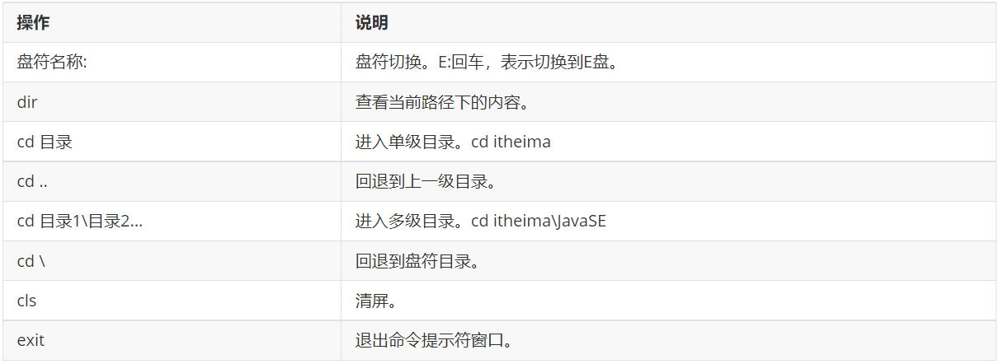
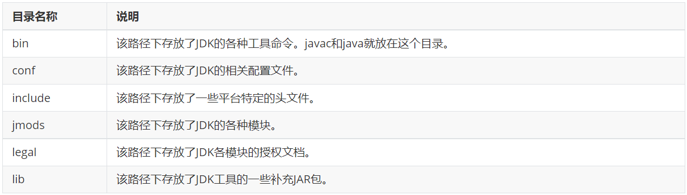
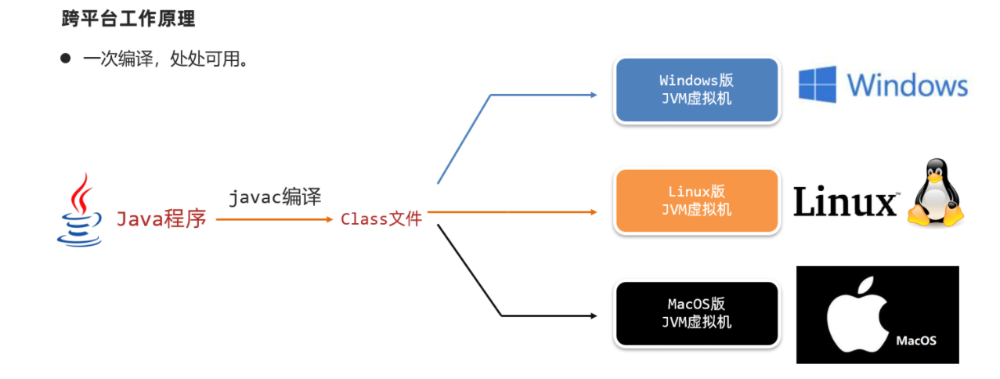
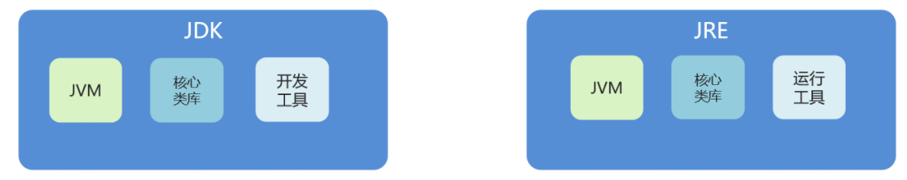

# 01-Java入门

##### 人机交互

###### 常用CMD命令



###### 环境变量

* 作用：

  * 如果我想要在CMD的任意目录下，都可以启动某一个软件，那么就可以把这个软件的路径配置到环境变量中的PATH里面。
  * 在启动软件的时候，操作系统会先在当前路径下找，如果在当前路径没有再到环境变量的路径中去找。如果都找不到就提示无法启动。
* 步骤：

  * 右键我的电脑，选择属性
  * 选择高级，再点击下面的环境变量
  * 找系统变量里面的PATH
  * 把软件的完整路径，配置到PATH当中就可以了
  * （可做可不做）就是把自己配置的路径，移动到最上面

##### Java概述

###### 下载和安装

* 下载

  通过官方网站获取JDK

  [http://www.oracle.com](http://www.oracle.com/)
* 安装

  傻瓜式安装，下一步即可，默认的安装路径是在C:\Program Files下

  建议：

  * 安装路径不要有中文，不要有空格等一些特殊的符号
  * 以后跟开发相关的所有软件建议都安装在同一个文件夹中，方便管理

JDK的安装目录介绍



###### Java程序开发运行流程

* 开发Java程序，需要三个步骤：编写程序，编译程序，运行程序
* 用到两个命令：

  javac + 文件名 + 后缀名 （就是编译java文件）

  java + 文件名（运行编译之后的class文件）

###### 环境变量

* 为什么配置环境变量

  开发Java程序，需要使用JDK提供的开发工具（比如javac.exe、java.exe等命令），而这些工具在JDK的安装目录的bin目录下，如果不配置环境变量，那么这些命令只可以在bin目录下使用，而我们想要在任意目录下都能使用，所以就要配置环境变量
* 配置方式

  1. ​JAVA_HOME：告诉操作系统JDK安装在了哪个位置（未来其他技术要通过这个找JDK）

      ```shell
      JAVA_HOME     C:\Program Files\Java\jdk-1.8
      ```
  2. ​Path：告诉操作系统JDK提供的javac(编译)、java(执行)命令安装到了哪个位置

      ```shell
      Path     %JAVA_HOME%\bin
      ```

‍

###### Java三大平台

* JavaSE

  Java语言的（标准版），用于桌面应用的开发，是其他两个版本的基础
* JavaME

  Java语言的小型版，用于嵌入式消费类电子设备或者小型移动设备的开发。其中最为主要的还是小型移动设备的开发（手机）。渐渐的没落了，已经被安卓和IOS给替代了。但是，安卓也是可以用Java来开发的
* JavaEE

  用于Web方向的网站开发（主要从事后台服务器的开发），在服务器领域，Java是当之无愧的龙头老大

###### Java主要特性

* 面向对象

  根据模板，把东西创建出来
* 安全性​
* 多线程

  同时做多件事情
* 简单易用
* 开源
* 跨平台

  Java程序可以在任意操作系统上运行。操作系统本身其实是不认识Java语言的。但是针对于不同的操作系统，Java提供了不同的虚拟机，虚拟机会把Java语言翻译成操作系统能看得懂的语言



###### JRE和JDK



* JVM（Java Virtual Machine）：Java虚拟机，真正运行Java程序的地方
* JRE（Java Runtime Environment）：Java运行环境，包含了JVM和Java的核心类库（Java API）
* JDK（Java Development Kit）：Java开发工具，包含了JRE和开发工具

总结：我们只需安装JDK即可，它包含了java的运行环境和虚拟机。

==1、JDK是什么？由哪些内容组成？==

JDK是Java的开发工具包

* JVM：Java程序运行的地方
* 核心类库：Java已经写好的东西，我们可以直接用
* 开发工具：javac，java......

==2、JRE是什么？由哪些内容组成？==

JRE是Java的运行环境

JVM、核心类库、运行工具

==3、JDK，JRE，JVM散着的包含关系？==

JDK包含了JRE

JRE包含了JVM

‍
