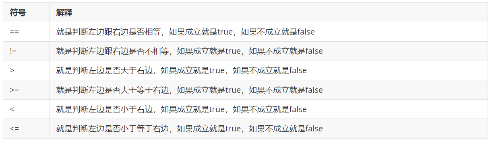
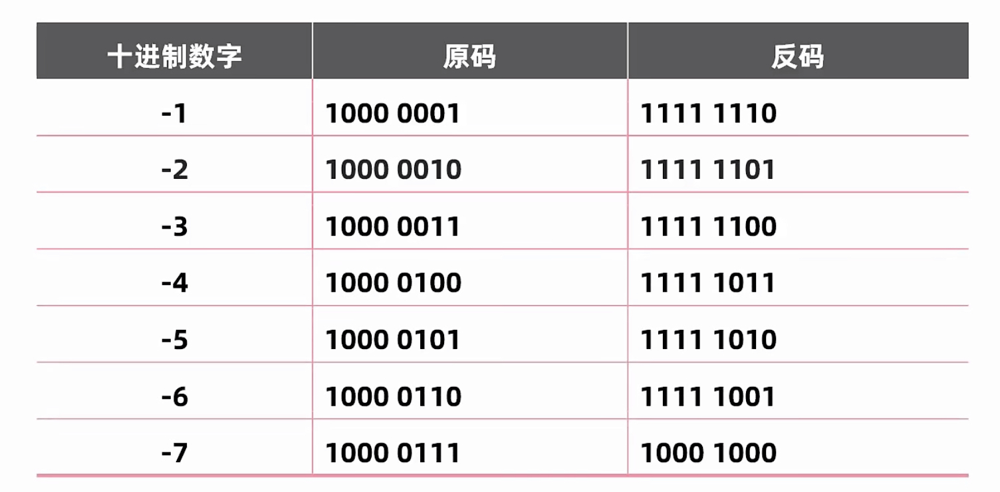
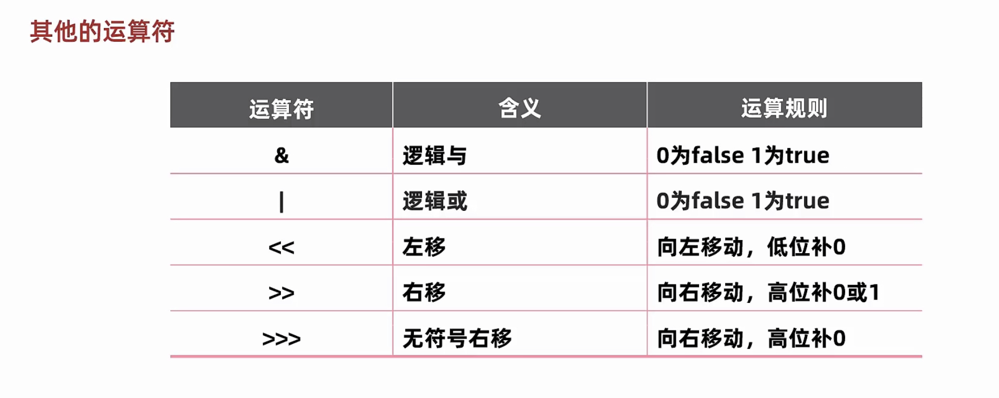

# 03-运算符

##### 运算符和表达式

###### 运算符

* 就是对常量或者变量进行操作的符号。比如： +  -  \*  /

###### 表达式

* 用运算符把常量或者变量连接起来的，符合Java语法的式子就是表达式。比如：a + b 这个整体就是表达式。而其中+是算术运算符的一种，所以这个表达式也称之为算术表达式。

##### 算术运算符

###### 分类

```java
+ - * / %
```

###### 运算特点

```java
+ - * :跟小学数学中一模一样没有任何区别
```

```java
/：
1.整数相除结果只能得到整除，如果结果想要是小数，必须要有小数参数。
2.小数直接参与运算，得到的结果有可能是不精确的。
案例：
System.out.println( 10 / 3);//3
System.out.println(10.0 / 3);//3.3333333333333335
```

```java
%：取模、取余。
   他做的也是除法运算，只不过获取的是余数而已。
案例：
System.out.println(10 % 2);//0
System.out.println(10 % 3);//1
应用场景：
//可以利用取模来判断一个数是奇数还是偶数
System.out.println(15 % 2);//1  奇数
```

###### 练习：数值拆分

需求：键盘录入一个三位数，将其拆分为个位、十位、百位后，打印在控制台

```java
//1.键盘录入一个三位数
//导包 --- 创建对象 --- 接收数据
Scanner sc = new Scanner(System.in);
System.out.println("请输入一个三位数");
int number = sc.nextInt();//123

//2.获取这个三位数的个位、十位、百位并打印出来
//公式：
//针对于任意的一个数而言
//个位： 数字 % 10
int ones = number % 10;
//十位： 数字 / 10 % 10
int tens = number / 10 % 10;
//百位： 数字 / 100 % 10
int hundreds = number / 100  % 10;

//输出结果
System.out.println(ones);
System.out.println(tens);
System.out.println(hundreds);
```

##### 隐式转换

概念

* 也叫自动类型提升。就是把一个取值范围小的数据或者变量，赋值给另一个取值范围大的变量。此时不需要我们额外写代码单独实现，是程序自动帮我们完成的。

简单记忆

* 就是小的给大的，可以直接给。

两种提升规则

* 取值范围小的，和取值范围大的进行运算，小的会先提升为大的，再进行运算。
* byte、short、char三种类型的数据在运算的时候，都会直接先提升为int，然后再进行运算。

取值范围从小到大的关系

* byte<short<int<long<float<double


##### 隐式转换练习

```java
double d = 10;
System.out.println(d);//10.0
//解释：
//10是整数，整数默认是int类型的。
//而在取值范围的顺序中：byte short int long float double
//在赋值的时候把一个int类型的赋值给了一个double类型的。把一个小的赋值给一个大的是可以直接给的。
```

```java
byte b = 100;
int i = b;//可以成功赋值
//解释：
//因为byte的取值范围是小的，int的取值范围是大的
//在底层进行了隐式转换，不需要我们额外写代码单独实现，是可以直接赋值。
```

```java
int i = 10;
long n = 20L;
result = i + n;//问变量result是什么类型的？long
//解释：
//变量i是int类型的，变量n是long类型的。
//而在取值范围的顺序中：byte short int long float double
//变量i里面的值会自动提升为long类型的，最终的结果其实就是两个long相加
//那么最终的result是long类型的。
```

```java
int i = 10;
long n = 100L;
double d = 20.0;
result = i + n + d;//问变量result是什么类型的？double
//解释：
//变量i是int类型，变量n是long类型，变量d是double类型。
//而在取值范围的顺序中：byte short int long float double
//所以变量i和变量n里面的值在参与运算的时候，都会进行类型提升，变成double。
//最终其实就是三个double进行相加，那么最终的结果就是double类型的。
```

```java
byte b1 = 10;
byte b2 = 20;
result = b1 + b2;//问变量result是什么类型的？int
//解释：
//因为b1和b2都是byte类型的。
//所以在参与计算的时候，变量b1和变量b2里面的值都会自动提升为int类型的。
//最终其实就是两个int类型的相加，最终结果也是int类型的。
```

```java
byte b = 10;
short s = 20;
long n = 100L;
result = b + s + n;//问变量result是什么类型的？long
//解释：
//变量b是byte类型的，变量s是short类型的，变量n是long类型的。
//byte，short，char类型的变量在参与运算的时候，变量里面的值会直接先提升为int。
//变量b和变量s里面的值会先提升为int参与运算。int + int + long
//而long类型的取值范围是大于int的取值范围的。
//所以变量b和变量s里面的值会再次提升为long。long + long + long
//所以最终结果是long类型的。
```

##### 强制转换

概念

* 如果要把一个取值范围大的数据或者变量赋值给另一个取值范围小的变量。是不允许直接操作。如果一定要这么干，就需要加入强制转换。

书写格式

* 目标数据类型 变量名 = （目标数据类型）被强转的数据；

  简单理解：要转成什么类型的，那么就在小括号中写什么类型就可以了。

```java
public class OperatorDemo2 {
    public static void main(String[] args) {
        double a = 12.3;
        int b = (int) a;
        System.out.println(b);//12
    }
}
```

注意点：强制转换有可能会导致数据发生错误（数据的精度丢失）

##### 字符串的+操作

核心技巧

* 当+操作中出现字符串时，此时就是字符串的连接符，会将前后的数据进行拼接，并产生一个新的字符串。
* 当连续进行+操作时，从左到右逐个执行。

##### 字符串相加的练习

```java
1 + "abc" + 1  //"1abc1"
```

```java
1 + 2 + "abc" + 2 + 1  //“3abc21”
```

```java
String name = "黑默丁格";
System.out.println("我的名字是" + name);//我的名字是黑默丁格
```

##### 字符串+操作

规则

* 当+操作中出现了字符，会拿着字符到计算机内置的ASCII码表中去查对应的数字，然后再进行计算。

```java
char c = 'a'; //'a'   -----    97  'A'   -----    65
int result = c + 0;
System.out.println(result);//97
```

##### 算术运算符的总结

分类

```java
+ - * / %  //这些操作跟小学数学几乎是一模一样的。
```

注意点：

* / 和 % 的区别：他们两个都是做除法运算，/取结果的商。% 取结果的余数。
* 整数操作只能得到整数，如果想要得到小数，必须有浮点数参与运算。

##### 自增自减运算符

分类

```java
++  //自增运算符，把变量里面的值+1
--  //自减运算符，把变量里面的值-1
```

使用方式

* 放在变量的前面，我们叫做先++。 比如：++a
* 放在变量的后面，我们叫做后++。 比如：a++

注意点：不管是先++，还是后++。单独写在一行的时候，运算结果是一模一样的。

```java
//++
int a = 10;
a++;//就是让变量a里面的值 + 1
System.out.println(a);//11
++a;//就是让变量a里面的值 + 1
System.out.println(a);//12
```

```java
int a= 10;
ing b=a++;//先用后加，最终b=10
```

```java
int a= 10;
ing b=++a;//先加后用，最终b=11
```

##### 赋值运算符

最为常用的：\=

* 运算过程：就是把等号右边的结果赋值给左边的变量

```java
public class OperatorDemo6 {
    public static void main(String[] args) {
        //1.最为简单的赋值运算符用法
        int a = 10;//就是把10赋值给变量a
        System.out.println(a);

        //2.如果等号右边需要进行计算。
        int b = 20;
        int c = a + b;//先计算等号右边的，把计算的结果赋值给左边的变量
        System.out.println(c);

        //3.特殊的用法
        a = a + 10;//先计算等号右边的，把计算的结果赋值给左边的变量
        System.out.println(a);//20
    }
}
```

##### 扩展赋值运算符

分类

* +=、-=、*=、/=、%=

运算规则

* 就是把左边跟右边进行运算，把最终的结果赋值给左边，对右边没有任何影响。

```java
public class OperatorDemo7 {
    public static void main(String[] args) {
        //扩展赋值运算符
        int a = 10;
        int b = 20;
        a += b;//把左边和右边相加，再把最终的结果赋值给左边，对右边没有任何影响
        // 相当于 a = a + b;
        System.out.println(a);//30
        System.out.println(b);//20
    }
}
```

注意点：扩展的赋值运算符中隐层还包含了一个强制转换。

* 以+=为例。a += b ;实际上相当于 a = (byte)(a + b);

  ```java
  public class OperatorDemo8 {
      public static void main(String[] args) {
          byte a = 10;
          byte b = 20;
          a += b;//a = (byte)(a + b);
          System.out.println(a);//30
      }
  }
  ```

##### 关系运算符

又叫比较运算符，其实就是拿着左边跟右边进行了判断而已



注意点：

* 关系运算符最终的结果一定是布尔类型的。要么是true，要么是false
* 在写==的时候，千万不要写成=

##### 逻辑运算符

###### & 和 | 的使用

&：逻辑与（而且）

* 两边都为真，结果才是真，只要有一个为假，那么结果就是假。

|：逻辑或（或者）

* 两边都为假，结果才是假，只要有一个为真，那么结果就是真。

```java
// &  //两边都是真，结果才是真。
System.out.println(true & true);//true
System.out.println(false & false);//false
System.out.println(true & false);//false
System.out.println(false & true);//false

System.out.println("===================================");

// | 或  //两边都是假，结果才是假，如果有一个为真，那么结果就是真。
System.out.println(true | true);//true
System.out.println(false | false);//false
System.out.println(true | false);//true
System.out.println(false | true);//true
```

###### \^（异或）的使用

在以后用的不多，了解一下即可。  

计算规则：如果两边相同，结果为false，如果两边不同，结果为true

```java
//^   //左右不相同，结果才是true，左右相同结果就是false
System.out.println(true ^ true);//false
System.out.println(false ^ false);//false
System.out.println(true ^ false);//true
System.out.println(false ^ true);//true
```

###### !（取反）的使用

！是取反，也叫做非。

* 计算规则：false取反就是true，true取反就是false

温馨提示：取反最多只用一个

```java
System.out.println(!false);//true
System.out.println(!true);//false

System.out.println(!!false);//错误写法，注意点：取反最多只用一个。
```

##### 短路逻辑运算符

分类： &&、||

* &&：运算结果跟&是一模一样的，只不过具有短路效果。
* ||：运算结果跟|是一模一样的。只不过具有短路效果。

逻辑核心

* 当左边不能确定整个表达式的结果，右边才会执行。
* 当左边能确定整个表达式的结果，那么右边就不会执行了。从而提高了代码的运行效率。

用户登录案例  

* 用户名正确  & 密码正确  
  如果使用一个&，不管用户名是否正确都会去验证密码。

思考：  
	如果用户名输入正确了，那么我们再判断密码是否正确，是符合业务逻辑的。但是如果用户名输入错误了，那么现在还有必要去比较密码吗？没有不要了。如果使用一个&，那么左边和右边不管什么情况下，都会执行。用户名正确  &&  密码正确如果用户名输入正确了，那么才会验证密码是否输入正确。如果用户名输入错误了，那么就不会再去验证密码是否正确，最终的结果直接为false。从而提高了程序运行的效率。

总结：

* && 和 & 、||和|的运行结果都是一模一样的。
* 但是短路逻辑运算符可以提高程序的运行效率。
* 最为常用： &&   ||   ！

##### 三元运算符

三元运算符又叫做：三元表达式或者问号冒号表达式。

格式

* 关系表达式 ？ 表达式1 ：表达式2 ；

计算规则

* 计算关系表达式的值。
* 如果关系表达式的值为真，那么执行表达式1。
* 如果关系表达式的值为假，那么执行表达式2。

注意点

* 三元运算符的最终结果一定要被使用，要么赋值给一个变量，要么直接打印出来。

```java
public class OperatorDemo12 {
    public static void main(String[] args) {
        //需求：求两个数的较大值
        int a = 10;
        int b = 20;

        //格式：关系表达式 ？ 表达式1 ： 表达式2 ；
        //注意点：
        //三元运算符的最终结果一定要被使用。
        //要么赋值给一个变量，要么直接输出。
       int max =  a > b ? a : b ;
        System.out.println(max);


        System.out.println(a > b ? a : b);
    }
}
```

##### 练习1-两只老虎

需求：  
	动物园里有两只老虎，两只老虎的体重分别为通过键盘录入获得，请用程序实现判断两只老虎的体重是否相同。

```java
//1.获取两只老虎的体重
Scanner sc = new Scanner(System.in);
System.out.println("请输入第一只老虎的体重");
int weight1 = sc.nextInt();
System.out.println("请输入第二只老虎的体重");
int weight2 = sc.nextInt();

//2.利用三元运算符求出最终结果
String result = weight1 == weight2 ? "相同" : "不相同";
System.out.println(result);
```

##### 练习2-求三个数的最大值

需求：  
	一座寺庙里住着三个和尚，已知他们的身高分别为150cm、210cm、165cm。请用程序实现获取这三个和尚的最高身高。

```java
//1.定义三个变量记录和尚的身高
int height1 = 150;
int height2 = 210;
int height3 = 165;

//2.利用三元运算符求出两个数中的较大值。
int temp = height1 > height2 ? height1 : height2;

//3.求出最终的结果
int max = temp > height3 ? temp : height3;

System.out.println(max);
```

##### 运算符的优先级

在Java中涉及了很多的运算符，每一种运算符都有各自的优先级。但是这些优先级不需要记忆。  

咱们只要知道其中一点：

* 小括号优先于所有。

##### 原码、反码、补码(扩展)

什么是原码？

* 十进制数据的二进制表现形式，最左边是符号位，0为正，1为负

56的原码为00111000

一个字节的最大值和最小值

* 最大值：01111111 ->+127
* 最小值：11111111 ->-127

利用原码对正数进行计算是不会有问题的。但是如果是负数计算，结果就会出错，实际运算的结果，跟我们预期的结果是相反的。

反码：为了解决原码不能计算负数的问题而出现的

计算规则：正数的反码不变，负数的反码在原码的基础上，符号位不变。数值取反，0变1，1变0.

-56的原码为10111000

-56的补码为11000111 ->可以解决负数计算问题

验证：已知-56+1=-55         11000111+1=11001000是否等于-55的补码

而55的原码为0011 0111，所以-55的原码为1011 0111

即-55的反码为11001000，即验证正确




注：原数是正数，右移时最高位补0，原数是负数，右移时最高位补1



‍
