# 05-循环高级和数组

#### 无限循环

##### 概念

* 又叫死循环。循环一直停不下来。

##### for格式

```java
for(;;){
    System.out.println("循环执行一直在打印内容");
}
```

解释

* 初始化语句可以空着不写，表示循环之前不定义任何的控制变量。
* 条件判断语句可以空着不写，如果不写，默认表示true，循环一直进行。
* 条件控制语句可以空着不写，表示每次循环体执行完毕后，控制变量不做任何变化。

##### while格式

```java
while(true){
    System.out.println("循环执行一直在打印内容");
}
```

解释：

* 小括号里面就不能省略了，true一定要写出来，否则代码会报错。

##### do...while格式

```java
do{
    System.out.println("循环执行一直在打印内容");
}while(true);
```

解释：

* 小括号里面就不能省略了，true一定要写出来，否则代码会报错。

##### 无限循环的注意事项

* 最为常用的格式：while
* 无限循环下面不能再写其他代码了，因为永远执行不到。

#### 条件控制语句

##### break

* 不能单独存在的。可以用在switch和循环中，表示结束，跳出的意思。

```java
//1.吃1~5号包子
for (int i = 1; i <= 5; i++) {
    System.out.println("在吃第" + i + "个包子");
    //2.吃完第三个的时候就不吃了
    if(i == 3){
        break;//结束整个循环。
    }
}
```

##### continue

不能单独存在的。只能存在于循环当中。表示跳过本次循环，继续执行下次循环。

```java
//1.吃1~5号包子
for (int i = 1; i <= 5; i++) {
    //2.第3个包子有虫子就跳过，继续吃下面的包子
    if(i == 3){
        //跳过本次循环（本次循环中，下面的代码就不执行了），继续执行下次循环。
        continue;
    }
    System.out.println("在吃第" + i + "个包子");
}
```

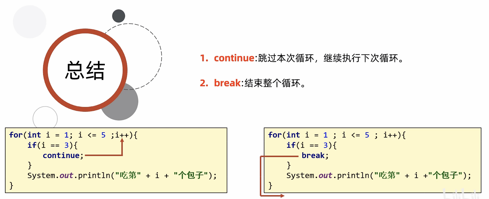

#### Random

Random跟Scanner一样，也是Java提前写好的类，我们不需要关心是如何实现的，只要直接使用就可以了。

使用步骤：

1. 导包

    ```java
    import java.util.Random;
    //导包的动作必须出现在类定义的上边。
    ```
2. 创建对象

    ```java
    Random r = new Random ();
    //上面这个格式里面，只有r是变量名，可以变，其他的都不允许变。
    ```
3. 生成随机数

    ```java
    int number = r.nextInt(随机数的范围);
    //上面这个格式里面，只有number是变量名，可以变，其他的都不允许变。
    //随机数范围的特点：从0开始，不包含指定值。比如：参数为10，生成的范围[0,10)
    ```

```java
//1.导包
import java.util.Random;

public class RandomDemo1 {
    public static void main(String[] args) {
        //2.创建对象
        Random r = new Random();
        //3.生成随机数
        int number = r.nextInt(100);//包左不包右，包头不包尾
        //0 ~ 99
        System.out.println(number);

    }
}
```

技巧：生成任意数到任意数之间的随机数

```java
public class LoopTest6 {
    public static void main(String[] args) {
        //需求：
        //随机数范围：1~100

        //创建对象
        Random r = new Random();
        //生成随机数
        int number = r.nextInt(100) + 1;//1  ~ 100
        System.out.println(number);


        //秘诀
        //用来生成任意数到任意数之间的随机数 7 ~15
        //1.让这个范围头尾都减去一个值，让这个范围从0开始  -7   0~8
        //2.尾巴+1       8 + 1 = 9
        //3.最终的结果，再加上第一步减去的值。

       /* Random r = new Random();
        int number = r.nextInt(9) + 7;// 7 ~ 15
                //   0 ~ 8  + 7
        System.out.println(number);*/

    }
}
```

#### 循环练习

##### 逢七过

需求：  
	朋友聚会的时候可能会玩一个游戏：逢7过  
	游戏规则：从任意一个数字开始报数，当你要报的数字是包含7或者是7的倍数时都要说过：过  
	使用程序在控制台打印出1-100之间的满足逢七必过规则的数据  
举例：  
	1 2 3 4 5 6 过 8 9 10 11 12 13 过 15 16 过 18 ...

```java
public class LoopTest1 {
    public static void main(String[] args) {
        /*朋友聚会的时候可能会玩一个游戏：逢7过
        游戏规则：从任意一个数字开始报数，当你要报的数字是包含7或者是7的倍数时都要说过：过
        需求：使用程序在控制台打印出1-100之间的满足逢七必过规则的数据*/

        //分析：
        //个位7  十位7   7倍数
        //1 2 3 4 5 6 过 8 9 10 11 12 13 过 15 16 过 18 19 20 过....
        //69 过 过 过 过 过 过... 80

        //1.得到1~100之间的每一个数字
        //开始：1
        //结束：100
        for (int i = 1; i <= 100; i++) {
        //2.判断每一个数字，如果符合规则，就打印过，如果不符合规则就打印真实的数字
            if(i % 10 == 7 || i / 10 % 10 == 7  ||  i % 7 == 0){
                System.out.println("过");
                continue;
            }
            System.out.println(i);
        }

    }
}
```

##### 平方根

需求：  
	键盘录入一个大于等于2的整数 x ，计算并返回 x 的平方根 。结果只保留整数部分 ，小数部分将被舍去 。

```java
/*需求：键盘录入一个大于等于2的整数 x ，计算并返回 x 的 平方根 。
        结果只保留整数部分 ，小数部分将被舍去 。*/


//分析：
//平方根   16的平方根4
//         4的平方根2


// 10
// 1 * 1 = 1 < 10
// 2 * 2 = 4 < 10
// 3 * 3 = 9 < 10
// 4 * 4 = 16 > 10
//推断：10的平方根是在3~4之间。


// 20
// 1 * 1 = 1 < 20
// 2 * 2 = 4 < 20
// 3 * 3 = 9 < 20
// 4 * 4 = 16 < 20
// 5 * 5 = 25 > 20
//推断：20的平方根是在4~5之间。


//在代码当中
//从1开始循环，拿着数字的平方跟原来的数字进行比较
//如果小于的，那么继续往后判断
//如果相等，那么当前数字就是平方根
//如果大于的，那么前一个数字就是平方跟的整数部分


//1.键盘录入一个整数
Scanner sc = new Scanner(System.in);
System.out.println("请输入一个整数");
int number = sc.nextInt();
//2.从1开始循环判断
//开始：1 结束: number
for (int i = 1; i <= number; i++) {
    //用i * i 再跟number进行比较
    if(i * i == number){
        System.out.println(i + "就是" + number + "的平方根");
        //一旦找到了，循环就可以停止了，后面的数字就不需要再找了，提高代码的运行效率。
        break;
    }else if(i * i > number){
        System.out.println((i - 1) + "就是" + number + "平方根的整数部分");
        break;
    }
}
```

##### 判断是否为质数

需求：  
	键盘录入一个正整数 x ，判断该整数是否为一个质数。

```java
//需求：键盘录入一个正整数 x ，判断该整数是否为一个质数。

//质数：
//如果一个整数只能被1和本身整除，那么这个数就是质数。否则这个数叫做合数
//7 = 1 * 7 质数
//8 = 1 * 8  2 * 4 合数


//分析：
//1.键盘录入一个正整数
//number
Scanner sc = new Scanner(System.in);
System.out.println("请输入一个正整数");
int number = sc.nextInt();//9

//定义一个变量，表示标记
//标记着number是否为一个质数
//true： 是一个质数
//false : 不是一个质数

//表示最初就认为number是一个质数
boolean flag = true;


//2.判断
//写一个循环，从2开始判断，一直判断到number-1为止
//看这个范围之内，有没有数字可以被number整除
for (int i = 2; i < number; i++) {
    //i 依次表示这个范围之内的每一个数字
    //看number是否能被i整除就可以了
    if(number % i == 0){// 9 % 2 = 1
        flag = false;
        //System.out.println(number + "不是一个质数");
        break;
    }/*else{
                System.out.println(number + "是一个质数");
            }*/
}

//只有当这个循环结束了，表示这个范围之内所有的数字都判断完毕了
//此时才能断定number是一个质数
if(flag){
    System.out.println(number + "是一个质数");
}else{
    System.out.println(number + "不是一个质数");
}
```

##### 猜数字小游戏

需求：程序自动生成一个1-100之间的随机数，在代码中使用键盘录入去猜出这个数字是多少？

要求：使用循环猜，一直猜中为止。

思路分析：

1. 生成一个1-100之间的随机数
2. 使用键盘录入去猜出这个数字是多少
3. 把反复猜的代码写在循环中

```java
//1.生成一个1-100之间的随机数
Random r = new Random();
int number = r.nextInt(100) + 1;// 0 ~ 99 + 1 --- 1 ~ 100
System.out.println(number);

//2.使用键盘录入去猜出这个数字是多少？
Scanner sc = new Scanner(System.in);
while(true){
    System.out.println("请输入一个整数");
    int guessNumber = sc.nextInt();
    //3.比较
    if(guessNumber > number){
        System.out.println("您猜的数字大了");
    }else if(guessNumber < number){
        System.out.println("您猜的数字小了");
    }else{
        System.out.println("恭喜你，猜中了");
        break;
    }
}
```

#### 数组

概念：指的是一种容器，可以同来存储同种数据类型的多个值。

但是数组容器在存储数据的时候，需要结合隐式转换考虑。

比如：定义了一个int类型的数组。那么boolean，double类型的数据是不能存到这个数组中的，但是byte类型，short类型，int类型的数据是可以存到这个数组里面的。

建议：容器的类型，和存储的数据类型保持一致。

举例：

整数1 2 3 4 56 就可以使用int类型的数组来存储。

小数1.1 1.2 1.3 1.4 就可以使用double类型的数组来存储。

字符串"aaa"  "bbb"  "ccc" 就可以使用String类型的数组来存储。

##### 数组的定义

格式一：数据类型[] 数组名

* 比如：int[] array

格式二：数据类型  数组名[]

* 比如：int array[]

##### 数组的静态初始化

初始化：就是在内存中，为数组容器开辟空间，并将数据存入容器中的过程

###### 完整格式

* 数据类型[] 数组名 \= new 数据类型[]{元素1，元素2，元素3，元素4...};

* 比如：

  ```java
  int[] arr = new int[]{11,22,33};
  double[] arr = new double[]{1.1,1.2,1.3};
  ```

注意点：

* 等号前后的数据类型必须保持一致。
* 数组一旦创建之后，长度不能发生变化。

###### 简化格式

* 数据类型[] 数组名 \= {元素1，元素2，元素3，元素4...};

* 比如：

  ```java
  int[] array = {1,2,3,4,5};
  double[] array = {1.1,1.2,1.3};
  ```

###### 练习1

定义数组存储5个学生的年龄。

```java
//1.给数组限定什么类型？ int
//2.利用静态初始化完成创建并添加元素
int[] agesArr = new int[]{18,19,20,21,22};
int[] agesArr = {18,19,20,21,22};
```

###### 练习2

定义数组存储4个学生的身高。

```java
//1.给数组限定什么类型？ String
//2.利用静态初始化完成创建并添加元素
String[] namesArr = new String[]{"zhangsan","lisi","wangwu"};
String[] namesArr = {"zhangsan","lisi","wangwu"};
```

###### 练习3

定义数组存储4个学生的身高。

```java
//1.给数组限定什么类型？ double
//2.利用静态初始化完成创建并添加元素
double[] heightsArr = new double[]{1.85,1.82,1.78,1.65};
double[] heightsArr = {1.85,1.82,1.78,1.65};
```

##### 地址值

```java
int[] arr = {1,2,3,4,5};
System.out.println(arr);//[I@6d03e736

double[] arr2 = {1.1,2.2,3.3};
System.out.println(arr2);//[D@568db2f2
```

打印数组的时候，实际出现的是数组的地址值。

数组的地址值：就表示数组在内存中的位置。

以[I@6d03e736为例：

[ ：表示现在打印的是一个数组。

I：表示现在打印的数组是int类型的。

@：仅仅是一个间隔符号而已。

6d03e736：就是数组在内存中真正的地址值。（十六进制的）

但是，我们习惯性会把[I@6d03e736这个整体称之为数组的地址值。

##### 数组元素访问

格式：数组名[索引];

```java
public class ArrDemo2 {
    /*

        数组中元素访问的格式：
                数组名[索引];

         作用：
            1.获取指定索引上对应的元素
            2.修改指定索引上对应的元素


    */
    public static void main(String[] args) {
       int[] arr = {1,2,3,4,5};
       //需求1：获取arr数组中，3索引上的值
        int number = arr[3];
        System.out.println(number);
        System.out.println(arr[3]);

       //需求2：将arr数组中，3索引上的值修改为10
            arr[3] = 10;
        System.out.println("修改之后为:" + arr[3]);

    }
}
```

##### 索引

也叫角标、下标，就是数组容器中每一个小格子对应的编号。

索引的特点

* 索引一定是从0开始的。
* 连续不间断。
* 逐个+1增长。

##### 数组的遍历

遍历：就是把数组里面所有的内容一个一个全部取出来。

数组的长度：数组名.length;

通用代码：

```java
for(int i = 0; i < arr.length; i++){
    //在循环的过程中，i依次表示数组中的每一个索引
    sout(arr[i]);//就可以把数组里面的每一个元素都获取出来，并打印在控制台上了。
}
```

##### 数组的动态初始化

###### 格式

* 数据类型[] 数组名 \= new 数据类型[数组的长度];

```java
//1.定义一个数组，存3个人的年龄，年龄未知
int[] agesArr = new int[3];

//2.定义一个数组，存班级10名学生的考试成绩，考试成绩暂时未知，考完才知道。
int[] scoresArr = new int[10];
```

###### 数组的默认初始化值

* 整数类型：0
* 小数类型：0.0
* 布尔类型：false
* 字符类型：'\u0000'（打印出来就是一个空格）
* 引用类型：null

##### 数组两种初始化方式的区别

静态初始化：int[] arr = {1,2,3,4,5};

动态初始化：int[] arr = new int[3];

静态初始化：手动指定数组的元素，系统会根据元素的个数，计算出数组的长度。

动态初始化：手动指定数组长度，由系统给出默认初始化值。

##### 数组的练习

###### 练习1：求和

需求：定义一个数组，存储1,2,3,4,5  
遍历数组得到每一个元素，求数组里面所有的数据和

```java
/*定义一个数组，存储1,2,3,4,5
        遍历数组得到每一个元素，求数组里面所有的数据和*/


//分析：
//1.定义一个数组，并添加数据1,2,3,4,5
int[] arr = {1,2,3,4,5};

//求和变量
int sum = 0;
//2.遍历数组得到每一个数据，累加求和
for (int i = 0; i < arr.length; i++) {
    //i 依次表示数组里面的每一个索引
    //arr[i] 依次表示数组里面的每一个元素
    sum = sum + arr[i];
}

//当循环结束之后，sum的值就是累加之后的结果
System.out.println(sum);
```

###### 练习2：统计个数

需求：定义一个数组，存储1,2,3,4,5,6,7,8,9,10  
遍历数组得到每一个元素，统计数组里面一共有多少个能被3整除的数字

```java
//分析：
//1.定义一个数组 存储1,2,3,4,5,6,7,8,9,10
int[] arr = {1, 2, 3, 4, 5, 6, 7, 8, 9, 10};
//定义一个变量，用来统计次数
int count = 0;
//2.遍历数组得到每一个元素
for (int i = 0; i < arr.length; i++) {
    //i 表示数组里面的每一个索引
    //arr[i] 表示数组里面的每一个元素
    //3.判断当前的元素是否为3的倍数，如果是那么统计变量就需要自增一次。
    if(arr[i] % 3 == 0){
        // System.out.println(arr[i]);
        count++;
    }
}
//当循环结束之后，就表示数组里面所有的数字都判断完毕了，直接打印count即可
System.out.println("数组中能被3整除的数字有" + count + "个");
```

###### 练习3：变化数据

需求：  
定义一个数组，存储1,2,3,4,5,6,7,8,9,10  
遍历数组得到每一个元素。  
要求：  
1，如果是奇数，则将当前数字扩大两倍  
2，如果是偶数，则将当前数字变成二分之一

```java
//分析：
//1.定义一个数组，存1,2,3,4,5,6,7,8,9,10
int[] arr = {1,2,3,4,5,6,7,8,9,10};
//2.遍历数组得到每一个元素
for (int i = 0; i < arr.length; i++) {
    //i 依次表示数组里面的每一个索引
    //arr[i] 依次表示数组里面的每一个元素
    //3.对每一个元素进行判断
    if(arr[i] % 2 == 0){
        //偶数 变成二分之一
        arr[i] = arr[i] / 2;
    }else{
        //奇数 扩大两倍
        arr[i] = arr[i] * 2;
    }
}

//遍历数组
//一个循环尽量只做一件事情。
for (int i = 0; i < arr.length; i++) {
    System.out.println(arr[i]);
}
```

###### 练习4：求最值

需求：求数组中的最大值

```java
//定义数组求最大值：33,5,22,44,55

//扩展问题：
//1.根据求最大值的思路，自己改写一下求最小智
//2.为什么max要记录为arr[0],默认值不能为0吗？
//不能写0
//max的初始化值一定要是数组中的值。
//3.循环中开始条件一定是0吗？
//循环的开始条件如果为0，那么第一次循环的时候是自己跟自己比了一下，对结果没有任何影响，但是效率偏低
//为了提高效率，减少一次循环的次数，循环开始条件可以写1.


//1.定义数组用来存储5个值
int[] arr = {33,5,22,44,55};
//2.定义一个变量max用来存储最大值
//临时认为0索引的数据是最大的
int max = arr[0];
//3.循环获取数组中的每一个元素
//拿着每一个元素跟max进行比较
for (int i = 1; i < arr.length; i++) {
    //i 索引  arr[i] 元素
    if(arr[i] > max){
        max = arr[i];
    }
}
//4.当循环结束之后，max记录的就是数组中的最大值
System.out.println(max);//55
```

###### 练习5：统计个数

需求：生成10个1\~100之间的随机数存入数组。  
1）求出所有数据的和  
2）求所有数据的平均数  
3）统计有多少个数据比平均值小

```java
//分析：
//1.定义数组
int[] arr = new int[10];
//2.把随机数存入到数组当中
Random r = new Random();

for (int i = 0; i < arr.length; i++) {
    //每循环一次，就会生成一个新的随机数
    int number = r.nextInt(100) + 1;
    //把生成的随机数添加的数组当中
    //数组名[索引] = 数据;
    arr[i] = number;
}

// 1）求出所有数据的和
//定义求和变量
int sum = 0;
for (int i = 0; i < arr.length; i++) {
    //循环得到每一个元素
    //并把元素累加到sum当中
    sum = sum + arr[i];
}
System.out.println("数组中所有数据的和为：" + sum);


//2）求所有数据的平均数
int avg = sum / arr.length;
System.out.println("数组中平均数为：" + avg);


//3）统计有多少个数据比平均值小
int count = 0;
for (int i = 0; i < arr.length; i++) {
    if(arr[i] < avg){
        count++;
    }
}

//当循环结束之后，就表示我已经找到了所有的比平均数小的数据
System.out.println("在数组中，一共有" + count + "个数据，比平均数小");


//遍历数组，验证答案
for (int i = 0; i < arr.length; i++) {
    System.out.print(arr[i] + " ");
}
```

###### 练习6：交换数据

需求：定义一个数组，存入1,2,3,4,5。按照要求交换索引对应的元素。  
交换前：1,2,3,4,5  
交换后：5,2,3,4,1

```java
//1.定义数组存储数据
int[] arr = {1,2,3,4,5};
//2.利用循环去交换数据
for(int i = 0,j = arr.length - 1; i < j; i++,j--){
    //交换变量i和变量j指向的元素
    int temp = arr[i];
    arr[i] = arr[j];
    arr[j] = temp;
}
//当循环结束之后，那么数组中的数据就实现了头尾交换
for (int i = 0; i < arr.length; i++) {
    System.out.print(arr[i] + " ");
}
```

###### 练习7：打乱数据

需求：定义一个数组，存入1\~5。要求打乱数组中所有数据的顺序。

```java
//1.定义数组存储1~5
int[] arr = {1, 2, 3, 4, 5};
//2.循环遍历数组，从0索引开始打乱数据的顺序
Random r = new Random();
for (int i = 0; i < arr.length; i++) {
    //生成一个随机索引
    int randomIndex = r.nextInt(arr.length);//randomIndex:0~4
    //拿着随机索引指向的元素 跟 i 指向的元素进行交换
    int temp = arr[i];
    arr[i] = arr[randomIndex];
    arr[randomIndex] = temp;
}
//当循环结束之后，那么数组中所有的数据已经打乱顺序了
for (int i = 0; i < arr.length; i++) {
    System.out.print(arr[i] + " ");
}
```

#### 数组的内存图

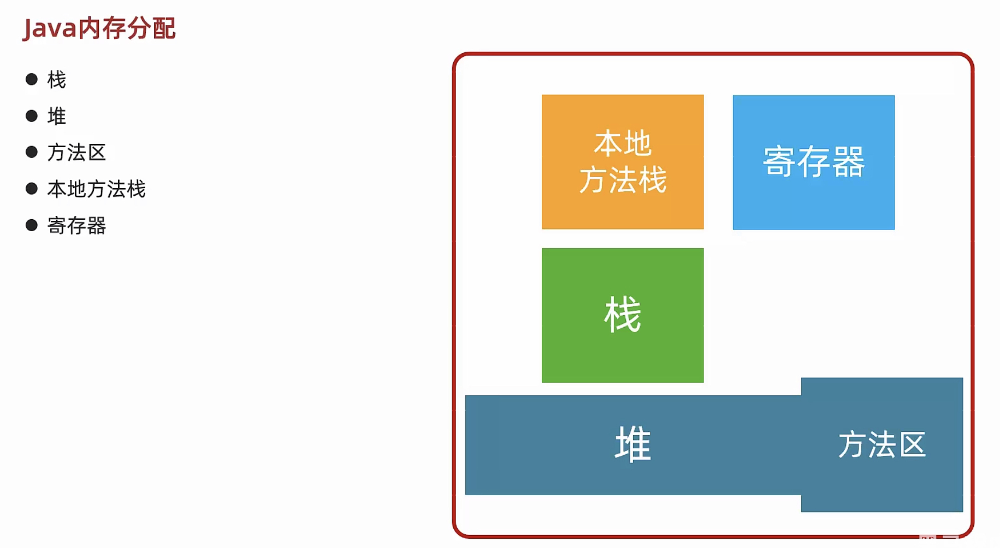

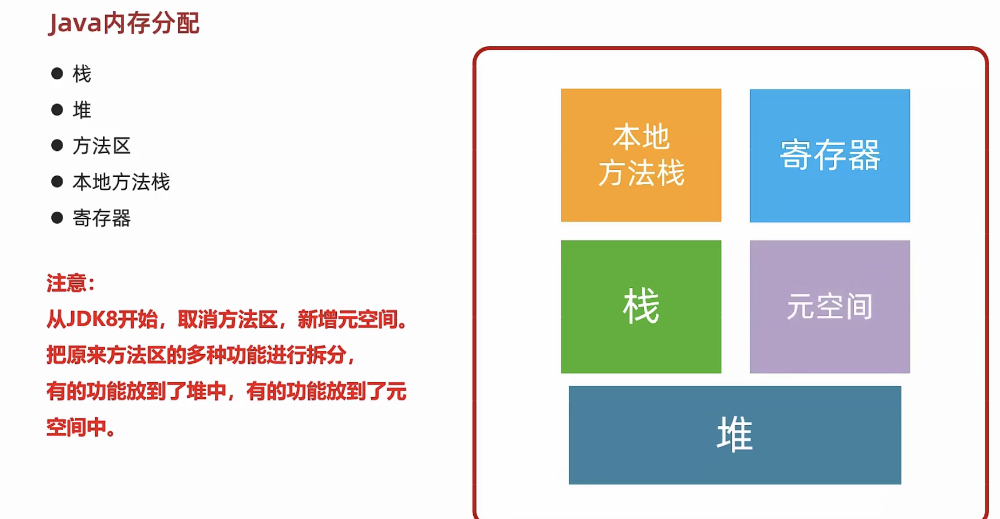

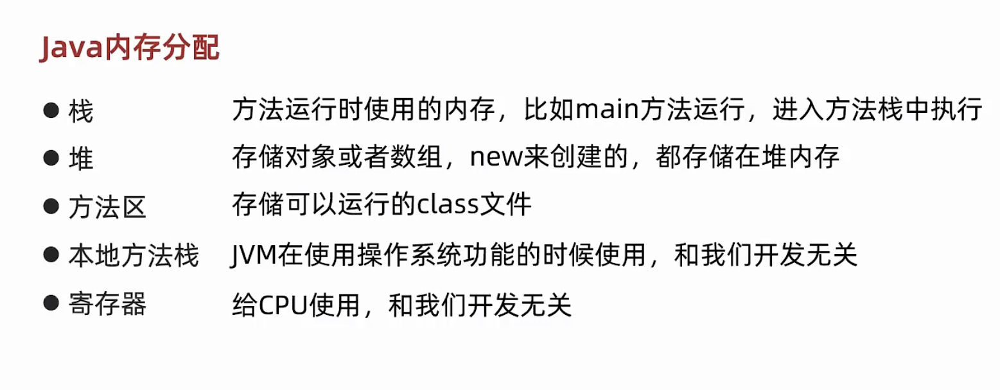

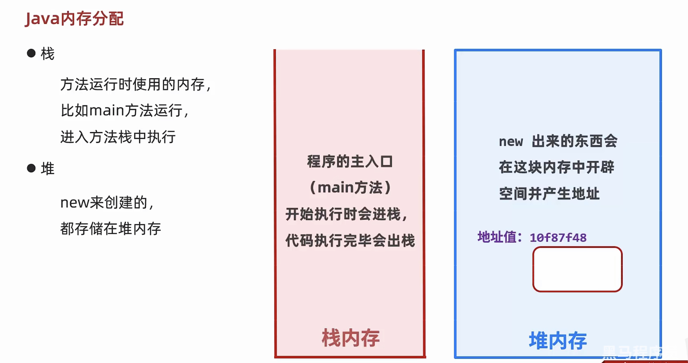

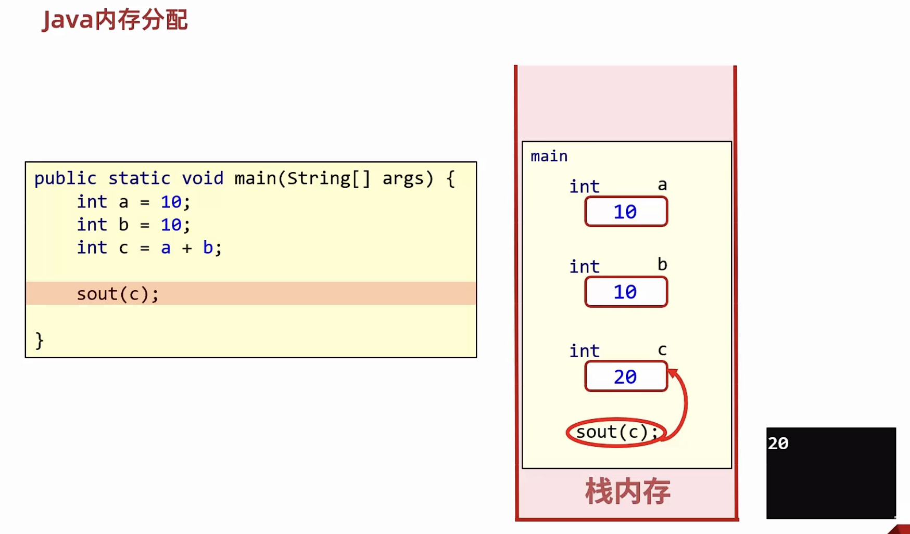

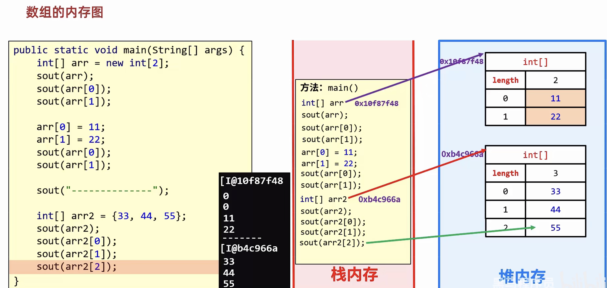

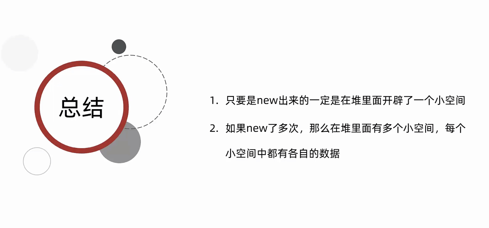

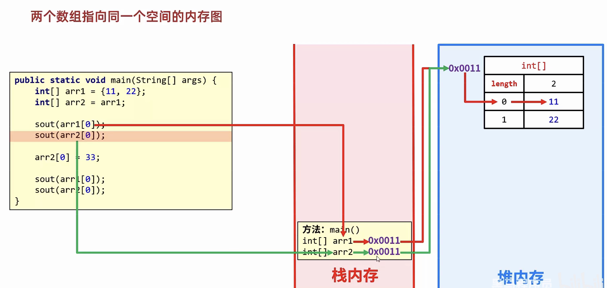

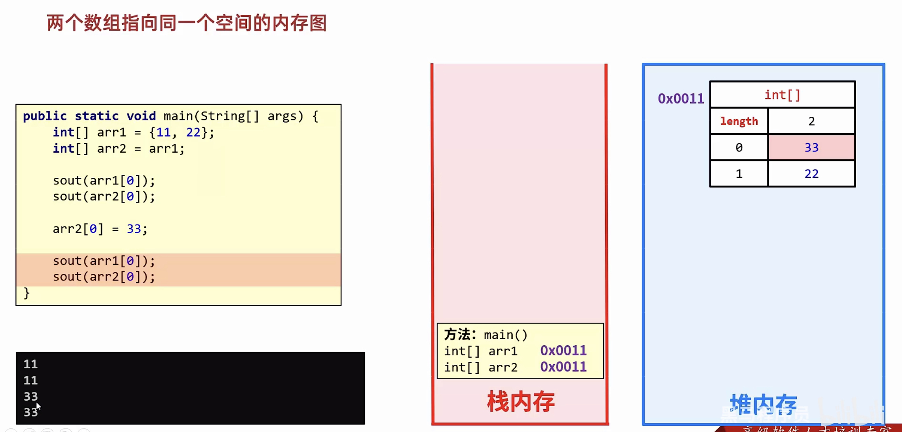

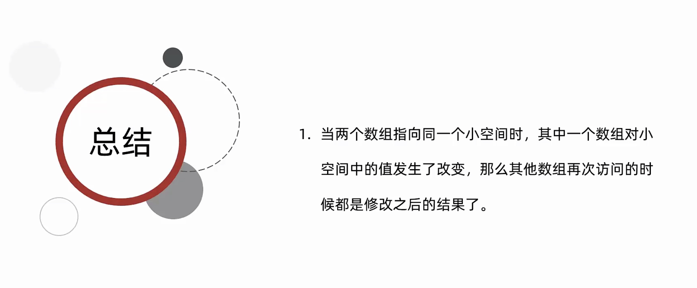

‍
