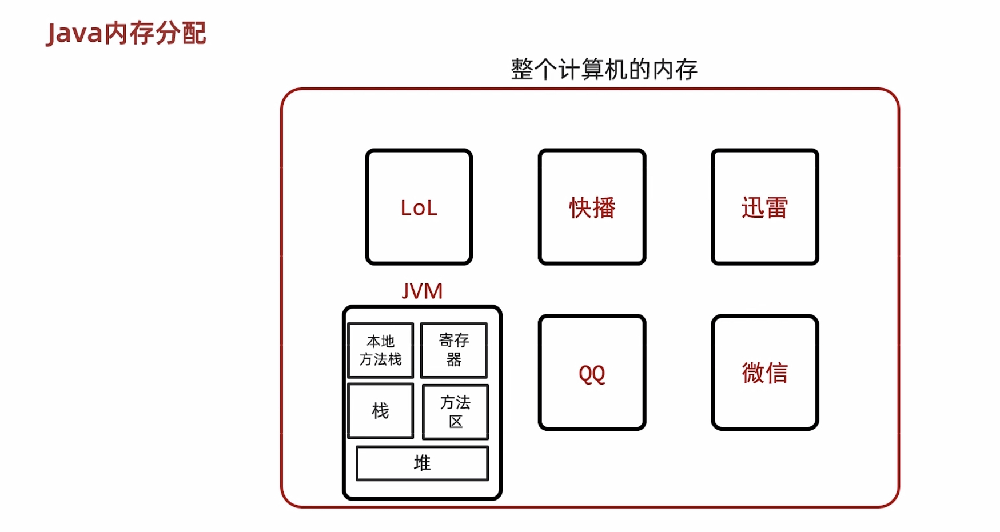
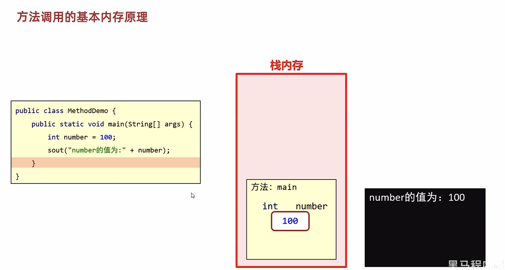

# 06-方法

#### 方法概述

##### 方法的概念

方法（method）是程序中最小的执行单元

注意：

* 方法必须先创建才可以使用，该过程成为方法定义
* 方法创建后并不是直接可以运行的，需要手动使用后，才执行，该过程成为方法调用

#### 方法的定义和调用

##### 无参数方法定义和调用

定义格式：

```java
public static void 方法名() {
	// 方法体;
}
```

调用格式：

```java
方法名();
```

范例：

```java
public static void method() {
	// 方法体;
}
```

```java
method();
```

注意：方法必须先定义，后调用，否则程序将报错  

##### 无参数方法的练习

* 需求：设计一个方法用于打印两个数中的较大数
* 思路：

  * ①定义一个方法，用于打印两个数字中的较大数，例如getMax()
  * ②方法中定义两个变量，用于保存两个数字
  * ③使用分支语句分两种情况对两个数字的大小关系进行处理
  * ④在main()方法中调用定义好的方法
* 代码：

  ```java
  public class MethodTest {
      public static void main(String[] args) {
          //在main()方法中调用定义好的方法
          getMax();
      }

      //定义一个方法，用于打印两个数字中的较大数，例如getMax()
      public static void getMax() {
          //方法中定义两个变量，用于保存两个数字
          int a = 10;
          int b = 20;

          //使用分支语句分两种情况对两个数字的大小关系进行处理
          if(a > b) {
              System.out.println(a);
          } else {
              System.out.println(b);
          }
      }
  }
  ```

##### 带参数方法定义和调用

定义格式：

```java
public static void 方法名 (参数1) {
	方法体;
}

public static void 方法名 (参数1, 参数2, 参数3...) {
	方法体;
}
```

调用格式：

```java
方法名(参数)；

方法名(参数1,参数2);
```

范例：

```java
public static void isEvenNumber(int number){
    ...
}
public static void getMax(int num1, int num2){
    ...
}
```

```java
isEvenNumber(10);

getMax(10,20);
```

注意：

* 方法定义时，参数中的数据类型与变量名都不能缺少，缺少任意一个程序将报错
* 方法定义时，多个参数之间使用逗号( ，)分隔
* 方法调用时，参数的数量与类型必须与方法定义中的设置相匹配，否则程序将报错

##### 带参数方法的练习

* 需求：设计一个方法用于打印两个数中的较大数，数据来自于方法参数
* 思路：

  * ①定义一个方法，用于打印两个数字中的较大数，例如getMax()
  * ②为方法定义两个参数，用于接收两个数字
  * ③使用分支语句分两种情况对两个数字的大小关系进行处理
  * ④在main()方法中调用定义好的方法（使用常量）
  * ⑤在main()方法中调用定义好的方法（使用变量）
* 代码：

  ```java
  public class MethodTest {
      public static void main(String[] args) {
          //在main()方法中调用定义好的方法（使用常量）
          getMax(10,20);
          //调用方法的时候，人家要几个，你就给几个，人家要什么类型的，你就给什么类型的
          //getMax(30);
          //getMax(10.0,20.0);

          //在main()方法中调用定义好的方法（使用变量）
          int a = 10;
          int b = 20;
          getMax(a, b);
      }

      //定义一个方法，用于打印两个数字中的较大数，例如getMax()
      //为方法定义两个参数，用于接收两个数字
      public static void getMax(int a, int b) {
          //使用分支语句分两种情况对两个数字的大小关系进行处理
          if(a > b) {
              System.out.println(a);
          } else {
              System.out.println(b);
          }
      }
  }
  ```

##### 带返回值方法定义和调用

定义格式：

```java
public static 数据类型 方法名 ( 参数 ) { 
	return 数据 ;
}
```

调用格式：

```java
方法名 ( 参数 ) ;
数据类型 变量名 = 方法名 ( 参数 ) ;
```

范例：

```java
public static boolean isEvenNumber( int number ) {         
	return true ;
}
public static int getMax( int a, int b ) {
	return  100 ;
}
```

```java
isEvenNumber(5);
boolean flag = isEvenNumber(5); 
```

注意：

* 方法定义时return后面的返回值与方法定义上的数据类型要匹配，否则程序将报错
* 方法的返回值通常会使用变量接收，否则该返回值将无意义

##### 带返回值方法练习1

* 需求：设计一个方法可以获取两个数的较大值，数据来自于参数
* 思路：

  * ①定义一个方法，用于获取两个数字中的较大数
  * ②使用分支语句分两种情况对两个数字的大小关系进行处理
  * ③根据题设分别设置两种情况下对应的返回结果
  * ④在main()方法中调用定义好的方法并使用变量保存
  * ⑤在main()方法中调用定义好的方法并直接打印结果
* 代码：

  ```java
  public class MethodTest {
      public static void main(String[] args) {
          //在main()方法中调用定义好的方法并使用变量保存
          int result = getMax(10,20);
          System.out.println(result);

          //在main()方法中调用定义好的方法并直接打印结果
          System.out.println(getMax(10,20));
      }

      //定义一个方法，用于获取两个数字中的较大数
      public static int getMax(int a, int b) {
          //使用分支语句分两种情况对两个数字的大小关系进行处理
          //根据题设分别设置两种情况下对应的返回结果
          if(a > b) {
              return a;
          } else {
              return b;
          }
      }
  }
  ```

##### 带返回值方法练习2

* 需求：定义一个方法，求一家商场每个季度的营业额。根据方法结果再计算出全年营业额。

* 代码：

  ```java
  public class MethodDemo9 {
      public static void main(String[] args) {
          /*需求：定义一个方法，求一家商场每个季度的营业额。
          根据方法结果再计算出全年营业额。*/
          int sum1 = getSum(10, 20, 30);
          int sum2 = getSum(10, 20, 30);
          int sum3 = getSum(10, 20, 30);
          int sum4 = getSum(10, 20, 30);

          int sum = sum1 + sum2 + sum3 + sum4;
          System.out.println(sum);

      }

      //心得：
      //1.我要干嘛？  决定了方法体   每个季度的营业额
      //2.我干这件事情，需要什么才能完成？ 决定了形参 需要三个月的营业额 a b c
      //3.我干完这件事情，看调用处是否需要使用方法的结果。   决定了返回值
      //如果需要使用，那么必须返回
      //如果不需要使用，可以返回也可以不返回
      public static int getSum(int month1,int month2,int month3){
          int sum = month1 + month2 + month3;
          //因为方法的调用处，需要继续使用这个结果
          //所以我们必须要把sum返回
          return sum;
      }
  }
  ```

##### 带返回值方法练习3

* 需求：键盘录入两个圆的半径（整数），比较两个圆的面积。

* 代码：

  ```java
  public class MethodDemo10 {
      public static void main(String[] args) {
          //需求：键盘录入两个圆的半径（整数），比较两个圆的面积。
          //键盘录入圆的半径
          Scanner sc = new Scanner(System.in);
          System.out.println("请输入圆的半径");
          int radii1 = sc.nextInt();

          System.out.println("请输入第二个圆的半径");
          int radii2 = sc.nextInt();
          double area1 = getArea(radii1);
          double area2 = getArea(radii2);
          if(area1 > area2){
              System.out.println("第一个圆更大");
          }else{
              System.out.println("第二个圆更大");
          }
      }

      //心得：
      //1.我要干嘛？   求圆的面积
      //2.我干这件事情，需要什么才能完成？        半径
      //3.方法的调用处，是否需要继续使用方法的结果    要比较
      public static double getArea(int radii) {
          double area = 3.14 * radii * radii;
          return area;
      }
  }
  ```

#### 方法的注意事项

* 方法不能嵌套定义
* void表示无返回值，可以省略return，也可以单独的书写return，后面不加数据(表示结束方法)

#### 方法的通用格式

```java
public static 返回值类型 方法名(参数) {
   方法体; 
   return 数据 ;
}
```

#### 方法重载

概念：方法重载指同一个类中定义的多个方法之间的关系，满足下列条件的多个方法相互构成重载

* 多个方法在同一个类中
* 多个方法具有相同的方法名
* 多个方法的参数不相同，类型不同或者数量不同（个数，类型，顺序）

注意：

* 重载仅对应方法的定义，与方法的调用无关，调用方式参照标准格式
* 重载仅针对同一个类中方法的名称与参数进行识别，与返回值无关，换句话说不能通过返回值来判定两个方法是否相互构成重载

正确范例：

```java
public class MethodDemo {
	public static void fn(int a) {
    	//方法体
    }
    public static int fn(double a) {
    	//方法体
    }
}

public class MethodDemo {
	public static float fn(int a) {
    	//方法体
    }
    public static int fn(int a , int b) {
    	//方法体
    }
}
```

错误范例：

```java
public class MethodDemo {
	public static void fn(int a) {
    	//方法体
    }
    public static int fn(int a) { 	/*错误原因：重载与返回值无关*/
    	//方法体
    }
}

public class MethodDemo01 {
    public static void fn(int a) {
        //方法体
    }
} 
public class MethodDemo02 {
    public static int fn(double a) { /*错误原因：这是两个类的两个fn方法*/
        //方法体
    }
}
```

#### 方法重载练习

* 需求：使用方法重载的思想，设计比较两个整数是否相同的方法，兼容全整数类型（byte,short,int,long）
* 思路：

  * ①定义比较两个数字的是否相同的方法compare()方法，参数选择两个int型参数
  * ②定义对应的重载方法，变更对应的参数类型，参数变更为两个long型参数
  * ③定义所有的重载方法，两个byte类型与两个short类型参数
  * ④完成方法的调用，测试运行结果
* 代码：

  ```java
  public class MethodTest {
      public static void main(String[] args) {
          //调用方法
          System.out.println(compare(10, 20));
          System.out.println(compare((byte) 10, (byte) 20));
          System.out.println(compare((short) 10, (short) 20));
          System.out.println(compare(10L, 20L));
      }

      //int
      public static boolean compare(int a, int b) {
          System.out.println("int");
          return a == b;
      }

      //byte
      public static boolean compare(byte a, byte b) {
          System.out.println("byte");
          return a == b;
      }

      //short
      public static boolean compare(short a, short b) {
          System.out.println("short");
          return a == b;
      }

      //long
      public static boolean compare(long a, long b) {
          System.out.println("long");
          return a == b;
      }

  }
  ```

#### 练习

##### 数组遍历

* 需求：设计一个方法用于数组遍历，要求遍历的结果是在一行上的。例如：[11, 22, 33, 44, 55]
* 思路：

  * ①因为要求结果在一行上输出，所以这里需要在学习一个新的输出语句System.out.print(“内容”);System.out.println(“内容”); 输出内容并换行System.out.print(“内容”); 输出内容不换行System.out.println(); 起到换行的作用
  * ②定义一个数组，用静态初始化完成数组元素初始化
  * ③定义一个方法，用数组遍历通用格式对数组进行遍历
  * ④用新的输出语句修改遍历操作
  * ⑤调用遍历方法
* 代码：

  ```java
  public class Test1 {
      public static void main(String[] args) {
        /*  //先打印数据，再进行换行
          System.out.println("aaa");
          //只打印不换行
          System.out.print("bbb");
          System.out.print("ddd");
          //不打印任何内容，只换行
          System.out.println();
          System.out.print("cc");*/
          //设计一个方法用于数组遍历，要求遍历的结果是在一行上的。例如：[11, 22, 33, 44, 55]
          int[] arr = {1,2,3,4,5};
          printArr(arr);
      }
      //1.我要遍历数组
      //2.需要什么？  数组
      //3.调用处是否需要使用方法的结果。
      public static void printArr(int[] arr){
          System.out.print("[");
          for (int i = 0; i < arr.length; i++) {
              if(i == arr.length - 1){
                  System.out.println(arr[i] + "]");
              }else{
                  System.out.print(arr[i] + ", ");
              }
          }
      }
  }
  ```

##### 数组最大值

* 需求：设计一个方法用于获取数组中元素的最大值
* 思路：

  * ①定义一个数组，用静态初始化完成数组元素初始化
  * ②定义一个方法，用来获取数组中的最大值，最值的认知和讲解我们在数组中已经讲解过了
  * ③调用获取最大值方法，用变量接收返回结果
  * ​④把结果输出在控制台
* 代码：

  ```java
  public class MethodTest02 {
      public static void main(String[] args) {
          //定义一个数组，用静态初始化完成数组元素初始化
          int[] arr = {12, 45, 98, 73, 60};

          //调用获取最大值方法，用变量接收返回结果
          int number = getMax(arr);

          //把结果输出在控制台
          System.out.println("number:" + number);
      }

      //定义一个方法，用来获取数组中的最大值
      /*
          两个明确：
              返回值类型：int
              参数：int[] arr
       */
      public static int getMax(int[] arr) {
          int max = arr[0];

          for(int x=1; x<arr.length; x++) {
              if(arr[x] > max) {
                  max = arr[x];
              }
          }
          return max;
      }
  }
  ```

##### 获取索引

需求：定义一个方法获取数字，在数组中的索引位置，将结果返回给调用处，如果有重复的，只要获取第一个即可。

代码示例：

```java
public class Test4 {
    public static void main(String[] args) {
        //定义一个方法获取数字，在数组中的索引位置，将结果返回给调用处
        //如果有重复的，只要获取第一个即可

        int[] arr = {1,2,3,4,5};
        int index = contains(arr, 3);
        System.out.println(index);
    }

    //1. 我要干嘛？判断数组中的某一个数是否存在
    //2. 需要什么？数组 数字
    //3. 调用处是否需要继续使用？返回
    //获取number在arr中的位置
    public static int contains(int[] arr, int number) {
        //遍历arr得到每一个元素
        for (int i = 0; i < arr.length; i++) {
            //拿着每一个元素跟number比较
            if(arr[i] == number){
                //如果相等，表示找到了
                return i;
            }
        }
        //当循环结束之后，如果还不能返回索引，表示数组中不存在该数据
        //可以返回-1
        return -1;
    }
}
```

##### 拷贝数组

```java
public class test2 {
    public static void main(String[] args) {
        /*需求：
            定义一个方法copyOfRange(int[] arr,int from,int to)
        功能：
            将数组arr中从索引from(包含from)开始。
            到索引to结束(不包含to)的元素复制到新数组中，
            将新数组返回。
        */

        //1、定义原始数组
        int[] arr = {1,2,3,4,5,6,7,8,9};
        //2、调用方法拷贝数组
        int[] copyArr = copyOfRange(arr, 3, 7);
        //3、遍历copyArr
        for (int i = 0; i < copyArr.length; i++) {
            System.out.print(copyArr[i] + " ");
        }
    }

    //将数组arr中从索引从索引from(包含from)开始，到索引to结束(不包含to)的元素复制到新数组
    public static int[] copyOfRange(int[] arr,int from,int to){
        //1、定义数组
        int[] newArr = new int[to-from];
        int index = 0;
        //2、把原始数组arr中的from到to对应的元素，直接拷贝到newArr这中
        for (int i = from; i < to; i++) {
            newArr[index] = arr[i];
            index++;
        }
        //3、将新数组返回
        return newArr;
    }
}
```

#### 方法的基本内存原理








​​


‍
