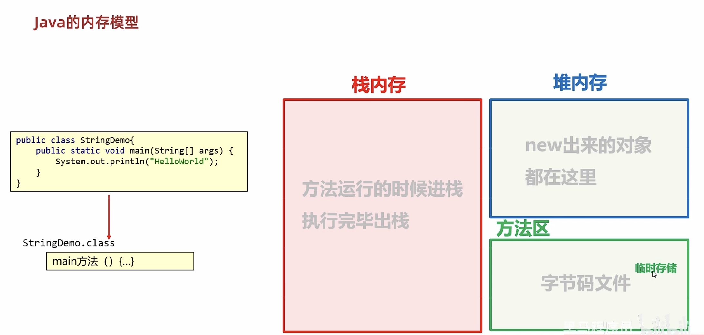
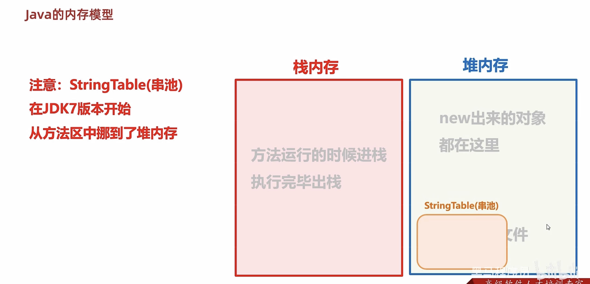
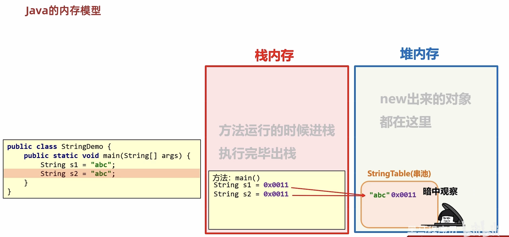
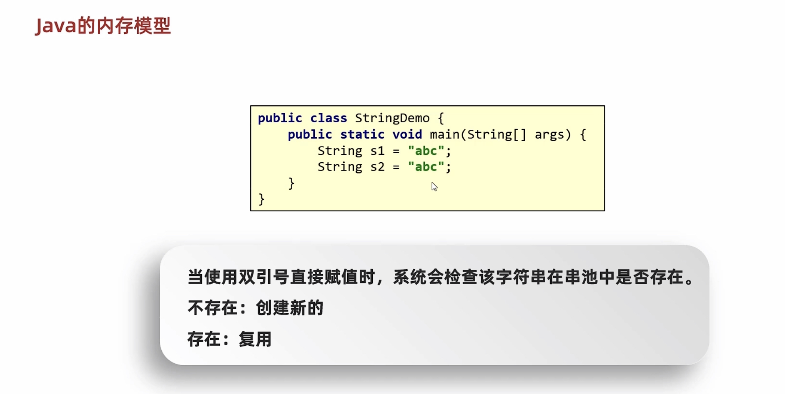
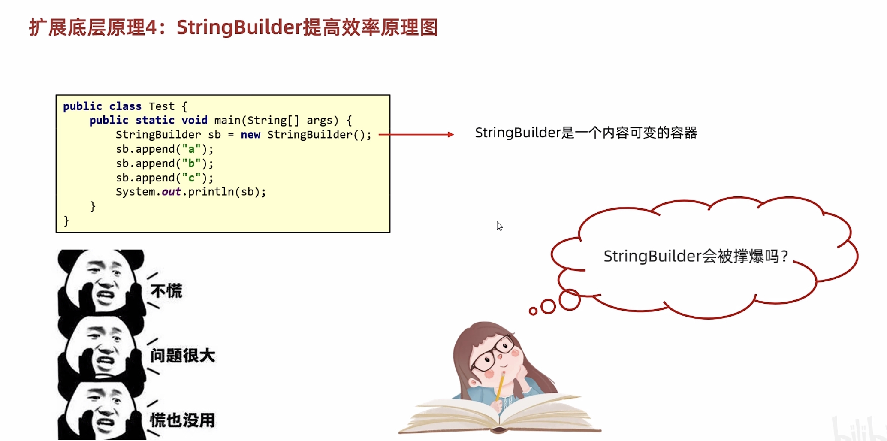
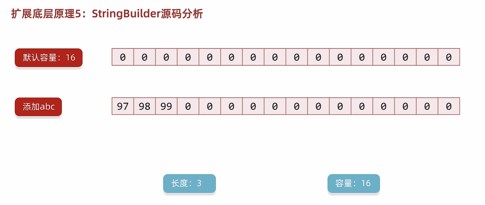
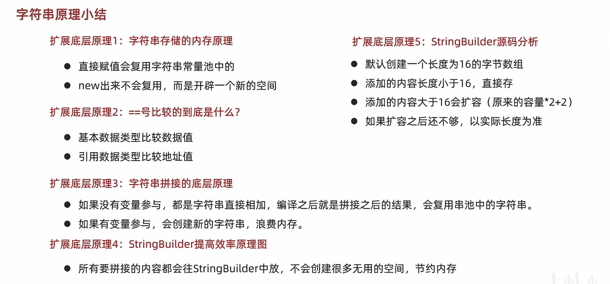

# 10-字符串

#### API和API帮助文档


#### String概述


#### String构造方法代码实现和内存分析


```java
public class StringDemo1 {
    public static void main(String[] args) {
        //1.使用直接赋值的方式获取一个字符串对象
        String s1 = "abc";
        System.out.println(s1);//abc


        //2.使用new的方式来获取一个字符串对象
        //空参构造：可以获取一个空白的字符串对象
        String s2 = new String();
        System.out.println("@" + s2 + "!");//""

        //传递一个字符串，根据传递的字符串内容再创建一个新的字符串对象
        String s3 = new String("abc");
        System.out.println(s3);

        //传递一个字符数组，根据字符数组的内容再创建一个新的字符串对象
        //需求：我要修改字符串的内容。  abc  Qbc
        //abc -->  {'a','b','c'}  -->  {'Q','b','c'} --> "Qbc"
        char[] chs = {'a', 'b', 'c', 'd'};
        String s4 = new String(chs);
        System.out.println(s4);//abcd

        //传递一个字节数组，根据字节数组的内容再创建一个新的字符串对象
        //应用场景：以后在网络当中传输的数据其实都是字节信息
        //我们一般要把字节信息进行转换，转成字符串，此时就要用到这个构造了。
        byte[] bytes = {97, 98, 99, 100};
        String s5 = new String(bytes);
        System.out.println(s5);//abcd

    }
}
```











#### 字符串的比较


```java
public class StringDemo2 {
    public static void main(String[] args) {
        //1.创建两个字符串对象
        String s1 = new String("abc");
        String s2 = "Abc";

        //2.==号比较
        //基本数据类型：比的是数据值
        //引用数据类型：比的是地址值
        System.out.println(s1 == s2);//false


        //3.比较字符串对象中的内容是否相等
        boolean result1 = s1.equals(s2);
        System.out.println(result1);

        //4.比较字符串对象中的内容是否相等，忽略大小写
        //1 一 壹 这不行
        //忽略大小写只能是英文状态下的a A
        boolean result2 = s1.equalsIgnoreCase(s2);
        System.out.println(result2);//true
    }
}
```

#### 练习

```java
public class StringDemo3 {
    public static void main(String[] args) {
        //1.假设我现在键盘录入一个abc
        Scanner sc = new Scanner(System.in);
        System.out.println("请输入一个字符串");
        String str1 = sc.next();//abc  是new出来的。
        //2.代码中再定义一个字符串abc
        String str2 = "abc";
        //3.用==比较，这两者能一样吗？
        System.out.println(str1 == str2);//false

        //结论:
        //以后只要想比较字符串的内容，就必须要用String里面的方法
    }
}
```

##### 用户登陆

需求：已知用户名和密码，请用程序实现模拟用户登录。总共给三次机会，登录之后，给出相应的提示

```java
public class StringDemo4 {
    public static void main(String[] args) {
        //读题拆解法

        //1.定义两个变量记录正确的用户名和密码
        String rightUsername = "zhangsan";
        String rightPassword = "123456";


        Scanner sc = new Scanner(System.in);
        //2.键盘录入用户名和密码
        for (int i = 0; i < 3; i++) {// 0 1 2
            System.out.println("请输入用户名");
            String username = sc.next();
            System.out.println("请输入密码");
            String password = sc.next();

            //3.比较
            if (username.equals(rightUsername) && password.equals(rightPassword)) {
                System.out.println("用户登录成功");
                break;
            } else {
                if(i == 2){
                    //最后一次机会也输入错误，此时要提示账号被锁定
                    System.out.println("账号" + username + "被锁定，请联系黑马程序员官方客服小姐姐:XXX-XXXXX");
                }else{
                    System.out.println("用户登录失败，用户名或密码有误,您还剩下" + (2 - i) + "次机会");//2 1 0
                }
            }
        }

    }
}
```

##### 遍历字符串

需求：键盘录入一个字符串，使用程序实现在控制台遍历该字符串


```java
public class StringDemo5 {
    public static void main(String[] args) {
        //1.键盘录入一个字符串
        Scanner sc = new Scanner(System.in);
        System.out.println("请输入一个字符串");
        String str = sc.next();
        //2.进行遍历
        for (int i = 0; i < str.length(); i++) {
            //i 依次表示字符串的每一个索引
            char c = str.charAt(i);
            System.out.println(c);
        }
    }
}
```

##### 统计字符次数

需求：键盘录入一个字符串，统计该字符串中大写字母字符，小写字母字符，数字字符出现的次数(不考虑其他字符)

```java
public class StringDemo6 {
    public static void main(String[] args) {
        //1.键盘录入一个字符串
        Scanner sc = new Scanner(System.in);
        System.out.println("请输入一个字符串");
        String str = sc.next();
        //2.统计--- 计数器思想
        //定义三个计数器
        int bigCount = 0;
        int smallCount = 0;
        int numberCount = 0;
        for (int i = 0; i < str.length(); i++) {
            //i 依次表示字符串中的每一个索引
            char c = str.charAt(i);
            if(c >= 'a' && c <= 'z'){
                //char类型的变量在参与计算的时候自动类型提升为int 查询ascii码表
                smallCount++;
            }else if(c >= 'A' && c <= 'Z'){
                bigCount++;
            }else if(c >= '0' && c <= '9'){
                numberCount++;
            }
        }

        //3.输出打印
        System.out.println("小写字母有：" + smallCount + "个");
        System.out.println("大写字母有：" + bigCount + "个");
        System.out.println("数字字母有：" + numberCount + "个");
    }
}
```

##### 字符串拼接

需求：定义一个方法，把 int 数组中的数据按照指定的格式拼接成一个字符串返回，调用该方法，并在控制台输出结果。例如，数组为 int[] arr \= {1,2,3}; ，执行方法后的输出结果为：[1, 2, 3]

```java
public class StringDemo7 {
    public static void main(String[] args) {
        int[] arr = {1,2,3};

        String str = arrToString(arr);
        System.out.println(str);//[123
    }

    //1.我要干嘛？ --- 遍历数组并把数组拼接成一个字符串
    //2.我干这件事情需要什么才能完成？ --- 数组
    //3.我干完了是否要把结果返回给调用处 --- 返回一个拼接之后的字符串
    //如果调用处需要继续使用，那么必须返回
    //如果调用处不需要继续使用，那么可以返回也可以不返回
    public static String arrToString(int[] arr){
        if(arr == null){
            return "";
        }

        if(arr.length == 0){
            return "[]";
        }

        String result = "[";
        //当代码执行到这里表示什么？
        //表示数组不是null，也不是长度为0的
        for (int i = 0; i < arr.length; i++) {
            //i 索引  arr[i] 元素
            if(i == arr.length - 1){
                result = result + arr[i];
            }else{
                result = result + arr[i] + ", ";
            }
        }
        //此时拼接右括号
        result = result + "]";
        return result;
    }

}
```

##### 字符串反转

需求：定义一个方法，实现字符串反转。键盘录入一个字符串，调用该方法后，在控制台输出结果。例如，键盘录入 abc，输出结果 cba

```java
public class StringDemo8 {
    public static void main(String[] args) {
        String result = reverser("abc");
        System.out.println(result);
    }

    //1.我要干嘛？  --- 字符串的反转
    //2.我干这件事情，需要什么才能完成？  --- 需要一个字符串
    //3.调用处是否需要继续使用方法的结果呢？ ---需要结果进行输出
    public static String reverser(String str){
        String result = "";
        for (int i = str.length() - 1; i >= 0; i--) {
            //i 依次表示字符串中的每一个索引 （倒着的）
            char c = str.charAt(i);
            result = result + c;
        }
        return result;
    }
}

```

##### 金额转换

需求：把2135变成：零佰零拾零万贰仟壹佰叁拾伍元  
	  把789变成：零佰零拾零万零仟柒佰捌拾玖元

```java
public class StringDemo9 {
    public static void main(String[] args) {
        //1.键盘录入一个金额
        Scanner sc = new Scanner(System.in);
        int money;
        while (true) {
            System.out.println("请录入一个金额");
            money = sc.nextInt();
            if (money >= 0 && money <= 9999999) {
                break;
            } else {
                System.out.println("金额无效");
            }
        }

        //定义一个变量用来表示钱的大写
        String moneyStr = "";

        //2.得到money里面的每一位数字,再转成中文
        while (true) {//2135
            //从右往左获取数据，因为右侧是数据的个位
            int ge = money % 10;
            String capitalNumber = getCapitalNumber(ge);
            //把转换之后的大写拼接到moneyStr当中
            moneyStr = capitalNumber + moneyStr;
            //第一次循环 ： "伍" + "" = "伍"
            //第二次循环 ： "叁" + "伍" = "叁伍"
            //去掉刚刚获取的数据
            money = money / 10;

            //如果数字上的每一位全部获取到了，那么money记录的就是0，此时循环结束
            if (money == 0) {
                break;
            }
        }

        //3.在前面补0，补齐7位
        int count = 7 - moneyStr.length();
        for (int i = 0; i < count; i++) {
            moneyStr = "零" + moneyStr;
        }
        System.out.println(moneyStr);//零零零贰壹叁伍

        //4.插入单位
        //定义一个数组表示单位
        String[] arr = {"佰","拾","万","仟","佰","拾","元"};
        //               零    零   零   贰   壹   叁   伍

        //遍历moneyStr，依次得到 零    零   零   贰   壹   叁   伍
        //然后把arr的单位插入进去

        String result = "";
        for (int i = 0; i < moneyStr.length(); i++) {
            char c = moneyStr.charAt(i);
            //把大写数字和单位拼接到result当中
            result = result + c + arr[i];
        }

        //5.打印最终结果
        System.out.println(result);

    }


    //定义一个方法把数字变成大写的中文
    //1 -- 壹
    public static String getCapitalNumber(int number) {
        //定义数组，让数字跟大写的中文产生一个对应关系
        String[] arr = {"零", "壹", "贰", "叁", "肆", "伍", "陆", "柒", "捌", "玖"};
        //返回结果
        return arr[number];
    }

}
```

##### 手机号屏蔽

需求：以字符串的形式从键盘接受一个手机号，将中间四位号码屏蔽，最终效果为：131\*\*\*\*9468


```java
public class Test8手机号屏蔽 {
    public static void main(String[] args) {
        /*以字符串的形式从键盘接受一个手机号，将中间四位号码屏蔽
        最终效果为：131****9468*/

        //1.键盘录入一个手机号码
        Scanner sc = new Scanner(System.in);
        System.out.println("请输入手机号码");
        String phoneNumber = sc.next();//13112349408

        //2.截取手机号码中的前三位
        String star = phoneNumber.substring(0, 3);

        //3.截取手机号码中的最后四位
        //此时我用substring方法，是用1个参数的，还是两个参数的？1个参数的会更好
        //因为现在我要截取到最后，所以建议使用1个参数的。
        String end = phoneNumber.substring(7);

        //4.拼接
        String result = star + "****" + end;

        System.out.println(result);

    }
}
```

##### 敏感词替换

需求1：键盘录入一个 字符串，如果字符串中包含（TMD），则使用\*\*\*替换


```java
public class Test9敏感词替换 {
    public static void main(String[] args) {
        //1.定义一个变量表示骂人的话
        String talk = "后裔你玩什么啊，TMD";


        //2.把这句话中的敏感词进行替换
        String result = talk.replace("TMD", "***");

        //3.打印
        System.out.println(talk);
        System.out.println(result);
    }
}

```

需求2：如果要替换的敏感词比较多怎么办？

```java
public class Test10多个敏感词替换 {
    public static void main(String[] args) {
        //实际开发中，敏感词会有很多很多

        //1.先键盘录入要说的话
        Scanner sc = new Scanner(System.in);
        System.out.println("请输入要说的话");
        String talk = sc.next();//后裔你玩什么啊，TMD,GDX,ctmd,ZZ

        //2.定义一个数组用来存多个敏感词
        String[] arr = {"TMD","GDX","ctmd","ZZ","lj","FW","nt"};

        //3.把说的话中所有的敏感词都替换为***

        for (int i = 0; i < arr.length; i++) {
            //i 索引
            //arr[i] 元素 --- 敏感词
            talk = talk.replace(arr[i],"***");
        }

        //4.打印结果
        System.out.println(talk);//后裔你玩什么啊，***,***,***,***

    }
}

```

##### 身份证信息查看

身份证的每一位都是有固定的含义：

* 1、2位：省份
* 3、4位：城市
* 5、6位：区县
* 7-14位：出生年、月、日
* 15、16位：所在地派出所
* 17位：性别（奇数男性，偶数女性）
* 18位：个人信息码（随机产生）

**要求打印内容方式如下：**

人物信息为：

出生年月日：XXXX年X月X日

性别为：男/女

```java
public class StringDemo11 {
    public static void main(String[] args) {
        //1.定义一个字符串记录身份证号码
        String id = "321281202001011234";

        //2.获取出生年月日
        String year = id.substring(6, 10);
        String month = id.substring(10, 12);
        String day = id.substring(12, 14);


        System.out.println("人物信息为：");
        System.out.println("出生年月日:" + year + "年" + month + "月" + day + "日");

        //3.获取性别
        char gender = id.charAt(16);//'3'  ---> 3
        //利用ASCII码表进行转换
        //'0' --->  48
        //'1' --->  49
        //'2' --->  50
        //'3' --->  51
        //'4' --->  52
        //'5' --->  53
        //'6' --->  54
        //'7' --->  55
        //'8' --->  56
        //'9' --->  57

       int num = gender - 48;
        if(num % 2 == 0){
            System.out.println("性别为:女");
        }else{
            System.out.println("性别为:男");
        }
    }
}
```

#### StringBuilder


​

##### 基本使用

```java
public class StringBuilderDemo3 {
    public static void main(String[] args) {
        //1.创建对象
        StringBuilder sb = new StringBuilder("abc");

        //2.添加元素
        /*sb.append(1);
        sb.append(2.3);
        sb.append(true);*/

        //反转
        sb.reverse();

        //获取长度
        int len = sb.length();
        System.out.println(len);


        //打印
        //普及：
        //因为StringBuilder是Java已经写好的类
        //java在底层对他做了一些特殊处理。
        //打印对象不是地址值而是属性值。
        System.out.println(sb);
    }
}
```

##### 链式编程

```java
public class StringBuilderDemo5 {
    public static void main(String[] args) {
        //链式编程：
        //当我们在调用一个方法的时候，不需要用变量接收他的结果，可以继续调用其他方法
        int len = getString().substring(1).replace("A", "Q").length();
        System.out.println(len);
    }

    public static String getString(){
        Scanner sc = new Scanner(System.in);
        System.out.println("请输入一个字符串");
        String str = sc.next();
        return str;
    }
}

```

```java
public class StringBuilderDemo4 {
    public static void main(String[] args) {
        //1.创建对象
        StringBuilder sb = new StringBuilder();

        //2.添加字符串
        sb.append("aaa").append("bbb").append("ccc").append("ddd");

        System.out.println(sb);//aaabbbcccddd

        //3.再把StringBuilder变回字符串
        String str = sb.toString();
        System.out.println(str);//aaabbbcccddd

    }
}
```

##### 练习

###### 练习1：对称字符串  

需求：键盘接受一个字符串，程序判断出该字符串是否是对称字符串，并在控制台打印是或不是

```java
对称字符串：123321、111

非对称字符串：123123
```

```java
public class StringBuilderDemo6 {
    //使用StringBuilder的场景：
    //1.字符串的拼接
    //2.字符串的反转

    public static void main(String[] args) {
        //1.键盘录入一个字符串
        Scanner sc = new Scanner(System.in);
        System.out.println("请输入一个字符串");
        String str = sc.next();

        //2.反转键盘录入的字符串
        String result = new StringBuilder().append(str).reverse().toString();

        //3.比较
        if(str.equals(result)){
            System.out.println("当前字符串是对称字符串");
        }else{
            System.out.println("当前字符串不是对称字符串");
        }

    }
}

```

###### 练习2：拼接字符串

需求：定义一个方法，把 int 数组中的数据按照指定的格式拼接成一个字符串返回。调用该方法，并在控制台输出结果。例如：数组为int[] arr = {1,2,3}；执行方法后的输出结果为：[1, 2, 3]

```java
public class StringBuilderDemo7 {
    public static void main(String[] args) {
        //1.定义数组
        int[] arr = {1,2,3};

        //2.调用方法把数组变成字符串
        String str = arrToString(arr);

        System.out.println(str);

    }

    public static String arrToString(int[] arr){
        StringBuilder sb = new StringBuilder();
        sb.append("[");

        for (int i = 0; i < arr.length; i++) {
            if(i == arr.length - 1){
                sb.append(arr[i]);
            }else{
                sb.append(arr[i]).append(", ");
            }
        }
        sb.append("]");

        return sb.toString();
    }
}

```

#### StringJoiner


```java
public class StringJoinerDemo1 {
    public static void main(String[] args) {
        //1.创建一个对象，并指定中间的间隔符号
        StringJoiner sj = new StringJoiner("---");

        //2.添加元素
        sj.add("aaa").add("bbb").add("ccc");


        //3.打印结果
        System.out.println(sj);//aaa---bbb---ccc
    }
}
```

```java
public class StringJoinerDemo2 {
    public static void main(String[] args) {
        //1.创建对象
        StringJoiner sj = new StringJoiner(", ","[","]");

        //2.添加元素
        sj.add("aaa").add("bbb").add("ccc");

        int len = sj.length();
        System.out.println(len);//15

        //3.打印
        System.out.println(sj);//[aaa, bbb, ccc]

        String str = sj.toString();
        System.out.println(str);//[aaa, bbb, ccc]

    }
}
```


#### 字符串相关类的底层原理










#### 综合练习

##### 转换罗马数字


方法一（查表法）

```java
public class Test1Case1 {
    public static void main(String[] args) {
       /* 键盘录入一个字符串，
        要求1：长度为小于等于9
        要求2：只能是数字
                将内容变成罗马数字
        下面是阿拉伯数字跟罗马数字的对比关系：
        Ⅰ－1、Ⅱ－2、Ⅲ－3、Ⅳ－4、Ⅴ－5、Ⅵ－6、Ⅶ－7、Ⅷ－8、Ⅸ－9
        注意点：
        罗马数字里面是没有0的
        如果键盘录入的数字包含0，可以变成""(长度为0的字符串)*/


        //1.键盘录入一个字符串
        //书写Scanner的代码
        Scanner sc = new Scanner(System.in);
        String str;
        while (true) {
            System.out.println("请输入一个字符串");
            str = sc.next();
            //2.校验字符串是否满足规则
            boolean flag = checkStr(str);
            if (flag) {
                break;
            } else {
                System.out.println("当前的字符串不符合规则，请重新输入");
                continue;
            }
        }

        //将内容变成罗马数字
        //下面是阿拉伯数字跟罗马数字的对比关系：
        //Ⅰ－1、Ⅱ－2、Ⅲ－3、Ⅳ－4、Ⅴ－5、Ⅵ－6、Ⅶ－7、Ⅷ－8、Ⅸ－9
        //查表法：数字跟数据产生一个对应关系
        StringBuilder sb = new StringBuilder();
        for (int i = 0; i < str.length(); i++) {
            char c = str.charAt(i);
            int number = c - 48; // 1 2 3 4 5
            String s = changeLuoMa(number);
            sb.append(s);
        }

        System.out.println(sb);

    }

    public static String changeLuoMa(int number) {
        //定义一个数组，让索引跟罗马数字产生一个对应关系
        String[] arr = {"", "Ⅰ", "Ⅱ", "Ⅲ", "Ⅳ", "Ⅴ", "Ⅵ", "Ⅶ", "Ⅷ", "Ⅸ"};
        return arr[number];
    }

    public static boolean checkStr(String str) {//123456
        //要求1：长度为小于等于9
        if (str.length() > 9) {
            return false;
        }

        //要求2：只能是数字
        for (int i = 0; i < str.length(); i++) {
            char c = str.charAt(i);//0~9
            if (c < '0' || c > '9') {
                return false;
            }
        }
        //只有当字符串里面所有的字符全都判断完毕了，我才能认为当前的字符串是符合规则
        return true;
    }
}
```

方法二（switch）

```java
public class Test1Case2 {
    public static void main(String[] args) {
       /* 键盘录入一个字符串，
        要求1：长度为小于等于9
        要求2：只能是数字
                将内容变成罗马数字
        下面是阿拉伯数字跟罗马数字的对比关系：
        Ⅰ－1、Ⅱ－2、Ⅲ－3、Ⅳ－4、Ⅴ－5、Ⅵ－6、Ⅶ－7、Ⅷ－8、Ⅸ－9
        注意点：
        罗马数字里面是没有0的
        如果键盘录入的数字包含0，可以变成""(长度为0的字符串)*/


        //1.键盘录入一个字符串
        //书写Scanner的代码
        Scanner sc = new Scanner(System.in);
        String str;
        while (true) {
            System.out.println("请输入一个字符串");
            str = sc.next();
            //2.校验字符串是否满足规则
            boolean flag = checkStr(str);
            if (flag) {
                break;
            } else {
                System.out.println("当前的字符串不符合规则，请重新输入");
                continue;
            }
        }

        //将内容变成罗马数字
        //下面是阿拉伯数字跟罗马数字的对比关系：
        //Ⅰ－1、Ⅱ－2、Ⅲ－3、Ⅳ－4、Ⅴ－5、Ⅵ－6、Ⅶ－7、Ⅷ－8、Ⅸ－9
        //查表法：数字跟数据产生一个对应关系
        StringBuilder sb = new StringBuilder();
        for (int i = 0; i < str.length(); i++) {
            char c = str.charAt(i);
            String s = changeLuoMa(c);
            sb.append(s);
        }

        System.out.println(sb);

    }

    //利用switch进行匹配(简化switch)
    public static String changeLuoMa(char number) {
        String str = switch (number) {
            case '0' -> "";
            case '1' -> "Ⅰ";
            case '2' -> "Ⅱ";
            case '3' -> "Ⅲ";
            case '4' -> "Ⅳ";
            case '5' -> "Ⅴ";
            case '6' -> "Ⅵ";
            case '7' -> "Ⅶ";
            case '8' -> "Ⅷ";
            case '9' -> "Ⅸ";
            default -> str = "";
        };
        return str;
    }

  
    //利用switch进行匹配
    /*public static String changeLuoMa(char number) {
         String str;
         switch (number) {
            case '0' -> str = "";
            case '1' -> str = "Ⅰ";
            case '2' -> str = "Ⅱ";
            case '3' -> str = "Ⅲ";
            case '4' -> str = "Ⅳ";
            case '5' -> str = "Ⅴ";
            case '6' -> str = "Ⅵ";
            case '7' -> str = "Ⅶ";
            case '8' -> str = "Ⅷ";
            case '9' -> str = "Ⅸ";
            default -> str = "";
        }
        return str;
    }*/


    public static boolean checkStr(String str) {//123456
        //要求1：长度为小于等于9
        if (str.length() > 9) {
            return false;
        }

        //要求2：只能是数字
        for (int i = 0; i < str.length(); i++) {
            char c = str.charAt(i);//0~9
            if (c < '0' || c > '9') {
                return false;
            }
        }

        //只有当字符串里面所有的字符全都判断完毕了，我才能认为当前的字符串是符合规则
        return true;
    }
}
```

##### 调整字符串


方法一（subString）

```java
public class Test2Case1 {
    public static void main(String[] args) {
       /* 给定两个字符串, A和B。
        A的旋转操作就是将A 最左边的字符移动到最右边。
        例如, 若A = 'abcde'，在移动一次之后结果就是'bcdea'
        如果在若干次调整操作之后，A能变成B，那么返回True。
        如果不能匹配成功，则返回false*/

        //1.定义两个字符串
        String strA = "abcde";
        String strB = "ABC";

        //2.调用方法进行比较
        boolean result = check(strA, strB);

        //3.输出
        System.out.println(result);
    }

    public static boolean check(String strA, String strB) {
        for (int i = 0; i < strA.length(); i++) {
            strA = rotate(strA);
            if(strA.equals(strB)){
                return true;
            }
        }
        //所有的情况都比较完毕了，还不一样那么直接返回false
        return false;
    }

    //作用：旋转字符串，把左侧的字符移动到右侧去
    //形参：旋转前的字符串
    //返回值：旋转后的字符串
    public static String rotate(String str) {
        //套路：
        //如果我们看到要修改字符串的内容
        //可以有两个办法：
        //1.用subString进行截取，把左边的字符截取出来拼接到右侧去
        //2.可以把字符串先变成一个字符数组，然后调整字符数组里面数据，最后再把字符数组变成字符串。

        //截取思路
        //获取最左侧那个字符
        char first = str.charAt(0);
        //获取剩余的字符
        String end = str.substring(1);

        return end + first;
    }
}
```

方法二（字符数组）

```java
public class Test2Case2 {
    public static void main(String[] args) {
       /* 给定两个字符串, A和B。
        A的旋转操作就是将A 最左边的字符移动到最右边。
        例如, 若A = 'abcde'，在移动一次之后结果就是'bcdea'
        如果在若干次调整操作之后，A能变成B，那么返回True。
        如果不能匹配成功，则返回false*/

        //1.定义两个字符串
        String strA = "abcde";
        String strB = "ABC";

        //2.调用方法进行比较
        boolean result = check(strA, strB);

        //3.输出
        System.out.println(result);

    }

    public static boolean check(String strA, String strB) {
        for (int i = 0; i < strA.length(); i++) {
            strA = rotate(strA);
            if (strA.equals(strB)) {
                return true;
            }
        }
        //所有的情况都比较完毕了，还不一样那么直接返回false
        return false;
    }

    //作用：旋转字符串，把左侧的字符移动到右侧去
    //形参：旋转前的字符串
    //返回值：旋转后的字符串
    public static String rotate(String str) {
        //套路：
        //如果我们看到要修改字符串的内容
        //可以有两个办法：
        //1.用subString进行截取，把左边的字符截取出来拼接到右侧去
        //2.可以把字符串先变成一个字符数组，然后调整字符数组里面数据，最后再把字符数组变成字符串。

        //可以把字符串先变成一个字符数组，然后调整字符数组里面数据，最后再把字符数组变成字符串。

        //"ABC"   ['A','B','C']  ['B','C','A']   new String(字符数组);
        char[] arr = str.toCharArray();
        //拿到0索引上的字符
        char first = arr[0];
        //把剩余的字符依次往前挪一个位置
        for (int i = 1; i < arr.length; i++) {
            arr[i - 1] = arr[i];
        }
        //把原来0索引上的字符放到最后一个索引
        arr[arr.length - 1] = first;

        //利用字符数组创建一个字符串对象
        String result = new String(arr);
        return result;
    }
}
```

‍
