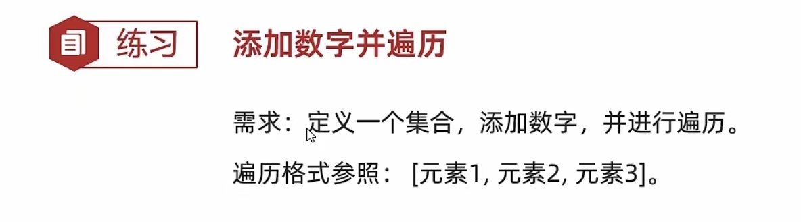

# 11-集合&学生管理系统

#### 集合的基本使用


```java
public class ArrayListDemo1 {
    public static void main(String[] args) {
        //1.创建集合的对象
        //泛型：限定集合中存储数据的类型
        //ArrayList<String> list = new ArrayList<String>();
        //JDK7:

        //此时我们创建的是ArrayList的对象，而ArrayList是java已经写好的一个类
        //这个类在底层做了一些处理
        //打印对象不是地址值，而是集合中存储数据内容
        //在展示的时候会拿[]把所有的数据进行包裹
        ArrayList<String> list = new ArrayList<>();
        System.out.println(list);

    }
}
```


```java
/*
    boolean add(E e)        添加

    boolean remove(E e)     删除
    E remove(int index)

    E set(int index,E e)    修改

    E get(int index)        查询
    int size()              获取长度

 */
public class ArrayListDemo2 {
    public static void main(String[] args) {

        //1.创建一个集合
        ArrayList<String> list = new ArrayList<>();

        //2.添加元素
        list.add("aaa");
        list.add("aaa");
        list.add("bbb");
        list.add("ccc");


        //3.删除元素
      /*  boolean result1 = list.remove("aaa");
        System.out.println(result1);

        boolean result2 = list.remove("ddd");
        System.out.println(result2);

        String str = list.remove(2);
        System.out.println(str);*/


        //修改元素
        /*String result = list.set(1, "ddd");
        System.out.println(result);*/

        //查询元素
       /* String s = list.get(0);
        System.out.println(s);*/

        //遍历
        for (int i = 0; i < list.size(); i++) {
            //i 索引
            //list.get(i) 元素
            String str = list.get(i);
            System.out.println(str);
        }
    }
}
```

#### 综合练习

##### 添加字符串并遍历


```java
public class Test1 {
    public static void main(String[] args) {
        //1.创建集合
        ArrayList<String> list = new ArrayList<>();

        //2.添加元素
        list.add("点赞了吗？");
        list.add("收藏了吗？");
        list.add("投币了吗？");
        list.add("转发了吗？");

        //3.遍历
        System.out.print("[");
        for (int i = 0; i < list.size(); i++) {
            if(i == list.size() - 1){
                System.out.print(list.get(i));
            }else{
                System.out.print(list.get(i) + ", ");
            }
        }
        System.out.println("]");
    }
}
```

##### 添加数字并遍历



​​

```java
public class Test2 {
    public static void main(String[] args) {
        //1.创建集合
        ArrayList<Integer> list = new ArrayList<>();

        //2.添加元素
        //jdk5以后 int Integer 之间是可以互相转化的
        list.add(1);
        list.add(2);
        list.add(3);
        list.add(4);
        list.add(5);

        //3.遍历集合
        System.out.print("[");
        for (int i = 0; i < list.size(); i++) {
            if(i == list.size() - 1){
                System.out.print(list.get(i));
            }else{
                System.out.print(list.get(i) + ", ");
            }
        }
        System.out.println("]");
    }
}
```

##### 添加对象并遍历


```java
public class Student {
    //1.私有化成员变量
    //2.空参构造方法
    //3.带全部参数的构造方法
    //4.get/set方法

    private String name;
    private int age;

    public Student() {
    }

    public Student(String name, int age) {
        this.name = name;
        this.age = age;
    }


    public String getName() {
        return name;
    }

    public void setName(String name) {
        this.name = name;
    }

    public int getAge() {
        return age;
    }

    public void setAge(int age) {
        this.age = age;
    }
}
```

```java
public class Test4 {
    public static void main(String[] args) {
        //1.创建集合
        ArrayList<Student> list = new ArrayList<>();

        //2.创建学生对象
        Student s1 = new Student("zhangsan",23);
        Student s2 = new Student("lisi",24);
        Student s3 = new Student("wangwu",25);

        //3.添加元素
        list.add(s1);
        list.add(s2);
        list.add(s3);

        //4.遍历集合
        for (int i = 0; i < list.size(); i++) {
            //i 索引 list.get(i) 元素/学生对象
            Student stu = list.get(i);
            System.out.println(stu.getName() + ", " + stu.getAge());
        }
    }
}
```


```java
public class Test5 {
    public static void main(String[] args) {
        //1.创建集合
        ArrayList<Student> list = new ArrayList<>();
        //长度为0
        //2.键盘录入学生的信息并添加到集合当中
        Scanner sc = new Scanner(System.in);
        for (int i = 0; i < 3; i++) {
            Student s = new Student();
            System.out.println("请输入学生的姓名");
            String name = sc.next();
            System.out.println("请输入学生的年龄");
            int age = sc.nextInt();

            //把name和age赋值给学生对象
            s.setName(name);
            s.setAge(age);

            //把学生对象添加到集合当中
            list.add(s);
        }
        //3.遍历
        for (int i = 0; i < list.size(); i++) {
            //i 索引 list.get(i) 元素/学生对象
            Student stu = list.get(i);
            System.out.println(stu.getName() + ", " + stu.getAge());
        }
    }
}
```


```java
public class User {
    private String id;
    private String username;
    private String password;


    public User() {
    }

    public User(String id, String username, String password) {
        this.id = id;
        this.username = username;
        this.password = password;
    }

    public String getId() {
        return id;
    }

    public void setId(String id) {
        this.id = id;
    }

    public String getUsername() {
        return username;
    }

    public void setUsername(String username) {
        this.username = username;
    }

    public String getPassword() {
        return password;
    }

    public void setPassword(String password) {
        this.password = password;
    }
}
```

```java
/*需求：
1，main方法中定义一个集合，存入三个用户对象。
用户属性为：id，username，password
2，要求：定义一个方法，根据id查找对应的用户信息。
如果存在，返回true
如果不存在，返回false*/
public class Test6 {
    public static void main(String[] args) {
        //1.创建集合
        ArrayList<User> list = new ArrayList<>();

        //2.创建三个用户对象
        User u1 = new User("heima001","zhangsan","123456");
        User u2 = new User("heima002","lisi","12345678");
        User u3 = new User("heima003","wangwu","1234qwer");

        //3.把用户对象添加到集合当中
        list.add(u1);
        list.add(u2);
        list.add(u3);

        //4.调用方法查看id是否存在
        boolean flag = contains(list, "heima0010");

        //5.打印结果
        System.out.println(flag);

    }

    //1.我要干嘛？   根据id查找用户
    //2.我干这件事需要什么才能完成？   list  id
    //3.调用处是否需要使用方法的结果？ 返回
    public static boolean contains(ArrayList<User> list, String id){
       /* for (int i = 0; i < list.size(); i++) {
            User u = list.get(i);
            String uid = u.getId();
            if(uid.equals(id)){
                //如果找到了直接返回true
                return true;
            }
        }
        //当循环结束表示集合里面所有的元素都已经比较完毕，还没有一样的，那么返回false就可以了
        return false;*/

       return getIndex(list,id) >= 0;
    }

    public static int getIndex(ArrayList<User> list, String id) {
        for (int i = 0; i < list.size(); i++) {
            User u = list.get(i);
            String uid = u.getId();
            if(uid.equals(id)){
                return i;
            }
        }

        return -1;
    }
```

变形

```java
/*需求：
1，main方法中定义一个集合，存入三个用户对象。
      用户属性为：id，username，password
2，要求：定义一个方法，根据id查找对应的用户信息。
      如果存在，返回索引
      如果不存在，返回-1
*/
public class Test7 {
    public static void main(String[] args) {
        //1.创建集合
        ArrayList<User> list = new ArrayList<>();

        //2.创建三个用户对象
        User u1 = new User("heima001", "zhangsan", "123456");
        User u2 = new User("heima002", "lisi", "12345678");
        User u3 = new User("heima003", "wangwu", "1234qwer");

        //3.把用户对象添加到集合当中
        list.add(u1);
        list.add(u2);
        list.add(u3);

        //4.查找索引
        int index = getIndex(list, "heima004");

        //5.打印
        System.out.println(index);

    }

    public static int getIndex(ArrayList<User> list, String id) {
        for (int i = 0; i < list.size(); i++) {
            User u = list.get(i);
            String uid = u.getId();
            if(uid.equals(id)){
                return i;
            }
        }
        return -1;
    }
}
```


```java
public class Phone {
    //Phone属性：品牌，价格。
    private String brand;
    private int price;

    public Phone() {
    }

    public Phone(String brand, int price) {
        this.brand = brand;
        this.price = price;
    }

    public String getBrand() {
        return brand;
    }

    public void setBrand(String brand) {
        this.brand = brand;
    }

    public int getPrice() {
        return price;
    }

    public void setPrice(int price) {
        this.price = price;
    }
}
```

```java
public class Test8 {
    public static void main(String[] args) {

        //1.创建集合对象
        ArrayList<Phone> list = new ArrayList<>();

        //2.创建手机的对象
        Phone p1 = new Phone("小米",1000);
        Phone p2 = new Phone("苹果",8000);
        Phone p3 = new Phone("锤子",2999);

        //3.添加数据
        list.add(p1);
        list.add(p2);
        list.add(p3);

        //4.调用方法
        ArrayList<Phone> phoneInfoList = getPhoneInfo(list);

        //5.遍历集合
        for (int i = 0; i < phoneInfoList.size(); i++) {
            Phone phone = phoneInfoList.get(i);
            System.out.println(phone.getBrand() + ", " + phone.getPrice());
        }

    }

    //1.我要干嘛？ 查询手机信息
    //2.我干这件事情，需要什么才能完成？  集合
    //3.我干完了，方法的调用处是否需要继续使用结果？  返回

    //技巧：
    //如果我们要返回多个数据，可以把这些数据先放到一个容器当中，再把容器返回
    //集合 数组
    public static ArrayList<Phone> getPhoneInfo(ArrayList<Phone> list){
        //定义一个集合用于存储价格低于3000的手机对象
        ArrayList<Phone> resultList = new ArrayList<>();
        //遍历集合
        for (int i = 0; i < list.size(); i++) {
            Phone p = list.get(i);
            int price = p.getPrice();
            //如果当前手机的价格低于3000，那么就把手机对象添加到resultList中
            if(price < 3000){
                resultList.add(p);
            }
        }
        //返回resultList
        return resultList;

    }
}
```

#### 学生管理系统

需求：采取控制台的方式去书写学生管理系统。

* **初始菜单**

```java
"-------------欢迎来到黑马学生管理系统----------------"
"1：添加学生"
"2：删除学生"
"3：修改学生"
"4：查询学生"
"5：退出"
"请输入您的选择:"
```

* **学生类**

属性：id、姓名、年龄、家庭住址

* **添加功能**

键盘录入每一个学生信息并添加，需要满足以下要求：

1. id唯一

* **删除功能**

键盘录入要删除的学生id，需要满足以下要求：

1. id存在删除
2. id不存在，需要提示不存在，并回到初始菜单

* **修改功能**

键盘录入要修改的学生id，需要满足以下要求：

1. id存在，继续录入其他信息
2. id不存在，需要提示不存在，并回到初始菜单

* **查询功能**

打印所有的学生信息，需要满足以下要求：

1. 如果没有学生信息，提示：当前无学生信息，请添加后再查询
2. 如果有学生信息，需要按照以下格式输出。（不用过于纠结对齐的问题）

```java
id			姓名		年龄		家庭住址
heima001		张三		23		 南京
heima002		李四		24		 北京
heima003		王五		25		 广州
heima004		赵六	 	26		 深圳
```

```java
public class Student {
    //id name age address
    private String id;
    private String name;
    private int age;
    private String address;

    public Student() {
    }

    public Student(String id, String name, int age, String address) {
        this.id = id;
        this.name = name;
        this.age = age;
        this.address = address;
    }

    public String getId() {
        return id;
    }

    public void setId(String id) {
        this.id = id;
    }

    public String getName() {
        return name;
    }

    public void setName(String name) {
        this.name = name;
    }

    public int getAge() {
        return age;
    }

    public void setAge(int age) {
        this.age = age;
    }

    public String getAddress() {
        return address;
    }

    public void setAddress(String address) {
        this.address = address;
    }
}
```

```java
public class StudentSystem {
    public static void main(String[] args) {
        ArrayList<Student> list = new ArrayList<>();
        loop:
        while (true) {
            System.out.println("-----------------欢迎来到黑马学生管理系统-------------------");
            System.out.println("1:添加学生");
            System.out.println("2:删除学生");
            System.out.println("3:修改学生");
            System.out.println("4:查询学生");
            System.out.println("5:退出");
            System.out.println("请输入您的选择：");
            Scanner sc = new Scanner(System.in);
            String choose = sc.next();
            switch (choose) {
                case "1" -> addStudent(list);
                case "2" -> deleteStudent(list);
                case "3" -> updateStudent(list);
                case "4" -> queryStudent(list);
                case "5" -> {
                    System.out.println("退出");
                    //break loop;
                    System.exit(0);//停止虚拟机运行
                }
                default -> System.out.println("没有这个选项");
            }
        }
    }

    //添加学生
    public static void addStudent(ArrayList<Student> list) {
        //利用空参构造先创建学生对象
        Student s = new Student();

        Scanner sc = new Scanner(System.in);
        String id = null;
        while (true) {
            System.out.println("请输入学生的id");
            id = sc.next();
            boolean flag = contains(list, id);
            if(flag){
                //表示id已经存在，需要重新录入
                System.out.println("id已经存在，请重新录入");
            }else{
                //表示id不存在，表示可以使用
                s.setId(id);
                break;
            }
        }

        System.out.println("请输入学生的姓名");
        String name = sc.next();
        s.setName(name);

        System.out.println("请输入学生的年龄");
        int age = sc.nextInt();
        s.setAge(age);

        System.out.println("请输入学生的家庭住址");
        String address = sc.next();
        s.setAddress(address);


        //把学生对象添加到集合当中
        list.add(s);

        //提示一下用户
        System.out.println("学生信息添加成功");
    }

    //删除学生
    public static void deleteStudent(ArrayList<Student> list) {
        Scanner sc = new Scanner(System.in);
        System.out.println("请输入要删除的id");
        String id = sc.next();
        //查询id在集合中的索引
        int index = getIndex(list, id);
        //对index进行判断
        //如果-1，就表示不存在，结束方法，回到初始菜单
        if(index >= 0){
            //如果大于等于0的，表示存在，直接删除
            list.remove(index);
            System.out.println("id为：" + id + "的学生删除成功");
        }else{
            System.out.println("id不存在，删除失败");
        }
    }

    //修改学生
    public static void updateStudent(ArrayList<Student> list) {
        Scanner sc = new Scanner(System.in);
        System.out.println("请输入要修改学生的id");
        String id = sc.next();

        int index = getIndex(list, id);

        if(index == -1){
            System.out.println("要修改的id" + id + "不存在，请重新输入");
            return;
        }

        //当代码执行到这里，表示什么？表示当前id是存在的。
        //获取要修改的学生对象
        Student stu = list.get(index);

        //输入其他的信息并修改
        System.out.println("请输入要修改的学生姓名");
        String newName = sc.next();
        stu.setName(newName);

        System.out.println("请输入要修改的学生年龄");
        int newAge = sc.nextInt();
        stu.setAge(newAge);

        System.out.println("请输入要修改的学生家庭住址");
        String newAddress = sc.next();
        stu.setAddress(newAddress);

        System.out.println("学生信息修改成功");


    }


    //查询学生
    public static void queryStudent(ArrayList<Student> list) {
        if (list.size() == 0) {
            System.out.println("当前无学生信息，请添加后再查询");
            //结束方法
            return;
        }

        //打印表头信息
        System.out.println("id\t\t姓名\t年龄\t家庭住址");
        //当代码执行到这里，表示集合中是有数据的
        for (int i = 0; i < list.size(); i++) {
            Student stu = list.get(i);
            System.out.println(stu.getId() + "\t" + stu.getName() + "\t" + stu.getAge() + "\t" + stu.getAddress());
        }
    }


    //判断id在集合中是否存在
    public static boolean contains(ArrayList<Student> list, String id) {
        //循环遍历集合得到里面的每一个学生对象
        /*for (int i = 0; i < list.size(); i++) {
            //拿到学生对象后，获取id并进行判断
            Student stu = list.get(i);
            String sid = stu.getId();
            if(sid.equals(id)){
                //存在，true
                return true;
            }
        }
        // 不存在false
        return false;*/
       return getIndex(list,id) >= 0;
    }

    //通过id获取索引的方法
    public static int getIndex(ArrayList<Student> list, String id){
        //遍历集合
        for (int i = 0; i < list.size(); i++) {
            //得到每一个学生对象
            Student stu = list.get(i);
            //得到每一个学生对象的id
            String sid = stu.getId();
            //拿着集合中的学生id跟要查询的id进行比较
            if(sid.equals(id)){
                //如果一样，那么就返回索引
                return i;
            }
        }
        //当循环结束之后还没有找到，就表示不存在，返回-1.
        return -1;
    }
}
```

#### 学生管理系统Plus

需求：为学生管理系统书写一个登陆、注册、忘记密码的功能。只有用户登录成功之后，才能进入到学生管理系统中进行增删改查操作。

* **登录界面**

```java
System.out.println("欢迎来到学生管理系统");
System.out.println("请选择操作1登录 2注册 3忘记密码");
```

* **用户类**

属性：用户名、密码、身份证号码、手机号码

* **注册功能**

1. 用户名需要满足以下要求：

    验证要求：

    用户名唯一

    用户名长度必须在3~15位之间

    只能是字母加数字的组合，但是不能是纯数字
2. 密码键盘输入两次，两次一致才可以进行注册。
3. 身份证号码需要验证。

    验证要求：

    长度为18位

    不能以0为开头

    前17位，必须都是数字

    最为一位可以是数字，也可以是大写X或小写x
4. 手机号验证。

    验证要求：

    长度为11位

    不能以0为开头

    必须都是数字

* **登录功能**

1. 键盘录入用户名
2. 键盘录入密码
3. 键盘录入验证码

验证要求：

用户名如果未注册，直接结束方法，并提示：用户名未注册，请先注册

判断验证码是否正确，如不正确，重新输入

再判断用户名和密码是否正确，有3次机会

* **忘记密码**

1. 键盘录入用户名，判断当前用户名是否存在，如不存在，直接结束方法，并提示：未注册
2. 键盘录入身份证号码和手机号码
3. 判断当前用户的身份证号码和手机号码是否一致，

如果一致，则提示输入密码，进行修改。

如果不一致，则提示：账号信息不匹配，修改失败。

* **验证码规则**

长度为5

由4位大写或者小写字母和1位数字组成，同一个字母可重复

数字可以出现在任意位置

比如：aQa1K

```java

```
