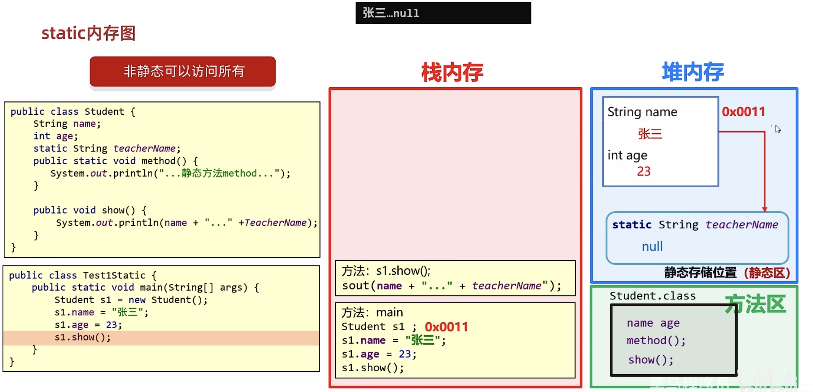
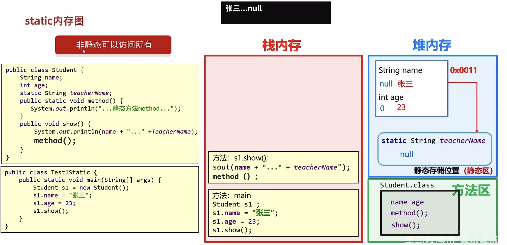
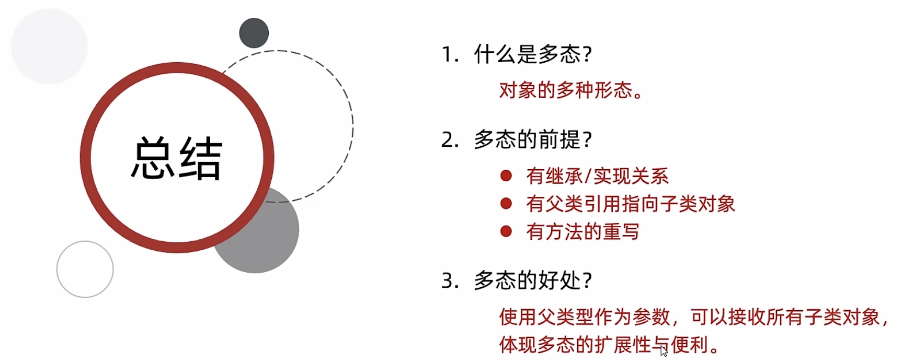
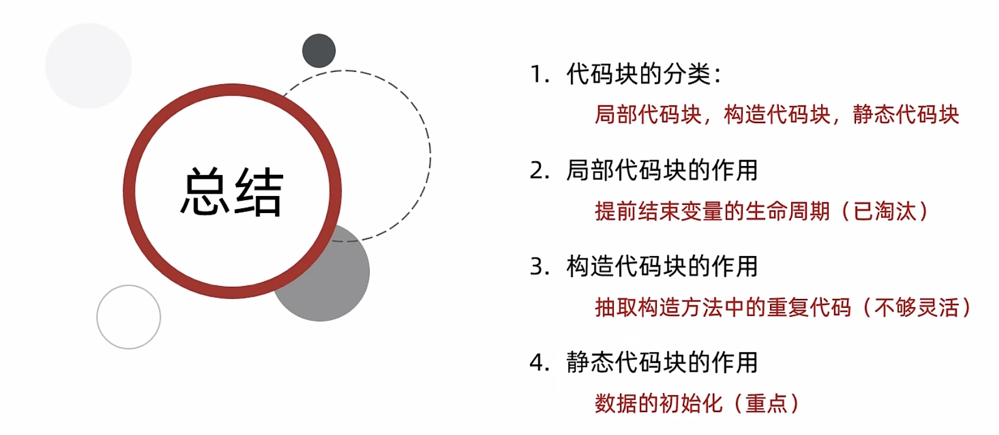
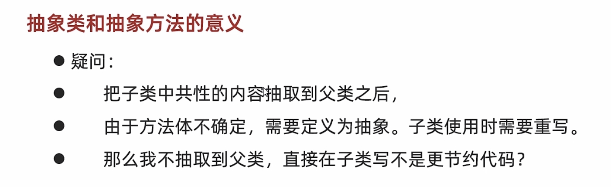
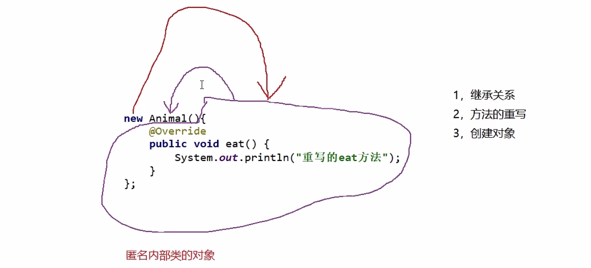

# 12-面向对象进阶

#### static

##### 静态变量


```java
public class Student {
    //属性：姓名 年龄 性别
    //新增：老师的姓名
    private String name;
    private int age;
    private String gender;
    public static String teacherName;

    public Student() {
    }

    public Student(String name, int age, String gender) {
        this.name = name;
        this.age = age;
        this.gender = gender;
    }

    public String getName() {
        return name;
    }

    public void setName(String name) {
        this.name = name;
    }

    public int getAge() {
        return age;
    }

    public void setAge(int age) {
        this.age = age;
    }

    public String getGender() {
        return gender;
    }

    public void setGender(String gender) {
        this.gender = gender;
    }

    //行为
    public void study() {
        System.out.println(name + "正在学习");
    }

    public void show() {
        System.out.println(name + ", " + age + ", " + gender + ", " + teacherName);
    }
}
```

```java
public class StudentTest {
    public static void main(String[] args) {
        Student.teacherName = "阿玮老师";
        //1.创建第一个学生对象
        Student s1 = new Student();
        s1.setName("张三");
        s1.setAge(23);
        s1.setGender("男");
        //s1.teacherName = "阿玮老师";

        s1.study();
        s1.show();

        //2.创建第二个学生对象
        Student s2 = new Student();
        s2.setName("李四");
        s2.setAge(24);
        s2.setGender("女");
        //s2.teacherName = "阿玮老师";

        s2.study();
        s2.show();
    }
}
```

​​

​​

​​

##### 静态方法和工具类


```java
public class ArrayUtil {

    //私有化构造方法
    //目的：为了不让外界创建他的对象
    private ArrayUtil() {
    }


    //需要定义为静态的，方便调用
    public static String printArr(int[] arr) {
        StringBuilder sb = new StringBuilder();
        sb.append("[");
        for (int i = 0; i < arr.length; i++) {
            //i 索引 arr[i] 元素
            if (i == arr.length - 1) {
                sb.append(arr[i]);
            } else {
                sb.append(arr[i]).append(", ");
            }
        }
        sb.append("]");
        return sb.toString();
    }


    public static double getAverage(double[] arr) {
        double sum = 0;
        for (int i = 0; i < arr.length; i++) {
            sum = sum + arr[i];
        }
        return sum / arr.length;
    }

}
```

```java
public class TestDemo {
    public static void main(String[] args) {
        //测试工具类中的两个方法是否正确

        int[] arr1 = {1, 2, 3, 4, 5};
        String str = ArrayUtil.printArr(arr1);
        System.out.println(str);


        double[] arr2 = {1.5, 3.7, 4.9, 5.8, 6.6};
        double avg = ArrayUtil.getAverage(arr2);
        System.out.println(avg);
    }
}
```


```java
public class Student {
    private String name;
    private int age;
    private String gender;

    public Student() {
    }

    public Student(String name, int age, String gender) {
        this.name = name;
        this.age = age;
        this.gender = gender;
    }

    public String getName() {
        return name;
    }

    public void setName(String name) {
        this.name = name;
    }

    public int getAge() {
        return age;
    }

    public void setAge(int age) {
        this.age = age;
    }

    public String getGender() {
        return gender;
    }

    public void setGender(String gender) {
        this.gender = gender;
    }
}
```

```java
public class StudentUtil {

    private StudentUtil(){}

    //静态方法
    public static int getMaxAgeStudent(ArrayList<Student> list){
        //1.定义一个参照物
        int max = list.get(0).getAge();

        //2.循环遍历集合
        for (int i = 1; i < list.size(); i++) {
            //i 索引  list.get(i)元素/学生对象  我们还需要getAge获取到年龄之后再进行比较
            int tempAge = list.get(i).getAge();
            if(tempAge > max){
                max = tempAge;
            }
        }

        //3.直接返回max
        return max;
    }
}
```

```java
public class Test {
    public static void main(String[] args) {
        //1.创建一个集合用来存储学生对象
        ArrayList<Student> list = new ArrayList<>();

        //2.创建3个学生对象
        Student stu1 = new Student("zhangsan",23,"男");
        Student stu2 = new Student("lisi",24,"女");
        Student stu3 = new Student("wangwu",25,"男");


        //3把学生对象添加到集合当中
        list.add(stu1);
        list.add(stu2);
        list.add(stu3);

        //4.调用工具类中的方法
        int maxAgeStudent = StudentUtil.getMaxAgeStudent(list);

        System.out.println(maxAgeStudent);
    }
}

```

##### static的注意事项







#### 继承

##### 继承的概述


##### 继承的特点


```java
public class Animal {

    //权限修饰符：
    //private：子类就无法访问了
    //私有：只能在本类中访问
    //爸爸的私房钱（自己能用）

    //注意事项:
    //子类只能访问父类中非私有的成员
    public void eat(){
        System.out.println("吃东西");
    }

    public void drink(){
        System.out.println("喝水");
    }
}
```

```java
public class Cat extends Animal {
    public void catchMouse() {
        System.out.println("猫在抓老鼠");
    }
}
```

```java
public class Dog extends Animal{
    public void lookHome(){
        System.out.println("狗看家");
    }
}
```

```java
public class Ragdoll extends Cat{

}
```

```java
public class LiHua extends Cat{

}
```

```java
public class Husky extends Dog{

    public void breakHome(){
        System.out.println("哈士奇在拆家");
    }
}
```

```java
public class Teddy extends Dog{
    public void touch(){
        System.out.println("泰迪又在蹭我的腿了~");
    }
}
```

```java
public class Test {
    public static void main(String[] args) {
        //创建对象并调用方法

        //1.创建布偶猫的对象
        Ragdoll rd = new Ragdoll();
        rd.eat();
        rd.drink();
        rd.catchMouse();

        System.out.println("----------------------");

        //2.创建哈士奇的对象
        Husky h = new Husky();
        h.eat();
        h.drink();
        h.lookHome();
        h.breakHome();
    }
}
```


##### 继承的内容


##### 访问的特点

###### 成员变量的访问特点


```java
public class Test {
    public static void main(String[] args) {
        Zi z = new Zi();
        z.show();
    }
}

class Fu {
    String name = "Fu";
    String hobby = "喝茶";

}

class Zi extends Fu {
    String name = "Zi";
    String game = "吃鸡";

    public void show() {
        //如何打印Zi
        //System.out.println(name);//Zi
        //System.out.println(this.name);//Zi
        //如何打印Fu
        //System.out.println(super.name);//Fu
        //如何打印喝茶
        //System.out.println(hobby);//喝茶
        //System.out.println(this.hobby);//喝茶
        //System.out.println(super.hobby);//喝茶
        //如何打印吃鸡
        System.out.println(game);
        System.out.println(this.game);
    }
}

```


###### 成员方法的访问特点


```java
public class Test {
    public static void main(String[] args) {
        OverseasStudent s = new OverseasStudent();
        s.lunch();
    }
}

class Person {
    public  void eat() {
        System.out.println("吃米饭，吃菜");
    }

    public void drink() {
        System.out.println("喝开水");
    }
}

//留学生
class OverseasStudent extends Person{
    public void lunch(){
        this.eat();//吃意大利面
        this.drink();//喝凉水

        super.eat();//吃米饭，吃菜
        super.drink();//喝开水
    }

    //应用场景：当父类中方法，不能满足子类现在的需求时，我们就需要把这个方法进行重写。
    //注意：子类中重写的方法上面需要加上@override
    @Override
    public  void eat() {
        System.out.println("吃意大利面");
    }

    @Override
    public void drink() {
        System.out.println("喝凉水");
    }

}

class Student extends Person{

    public void lunch(){
        //先在本类中查看eat和drink方法，就会调用子类的，如果没有，就会调用从父类中继承下来的eat和drink方法
        this.eat();
        this.drink();

        //直接调用父类中的eat和drink方法
        super.eat();
        super.drink();
    }

}
```


​​


```java
public class Dog {

    public void eat() {
        System.out.println("狗在吃狗粮");
    }


    public void drink() {
        System.out.println("狗在喝水");
    }

    public void lookHome() {
        System.out.println("狗在看家");
    }

}
```

```java
public class Husky extends Dog{

    //哈士奇有一个额外的方法拆家
    public void breakHome(){
        System.out.println("哈士奇又在拆家了");
    }

}
```

```java
public class SharPei extends Dog{

    //因为沙皮狗吃的狗粮和骨头
    //父类中的方法不能满足我们的需求了，所以需要进行重写
    @Override
    public void eat() {
        super.eat();//吃狗粮
        System.out.println("狗啃骨头");
    }
}
```

```java
public class ChineseDog extends Dog{

    //父类中的方法不能满足我们的需求了，所以需要进行重写
    //而且中华田园犬完全用不到父类中的代码的，所以不需要通过super进行调用

    @Override
    public void eat() {
        System.out.println("吃剩饭");
    }
}
```

```java
public class DogTest {
    public static void main(String[] args) {
        //创建对象并调用

        Husky h = new Husky();
        h.eat();
        h.drink();
        h.lookHome();
        h.breakHome();

        ChineseDog cd = new ChineseDog();
        cd.eat();
        cd.drink();
        cd.lookHome();
    }
}
```


###### 构造方法的访问特点


```java
public class Person {
    String name;
    int age;

    public Person() {
        System.out.println("父类的无参构造");
    }

    public Person(String name, int age) {
        this.name = name;
        this.age = age;
    }
}
```

```java
public class Student extends Person{

    public Student(){
        //子类构造方法中隐藏的super()去访问父类的无参构造
        super();
        System.out.println("子类的无参构造");
    }

    public Student(String name,int age){
       super(name,age);
    }

}

```

```java
public class Test {
    public static void main(String[] args) {
        //创建学生对象
        Student s = new Student("zhangsan",23);
    }
}
```


#### this、super关键字总结


```java
public class Employee {
    //1.类名见名知意
    //2.所有的成员变量都需要私有
    //3.构造方法（空参  带全部参数的构造）
    //4.get/set

    private String id;
    private String name;
    private double salary;

    public Employee() {
    }

    public Employee(String id, String name, double salary) {
        this.id = id;
        this.name = name;
        this.salary = salary;
    }

    public String getId() {
        return id;
    }

    public void setId(String id) {
        this.id = id;
    }

    public String getName() {
        return name;
    }

    public void setName(String name) {
        this.name = name;
    }

    public double getSalary() {
        return salary;
    }

    public void setSalary(double salary) {
        this.salary = salary;
    }

    //工作
    public void work(){
        System.out.println("员工在工作");
    }

    //吃饭
    public void eat(){
        System.out.println("吃米饭");
    }
}
```

```java
public class Cook extends Employee{

    public Cook() {
    }

    public Cook(String id, String name, double salary) {
        super(id, name, salary);
    }


    @Override
    public void work() {
        System.out.println("厨师正在炒菜");
    }
}
```

```java
public class Manager extends Employee{

    private double bouns;

    //空参构造
    public Manager() {
    }

    //带全部参数的构造
    //父类 + 子类
    public Manager(String id, String name, double salary, double bouns) {
        super(id, name, salary);
        this.bouns = bouns;
    }


    public double getBouns() {
        return bouns;
    }

    public void setBouns(double bouns) {
        this.bouns = bouns;
    }

    @Override
    public void work() {
        System.out.println("管理其他人");
    }
}
```

```java
public class Test {
    public static void main(String[] args) {
        //创建对象并赋值调用
        Manager m = new Manager("heima001","张三",15000,8000);
        System.out.println(m.getId() + ", " + m.getName() +
                ", " + m.getSalary() + ", " + m.getBouns());
        m.work();
        m.eat();

        Cook c = new Cook();
        c.setId("heima002");
        c.setName("李四");
        c.setSalary(8000);
        System.out.println(c.getId() + ", " + c.getName() + ", " + c.getSalary());
        c.work();
        c.eat();
    }
}
```

#### 多态

##### 认识多态


```java
public class Person {
    private String name;
    private int age;

    public Person() {
    }

    public Person(String name, int age) {
        this.name = name;
        this.age = age;
    }

    public String getName() {
        return name;
    }

    public void setName(String name) {
        this.name = name;
    }

    public int getAge() {
        return age;
    }

    public void setAge(int age) {
        this.age = age;
    }

    public void show(){
        System.out.println(name + ", " + age);
    }
}
```

```java
public class Administrator extends Person {
    @Override
    public void show() {
        System.out.println("管理员的信息为：" + getName() + ", " + getAge());
    }
}
```

```java
public class Student extends Person{

    @Override
    public void show() {
        System.out.println("学生的信息为：" + getName() + ", " + getAge());
    }
}

```

```java
public class Teacher extends Person{

    @Override
    public void show() {
        System.out.println("老师的信息为：" + getName() + ", " + getAge());
    }
}
```

```java
public class Test {
    public static void main(String[] args) {
        //创建三个对象，并调用register方法

        Student s = new Student();
        s.setName("张三");
        s.setAge(18);

        Teacher t = new Teacher();
        t.setName("王建国");
        t.setAge(30);

        Administrator admin = new Administrator();
        admin.setName("管理员");
        admin.setAge(35);

        register(s);
        register(t);
        register(admin);
    }

    //这个方法既能接收老师，又能接收学生，还能接收管理员
    //只能把参数写成这三个类型的父类
    public static void register(Person p){
        p.show();
    }
}
```



##### 多态调用成员的特点

‍


```java
public class Test {
    public static void main(String[] args) {
        //创建对象（多态方式）
        //Fu f = new Zi();
        Animal a = new Dog();
        //调用成员变量：编译看左边，运行也看左边
        //编译看左边：javac编译代码的时候，会看左边的父类中有没有这个变量，如果有，编译成功，如果没有编译失败。
        //运行也看左边：java运行代码的时候，实际获取的就是左边父类中成员变量的值
        System.out.println(a.name);//动物

        //调用成员方法：编译看左边，运行看右边
        //编译看左边：javac编译代码的时候，会看左边的父类中有没有这个方法，如果有，编译成功，如果没有编译失败。
        //运行看右边：java运行代码的时候，实际上运行的是子类中的方法。
        a.show();///Dog --- show方法

        //理解：
        //Animal a = new Dog();
        //现在用a去调用变量和方法的呀？是的
        //而a是Animal类型的，所以默认都会从Animal这个类中去找

        //成员变量：在子类的对象中，会把父类的成员变量也继承下的。父：name  子：name
        //成员方法：如果子类对方法进行了重写，那么在虚方法表中是会把父类的方法进行覆盖的。
    }
}

class Animal{
    String name = "动物";

   public void show(){
        System.out.println("Animal --- show方法");
    }
}

class Dog extends Animal{
    String name = "狗";

    @Override
    public void show() {
        System.out.println("Dog --- show方法");
    }
}

class Cat extends Animal{
    String name = "猫";

   @Override
    public void show() {
        System.out.println("Cat --- show方法");
    }
}
```


##### 多态的优势和弊端


```java
public class Test {
    public static void main(String[] args) {
        //创建对象
        Animal a = new Dog();
        //编译看左边，运行看右边
        a.eat();

        //多态的弊端
        //不能调用子类的特有功能
        //报错的原因？
        //当调用成员方法的时候，编译看左边，运行看右边
        //那么在编译的时候会先检查左边的父类中有没有这个方法，如果没有直接报错。
        //a.lookHome();

        //解决方案：
        //变回子类类型就可以了
        //细节：转换的时候不能瞎转，如果转成其他类的类型，就会报错
        //Cat c = (Cat) a;
        //c.catchMouse();

        /*if(a instanceof Dog){
            Dog d = (Dog) a;
            d.lookHome();
        }else if(a instanceof Cat){
            Cat c = (Cat) a;
            c.catchMouse();
        }else{
            System.out.println("没有这个类型，无法转换");
        }*/

        //新特性
        //先判断a是否为Dog类型，如果是，则强转成Dog类型，转换之后变量名为d
        //如果不是，则不强转，结果直接是false
        if(a instanceof Dog d){
            d.lookHome();
        }else if(a instanceof Cat c){
            c.catchMouse();
        }else{
            System.out.println("没有这个类型，无法转换");
        }
    }
}

class Animal{
    public void eat(){
        System.out.println("动物在吃东西");
    }
}

class Dog extends Animal{
    @Override
    public void eat() {
        System.out.println("狗吃骨头");
    }

    public void lookHome(){
        System.out.println("狗看家");
    }
}

class Cat extends Animal{
    @Override
    public void eat() {
        System.out.println("猫吃小鱼干");
    }

    public void catchMouse(){
        System.out.println("猫抓老鼠");
    }
}
```


##### 多态的综合练习

```java
根据需求完成代码:
	1.定义狗类
		属性：
			年龄，颜色
		行为:
			eat(String something)(something表示吃的东西)
			看家lookHome方法(无参数)

	2.定义猫类
		属性：
			年龄，颜色
		行为:
			eat(String something)方法(something表示吃的东西)
			逮老鼠catchMouse方法(无参数)

	3.定义Person类//饲养员
		属性：
			姓名，年龄
		行为：
			keepPet(Dog dog,String something)方法
				功能：喂养宠物狗，something表示喂养的东西
		行为：
			keepPet(Cat cat,String something)方法
				功能：喂养宠物猫，something表示喂养的东西
		生成空参有参构造，set和get方法  
	4.定义测试类(完成以下打印效果):
		keepPet(Dog dog,String somethind)方法打印内容如下：
			年龄为30岁的老王养了一只黑颜色的2岁的狗
			2岁的黑颜色的狗两只前腿死死的抱住骨头猛吃
		keepPet(Cat cat,String somethind)方法打印内容如下：
			年龄为25岁的老李养了一只灰颜色的3岁的猫
			3岁的灰颜色的猫眯着眼睛侧着头吃鱼
	5.思考：	
		1.Dog和Cat都是Animal的子类，以上案例中针对不同的动物，定义了不同的keepPet方法，过于繁琐，能否简化，并体会简化后的好处？
		2.Dog和Cat虽然都是Animal的子类，但是都有其特有方法，能否想办法在keepPet中调用特有方法？
```

```java
public class Animal {

    /*属性：
    年龄，颜色
    行为:
    eat(String something)(something表示吃的东西)*/


    private int age;
    private String color;


    public Animal() {
    }

    public Animal(int age, String color) {
        this.age = age;
        this.color = color;
    }

    public int getAge() {
        return age;
    }

    public void setAge(int age) {
        this.age = age;
    }

    public String getColor() {
        return color;
    }

    public void setColor(String color) {
        this.color = color;
    }

    public void eat(String something){
        System.out.println("动物在吃" + something);
    }
}
```

```java
public class Dog extends Animal {
    /* 1.定义狗类
    行为:
    eat(String something)(something表示吃的东西)
    看家lookHome方法(无参数)*/


    //空参构造
    //带全部参数的构造
    public Dog() {
    }

    public Dog(int age, String color) {
        super(age, color);
    }

    //行为
    //eat(String something)(something表示吃的东西)
    //看家lookHome方法(无参数)
    @Override
    public void eat(String something) {
        System.out.println(getAge() + "岁的" + getColor() + "颜色的狗两只前腿死死的抱住" + something + "猛吃");
    }

    public void lookHome(){
        System.out.println("狗在看家");
    }
}
```

```java
public class Cat extends Animal {

    public Cat() {
    }

    public Cat(int age, String color) {
        super(age, color);
    }


    /*eat(String something)方法(something表示吃的东西)
    逮老鼠catchMouse方法(无参数)*/

    @Override
    public void eat(String something) {
        System.out.println(getAge() + "岁的" + getColor() + "颜色的猫眯着眼睛侧着头吃" + something);
    }

    public void catchMouse(){
        System.out.println("猫抓老鼠");
    }

}
```

```java
public class Person {
   /* 属性：
    姓名，年龄
    行为：
    keepPet(Dog dog,String something)方法
    功能：喂养宠物狗，something表示喂养的东西
    行为：
    keepPet(Cat cat,String something)方法
    功能：喂养宠物猫，something表示喂养的东西
    生成空参有参构造，set和get方法
	4.定义测试类(完成以下打印效果):
    keepPet(Dog dog,String somethind)方法打印内容如下：
    年龄为30岁的老王养了一只黑颜色的2岁的狗   //对饲养员的描述
			2岁的黑颜色的狗两只前腿死死的抱住骨头猛吃  //当狗在吃东西的时候的描述
    keepPet(Cat cat,String somethind)方法打印内容如下：
    年龄为25岁的老李养了一只灰颜色的3岁的猫
			3岁的灰颜色的猫眯着眼睛侧着头吃鱼*/

    private String name;
    private int age;

    public Person() {
    }

    public Person(String name, int age) {
        this.name = name;
        this.age = age;
    }

    public String getName() {
        return name;
    }

    public void setName(String name) {
        this.name = name;
    }

    public int getAge() {
        return age;
    }

    public void setAge(int age) {
        this.age = age;
    }

    //饲养狗
   /* public void keepPet(Dog dog, String something) {
        System.out.println("年龄为" + age + "岁的" + name + "养了一只" + dog.getColor() + "颜色的" + dog.getAge() + "岁的狗");
        dog.eat(something);
    }

    //饲养猫
    public void keepPet(Cat cat, String something) {
        System.out.println("年龄为" + age + "岁的" + name + "养了一只" + cat.getColor() + "颜色的" + cat.getAge() + "岁的猫");
        cat.eat(something);
    }*/


    //想要一个方法，能接收所有的动物，包括猫，包括狗
    //方法的形参：可以写这些类的父类 Animal
    public void keepPet(Animal a, String something) {
        if(a instanceof Dog d){
            System.out.println("年龄为" + age + "岁的" + name + "养了一只" + a.getColor() + "颜色的" + a.getAge() + "岁的狗");
            d.eat(something);
        }else if(a instanceof Cat c){
            System.out.println("年龄为" + age + "岁的" + name + "养了一只" + c.getColor() + "颜色的" + c.getAge() + "岁的猫");
            c.eat(something);
        }else{
            System.out.println("没有这种动物");
        }
    }
}
```

```java
 /* 根据需求完成代码:
            1.定义狗类
    属性：
    年龄，颜色
    行为:
    eat(String something)(something表示吃的东西)
    看家lookHome方法(无参数)

	2.定义猫类
    属性：
    年龄，颜色
    行为:
    eat(String something)方法(something表示吃的东西)
    逮老鼠catchMouse方法(无参数)

	3.定义Person类//饲养员
    属性：
    姓名，年龄
    行为：
    keepPet(Dog dog,String something)方法
    功能：喂养宠物狗，something表示喂养的东西
    行为：
    keepPet(Cat cat,String something)方法
    功能：喂养宠物猫，something表示喂养的东西
    生成空参有参构造，set和get方法
	4.定义测试类(完成以下打印效果):
    keepPet(Dog dog,String somethind)方法打印内容如下：
            年龄为30岁的老王养了一只黑颜色的2岁的狗   //对饲养员的描述
			2岁的黑颜色的狗两只前腿死死的抱住骨头猛吃  //当狗在吃东西的时候的描述
    keepPet(Cat cat,String somethind)方法打印内容如下：
            年龄为25岁的老李养了一只灰颜色的3岁的猫
			3岁的灰颜色的猫眯着眼睛侧着头吃鱼
	5.思考：
            1.Dog和Cat都是Animal的子类，以上案例中针对不同的动物，定义了不同的keepPet方法，过于繁琐，能否简化，并体会简化后的好处？
            2.Dog和Cat虽然都是Animal的子类，但是都有其特有方法，能否想办法在keepPet中调用特有方法？*/

public class Test {
    public static void main(String[] args) {
        //创建对象并调用方法
       /* Person p1 = new Person("老王",30);
        Dog d = new Dog(2,"黑");
        p1.keepPet(d,"骨头");


        Person p2 = new Person("老李",25);
        Cat c = new Cat(3,"灰");
        p2.keepPet(c,"鱼");*/


        //创建饲养员的对象
        Person p = new Person("老王",30);
        Dog d = new Dog(2,"黑");
        Cat c = new Cat(3,"灰");
        p.keepPet(d,"骨头");
        p.keepPet(c,"鱼");

    }

}
```

#### 包和final


#### 权限修饰符和代码块

 


```java
public class CodeBlockDemo1 {
    public static void main(String[] args) {
        /*{
            int a = 10;
        }//因为当代码执行到这里时，变量a就从内存中消失了
        //System.out.println(a);*/

        //创建对象
        Student s = new Student();

        Student s2 = new Student("zhangsan",23);

        Student s3 = new Student("zhangsan");

    }
}
```


```java
public class Student {
    private String name;
    private int age;

    //构造代码块：
    //1.写在成员位置的代码块
    //2.作用：可以把多个构造方法中重复的代码抽取出来
    //3.执行时机：我们在创建本类对象的时候会先执行构造代码块再执行构造方法
    //渐渐的淘汰了
    {
        System.out.println("开始创建对象了");
    }

    public Student() {
        System.out.println("空参构造");
    }

    public Student(String name, int age) {
        System.out.println("有参构造");
        this.name = name;
        this.age = age;
    }

    public Student(String name) {
        this.name = name;
        this.age = age;
    }

    public String getName() {
        return name;
    }

    public void setName(String name) {
        this.name = name;
    }

    public int getAge() {
        return age;
    }

    public void setAge(int age) {
        this.age = age;
    }
}
```




#### 抽象类和抽象方法


‍

```java
public abstract class Animal {
    private String name;
    private int age;

    public Animal() {
    }

    public Animal(String name, int age) {
        this.name = name;
        this.age = age;
    }


    public String getName() {
        return name;
    }

    public void setName(String name) {
        this.name = name;
    }

    public int getAge() {
        return age;
    }

    public void setAge(int age) {
        this.age = age;
    }

    public void drink(){
        System.out.println("动物在喝水");
    }

    public abstract void eat();

}
```

```java
public class Frog extends Animal{

    public Frog() {
    }

    public Frog(String name, int age) {
        super(name, age);
    }

    @Override
    public void eat() {
        System.out.println("青蛙在吃虫子");
    }
}

```

```java
public class Dog extends Animal{

    public Dog() {
    }

    public Dog(String name, int age) {
        super(name, age);
    }

    @Override
    public void eat() {
        System.out.println("狗吃骨头");
    }
}
```

```java
public class Sheep extends Animal{

    public Sheep() {
    }

    public Sheep(String name, int age) {
        super(name, age);
    }

    @Override
    public void eat() {
        System.out.println("山羊在吃草");
    }
}

```

```java
public class Test {
    public static void main(String[] args) {
        //创建对象
        Frog f = new Frog("小绿",1);
        System.out.println(f.getName() + ", " + f.getAge());
        f.drink();
        f.eat();
    }
}
```




#### 接口


​​


```java
public abstract class Animal {
    private String name;
    private int age;


    public Animal() {
    }

    public Animal(String name, int age) {
        this.name = name;
        this.age = age;
    }

    public String getName() {
        return name;
    }

    public void setName(String name) {
        this.name = name;
    }

    public int getAge() {
        return age;
    }

    public void setAge(int age) {
        this.age = age;
    }


    public abstract void eat();

}
```

```java
public interface Swim {

    public abstract void swim();

}

```

```java
public class Dog extends Animal implements Swim{

    public Dog() {
    }

    public Dog(String name, int age) {
        super(name, age);
    }

    @Override
    public void eat() {
        System.out.println("狗吃骨头");
    }

    @Override
    public void swim() {
        System.out.println("狗刨");
    }
}
```

```java
public class Frog extends Animal implements Swim{

    public Frog() {
    }

    public Frog(String name, int age) {
        super(name, age);
    }

    @Override
    public void eat() {
        System.out.println("青蛙在吃虫子");
    }

    @Override
    public void swim() {
        System.out.println("青蛙在蛙泳");
    }
}
```

```java
public class Rabbit extends Animal{


    public Rabbit() {
    }

    public Rabbit(String name, int age) {
        super(name, age);
    }

    @Override
    public void eat() {
        System.out.println("兔子在吃胡萝卜");
    }
}

```

```java
public class Test {

    public static void main(String[] args) {
       //创建青蛙的对象
       Frog f = new Frog("小青",1);
        System.out.println(f.getName() + ", " + f.getAge());

        f.eat();
        f.swim();

        //创建兔子的对象
        Rabbit r = new Rabbit("小白",2);
        System.out.println(r.getName() + ", " + r.getAge());
        r.eat();

    }
}
```

##### 接口的细节


#### 接口和抽象类的综合案例


```java
//因为现在我不想让外界去直接创建人的对象
//因为直接创建顶层父类人的对象此时是没有意义的
//所以我就把他写为抽象的。
public abstract class Person {
    private String name;
    private int age;

    public Person() {
    }

    public Person(String name, int age) {
        this.name = name;
        this.age = age;
    }

    public String getName() {
        return name;
    }

    public void setName(String name) {
        this.name = name;
    }

    public int getAge() {
        return age;
    }

    public void setAge(int age) {
        this.age = age;
    }
}
```

```java
public abstract class Sporter extends Person{

    public Sporter() {
    }

    public Sporter(String name, int age) {
        super(name, age);
    }

    public abstract void study();
}
```

```java
public abstract class Coach extends Person{

    public Coach() {
    }

    public Coach(String name, int age) {
        super(name, age);
    }

    public abstract void teach();
}
```

```java
public interface English {
    public abstract void speakEnglish();
}
```

```java
public class PingPangSporter extends Sporter implements English{

    public PingPangSporter() {
    }

    public PingPangSporter(String name, int age) {
        super(name, age);
    }

    @Override
    public void speakEnglish() {
        System.out.println("乒乓球运动员在说英语");
    }

    @Override
    public void study() {
        System.out.println("乒乓球运动员在学习如何打乒乓球");
    }
}
```

```java
public class BasketballSporter extends Sporter{

    public BasketballSporter() {
    }

    public BasketballSporter(String name, int age) {
        super(name, age);
    }

    @Override
    public void study() {
        System.out.println("篮球运动员在学习如何打篮球");
    }
}
```

```java
public class PingPangCoach extends Coach implements English{

    public PingPangCoach() {
    }

    public PingPangCoach(String name, int age) {
        super(name, age);
    }

    @Override
    public void teach() {
        System.out.println("乒乓球教练正在教如何打乒乓球");
    }

    @Override
    public void speakEnglish() {
        System.out.println("乒乓球教练在学习说英语");
    }
}
```

```java
public class BasketballCoach extends Coach{

    public BasketballCoach() {
    }

    public BasketballCoach(String name, int age) {
        super(name, age);
    }

    @Override
    public void teach() {
        System.out.println("篮球教练正在教如何打篮球");
    }
}
```

```java
public class Test {
    public static void main(String[] args) {
        //创建运动员或教练的对象

        PingPangSporter pps = new PingPangSporter("刘诗雯",23);
        System.out.println(pps.getName() + ", " + pps.getAge());
        pps.study();
        pps.speakEnglish();

    }
}
```

#### 接口中新增方法，接口应用和适配器模式（扩展）


```java
public interface InterA {

    public static void show1(){
        System.out.println("show1方法开始执行了");
        show4();
    }

    public static void show2(){
        System.out.println("show2方法开始执行了");
        show4();
    }

   //普通的私有方法，给默认方法服务的
    private void show3(){
        System.out.println("记录程序在运行过程中的各种细节，这里有100行代码");
    }

    //静态的私有方法，给静态方法服务的
    private static void show4(){
        System.out.println("记录程序在运行过程中的各种细节，这里有100行代码");
    }

}
```


```java
public interface Inter {
    public abstract void method1();
    public abstract void method2();
    public abstract void method3();
    public abstract void method4();
    public abstract void method5();
    public abstract void method6();
    public abstract void method7();
    public abstract void method8();
    public abstract void method9();
    public abstract void method10();
}
```

```java
ublic abstract class InterAdapter implements Inter{

    @Override
    public void method1() {

    }

    @Override
    public void method2() {

    }

    @Override
    public void method3() {

    }

    @Override
    public void method4() {

    }

    @Override
    public void method5() {

    }

    @Override
    public void method6() {

    }

    @Override
    public void method7() {

    }

    @Override
    public void method8() {

    }

    @Override
    public void method9() {

    }

    @Override
    public void method10() {

    }
}
```

```java
public class InterImpl extends InterAdapter{
  //我需要用到那个方法，就重写哪个方法就可以了

    @Override
    public void method5() {
        System.out.println("只要用第五个方法");
    }
}
```


#### 内部类


```java
public class Car {
    String carName;
    int carAge;
    String carColor;


    public void show(Car this){
        //是打印调用者车的名字：宾利
        System.out.println(this.carName);
        Engine e = new Engine();
        System.out.println(e.engineName);
    }


    class Engine{
        String engineName;
        int engineAge;

        public void show(){
            System.out.println(engineName);
            System.out.println(carName);
        }
    }
}
```

```java
public class Test {
    public static void main(String[] args) {
        /*
            需求：写一个Javabean类描述汽车。
            属性：汽车的品牌，车龄，颜色，发动机的品牌，使用年限。

            内部类的访问特点:
                内部类可以直接访问外部类的成员，包括私有
                外部类要访问内部类的成员，必须创建对象

        */

        Car c = new Car();
        c.carName = "宾利";
        c.carAge = 1;
        c.carColor = "粉色";

        c.show();
    }
}
```


##### 成员内部类


```java
public class Outer {
    String name;

    private class Inner{
        static int a = 10;
    }

    public Inner getInstance(){
        return new Inner();
    }

}
```

```java
public class Test {
    public static void main(String[] args) {
       /*
        编写成员内部类的注意点：
            1.成员内部类可以被一些修饰符所修饰，比如： private，默认，protected，public，static等
            2.在成员内部类里面，JDK16之前不能定义静态变量，JDK16开始才可以定义静态变量。

        获取成员内部类对象的两种方式：
            方式一：外部类编写方法，对外提供内部类对象（private）

            方式二：直接创建
            格式：外部类名.内部类名 对象名 = 外部类对象.内部类对象;
            范例：Outer.Inner oi = new Outer().new Inner();
        */

        //创建对象的方式：
        //类名 对象名 = new 类名（）；
        //Student s = new Student();

        //我要创建的是谁的对象？
        //内部类的对象

       // Outer.Inner oi = new Outer().new Inner();

        Outer o = new Outer();
        System.out.println(o.getInstance());

    }
}
```

​​

```java
public class Outer {
    private int a = 10;

    class Inner {
        private int a = 20;

        public void show() {
            int a = 30;
            //Outer.this 获取了外部类对象的地址值
            System.out.println(Outer.this.a);//10
            System.out.println(this.a); //20
            System.out.println(a); //30
        }
    }
}
```

```java
public class Test {
    public static void main(String[] args) {
        //创建内部类的对象，并调用show方法
        Outer.Inner oi = new Outer().new Inner();

        oi.show();

        Scanner sc = new Scanner(System.in);
        sc.next();
    }
}
```


##### 静态内部类


```java
public class Outer {

    //int a = 10;
    //static int b = 20;

    //静态内部类
    static class Inner {
        public void show1(){
            System.out.println("非静态的方法被调用了");
        }

        public static void show2(){
            System.out.println("静态的方法被调用了");
        }
    }
}
```

```java
public class Test {
    public static void main(String[] args) {
        //注意事项：
        //1.静态内部类也是成员内部类中的一种
        //2.静态内部类只能访问外部类中的静态变量和静态方法，
        //  如果想要访问非静态的需要创建外部类的对象。

        //创建静态内部类对象的格式：
        //      外部类名.内部类名 对象名 = new 外部类名.内部类名();
        //调用静态方法的格式：
        //      外部类名.内部类名.方法名();

        //创建静态内部类的对象
        //只要是静态的东西，都可以用类名点直接获取
        Outer.Inner oi = new Outer.Inner();
        oi.show1();

        //静态方法
        Outer.Inner.show2();

    }
}
```

​​

##### 局部内部类


```java
public class Outer {

    int b = 20;

    public void show(){
        int a = 10;

        //局部内部类
        class Inner{
            String name;
            int age;

            public void method1(){
                System.out.println(a);
                System.out.println(b);
                System.out.println("局部内部类中的method1方法");
            }

            public static void method2(){
                System.out.println("局部内部类中的method2静态方法");
            }
        }

        //创建局部内部类的对象
        Inner i = new Inner();
        System.out.println(i.name);
        System.out.println(i.age);
        i.method1();
        Inner.method2();

    }
```

```java
public class Test {
    public static void main(String[] args) {
        /*
        局部内部类
        1.将内部类定义在方法里面就叫做局部内部类，类似于方法里面的局部变量。
        2.外界是无法直接使用局部内部类，需要在方法内部创建对象并使用。
        3.该类可以直接访问外部类的成员，也可以访问方法内的局部变量。*/

        //调用show方法，让代码执行
        Outer o = new Outer();
        o.show();

    }
}
```

##### 匿名内部类


```java
public interface Swim {
    public abstract void swim();
}
```

```java
public abstract class Animal {
    public abstract void eat();
}
```

```java
public class Test {

    public static void main(String[] args) {
       /*
            需要大家理解匿名内部类的格式，而不是硬记：
                new 类名或者接口名() {
                 重写方法;
                };
        */

        //编写匿名内部类的代码
        new Swim(){
            @Override
            public void swim() {
                System.out.println("重写了游泳的方法");
            }
        };

        new Animal(){
            @Override
            public void eat() {
                System.out.println("重写了eat方法");
            }
        };

        //在测试类中调用下面的method方法？
        //以前的方式如何调用？
        //要自己写一个子类继承Animal类
        //再创建子类的对象，传递给method方法
       /* Dog d = new Dog();
        method(d);*/
        //如果Dog类我只要用一次，那么还需要单独定义一个类太麻烦了。

        method(

                new Animal() {
                    @Override
                    public void eat() {
                        System.out.println("狗吃骨头");
                    }
                }
        );

    }

    public static void method(Animal a){//Animal a = 子类对象 多态
        a.eat();//编译看左边，运行看右边
    }

}
```

```java
public class Test2 {

    //是一个没有名字的成员内部类
    Swim s = new Swim(){

        @Override
        public void swim() {
            System.out.println("重写之后游泳方法");
        }
    };

    public static void main(String[] args) {
        //回顾一下匿名内部类的格式
        /*
        *
        *           new 类/接口(){
        *               重写的方法;
        *           }
        *
        *
        * */

        //整体我们可以理解为Swim接口的实现类对象
        //接口多态
        Swim s = new Swim(){

            @Override
            public void swim() {
                System.out.println("重写之后游泳方法");
            }
        };

        //编译看左边，运行看右边的原则
        s.swim();

        new Swim(){

            @Override
            public void swim() {
                System.out.println("重写之后游泳方法");
            }
        }.swim();

    }
}
```

​​

​​

​​

‍
