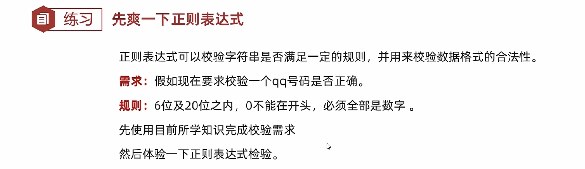
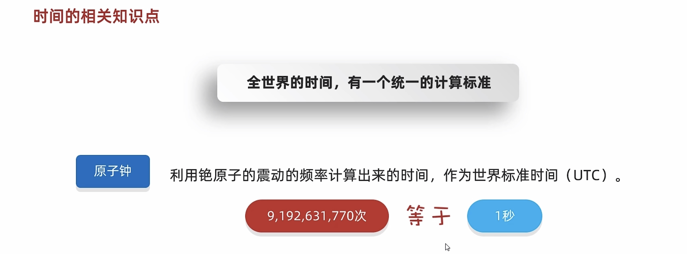
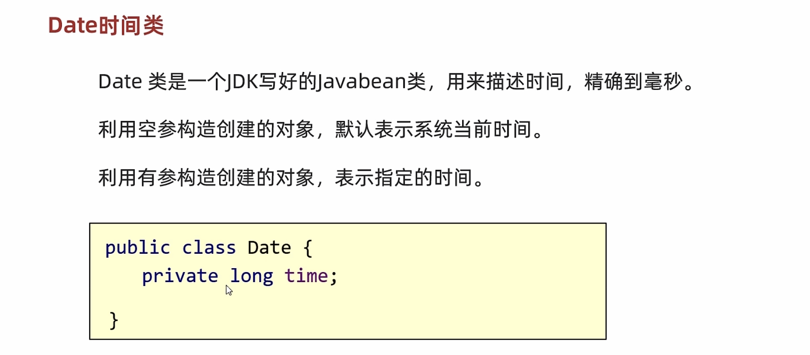
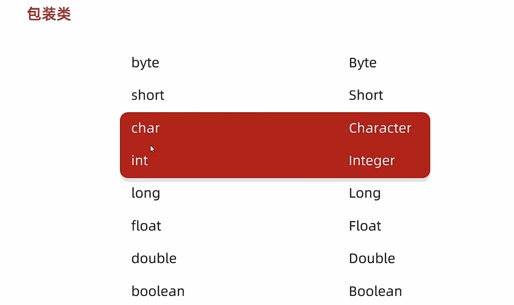

# 14-常用API

#### Math


```java
public class MathDemo1 {
    public static void main(String[] args) {
        /*
            public static int abs(int a) 获取参数绝对值
            public static double ceil(double a) 向上取整
            public static double floor(double a) 向下取整
            public static int round(float a) 四舍五入
            public static int max(int a,int b) 获取两个int值中的较大值
            public static double pow(double a,double b) 返回a的b次幂的值
            public static double random() 返回值为double的随机值，范围[0.0,1.0)
        */


        //abs 获取参数绝对值
        System.out.println(Math.abs(88));
        System.out.println(Math.abs(-88));


        //bug:
        //以int类型为例，取值范围: -2147483648~ 2147483647
        //如果没有正数与负数对应，那么传递负数结果有误
        //-2147483648 没有正数与之对应，所以abs结果产生bug
        //system.out.println(Math.abs(-2147483647));//2147483647
        //System.out.println(Math.absExact(-2147483648));

        //进一法，往数轴的正方向进一
        System.out.println(Math.ceil(12.34));//13.0
        System.out.println(Math.ceil(12.54));//13.0
        System.out.println(Math.ceil(-12.34));//-12.0
        System.out.println(Math.ceil(-12.54));//-12.0


        System.out.println("-------------------------------");


        //去尾法，
        System.out.println(Math.floor(12.34));//12.0
        System.out.println(Math.floor(12.54));//12.0
        System.out.println(Math.floor(-12.34));//-13.0
        System.out.println(Math.floor(-12.54));//-13.0
        System.out.println("-------------------------------");
        //四舍五入
        System.out.println(Math.round(12.34));//12
        System.out.println(Math.round(12.54));//13
        System.out.println(Math.round(-12.34));//-12
        System.out.println(Math.round(-12.54));//-13
        System.out.println("-------------------------------");
        //获取两个整数的较大值
        System.out.println(Math.max(20,30));//30
        //获取两个整数的较小值
        System.out.println(Math.min(20,30));//20
        System.out.println("-------------------------------");

        // 获取a的b次幂
        System.out.println(Math.pow(2,3));//8
        // 细节:
        //如果第二个参数 0~ 1之间的小数
        //system.out.println(Math.pow(4,0.5));//2.0
        //System.out.println(Math.pow(2,-2));//0.25
        //建议:
        //第二个参数:一般传递大于等于1的正整数。
        System.out.println(Math.sqrt(4));//2.0
        System.out.println(Math.cbrt(8));//2.0
        System.out.println("-------------------------------");
        for (int i = 0; i < 1; i++) {
            System.out.println(Math.floor(Math.random()*100)+1);
            //Math.random() [0.0 1.0)
            //* 100         [0.0 100.0)
            //floor         去掉了后面的小数
            //+1            [1 100]
        }
    }
}
```


#### 练习

##### 练习1

需求：判断一个数是否为质数

```java
public class MathDemo2 {
    public static void main(String[] args) {
        //判断一个数是否为一个质数
        System.out.println(isPrime(997));
        //997 2~996 995次
        //30次
    }

    public static boolean isPrime(int number) {
        int count = 0;
        for (int i = 2; i <= Math.sqrt(number); i++) {
            count++;
            if (number % i == 0) {
                return false;
            }
        }
        System.out.println(count);
        return true;
    }
}
```

##### 练习2

​​

```java
public class MathDemo3 {
    public static void main(String[] args) {
        //要求1:统计一共有多少个水仙花数。
        //要求2:判断一下为什么没有两位自幂数。
        //要求3:统计一共有多少个四叶玫瑰数，五角星数

        //水仙花数:100 ~ 999
        int count = 0;
        //得到每一个三位数
        for (int i = 100; i <= 999; i++) {
            //个位 十位 百位
            int ge = i % 10;
            int shi = i / 10 % 10;
            int bai = i / 100 % 10;
            //判断:
            //每一位的三次方之和 跟本身 进行比较。
            double sum = Math.pow(ge, 3) + Math.pow(shi, 3) + Math.pow(bai, 3);
            if (sum == i) {
                count++;
                //System.out.println(i);

                System.out.println(count);
            }
        }
    }
}
```

#### System


```java
public class SystemDemo1 {
    public static void main(String[] args) {
    /*
        public static void exit(int status) 终止当前运行的Java 虚拟机
        public static long currentTimeMillis() 返 回当前系统的时间毫秒值形式
        public static void arraycopy( 数据源数组，起始索引，目的地数组，起始索引，拷贝个数) 数组拷贝
    */
        //方法的形参:
        //状态码:
        //0:表示当前虚拟机是正常停止
        //非0:表示当前虚拟机异常停止
        System.exit(0);
        System.out.println("看看我执行了吗? ");
        //以拼图小游戏为例:
        //当我们需要把整个程序就结束的时候，就可以调用这个方法.


        long l = System.currentTimeMillis();
        System.out.println(l);//1656569533325 1656569559318


        //拷贝数组
        int[] arr1 = {1, 2, 3, 4, 5, 6, 7, 8, 9, 10};
        int[] arr2 = new int[10];
        //把arr1数组中的数据拷贝到arr2中
        //参数一:数据源，要拷贝的数据从哪个数组而来
        //参数二:从数据源数组中的第几个索引开始拷贝
        //参数三:目的地，我要把数据拷贝到哪个数组中
        //参数四:目的地数组的索引。
        //参数五:拷贝的个数
        //System.arraycopy(arr1,0,arr2,e,5);


        //课堂练习1:
        //arr2 : 0 0 0 0 1 2 3 0 0 0
        //system.arraycopy(arr1,0,arr2, 4, 3);


        //课堂练习2:
        //arr2 : 0 0 7 8 9 0 0 0 0 0
        //system.arraycopy(arr1,6,arr2,2,3);


        //验证
        for (int i = 0; i < arr2.length; i++) {
            System.out.print(arr2[i] + "");
        }

    }
}
```

```java
public class SystemDemo2 {
    public static void main(String[] args) {
        //判断1~100000之间有多少个质数

        long start = System.currentTimeMillis();

        for (int i = 1; i <= 100000; i++) {
            boolean flag = isPrime2(i);
            if (flag) {
                System.out.println(i);
            }
        }
        long end = System.currentTimeMillis();
        //获取程序运行的总时间
        System.out.println(end - start); //方式一：1514 毫秒  方式二：71毫秒
    }

    //以前判断是否为质数的方式
    public static boolean isPrime1(int number) {
        for (int i = 2; i < number; i++) {
            if (number % i == 0) {
                return false;
            }
        }
        return true;
    }

    //改进之后判断是否为质数的方式（效率高）
    public static boolean isPrime2(int number) {
        for (int i = 2; i <= Math.sqrt(number); i++) {
            if (number % i == 0) {
                return false;
            }
        }
        return true;
    }
}
```

```java
public class SystemDemo3 {
    public static void main(String[] args) {
        //public static void arraycopy(数据源数组，起始索引，目的地数组，起始索引，拷贝个数) 数组拷贝
        //细节:
        //1.如果数据源数组和目的地数组都是基本数据类型，那么两者的类型必须保持一致，否则会报错
        //2.在拷贝的时候需要考虑数组的长度，如果超出范围也会报错
        //3.如果数据源数组和目的地数组都是引用数据类型，那么子类类型可以赋值给父类类型

        Student s1 = new Student("zhangsan", 23);
        Student s2 = new Student("lisi", 24);
        Student s3 = new Student("wangwu", 25);

        Student[] arr1 = {s1, s2, s3};
        Person[] arr2 = new Person[3];
        //把arr1中对象的地址值赋值给arr2中
        System.arraycopy(arr1, 0, arr2, 0, 3);

        //遍历数组arr2
        for (int i = 0; i < arr2.length; i++) {
            Student stu = (Student) arr2[i];
            System.out.println(stu.getName() + "," + stu.getAge());
        }
    }
}

class Person {
    private String name;
    private int age;

    public Person() {
    }

    public Person(String name, int age) {
        this.name = name;
        this.age = age;
    }

    /**
     * 获取
     *
     * @return name
     */
    public String getName() {
        return name;
    }

    /**
     * 设置
     *
     * @param name
     */
    public void setName(String name) {
        this.name = name;
    }

    /**
     * 获取
     *
     * @return age
     */
    public int getAge() {
        return age;
    }

    /**
     * 设置
     *
     * @param age
     */
    public void setAge(int age) {
        this.age = age;
    }

    public String toString() {
        return "Person{name = " + name + ", age = " + age + "}";
    }
}


class Student extends Person {

    public Student() {
    }

    public Student(String name, int age) {
        super(name, age);
    }
}
```


#### Runtime


```java
public class RunTimeDemo1 {
    public static void main(String[] args) throws IOException {
        /*
            public static Runtime getRuntime() 当前系统的运行环境对象
            public void exit(int status) 停止虚拟机
            public int availableProcessors() 获得CPU的线程数
            public long maxMemory() JVM能从系统中获取总内存大小(单位byte)
            public long totalMemory() JVM已经从系统中获取总内存大小(单位byte)
            public long freeMemory() JVM剩余内存大小(单位byte)
            public Process exec(string command) 运行cmd命令
        */

        //1.获取Runtime的对象
        //Runtime r1 =Runtime.getRuntime();

        //2.exit 停止虚拟机
        //Runtime.getRuntime().exit(0);
        //System.out.println("看看我执行了吗?");


        //3.获得CPU的线程数
        System.out.println(Runtime.getRuntime().availableProcessors());//8
        //4.总内存大小,单位byte字节
        System.out.println(Runtime.getRuntime().maxMemory() / 1024 / 1024);//4064
        //5.已经获取的总内存大小,单位byte字节
        System.out.println(Runtime.getRuntime().totalMemory() / 1024 / 1024);//254
        //6.剩余内存大小
        System.out.println(Runtime.getRuntime().freeMemory() / 1024 / 1024);//251

        //7.运行cmd命令
        //shutdown :关机
        //加上参数才能执行
        //-s :默认在1分钟之后关机
        //-s -t 指定时间 : 指定关机时间
        //-a :取消关机操作
        //-r: 关机并重启
        Runtime.getRuntime().exec("shutdown -s -t 3600");


    }
}
```

#### Object


```java
public class Student {
    private String name;
    private int age;


    public Student() {
    }

    public Student(String name, int age) {
        this.name = name;
        this.age = age;
    }

    /**
     * 获取
     *
     * @return name
     */
    public String getName() {
        return name;
    }

    /**
     * 设置
     *
     * @param name
     */
    public void setName(String name) {
        this.name = name;
    }

    /**
     * 获取
     *
     * @return age
     */
    public int getAge() {
        return age;
    }

    /**
     * 设置
     *
     * @param age
     */
    public void setAge(int age) {
        this.age = age;
    }


    @Override
    public boolean equals(Object o) {
        if (this == o) return true;
        if (o == null || getClass() != o.getClass()) return false;
        Student student = (Student) o;
        return age == student.age && Objects.equals(name, student.name);
    }

    @Override
    public int hashCode() {
        return Objects.hash(name, age);
    }

    public String toString() {
        return name + ", " + age;
    }
}
```

```java
//Cloneable
//如果一个接口里面没有抽象方法
//表示当前的接口是一个标记性接口
//现在Cloneable表示一旦实现了，那么当前类的对象就可以被克降
//如果没有实现，当前类的对象就不能克隆
public class User implements Cloneable {
    private int id;
    private String username;
    private String password;
    private String path;
    private int[] data;

    public User() {
    }

    public User(int id, String username, String password, String path, int[] data) {
        this.id = id;
        this.username = username;
        this.password = password;
        this.path = path;
        this.data = data;
    }

    /**
     * 获取
     *
     * @return id
     */
    public int getId() {
        return id;
    }

    /**
     * 设置
     *
     * @param id
     */
    public void setId(int id) {
        this.id = id;
    }

    /**
     * 获取
     *
     * @return username
     */
    public String getUsername() {
        return username;
    }

    /**
     * 设置
     *
     * @param username
     */
    public void setUsername(String username) {
        this.username = username;
    }

    /**
     * 获取
     *
     * @return password
     */
    public String getPassword() {
        return password;
    }

    /**
     * 设置
     *
     * @param password
     */
    public void setPassword(String password) {
        this.password = password;
    }

    /**
     * 获取
     *
     * @return path
     */
    public String getPath() {
        return path;
    }

    /**
     * 设置
     *
     * @param path
     */
    public void setPath(String path) {
        this.path = path;
    }

    /**
     * 获取
     *
     * @return data
     */
    public int[] getData() {
        return data;
    }

    /**
     * 设置
     *
     * @param data
     */
    public void setData(int[] data) {
        this.data = data;
    }

    public String toString() {
        return "角色编号为：" + id + "，用户名为：" + username + "密码为：" + password + ", 游戏图片为:" + path + ", 进度:" + arrToString();
    }


    public String arrToString() {
        StringJoiner sj = new StringJoiner(", ", "[", "]");

        for (int i = 0; i < data.length; i++) {
            sj.add(data[i] + "");
        }
        return sj.toString();
    }

    @Override
    protected Object clone() throws CloneNotSupportedException {
        //调用父类中的clone方法
        //相当于让Java帮我们克隆一个对象，并把克隆之后的对象返回出去。

        //先把被克隆对象中的数组获取出来
        int[] data = this.data;
        //创建新的数组
        int[] newData =new int[data.length];
        //拷贝数组中的数据
        for (int i = 0; i < data.length; i++) {
            newData[i] = data[i];
        }
        //调用父类中的方法克隆对象
            User u=(User)super.clone();
        //因为父类中的克隆方法是浅克隆，替换克隆出来对象中的数组地址值
        u.data =newData;
        return u;
    }
}
```

```java
public class ObjectDemo1 {
    public static void main(String[] args) {
        /*
            public string tostring() 返回对象的字符串表示形式
            public boolean equals(Object obj) 比较两个对象是否相等
            protected object clone(int a) 对象克隆
        */
        //1.tostring 返回对象的字符串表示形式
        Object obj = new Object();
        String str1 = obj.toString();
        System.out.println(str1);//java.lang.Object@119d7047

        Student stu = new Student();
        String str2 = stu.toString();
        System.out.println(str2);//com.itheima.a04objectdemo.student@4eec7777

        //细节:
        System.out.println(stu);//com.itheima.a04objectdemo.student@4eec7777


        //细节:
        //System:类名
        //out:静态变量
        //system.out:获取打印的对象
        //println():方法
        //参数:表示打印的内容
        //核心逻辑:
        //当我们打印一个对象的时候，底层会调用对象的tostring方法，把对象变成字符串。
        //然后再打印在控制台上，打印完毕换行处理。

        //思考:默认情况下，因为Object类中的tostring方法返回的是地址值
        //所以，默认情况下，打印一个对象打印的就是地址值
        //但是地址值对于我们是没什么意义的?
        //我想要看到对象内部的属性值?我们该怎么办?
        //处理方案：重写父类Object类中的toString方法
        System.out.println(stu);//com.itheima.a04objectdemo.Student@4eec7777


        //tostring方法的结论:
        //如果我们打印一个对象，想要看到属性值的话，那么就重写tostring方法就可以了。
        //在重写的方法中，把对象的属性值进行拼接。
    }
}

```

```java
public class ObjectDemo2 {
    public static void main(String[] args) {
        /*
            public boolean equals(Object obj) 比较两个对象是否相等
        */
        Student s1 = new Student("zhangsan",23);
        Student s2 =new Student("zhangsan",23);

        boolean result1 = s1.equals(s2);
        System.out.println(result1);//true

        //结论:
        //1.如果没有重写equals方法，那么默认使用Object中的方法进行比较，比较的是地址值是否相等
        //2.一般来讲地址值对于我们意义不大，所以我们会重写，重写之后比较的就是对象内部的属性值了。
    }
}
```

```java
public class ObjectDemo3 {
    public static void main(String[] args) {
        String s = "abc";
        StringBuilder sb = new StringBuilder("abc");

        System.out.println(s.equals(sb));// false
        //因为equals方法是被s调用的，而s是字符串
        //所以equals要看string类中的
        //字符串中的equals方法，先判断参数是否为字符串
        // 如果是字符串，再比较内部的属性
        //但是如果参数不是字符串，直接返回false


        System.out.println(sb.equals(s));// false
        //因为equals方法是被sb调用的，而sb是StringBuilder
        //所以这里的equals方法要看StringBuilder中的equals方法
        //那么在StringBuilder当中，没有重写equals方法
        //使用的是Object中的
        //在Object当中默认是使用==号比较两个对象的地址值
        //而这里的s和sb记录的地址值是不一样的，所以结果返回false
    }
}
```

```java
public class ObjectDemo4 {
    public static void main(String[] args) throws CloneNotSupportedException {
        // protected object clone(int a) 对象克隆 

        //1.先创建一个对象
        int[] data = {1, 2, 3, 4, 5, 6, 7, 8, 9, 10, 11, 12, 13, 14, 15, 0};
        User u1 = new User(1, "zhangsan", "1234qwer", "girl11", data);

        //2.克隆对象
        //细节:
        //方法在底层会帮我们创建一个对象,并把原对象中的数据拷贝过去。
        //书写细节:
        //1.重写Object中的clone方法
        //2.让javabean类实现Cloneable接口
        //3.创建原对象并调用clone就可以了
        //User u2 =(User)u1.clone();

        //验证一件事情：Object中的克隆是浅克隆
        //想要进行深克隆，就需要重写clone方法并修改里面的方法体
        //int[] arr = u1.getData();
        //arr[0] = 100;

        //System.out.println(u1);
        //System.out.println(u2);


        //以后一般会用第三方工具进行克隆
        //1.第三方写的代码导入到项目中
        //2.编写代码
        //Gson gson =new Gson();
        //把对象变成一个字符串
        //String s=gson.toJson(u1);
        //再把字符串变回对象就可以了
        //User user =gson.fromJson(s, User.class);

        //int[] arr=u1.getData();
        //arr[0] = 100;

        //打印对象
        //System.out.println(user);

    }
}
```


#### Objects


```java
public class Student {
    private String name;
    private int age;


    public Student() {
    }

    public Student(String name, int age) {
        this.name = name;
        this.age = age;
    }

    /**
     * 获取
     *
     * @return name
     */
    public String getName() {
        return name;
    }

    /**
     * 设置
     *
     * @param name
     */
    public void setName(String name) {
        this.name = name;
    }

    /**
     * 获取
     *
     * @return age
     */
    public int getAge() {
        return age;
    }

    /**
     * 设置
     *
     * @param age
     */
    public void setAge(int age) {
        this.age = age;
    }


    @Override
    public boolean equals(Object o) {
        if (this == o) return true;
        if (o == null || getClass() != o.getClass()) return false;
        Student student = (Student) o;
        return age == student.age && Objects.equals(name, student.name);
    }

    @Override
    public int hashCode() {
        return Objects.hash(name, age);
    }

    public String toString() {
        return name + ", " + age;
    }
}
```

```java
public class ObjectsDemo1 {
    public static void main(String[] args) {
        /*
            public static boolean equals(Object a, Object b) 先做非空判断，比较两个对象
            public static boolean isNull(Object obj) 判断对象是否为null，为nul1返回true ，反之
            public static boolean nonNull(Object obj) 判断对象是否为null，跟isNull的结果相反
        */
        //1.创建学生类的对象
        Student s1 = null;
        Student s2 = new Student("zhangsan", 23);

        //2.比较两个对象的属性值是否相同
        if(s1 != null){
            boolean result = s1.equals(s2);
            System.out.println(result);
        }else{
            System.out.println("调用者为空");
        }

        boolean result = Objects.equals(s1, s2);
        System.out.println(result);
        //细节:
        //1.方法的底层会判断s1是否为null，如果为null，直接返回false
        //2.如果s1不为null，那么就利用s1再次调用equals方法
        //3.此时s1是student类型，所以最终还是会调用student中的equals方法。
        // 如果没有重写，比较地址值，如果重写了，就比较属性值。

        //public static boolean isNull(Obiect obi) 判断对象是否为null，为nul1返回true,反之
        Student s3 = new Student();
        Student s4 = null;

        System.out.println(Objects.isNull(s3));//false
        System.out.println(Objects.isNull(s4));//true

        System.out.println(Objects.nonNull(s3));//true
        System.out.println(Objects.nonNull(s4));//false

    }
}
```


#### BigInteger


##### 构造方法


```java
public class BigIntegerDemo1 {
    public static void main(String[] args) {
        /*
            public BigInteger(int num, Random rnd) 获取随机大整数，范围:[0~ 2的num次方-11
            public BigInteger(String val) 获取指定的大整数
            public BigInteger(String val, int radix) 获取指定进制的大整数

            public static BigInteger valueOf(long val) 静态方法获取BigInteger的对象，内部有优化

            细节:
            对象一旦创建里面的数据不能发生改变。
        */

        //1.获取一个随机的大整数
        /* Random r=new Random();
            for (int i = e; i < 100; i++) {
            BigInteger bd1 = new BigInteger(4,r);
            System.out.println(bd1);//[@ ~ 15]}
            }
        */

        //2.获取一个指定的大整数，可以超出long的取值范围
        //细节:字符串中必须是整数，否则会报错
        /* BigInteger bd2 = new BigInteger("1.1");
            System.out.println(bd2);
        */

        /*
            BigInteger bd3 = new BigInteger("abc");
            System.out.println(bd3);
         */

        //3.获取指定进制的大整数
        //细节:
        //1.字符串中的数字必须是整数
        //2.字符串中的数字必须要跟进制吻合。
        //比如二进制中，那么只能写日和1，写其他的就报错。
        BigInteger bd4 = new BigInteger("123", 2);
        System.out.println(bd4);

        //4.静态方法获取BigInteger的对象，内部有优化
        //细节:
        //1.能表示范围比较小，只能在long的取值范围之内，如果超出long的范围就不行了。
        //2.在内部对常用的数字: -16 ~ 16 进行了优化。
        //  提前把-16~16 先创建好BigInteger的对象，如果多次获取不会重新创建新的。
        BigInteger bd5 = BigInteger.valueOf(16);
        BigInteger bd6 = BigInteger.valueOf(16);
        System.out.println(bd5 == bd6);//true

        BigInteger bd7 = BigInteger.valueOf(17);
        BigInteger bd8 = BigInteger.valueOf(17);
        System.out.println(bd7 == bd8);//false

        //5.对象一旦创建内部的数据不能发生改变
        BigInteger bd9 =BigInteger.valueOf(1);
        BigInteger bd10 =BigInteger.valueOf(2);
        //此时，不会修改参与计算的BigInteger对象中的借，而是产生了一个新的BigInteger对象记录
        BigInteger result=bd9.add(bd10);
        System.out.println(result);//3

    }
}
```


##### 成员方法


```java
public class BigIntegerDemo2 {
    public static void main(String[] args) {
        /*
            public BigInteger add(BigInteger val) 加法
            public BigInteger subtract(BigInteger val) 减法
            public BigInteger multiply(BigInteger val) 乘法
            public BigInteger divide(BigInteger val) 除法，获取商
            public BigInteger[] divideAndRemainder(BigInteger val) 除法，获取商和余数
            public boolean equals(Object x) 比较是否相同
            public BigInteger pow(int exponent) 次幂
            public BigInteger max/min(BigInteger val) 返回较大值/较小值
            public int intValue(BigInteger val) 转为int类型整数，超出范围数据有误
        */

        //1.创建两个BigInteger对象
        BigInteger bd1 = BigInteger.valueOf(10);
        BigInteger bd2 = BigInteger.valueOf(5);

        //2.加法
        BigInteger bd3 = bd1.add(bd2);
        System.out.println(bd3);

        //3.除法，获取商和余数
        BigInteger[] arr = bd1.divideAndRemainder(bd2);
        System.out.println(arr[0]);
        System.out.println(arr[1]);

        //4.比较是否相同
        boolean result = bd1.equals(bd2);
        System.out.println(result);

        //5.次幂
        BigInteger bd4 = bd1.pow(2);
        System.out.println(bd4);

        //6.max
        BigInteger bd5 = bd1.max(bd2);


        //7.转为int类型整数，超出范围数据有误
        /* BigInteger bd6 = BigInteger.valueOf(2147483647L);
         int i = bd6.intValue();
         System.out.println(i);
         */

        BigInteger bd6 = BigInteger.valueOf(200);
        double v = bd6.doubleValue();
        System.out.println(v);//200.0
    }
}
```


#### BigDecima

##### 构造方法


```java
public class BigDecimalDemo1 {
    public static void main(String[] args) {
        System.out.println(0.09 + 0.01);
        System.out.println(0.216 - 0.1);
        System.out.println(0.226 * 0.01);
        System.out.println(0.09 / 0.1);
    }
}
```

```java
public class BigDecimalDemo2 {
    public static void main(String[] args) {
        /*
            构造方法获取BigDecimal对象
            public BigDecimal(double val) public BigDecimal(string val)

            静态方法获取BigDecimal对象
            public static BigDecimal valuef(double val)
        */

        //1.通过传递double类型的小数来创建对象
        //细节:
        //这种方式有可能是不精确的，所以不建议使用
        BigDecimal bd1 = new BigDecimal(0.01);
        BigDecimal bd2 = new BigDecimal(0.09);

        System.out.println(bd1);
        System.out.println(bd2);

        //通过传递字符串表示的小数来创建对象
        BigDecimal bd3 = new BigDecimal("0.01");
        BigDecimal bd4 = new BigDecimal("0.09");
        BigDecimal bd5 = bd3.add(bd4);
        System.out.println(bd3);
        System.out.println(bd4);
        System.out.println(bd5);

        //3.通过静态方法获取对象
        //细节:
        //1.如果要表示的数字不大，没有超出double的取值范围，建议使用静态方法
        //2.如果要表示的数字比较大，超出了double的取值范围，建议使用构造方法
        //3.如果我们传递的是0~10之间的整数，包含0，包含10，那么方法会返回已经创建好的对象，不会重新new
        BigDecimal bd6 = BigDecimal.valueOf(10.0);
        BigDecimal bd7 = BigDecimal.valueOf(10.0);
        System.out.println(bd6 == bd7);
    }
}
```

##### 成员方法


```java
public class BigDecimalDemo3 {
    public static void main(String[] args) {
        /*
            public BigDecimal add(BigDecimal val) 加法
            public BigDecimal subtract(BigDecimal val) 减法
            public BigDecimal multiply(BigDecimal val) 乘法
            public BigDecimal divide(BigDecimal val) 除法
            public BigDecimal divide(BigDecimal val，精确几位，舍入模式)除法
        */
        //1.加法
        BigDecimal bd1 = BigDecimal.valueOf(10.);
        BigDecimal bd2 = BigDecimal.valueOf(2.0);
        BigDecimal bd3 = bd1.add(bd2);
        System.out.println(bd3);

        //2.减法
        BigDecimal bd4 = bd1.subtract(bd2);
        System.out.println(bd4);

        //3.乘法
        BigDecimal bd5 = bd1.multiply(bd2);
        System.out.println(bd5);//20.00

        //4.除法
        BigDecimal bd6 = bd1.divide(bd2, 2, RoundingMode.HALF_UP);
        System.out.println(bd6);//3.33
    }
}

```


#### 正则表达式



```java
public class RegexDemo1 {
    public static void main(String[] args) {
        /* 假如现在要求校验一个qq号码是否正确。
            规则:6位及20位之内，日不能在开头，必须全部是数字。
            先使用目前所学知识完成校验需求然后体验一下正则表达式检验。
        */

        String qq ="1234567890";
        //system.out.println(checkQQ(qq));

        System.out.println(qq.matches("[1-9]\\d{5,19}"));
        //校验用户名是否满足规则
        //校验密码是否满足规则
        //校验身份证是否满足规则
        //校验手机是否满足规则

    }

    public static boolean checkQQ(String qq) {
        //规则:6位及20位之内，日不能在开头，必须全部是数字 。
        //核心思想:
        //先把异常数据进行过滤
        //下面的就是满足要求的数据了。
        int len = qq.length();
        if (len < 6 || len > 20) {
            return false;
        }
        //0不能在开头
        if (qq.startsWith("0")) {
            return false;
        }
        //必须全部是数字
        for (int i = 0; i < qq.length(); i++) {
            char c = qq.charAt(i);
            if (c < '0' | c > '9') {
                return false;
            }
        }
        return true;
    }
}
```


```java
public class RegexDemo2 {
    public static void main(String[] args) {
        //public boolean matches(String regex):判断是否与正则表达式匹配，匹配返回true
        // 只能是a b c
        System.out.println("-----------1-------------");
        System.out.println("a".matches("[abc]")); // true
        System.out.println("z".matches("[abc]")); // false

        // 不能出现a b c
        System.out.println("-----------2-------------");
        System.out.println("a".matches("[^abc]")); // false
        System.out.println("z".matches("[^abc]")); // true
        System.out.println("zz".matches("[^abc]")); //false
        System.out.println("zz".matches("[^abc][^abc]")); //true

        // a到zA到Z(包括头尾的范围)
        System.out.println("-----------3-------------");
        System.out.println("a".matches("[a-zA-z]")); // true
        System.out.println("z".matches("[a-zA-z]")); // true
        System.out.println("aa".matches("[a-zA-z]"));//false
        System.out.println("zz".matches("[a-zA-Z]")); //false
        System.out.println("zz".matches("[a-zA-Z][a-zA-Z]")); //true
        System.out.println("0".matches("[a-zA-Z]"));//false
        System.out.println("0".matches("[a-zA-Z0-9]"));//true


        // [a-d[m-p]] a到d，或m到p
        System.out.println("-----------4-------------");
        System.out.println("a".matches("[a-d[m-p]]"));//true
        System.out.println("d".matches("[a-d[m-p]]")); //true
        System.out.println("m".matches("[a-d[m-p]]")); //true
        System.out.println("p".matches("[a-d[m-p]]")); //true
        System.out.println("e".matches("[a-d[m-p]]")); //false
        System.out.println("0".matches("[a-d[m-p]]")); //false

        // [a-z&&[def]] a-z和def的交集。为:d，e，f
        System.out.println("----------5------------");
        System.out.println("a".matches("[a-z&[def]]")); //false
        System.out.println("d".matches("[a-z&&[def]]")); //true
        System.out.println("0".matches("[a-z&&[def]]")); //false

        // [a-z&&[^bc]] a-z和非bc的交集。(等同于[ad-z])
        System.out.println("-----------6------------_");
        System.out.println("a".matches("[a-z&&[^bc]]"));//true
        System.out.println("b".matches("[a-z&&[^bc]]")); //false
        System.out.println("0".matches("[a-z&&[^bc]]")); //false

        // [a-z&&[^m-p]] a到z和除了m到p的交集。(等同于[a-1q-z])
        System.out.println("-----------7-------------");
        System.out.println("a".matches("[a-z&&[^m-p]]")); //true
        System.out.println("m".matches("[a-z&&[^m-p]]")); //false
        System.out.println("0".matches("[a-z&&[^m-p]]")); //false

    }
}
```

```java
public class RegexDemo3 {
    public static void main(String[] args) {
        // \ 转义字符 改变后面那个字符原本的含义
        //练习:以字符串的形式打印一个双引号
        //"在Java中表示字符串的开头或者结尾

        //此时\表示转义字符，改变了后面那个双引号原本的含义
        //把他变成了一个普普通通的双引号而已。
        System.out.println("\"");

        // \表示转义字符
        //两个\的理解方式：前面的\是一个转义字符，改变了后面\原本的含义，把他变成一个普普通通的\而已。
        System.out.println("c:Users\\moon\\IdeaProjects\\basic-code\\myapi\\src\\com\\itheima\\a08regexdemo\\RegexDemo1.java");


        //.表示任意一个字符
        System.out.println("你".matches("..")); //false
        System.out.println("你".matches(".")); //true
        System.out.println("你a".matches(".."));//true

        // \\d 表示任意的一个数字
        // \\d只能是任意的一位数字
        // 简单来记:两个\表示一个\
        System.out.println("a".matches("\\d")); // false
        System.out.println("3".matches("\\d")); // true
        System.out.println("333".matches("\\d")); // false

        //\\w只能是一位单词字符[a-zA-Z_0-9]
        System.out.println("z".matches("\\w")); // true
        System.out.println("2".matches("\\w")); // true
        System.out.println("21".matches("\\w")); // false
        System.out.println("你".matches("\\w"));//false

        // 非单词字符
        System.out.println("你".matches("\\W")); // true
        System.out.println("---------------------------------------------");
        // 以上正则匹配只能校验单个字符。


        // 必须是数字 字母 下划线 至少 6位
        System.out.println("2442fsfsf".matches("\\w{6,}"));//true
        System.out.println("244f".matches("\\w{6,}"));//false

        // 必须是数字和字符 必须是4位
        System.out.println("23dF".matches("[a-zA-Z0-9]{4}"));//true
        System.out.println("23 F".matches("[a-zA-Z0-9]{4}"));//false
        System.out.println("23dF".matches("[\\w&&[^_]]{4}"));//true
        System.out.println("23_F".matches("[\\w&&[^_]]{4}"));//false


    }
}
```

#### 时间类

##### JDK7以前时间相关类

###### Date类








```java
public class A01_DateDemo1 {
    public static void main(String[] args) {
        /*
            public Date() 创建Date对象，表示当前时间
            public Date(long date) 创建Date对象，表示指定时间
            public void settime(long time) 设置/修改毫秒值
            public long gettime() 获取时间对象的毫秒值
        */

        //1.创建对象表示一个时间
        Date d1 = new Date();
        //system.out.println(d1);

        //2.创建对象表示一个指定的时间
        Date d2 = new Date(0L);
        System.out.println(d2);

        //3.settime 修改时间
        //1000毫秒=1秒
        d2.setTime(1000L);
        System.out.println(d2);

        //4.getTime获取当前时间的毫秒值
        long time = d2.getTime();
        System.out.println(time);
    }
}
```

​​

```java
public class A02_DateDemo2 {
    public static void main(String[] args) {
        /*
        需求1:打印时间原点开始一年之后的时间
        需求2:定义任意两个Date对象，比较一下哪个时间在前，哪个时间在后
        */


        //需求2:定义任意两个Date对象，比较一下哪个时间在前，哪个时间在后


        Random r = new Random();

        //创建两个时间对象
        Date d1 = new Date(Math.abs(r.nextInt()));
        Date d2 = new Date(Math.abs(r.nextInt()));
        long time1 = d1.getTime();
        long time2 = d2.getTime();

        if (time1 > time2) {
            System.out.println("第一个时间在后面，第二个时间在前面");
        } else if (time1 < time2) {
            System.out.println("第二个时间在后面，第一个时间在前面");
        } else {
            System.out.println("表示两个时间一样");
        }


    }

    private static void method() {
        //需求1:打印时间原点开始一年之后的时间
        //1.创建一个对象，表示时间原点
        Date d1 = new Date(0L);

        //2.获取d1时间的毫秒值
        long time = d1.getTime();

        //3.在这个基础上我们要加一年的毫秒值即可
        time = time + 1000L * 60 * 60 * 24 * 365;
        //4.把计算之后的时间毫秒值，再设置回d1当中
        d1.setTime(time);
        //5.打印d1
        System.out.println(d1);
    }
}
```


###### SimpleDateFormat类


```java
public class A03_SimpleDateFormatDemo1 {
    public static void main(String[] args) throws ParseException {
        /*
            public simpleDateFormat() 默认格式
            public simpleDateFormat(String pattern) 指定格式
            public final string format(Date date) 格式化(日期对象 ->字符串)
            public Date parse(string source) 解析(字符串 ->日期对象)
        */

        //1.定义一个字符串表示时间
        String str = "2023-11-11 11:11:11";
        //2.利用空参构造创建simpleDateFormat对象
        // 细节:
        //创建对象的格式要跟字符串的格式完全一致
        SimpleDateFormat sdf = new SimpleDateFormat("yyyy-MM-dd HH:mm:ss");
        Date date = sdf.parse(str);
        //3.打印结果
        System.out.println(date.getTime());//1699672271000

    }

    private static void method1() {
        //1.利用空参构造创建simpleDateFormat对象，默认格式
        SimpleDateFormat sdf1 = new SimpleDateFormat();
        Date d1 = new Date(0L);
        String str1 = sdf1.format(d1);
        System.out.println(str1);//1970/1/1 上午8:00

        //2.利用带参构造创建simpleDateFormat对象，指定格式
        SimpleDateFormat sdf2 = new SimpleDateFormat("yyyy年MM月dd日HH:mm:ss");
        String str2 = sdf2.format(d1);
        System.out.println(str2);//1970年01月01日 08:00:00

        //课堂练习:yyyy年MM月dd日 时:分:秒 星期
    }
}
```


```java
public class A04_SimpleDateFormatDemo2 {
    public static void main(String[] args) throws ParseException {
        /*
            假设，你初恋的出生年月日为:2000-11-11
            请用字符串表示这个数据，并将其转换为:2000年11月11日

            创建一个Date对象表示2000年11月11日
            创建一个SimpleDateFormat对象，并定义格式为年月日把时间变成:2000年11月11日
        */

        //1.可以通过2000-11-11进行解析，解析成一个Date对象
        String str = "2000-11-11";
        //2.解析
        SimpleDateFormat sdf1 = new SimpleDateFormat("yyyy-MM-dd");
        Date date = sdf1.parse(str);
        //3.格式化
        SimpleDateFormat sdf2 = new SimpleDateFormat("yyyy年MM月dd日");
        String result = sdf2.format(date);
        System.out.println(result);
    }
}
```


```java
public class A05_SimpleDateFormatDemo3 {
    public static void main(String[] args) throws ParseException {
        /* 需求:
            秒杀活动开始时间:2023年11月11日 0:0:0(毫秒值)
            秒杀活动结束时间:2023年11月11日 0:10:0(毫秒值)

            小贾下单并付款的时间为:2023年11月11日 0:01:0
            小皮下单并付款的时间为:2023年11月11日 0:11:0
            用代码说明这两位同学有没有参加上秒杀活动?
         */

        //1.定义字符串表示三个时间
        String startstr = "2023年11月11日 0:0:0";
        String endstr = "2023年11月11日 0:10:0";
        String orderstr = "2023年11月11日 0:01:00";
        //2.解析上面的三个时间，得到Date对象
        SimpleDateFormat sdf = new SimpleDateFormat("yyyy年MM月dd日HH:mm:ss");
        Date startDate = sdf.parse(startstr);
        Date endDate = sdf.parse(endstr);
        Date orderDate = sdf.parse(orderstr);

        //3.得到三个时间的毫秒值
        long startTime = startDate.getTime();
        long endTime = endDate.getTime();
        long orderTime = orderDate.getTime();

        //4.判断
        if (orderTime >= startTime && orderTime <= endTime) {
            System.out.println("参加秒杀活动成功");
        } else {
            System.out.println("参加秒杀活动失败");
        }

    }
}
```

###### Calendar


```java
public class A06_CalendarDemo1 {
    public static void main(String[] args) {
        /*
            public static Calendar lgetInstance()               获取当前时间的日历对象
            public final Date getTime()                         获取日期对象
            public final setTime(Date date)                     给日历设置日期对象
            public long getTimeInMillis()                       拿到时间毫秒值
            public void setTimeInMillis(long millis)            给日历设置时间毫秒值
            public int get(int field)                           获取日期中的某个字段信息
            public void set(int field,int value)                修改日历的某个字段信息
            public void add(int field,int amount)               为某个字段增加/减少指定的值
        */

        //1.获取日历对象
        //细节1:Calendar是一个抽象类,不能直接new,而是通过一个静态方法获取到子类对象
        //底层原理:
        //会根据系统的不同时区来获取不同的日历对象,默认表示当前时间。
        //把会把时间中的纪元,年,月,日,时,分,秒,星期,等等的都放到一个数组当中
        //日 :纪元
        // 1 :年
        // 2 :月
        // 3 : 一年中的第几周
        // 4:一个月中的第几周
        // 5: 一个月中的第几天(日期)
        // ....

        //细节2:
        //月份:范围0~11 如果获取出来的是.那么实际上是1月。
        //星期:在老外的眼里,星期日是一周中的第一天
        //      1(星期日) 2(星期一) 3(星期二) 4(星期三) 5(星期四) 6(星期五) 7(星期六)
        Calendar c = Calendar.getInstance();

        //2.修改一下日历代表的时间
        Date d = new Date(0L);
        c.setTime(d);
        System.out.println(c);

        //puslic int get(int field) 取日期中的某个字段信息
        //public void set(int field,int value) 修改日历的某个字段信息
        //public void add(int fieldint amount) 为某个字段增加/减少指定的值


        c.set(Calendar.YEAR, 2023);
        c.set(Calendar.MONTH, 8);
        c.set(Calendar.DAY_OF_MONTH, 10);


        //调用方法在这个基础上增加一个月
        c.add(Calendar.MONTH, -1);


        //java在Calendar类中,把索引对应的数字都定义成常量 
        int year = c.get(Calendar.YEAR);
        int month = c.get(Calendar.MONTH) + 1;
        int date = c.get(Calendar.DAY_OF_MONTH);
        int week = c.get(Calendar.DAY_OF_WEEK);
        System.out.println(year + "," + month + "," + date + "," + getWeek(week));
    }

    //查表法://表:容器
    //让数据跟索引产生对应的关系
    //传入对应的数字: 1 ~7//返回对应的星期
    public static String getWeek(int index) {
        //定义一个数组,让汉字星期几 跟1~7产生对应关系
        String[] arr = {"", "星期日", "星期一", "星期二", "星期三", "星期四", "星期五", "星期六"};
        //根据索引返回对应的星期
        return arr[index];

    }
}

```


##### JDK8新增时间相关类


```java
public class A01_ZoneIDDemo1 {
    public static void main(String[] args) {
        /*
        static Set<string> getAvailableZoneIds() 获取Java中支持的所有时区
        static ZoneId systemDefault() 获取系统默认时区
        static Zoneld of(string zoneld) 获取一个指定时区
        */

        //1.获取所有的时区名称
        Set<String> zoneIds = ZoneId.getAvailableZoneIds();
        System.out.println(zoneIds.size());//600
        System.out.println(zoneIds);// Asia/Shanghai

        //2.获取当前系统的默认时区
        ZoneId zoneId = ZoneId.systemDefault();
        System.out.println(zoneId);//Asia/Shanghai

        //3.获取指定的时区
        ZoneId zoneId1 = ZoneId.of("Asia/Pontianak");
        System.out.println(zoneId1);//Asia/Pontianak
    }
}
```


```java
public class A02_InstantDemo {
    public static void main(String[] args) {
        /*
            static Instant now() 获取当前时间的Instant对象(标准时间)
            static Instant ofXxxx(long epochMilli) 根据(秒/毫秒/纳秒)获取Instant对象
            ZonedDateTime atZone(ZoneIdzone) 指定时区
            boolean isxxx(Instant otherInstant) 判断系列的方法
            Instant minusXxx(long millisToSubtract) 减少时间系列的方法
            Instant plusXxx(long millisToSubtract) 增加时间系列的方法
        */
        //1.获取当前时间的Instant对象(标准时间)
        Instant now = Instant.now();
        System.out.println(now);

        //2.根据(秒/毫秒/纳秒)获取Instant对象
        Instant instant1 = Instant.ofEpochMilli(0L);
        System.out.println(instant1);//1970-01-01T00:00:00z

        Instant instant2 = Instant.ofEpochSecond(1L);
        System.out.println(instant2);//1970-01-01T00:00:01Z

        Instant instant3 = Instant.ofEpochSecond(1L, 1000000000L);
        System.out.println(instant3);//1970-01-01T00:00:027

        //3. 指定时区
        ZonedDateTime time = Instant.now().atZone(ZoneId.of("Asia/Shanghai"));
        System.out.println(time);


        //4.isXxx 判断
        Instant instant4=Instant.ofEpochMilli(0L);
        Instant instant5 =Instant.ofEpochMilli(1000L);

        //5.用于时间的判断
        //isBefore:判断调用者代表的时间是否在参数表示时间的前面
        boolean result1=instant4.isBefore(instant5);
        System.out.println(result1);//true

        //isAfter:判断调用者代表的时间是否在参数表示时间的后面
        boolean result2 = instant4.isAfter(instant5);
        System.out.println(result2);//false

        //6.Instant minusXxx(long millisToSubtract) 减少时间系列的方法
        Instant instant6 =Instant.ofEpochMilli(3000L);
        System.out.println(instant6);//1970-01-01T00:00:03Z

        Instant instant7 =instant6.minusSeconds(1);
        System.out.println(instant7);//1970-01-01T00:00:02Z

    }
}
```


```java
public class A03_ZoneDateTimeDemo {
    public static void main(String[] args) {
        /*
            static ZonedDateTime now() 获取当前时间的ZonedDateTime对象
            static ZonedDateTime ofXxxx(。。。) 获取指定时间的ZonedDateTime对象
            ZonedDateTime withXxx(时间) 修改时间系列的方法
            ZonedDateTime minusXxx(时间) 减少时间系列的方法
            ZonedDateTime plusXxx(时间) 增加时间系列的方法
         */
        //1.获取当前时间对象(带时区)
        ZonedDateTime now = ZonedDateTime.now();
        System.out.println(now);

        //2.获取指定的时间对象(带时区)1/年月日时分秒纳秒方式指定
        ZonedDateTime time1 = ZonedDateTime.of(2023, 10, 1,
                11, 12, 12, 0, ZoneId.of("Asia/Shanghai"));
        System.out.println(time1);

        //通过Instant + 时区的方式指定获取时间对象
        Instant instant = Instant.ofEpochMilli(0L);
        ZoneId zoneId = ZoneId.of("Asia/Shanghai");
        ZonedDateTime time2 = ZonedDateTime.ofInstant(instant, zoneId);
        System.out.println(time2);


        //3.withXxx 修改时间系列的方法
        ZonedDateTime time3 = time2.withYear(2000);
        System.out.println(time3);

        //4. 减少时间
        ZonedDateTime time4 = time3.minusYears(1);
        System.out.println(time4);

        //5.增加时间
        ZonedDateTime time5 = time4.plusYears(1);
        System.out.println(time5);

    }
}
```


```java
public class A04_DateTimeForMatterDemo {
    public static void main(String[] args) {
        /*
            static DateTimeFormatter ofPattern(格式) 获取格式对象
            String format(时间对象) 按照指定方式格式化
        */
        //获取时间对象
        ZonedDateTime time = Instant.now().atZone(ZoneId.of("Asia/Shanghai"));

        // 解析/格式化器
        DateTimeFormatter dtf1=DateTimeFormatter.ofPattern("yyyy-MM-dd HH:mm;ss EE a");
        // 格式化
        System.out.println(dtf1.format(time));
    }
}
```


```java
public class A05_LocalDateDemo {
    public static void main(String[] args) {
        //1.获取当前时间的日历对象(包含 年月日)
        LocalDate nowDate = LocalDate.now();
        //System.out.println("今天的日期:" + nowDate);
        //2.获取指定的时间的日历对象
        LocalDate ldDate = LocalDate.of(2023, 1, 1);
        System.out.println("指定日期:" + ldDate);

        System.out.println("=============================");

        //3.get系列方法获取日历中的每一个属性值//获取年
        int year = ldDate.getYear();
        System.out.println("year: " + year);
        //获取月//方式一:
        Month m = ldDate.getMonth();
        System.out.println(m);
        System.out.println(m.getValue());

        //方式二:
        int month = ldDate.getMonthValue();
        System.out.println("month: " + month);


        //获取日
        int day = ldDate.getDayOfMonth();
        System.out.println("day:" + day);

        //获取一年的第几天
        int dayofYear = ldDate.getDayOfYear();
        System.out.println("dayOfYear:" + dayofYear);

        //获取星期
        DayOfWeek dayOfWeek = ldDate.getDayOfWeek();
        System.out.println(dayOfWeek);
        System.out.println(dayOfWeek.getValue());

        //is开头的方法表示判断
        System.out.println(ldDate.isBefore(ldDate));
        System.out.println(ldDate.isAfter(ldDate));

        //with开头的方法表示修改，只能修改年月日
        LocalDate withLocalDate = ldDate.withYear(2000);
        System.out.println(withLocalDate);

        //minus开头的方法表示减少，只能减少年月日
        LocalDate minusLocalDate = ldDate.minusYears(1);
        System.out.println(minusLocalDate);


        //plus开头的方法表示增加，只能增加年月日
        LocalDate plusLocalDate = ldDate.plusDays(1);
        System.out.println(plusLocalDate);

        //-------------
        // 判断今天是否是你的生日
        LocalDate birDate = LocalDate.of(2000, 1, 1);
        LocalDate nowDate1 = LocalDate.now();

        MonthDay birMd = MonthDay.of(birDate.getMonthValue(), birDate.getDayOfMonth());
        MonthDay nowMd = MonthDay.from(nowDate1);

        System.out.println("今天是你的生日吗? " + birMd.equals(nowMd));//今天是你的生日吗?

    }
}
```

```java
public class A06_LocalTimeDemo {
    public static void main(String[] args) {
        // 获取本地时间的日历对象。(包含 时分秒)
        LocalTime nowTime = LocalTime.now();
        System.out.println("今天的时间:" + nowTime);

        int hour = nowTime.getHour();//时
        System.out.println("hour: " + hour);

        int minute = nowTime.getMinute();//分
        System.out.println("minute: " + minute);

        int second = nowTime.getSecond();//秒
        System.out.println("second:" + second);

        int nano = nowTime.getNano();//纳秒
        System.out.println("nano:" + nano);
        System.out.println("------------------------------------");
        System.out.println(LocalTime.of(8, 20));//时分
        System.out.println(LocalTime.of(8, 20, 30));//时分秒
        System.out.println(LocalTime.of(8, 20, 30, 150));//时分秒纳秒
        LocalTime mTime = LocalTime.of(8, 20, 30, 150);

        //is系列的方法
        System.out.println(nowTime.isBefore(mTime));
        System.out.println(nowTime.isAfter(mTime));

        //with系列的方法，只能修改时、分、秒
        System.out.println(nowTime.withHour(10));

        //plus系列的方法，只能修改时、分、秒
        System.out.println(nowTime.plusHours(10));

    }
}

```

```java
public class A07_LocalDateTimeDemo {
    public static void main(String[] args) {
        // 当前时间的的日历对象(包含年月日时分秒)
        LocalDateTime nowDateTime = LocalDateTime.now();

        System.out.println("今天是:" + nowDateTime);//今天是：
        System.out.println(nowDateTime.getYear());//年
        System.out.println(nowDateTime.getMonthValue());//月
        System.out.println(nowDateTime.getDayOfMonth());//日
        System.out.println(nowDateTime.getHour());//时
        System.out.println(nowDateTime.getMinute());//分
        System.out.println(nowDateTime.getSecond());//秒
        System.out.println(nowDateTime.getNano());//纳秒
        // 日:当年的第几天
        System.out.println("dayofYear:" + nowDateTime.getDayOfYear());
        //星期
        System.out.println(nowDateTime.getDayOfWeek());
        System.out.println(nowDateTime.getDayOfWeek().getValue());
        //月份
        System.out.println(nowDateTime.getMonth());
        System.out.println(nowDateTime.getMonth().getValue());

        LocalDate ld = nowDateTime.toLocalDate();
        System.out.println(ld);

        LocalTime lt = nowDateTime.toLocalTime();
        System.out.println(lt.getHour());
        System.out.println(lt.getMinute());
         System.out.println(lt.getSecond());
    }
}
```


```java
public class A08_PeriodDemo {
    public static void main(String[] args) {
        // 当前本地 年月日
        LocalDate today = LocalDate.now();
        System.out.println(today);

        // 生日的 年月日
        LocalDate birthDate = LocalDate.of(2000, 1, 1);
        System.out.println(birthDate);

        Period period = Period.between(birthDate, today);//第二个参数减第一个参数

        System.out.println("相差的时间间隔对象:" + period);
        System.out.println(period.getYears());
        System.out.println(period.getMonths());
        System.out.println(period.getDays());

        System.out.println(period.toTotalMonths());
    }
}

```

```java
public class A09_DurationDemo {
    public static void main(String[] args) {
        // 本地日期时间对象。
        LocalDateTime today = LocalDateTime.now();
        System.out.println(today);

        // 出生的日期时间对象
        LocalDateTime birthDate = LocalDateTime.of(2000, 1, 1, 0, 0, 0);
        System.out.println(birthDate);

        Duration duration = Duration.between(birthDate, today);//第二个参数减第一个参数
        System.out.println("相差的时间间隔对象:" + duration);

        System.out.println("============================================");
        System.out.println(duration.toDays());//两个时间差的天数
        System.out.println(duration.toHours());//两个时间差的小时数
        System.out.println(duration.toMinutes());//两个时间差的分钟数
        System.out.println(duration.toMillis());//两个时间差的毫秒数
        System.out.println(duration.toNanos());//两个时间差的纳秒数
    }
}
```

```java
public class A10_ChronoUnitDemo {
    public static void main(String[] args) {
        // 当前时间
        LocalDateTime today = LocalDateTime.now();
        System.out.println(today);
        // 生日时间
        LocalDateTime birthDate = LocalDateTime.of(2000, 1, 1,
                0, 0, 0);
        System.out.println(birthDate);

        System.out.println("相差的年数:" + ChronoUnit.YEARS.between(birthDate, today));
        System.out.println("相差的月数:" + ChronoUnit.MONTHS.between(birthDate, today));
        System.out.println("相差的周数:" + ChronoUnit.WEEKS.between(birthDate, today));
        System.out.println("相差的天数:" + ChronoUnit.DAYS.between(birthDate, today));
        System.out.println("相差的时数:" + ChronoUnit.HOURS.between(birthDate, today));
        System.out.println("相差的分数:" + ChronoUnit.MINUTES.between(birthDate, today));
        System.out.println("相差的秒数:" + ChronoUnit.SECONDS.between(birthDate, today));
        System.out.println("相差的毫秒数:" + ChronoUnit.MILLIS.between(birthDate, today));
        System.out.println("相差的微秒数:" + ChronoUnit.MICROS.between(birthDate, today));
        System.out.println("相差的纳秒数:" + ChronoUnit.NANOS.between(birthDate, today));
        System.out.println("相差的半天数:" + ChronoUnit.HALF_DAYS.between(birthDate, today));
        System.out.println("相差的十年数:" + ChronoUnit.DECADES.between(birthDate, today));
        System.out.println("相差的世纪(百年)数:" + ChronoUnit.CENTURIES.between(birthDate, today));
        System.out.println("相差的千年数:" + ChronoUnit.MILLENNIA.between(birthDate, today));
        System.out.println("相差的纪元数:" + ChronoUnit.ERAS.between(birthDate, today));
    }
}
```

#### 包装类





```java
public class A01_IntegerDemo1 {
    public static void main(String[] args) {
        /*
            public Integer(int value) 根据传递的整数创建一个Integer对象
            public Integer(String s) 根据传递的字符串创建一个Integer对象
            public static Integer valueOf(int i) 根据传递的整数创建一个Integer对象
            public static Integer valueof(String s) 根据传递的字符串创建一个Integer对象
            public static Integer valueof(String s, int radix) 根据传递的字符串和进制创建一个Integer对象
        */

        //1.利用构造方法获取Integer的对象(JDK5以前的方式)
        /*Integer i1 = new Integer(1);
        Integer i2 = new Integer("1");
        System.out.println(i1);
        System.out.println(i2);*/

        //2.利用静态方法获取Integer的对象(JDK5以前的方式)
        Integer i3 = Integer.valueOf(123);
        Integer i4 = Integer.valueOf("123");
        Integer i5 = Integer.valueOf("123", 8);

        System.out.println(i3);
        System.out.println(i4);
        System.out.println(i5);

        //3.这两种方式获取对象的区别(掌握)
        //底层原理：
        //因为在实际开发中，-128~127之间的数据，用的比较多。
        //如果每次使用都是new对象，那么太浪费内存了
        //所以，提前把这个范围之内的每一个数据都创建好对象
        //如果要用到了不会创建新的，而是返回已经创建好的对象。
        Integer i6 = Integer.valueOf(127);
        Integer i7 = Integer.valueOf(127);
        System.out.println(i6 == i7);//true

        Integer i8 = Integer.valueOf(128);
        Integer i9 = Integer.valueOf(128);
        System.out.println(i8 == i9);//false

        //因为看到了new关键字，在Java中，每一次new都是创建了一个新的对象
        //所以下面的两个对象都是new出来，地址值不一样。
        /*Integer i10 = new Integer(127);
        Integer i11 = new Integer(127);
        System.out.println(i10 == i11);

        Integer i12 = new Integer(128);
        Integer i13 = new Integer(128);
        System.out.println(i12 == i13);*/
    }
}
```

```java
public class A02_IntegerDemo2 {
    public static void main(String[] args) {
        //在以前包装类如何进行计算
       /* Integer i1 = new Integer(1);
        Integer i2 = new Integer(2);*/

        //需求:要把两个数据进行相加得到结果3
        //对象之间是不能直接进行计算的。
        //步骤:
        //1.把对象进行拆箱，变成基本数据类型
        //2.相加
        //3.把得到的结果再次进行装箱(再变回包装类)

       /* int result = i1.intValue() + i2.intValue();
        Integer i3 = new Integer(result);
        System.out.println(i3);*/
    }
}
```

```java
public class A03_IntegerDemo3 {
    public static void main(String[] args) {
        //在JDK5的时候提出了一个机制:自动装箱和自动拆箱
        //自动装箱:把基本数据类型会自动的变成其对应的包装类
        //自动拆箱:把包装类自动的变成其对象的基本数据类型

        //在底层，此时还会去自动调用静态方法valueof得到一个Integer对象，只不过这个动作不需要我们自己去操作了
        //自动装箱的动作
        //Integer i1 = 10;


        //Integer i2 = new Integer(10);
        //自动拆箱的动作
        //int i = i2;


        //结论：在JDK5以后，int和Integer可以看做是同一个东西，因为在内部可以自动转化。

    }
}

```


```java
public class A04_IntegerDemo4 {
    public static void main(String[] args) {
        /*
            public static string tobinarystring(int i) 得到二进制
            public static string tooctalstring(int i) 得到八进制
            public static string toHexstring(int i) 得到十六进制
            public static int parseInt(string s) 将字符串类型的整数转成int类型的整数
        */

        //1.把整数转成二进制，十六进制
        String str1 = Integer.toBinaryString(100);
        System.out.println(str1);//1100100

        //2.把整数转成八进制
        String str2 = Integer.toOctalString(100);
        System.out.println(str2);//144

        //3.把整数转成十六进制
        String str3 = Integer.toHexString(100);
        System.out.println(str3);//64

        //4.将字符串类型的整数转成int类型的整数
        //强类型语言:每种数据在java中都有各自的数据类型
        //在计算的时候，如果不是同一种数据类型，是无法直接计算的。
        int i = Integer.parseInt("123");
        System.out.println(i);
        System.out.println(i + 1);//124
        //细节1:
        //在类型转换的时候，括号中的参数只能是数字不能是其他，否则代码会报错
        //细节2:
        //8种包装类当中，除了Character都有对应的parseXxx的方法，进行类型转换
        String str = "true";
        boolean b = Boolean.parseBoolean(str);
        System.out.println(b);

    }
}
```

```java

public class A05_IntegerDemo5 {
    public static void main(String[] args) {
        //键盘录入
        Scanner sc = new Scanner(System.in);
        System.out.println("请输入一个字符串");
        /* String str = sc.next();
        System.out.println(str);*/
        //弊端:
        //当我们在使用next，nextInt，nextDouble在接收数据的时候，遇到空格，回车，制表符的时候就停止了
        //键盘录入的是123 123 那么此时只能接收到空格前面的数据
        //我想要的是接收一整行数据
        //约定:
        //以后我们如果想要键盘录入，不管什么类型，统一使用nextLine
        //特点:遇到回车才停止
        String line = sc.nextLine();
        System.out.println(line);
        double v = Double.parseDouble(line);
        System.out.println(v);
    }
}
```

‍
