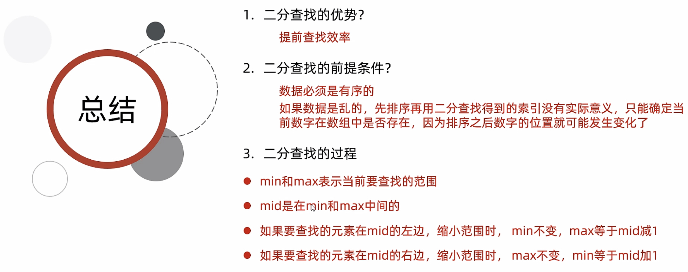
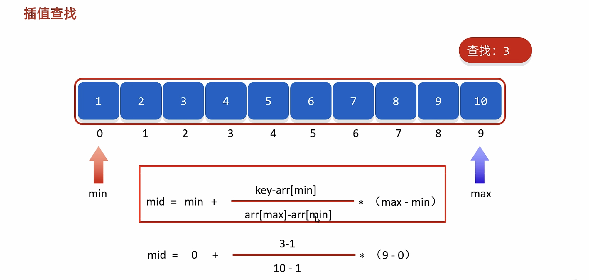
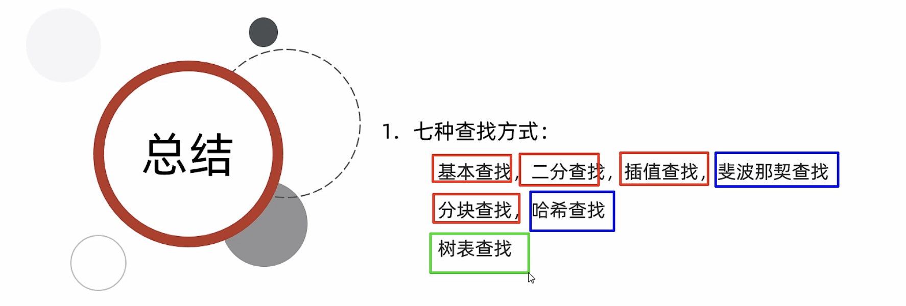
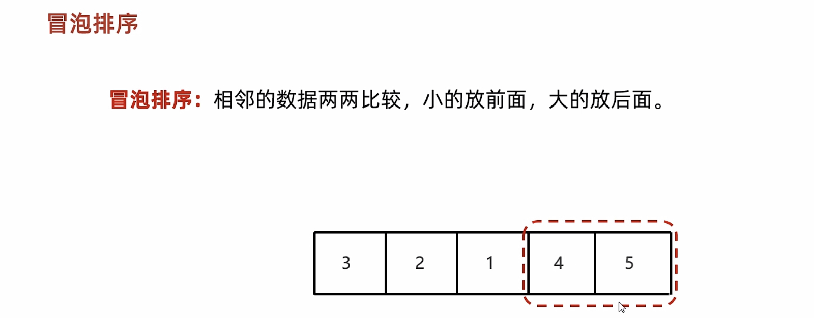

# 15-常见算法

#### 查找算法

##### 顺序查找

```java
public class A01_BasicSearchDemo1 {
    public static void main(String[] args) {
        //基本查找/顺序查找
        //核心：
        //从0索引开始挨个往后查找

        //需求：定义一个方法利用基本查找，查询某个元素是否存在
        //数据如下：{131, 127, 147, 81, 103, 23, 7, 79}


        int[] arr = {131, 127, 147, 81, 103, 23, 7, 79};
        int number = 82;
        System.out.println(basicSearch(arr, number));

    }

    //参数：
    //一：数组
    //二：要查找的元素

    //返回值：
    //元素是否存在
    public static boolean basicSearch(int[] arr, int number){
        //利用基本查找来查找number在数组中是否存在
        for (int i = 0; i < arr.length; i++) {
            if(arr[i] == number){
                return true;
            }
        }
        return false;
    }

}
```

##### 折半查找(二分查找)


```java
public class A02_BinarySearchDemo1 {
    public static void main(String[] args) {
        //二分查找/折半查找
        //核心：
        //每次排除一半的查找范围

        //需求：定义一个方法利用二分查找，查询某个元素在数组中的索引
        //数据如下：{7, 23, 79, 81, 103, 127, 131, 147}

        int[] arr = {7, 23, 79, 81, 103, 127, 131, 147};
        System.out.println(binarySearch(arr, 150));

    }

    public static int binarySearch(int[] arr, int number){
        //1.定义两个变量记录要查找的范围
        int min = 0;
        int max = arr.length - 1;

        //2.利用循环不断的去找要查找的数据
        while(true){
            if(min > max){
                return -1;
            }
            //3.找到min和max的中间位置
            int mid = (min + max) / 2;
            //4.拿着mid指向的元素跟要查找的元素进行比较
            if(arr[mid] > number){
                //4.1 number在mid的左边
                //min不变，max = mid - 1；
                max = mid - 1;
            }else if(arr[mid] < number){
                //4.2 number在mid的右边
                //max不变，min = mid + 1;
                min = mid + 1;
            }else{
                //4.3 number跟mid指向的元素一样
                //找到了
                return mid;
            }

        }
    }

}
```



##### 插值查找



##### 斐波那契查找


##### 分块查找

 


```java
public class A03_BlockSearchDemo {
    public static void main(String[] args) {
        /*
            分块查找
            核心思想：
                块内无序，块间有序
            实现步骤：
                1.创建数组blockArr存放每一个块对象的信息
                2.先查找blockArr确定要查找的数据属于哪一块
                3.再单独遍历这一块数据即可
        */
        int[] arr = {16, 5, 9, 12,21, 18,
                     32, 23, 37, 26, 45, 34,
                     50, 48, 61, 52, 73, 66};

        //创建三个块的对象
        Block b1 = new Block(21,0,5);
        Block b2 = new Block(45,6,11);
        Block b3 = new Block(73,12,17);

        //定义数组用来管理三个块的对象（索引表）
        Block[] blockArr = {b1,b2,b3};

        //定义一个变量用来记录要查找的元素
        int number = 37;

        //调用方法，传递索引表，数组，要查找的元素
        int index = getIndex(blockArr,arr,number);

        //打印一下
        System.out.println(index);

    }

    //利用分块查找的原理，查询number的索引
    private static int getIndex(Block[] blockArr, int[] arr, int number) {
        //1.确定number是在那一块当中
        int indexBlock = findIndexBlock(blockArr, number);

        if(indexBlock == -1){
            //表示number不在数组当中
            return -1;
        }

        //2.获取这一块的起始索引和结束索引   --- 30
        // Block b1 = new Block(21,0,5);   ----  0
        // Block b2 = new Block(45,6,11);  ----  1
        // Block b3 = new Block(73,12,17); ----  2
        int startIndex = blockArr[indexBlock].getStartIndex();
        int endIndex = blockArr[indexBlock].getEndIndex();

        //3.遍历
        for (int i = startIndex; i <= endIndex; i++) {
            if(arr[i] == number){
                return i;
            }
        }
        return -1;
    }

    //定义一个方法，用来确定number在哪一块当中
    public static int findIndexBlock(Block[] blockArr,int number){ //100


        //从0索引开始遍历blockArr，如果number小于max，那么就表示number是在这一块当中的
        for (int i = 0; i < blockArr.length; i++) {
            if(number <= blockArr[i].getMax()){
                return i;
            }
        }
        return -1;
    }


}

class Block{
    private int max;//最大值
    private int startIndex;//起始索引
    private int endIndex;//结束索引


    public Block() {
    }

    public Block(int max, int startIndex, int endIndex) {
        this.max = max;
        this.startIndex = startIndex;
        this.endIndex = endIndex;
    }

    /**
     * 获取
     * @return max
     */
    public int getMax() {
        return max;
    }

    /**
     * 设置
     * @param max
     */
    public void setMax(int max) {
        this.max = max;
    }

    /**
     * 获取
     * @return startIndex
     */
    public int getStartIndex() {
        return startIndex;
    }

    /**
     * 设置
     * @param startIndex
     */
    public void setStartIndex(int startIndex) {
        this.startIndex = startIndex;
    }

    /**
     * 获取
     * @return endIndex
     */
    public int getEndIndex() {
        return endIndex;
    }

    /**
     * 设置
     * @param endIndex
     */
    public void setEndIndex(int endIndex) {
        this.endIndex = endIndex;
    }

    public String toString() {
        return "Block{max = " + max + ", startIndex = " + startIndex + ", endIndex = " + endIndex + "}";
    }
}
```


##### 哈希查找




#### 排序算法

##### 冒泡排序




```java
public class A01_BubbleDemo {
    public static void main(String[] args) {
        /*
            冒泡排序：
            核心思想：
            1，相邻的元素两两比较，大的放右边，小的放左边。
            2，第一轮比较完毕之后，最大值就已经确定，第二轮可以少循环一次，后面以此类推。
            3，如果数组中有n个数据，总共我们只要执行n-1轮的代码就可以。
        */


        //1.定义数组
        int[] arr = {2, 4, 5, 3, 1};

        //2.利用冒泡排序将数组中的数据变成 1 2 3 4 5

        //外循环：表示我要执行多少轮。 如果有n个数据，那么执行n - 1 轮
        for (int i = 0; i < arr.length - 1; i++) {
            //内循环：每一轮中我如何比较数据并找到当前的最大值
            //-1：为了防止索引越界
            //-i：提高效率，每一轮执行的次数应该比上一轮少一次。
            for (int j = 0; j < arr.length - 1 - i; j++) {
                //i 依次表示数组中的每一个索引：0 1 2 3 4
                if(arr[j] > arr[j + 1]){
                    int temp = arr[j];
                    arr[j] = arr[j + 1];
                    arr[j + 1] = temp;
                }
            }
        }

        printArr(arr);

    }

    private static void printArr(int[] arr) {
        //3.遍历数组
        for (int i = 0; i < arr.length; i++) {
            System.out.print(arr[i] + " ");
        }
        System.out.println();
    }
}
```

##### 选择排序


```java
public class A02_SelectionDemo {
    public static void main(String[] args) {

        /*
            选择排序：
                1，从0索引开始，跟后面的元素一一比较。
                2，小的放前面，大的放后面。
                3，第一次循环结束后，最小的数据已经确定。
                4，第二次循环从1索引开始以此类推。

         */


        //1.定义数组
        int[] arr = {2, 4, 5, 3, 1};


        //2.利用选择排序让数组变成 1 2 3 4 5
       /* //第一轮：
        //从0索引开始，跟后面的元素一一比较。
        for (int i = 0 + 1; i < arr.length; i++) {
            //拿着0索引跟后面的数据进行比较
            if(arr[0] > arr[i]){
                int temp = arr[0];
                arr[0] = arr[i];
                arr[i] = temp;
            }
        }*/

        //最终代码：
        //外循环：几轮
        //i:表示这一轮中，我拿着哪个索引上的数据跟后面的数据进行比较并交换
        for (int i = 0; i < arr.length -1; i++) {
            //内循环：每一轮我要干什么事情？
            //拿着i跟i后面的数据进行比较交换
            for (int j = i + 1; j < arr.length; j++) {
                if(arr[i] > arr[j]){
                    int temp = arr[i];
                    arr[i] = arr[j];
                    arr[j] = temp;
                }
            }
        }


        printArr(arr);


    }
    private static void printArr(int[] arr) {
        //3.遍历数组
        for (int i = 0; i < arr.length; i++) {
            System.out.print(arr[i] + " ");
        }
        System.out.println();
    }

}
```

##### 插入排序


```java
public class A03_InsertDemo {
    public static void main(String[] args) {
        /*
            插入排序：
                将0索引的元素到N索引的元素看做是有序的，把N+1索引的元素到最后一个当成是无序的。
                遍历无序的数据，将遍历到的元素插入有序序列中适当的位置，如遇到相同数据，插在后面。
                N的范围：0~最大索引

        */
        int[] arr = {3, 44, 38, 5, 47, 15, 36, 26, 27, 2, 46, 4, 19, 50, 48};

        //1.找到无序的哪一组数组是从哪个索引开始的。  2
        int startIndex = -1;
        for (int i = 0; i < arr.length; i++) {
            if(arr[i] > arr[i + 1]){
                startIndex = i + 1;
                break;
            }
        }

        //2.遍历从startIndex开始到最后一个元素，依次得到无序的哪一组数据中的每一个元素
        for (int i = startIndex; i < arr.length; i++) {
            //问题：如何把遍历到的数据，插入到前面有序的这一组当中

            //记录当前要插入数据的索引
            int j = i;

            while(j > 0 && arr[j] < arr[j - 1]){
                //交换位置
                int temp = arr[j];
                arr[j] = arr[j - 1];
                arr[j - 1] = temp;
                j--;
            }

        }
        printArr(arr);
    }

    private static void printArr(int[] arr) {
        //3.遍历数组
        for (int i = 0; i < arr.length; i++) {
            System.out.print(arr[i] + " ");
        }
        System.out.println();
    }

}
```


```java
public class A04_RecursionDemo1 {
    public static void main(String[] args) {
        method();
    }


    public static void method(){
        method();
    }
}
```


```java
public class A04_RecursionDemo2 {
    public static void main(String[] args) {
        //需求：利用递归求1-100之间的和
        //100 + 99 + 98 + 97 + 96 + 95 .... + 2 + 1

        //大问题拆解成小问题
        //1~100之间的和 = 100 + （1~99之间的和）
        //1~99之间的和 = 99 + （1~98之间的和）
        //1~98之间的和 = 98 + （1~97之间的和）
        //。。。
        //1~2之间的和 = 2 + （1~1之间的和）
        //1~1之间的和 = 1（递归的出口）

        //核心：
        //1.找出口
        //2.找规律

        System.out.println(getSum(100));//5050

    }


    public static int getSum(int number){//99
        if(number == 1){
            return 1;
        }

        //如果numbert不是1呢？
        return number + getSum(number -1);

    }
}
```


```java
public class A04_RecursionDemo3 {
    public static void main(String[] args) {
        //需求：利用递归求5的阶乘
        //5！ = 5 * 4 * 3 * 2 * 1;

        //核心：
        //1.找出口
        //2.找规律
        //心得：
        //方法内部再次调用方法的时候，参数必须要更加的靠近出口
        //第一次调用：5
        //第二次调用：4


        //5！ = 5 * 4!;
        //4！ = 4 * 3!;
        //3！ = 3 * 2!;
        //2！ = 2 * 1!;
        //1！ = 1;

        System.out.println(getFactorialRecursion(5));//120


    }

    public static int getFactorialRecursion(int number){//5 !
        if(number == 1){
            return 1;
        }

        return number * getFactorialRecursion(number - 1);
    }
}
```


```java
public class A05_QuickSortDemo {
    public static void main(String[] args) {
        System.out.println(Integer.MAX_VALUE);
        System.out.println(Integer.MIN_VALUE);
      /*
        快速排序：
            第一轮：以0索引的数字为基准数，确定基准数在数组中正确的位置。
            比基准数小的全部在左边，比基准数大的全部在右边。
            后面以此类推。
      */

        int[] arr = {1,1, 6, 2, 7, 9, 3, 4, 5, 1,10, 8};


        //int[] arr = new int[1000000];

       /* Random r = new Random();
        for (int i = 0; i < arr.length; i++) {
            arr[i] = r.nextInt();
        }*/


        long start = System.currentTimeMillis();
        quickSort(arr, 0, arr.length - 1);
        long end = System.currentTimeMillis();

        System.out.println(end - start);//149

        System.out.println(Arrays.toString(arr));
        //课堂练习：
        //我们可以利用相同的办法去测试一下，选择排序，冒泡排序以及插入排序运行的效率
        //得到一个结论：快速排序真的非常快。

       /* for (int i = 0; i < arr.length; i++) {
            System.out.print(arr[i] + " ");
        }*/

    }


    /*
     *   参数一：我们要排序的数组
     *   参数二：要排序数组的起始索引
     *   参数三：要排序数组的结束索引
     * */
    public static void quickSort(int[] arr, int i, int j) {
        //定义两个变量记录要查找的范围
        int start = i;
        int end = j;

        if(start > end){
            //递归的出口
            return;
        }


        //记录基准数
        int baseNumber = arr[i];
        //利用循环找到要交换的数字
        while(start != end){
            //利用end，从后往前开始找，找比基准数小的数字
            //int[] arr = {1, 6, 2, 7, 9, 3, 4, 5, 10, 8};
            while(true){
                if(end <= start || arr[end] < baseNumber){
                    break;
                }
                end--;
            }
            System.out.println(end);
            //利用start，从前往后找，找比基准数大的数字
            while(true){
                if(end <= start || arr[start] > baseNumber){
                    break;
                }
                start++;
            }


            //把end和start指向的元素进行交换
            int temp = arr[start];
            arr[start] = arr[end];
            arr[end] = temp;
        }

        //当start和end指向了同一个元素的时候，那么上面的循环就会结束
        //表示已经找到了基准数在数组中应存入的位置
        //基准数归位
        //就是拿着这个范围中的第一个数字，跟start指向的元素进行交换
        int temp = arr[i];
        arr[i] = arr[start];
        arr[start] = temp;

        //确定6左边的范围，重复刚刚所做的事情
        quickSort(arr,i,start - 1);
        //确定6右边的范围，重复刚刚所做的事情
        quickSort(arr,start + 1,j);

    }


}
```


#### API

##### Arrays


#### Lambda表达式


‍
