# 16-集合进阶

### 单列集合

#### Collection

##### 通用方法


```java
public class A01_CollectionDemo1 {
    public static void main(String[] args) {
/*
        public boolean add(E e)             添加
        public void clear()                 清空
        public boolean remove(E e)          删除
        public boolean contains(Object obj) 判断是否包含
        public boolean isEmpty()            判断是否为空
        public int size()                   集合长度


       注意点：
        Collection是一个接口,我们不能直接创建他的对象。
        所以，现在我们学习他的方法时，只能创建他实现类的对象。
        实现类：ArrayList
*/
        //目的：为了学习Collection接口里面的方法
        //自己在做一些练习的时候，还是按照之前的方式去创建对象。
        Collection<String> coll = new ArrayList<>();


        //1.添加元素
        //细节1：如果我们要往List系列集合中添加数据，那么方法永远返回true，因为List系列的是允许元素重复的。
        //细节2：如果我们要往Set系列集合中添加数据，如果当前要添加元素不存在，方法返回true，表示添加成功。
        //                                       如果当前要添加的元素已经存在，方法返回false，表示添加失败。
        //                                       因为Set系列的集合不允许重复。
        coll.add("aaa");
        coll.add("bbb");
        coll.add("ccc");
        System.out.println(coll);

        //2.清空
        //coll.clear();

        //3.删除
        //细节1：因为Collection里面定义的是共性的方法，所以此时不能通过索引进行删除。只能通过元素的对象进行删除。
        //细节2：方法会有一个布尔类型的返回值，删除成功返回true，删除失败返回false
        //如果要删除的元素不存在，就会删除失败。
        System.out.println(coll.remove("aaa"));
        System.out.println(coll);


        //4.判断元素是否包含
        //细节：底层是依赖equals方法进行判断是否存在的。
        //所以，如果集合中存储的是自定义对象，也想通过contains方法来判断是否包含，那么在javabean类中，一定要重写equals方法。
        boolean result1 = coll.contains("bbb");
        System.out.println(result1);


        //5.判断集合是否为空
        boolean result2 = coll.isEmpty();
        System.out.println(result2);//false


        //6.获取集合的长度
        coll.add("ddd");
        int size = coll.size();
        System.out.println(size);//3

    }
}
```

```java
public class Student {
    private String name;
    private int age;


    public Student() {
    }

    public Student(String name, int age) {
        this.name = name;
        this.age = age;
    }

    /**
     * 获取
     * @return name
     */
    public String getName() {
        return name;
    }

    /**
     * 设置
     * @param name
     */
    public void setName(String name) {
        this.name = name;
    }

    /**
     * 获取
     * @return age
     */
    public int getAge() {
        return age;
    }

    /**
     * 设置
     * @param age
     */
    public void setAge(int age) {
        this.age = age;
    }


    @Override
    public boolean equals(Object o) {
        if (this == o) return true;
        if (o == null || getClass() != o.getClass()) return false;
        Student student = (Student) o;
        return age == student.age && Objects.equals(name, student.name);
    }


    public String toString() {
        return "Student{name = " + name + ", age = " + age + "}";
    }
}
```

```java
public class A02_CollectionDemo2 {
    public static void main(String[] args) {
        //1.创建集合的对象
        Collection<Student> coll = new ArrayList<>();


        //2.创建三个学生对象
        Student s1 = new Student("zhangsan",23);
        Student s2 = new Student("lisi",24);
        Student s3 = new Student("wangwu",25);


        //3.把学生对象添加到集合当中
        coll.add(s1);
        coll.add(s2);
        coll.add(s3);

        //4.判断集合中某一个学生对象是否包含
        Student s4 = new Student("zhangsan",23);
        //因为contains方法在底层依赖equals方法判断对象是否一致的。
        //如果存的是自定义对象，没有重写equals方法，那么默认使用Object类中的equals方法进行判断，而Object类中equals方法，依赖地址值进行判断。
        //需求：如果同姓名和同年龄，就认为是同一个学生。
        //所以，需要在自定义的Javabean类中，重写equals方法就可以了。
        System.out.println(coll.contains(s4));
    }
}
```

##### 通用遍历方式

###### 迭代器遍历


```java
public class A03_CollectionDemo3 {
    public static void main(String[] args) {
        /*
            Collection系列集合三种通用的遍历方式：
                1.迭代器遍历
                2.增强for遍历
                3.lambda表达式遍历


             迭代器遍历相关的三个方法：
                    Iterator<E> iterator()  ：获取一个迭代器对象
                    boolean hasNext()       ：判断当前指向的位置是否有元素
                    E next()                ：获取当前指向的元素并移动指针
        */

        //1.创建集合并添加元素
        Collection<String> coll = new ArrayList<>();
        coll.add("aaa");
        coll.add("bbb");
        coll.add("ccc");
        coll.add("ddd");

        //2.获取迭代器对象
        //迭代器就好比是一个箭头，默认指向集合的0索引处
        Iterator<String> it = coll.iterator();
        //3.利用循环不断的去获取集合中的每一个元素
        while(it.hasNext()){
            //4.next方法的两件事情：获取元素并移动指针
            String str = it.next();
            System.out.println(str);
        }

    }
}
```

‍


```java
public class A04_CollectionDemo4 {
    public static void main(String[] args) {
      /*
        迭代器的细节注意点：
            1.报错NoSuchElementException
            2.迭代器遍历完毕，指针不会复位
            3.循环中只能用一次next方法
            4.迭代器遍历时，不能用集合的方法进行增加或者删除
       */

        //1.创建集合并添加元素
        Collection<String> coll = new ArrayList<>();
        coll.add("aaa");
        coll.add("bbb");
        coll.add("ccc");
        coll.add("ddd");

        //2.获取迭代器对象
        //迭代器就好比是一个箭头，默认指向集合的0索引处
        Iterator<String> it = coll.iterator();
        //3.利用循环不断的去获取集合中的每一个元素
        while(it.hasNext()){
            //4.next方法的两件事情：获取元素并移动指针
            String str = it.next();
            System.out.println(str);
        }

        //当上面循环结束之后，迭代器的指针已经指向了最后没有元素的位置
        //System.out.println(it.next());//NoSuchElementException

        //迭代器遍历完毕，指针不会复位
        System.out.println(it.hasNext());

        //如果我们要继续第二次遍历集合，只能再次获取一个新的迭代器对象
        Iterator<String> it2 = coll.iterator();
        while(it2.hasNext()){
            String str = it2.next();
            System.out.println(str);
        }
    }
}
```

```java
public class A05_CollectionDemo5 {
    public static void main(String[] args) {
      /*
        迭代器的细节注意点：
            1.报错NoSuchElementException
            2.迭代器遍历完毕，指针不会复位
            3.循环中只能用一次next方法
            4.迭代器遍历时，不能用集合的方法进行增加或者删除
                暂时当做一个结论先行记忆，在今天我们会讲解源码详细的再来分析。
                如果我实在要删除：那么可以用迭代器提供的remove方法进行删除。
                如果我要添加，暂时没有办法。
       */

        //1.创建集合并添加元素
        Collection<String> coll = new ArrayList<>();
        coll.add("aaa");
        coll.add("bbb");
        coll.add("ccc");
        coll.add("ddd");
        coll.add("eee");

        //2.获取迭代器对象
        //迭代器就好比是一个箭头，默认指向集合的0索引处
        Iterator<String> it = coll.iterator();
        //3.利用循环不断的去获取集合中的每一个元素
        while(it.hasNext()){
            //4.next方法的两件事情：获取元素,并移动指针
            String str = it.next();
            if("bbb".equals(str)){
                //coll.remove("bbb");
                it.remove();
            }
        }
        System.out.println(coll);

    }
}
```


###### 增强for遍历


```java
public class A06_CollectionDemo6 {
    public static void main(String[] args) {
       /* Collection系列集合三种通用的遍历方式：
        1.迭代器遍历
        2.增强for遍历
        3.lambda表达式遍历

        增强for格式：
            for(数据类型 变量名: 集合/数组){

            }

        快速生成方式：
            集合的名字 + for 回车

        */


        //1.创建集合并添加元素
        Collection<String> coll = new ArrayList<>();
        coll.add("zhangsan");
        coll.add("lisi");
        coll.add("wangwu");

        //2.利用增强for进行遍历
        //注意点：
        //s其实就是一个第三方变量，在循环的过程中依次表示集合中的每一个数据
        for(String s : coll){
            s = "qqq";
        }

        System.out.println(coll);//zhangsan lisi wangwu

    }
}
```


###### Lambda表达式遍历


```java
public class A07_CollectionDemo7 {
    public static void main(String[] args) {
       /* Collection系列集合三种通用的遍历方式：
        1.迭代器遍历
        2.增强for遍历
        3.lambda表达式遍历

        lambda表达式遍历：
                default void forEach(Consumer<? super T> action):
        */

        //1.创建集合并添加元素
        Collection<String> coll = new ArrayList<>();
        coll.add("zhangsan");
        coll.add("lisi");
        coll.add("wangwu");
        //2.利用匿名内部类的形式
        //底层原理：
        //其实也会自己遍历集合，依次得到每一个元素
        //把得到的每一个元素，传递给下面的accept方法
        //s依次表示集合中的每一个数据
       /* coll.forEach(new Consumer<String>() {
            @Override
            public void accept(String s) {
                System.out.println(s);
            }
        });*/

        //lambda表达式
        coll.forEach(s -> System.out.println(s));

    }
}
```


#### List集合

##### 特点


##### 特有方法


```java
public class A01_ListDemo1 {
    public static void main(String[] args) {
       /*

        List系列集合独有的方法：
            void add(int index,E element)       在此集合中的指定位置插入指定的元素
            E remove(int index)                 删除指定索引处的元素，返回被删除的元素
            E set(int index,E element)          修改指定索引处的元素，返回被修改的元素
            E get(int index)                    返回指定索引处的元素
        */


        //1.创建一个集合
        List<String> list = new ArrayList<>();

        //2.添加元素
        list.add("aaa");
        list.add("bbb");//1
        list.add("ccc");


        //void add(int index,E element)       在此集合中的指定位置插入指定的元素
        //细节：原来索引上的元素会依次往后移
        //list.add(1,"QQQ");

        //E remove(int index)                 删除指定索引处的元素，返回被删除的元素
        //String remove = list.remove(0);
        //System.out.println(remove);//aaa


        //E set(int index,E element)          修改指定索引处的元素，返回被修改的元素
        //String result = list.set(0, "QQQ");
        //System.out.println(result);

        // E get(int index)                    返回指定索引处的元素
        //String s = list.get(0);
        //System.out.println(s);


        //3.打印集合
        System.out.println(list);


    }
}
```

```java
public class A02_ListDemo2 {
    public static void main(String[] args) {

        //List系列集合中的两个删除的方法
        //1.直接删除元素
        //2.通过索引进行删除

        //1.创建集合并添加元素
        List<Integer> list = new ArrayList<>();

        list.add(1);
        list.add(2);
        list.add(3);


        //2.删除元素
        //请问：此时删除的是1这个元素，还是1索引上的元素？
        //为什么？
        //因为在调用方法的时候，如果方法出现了重载现象
        //优先调用，实参跟形参类型一致的那个方法。

        //list.remove(1);


        //手动装箱，手动把基本数据类型的1，变成Integer类型
        Integer i = Integer.valueOf(1);

        list.remove(i);

        System.out.println(list);


    }
}
```

##### 遍历方式

```java
public class A03_ListDemo3 {
    public static void main(String[] args) {
        /*
            List系列集合的五种遍历方式：
                1.迭代器
                2.列表迭代器
                3.增强for
                4.Lambda表达式
                5.普通for循环
         */


        //创建集合并添加元素
        List<String> list = new ArrayList<>();
        list.add("aaa");
        list.add("bbb");
        list.add("ccc");

        //1.迭代器
        /*Iterator<String> it = list.iterator();
        while(it.hasNext()){
            String str = it.next();
            System.out.println(str);
        }*/


        //2.增强for
        //下面的变量s，其实就是一个第三方的变量而已。
        //在循环的过程中，依次表示集合中的每一个元素
       /* for (String s : list) {
            System.out.println(s);
        }*/

        //3.Lambda表达式
        //forEach方法的底层其实就是一个循环遍历，依次得到集合中的每一个元素
        //并把每一个元素传递给下面的accept方法
        //accept方法的形参s，依次表示集合中的每一个元素
        //list.forEach(s->System.out.println(s) );


        //4.普通for循环
        //size方法跟get方法还有循环结合的方式，利用索引获取到集合中的每一个元素
        /*for (int i = 0; i < list.size(); i++) {
            //i:依次表示集合中的每一个索引
            String s = list.get(i);
            System.out.println(s);
        }*/

        // 5.列表迭代器
        //获取一个列表迭代器的对象，里面的指针默认也是指向0索引的

        //额外添加了一个方法：在遍历的过程中，可以添加元素
        ListIterator<String> it = list.listIterator();
        while(it.hasNext()){
            String str = it.next();
            if("bbb".equals(str)){
                //qqq
                it.add("qqq");
            }
        }
        System.out.println(list);


    }
}
```

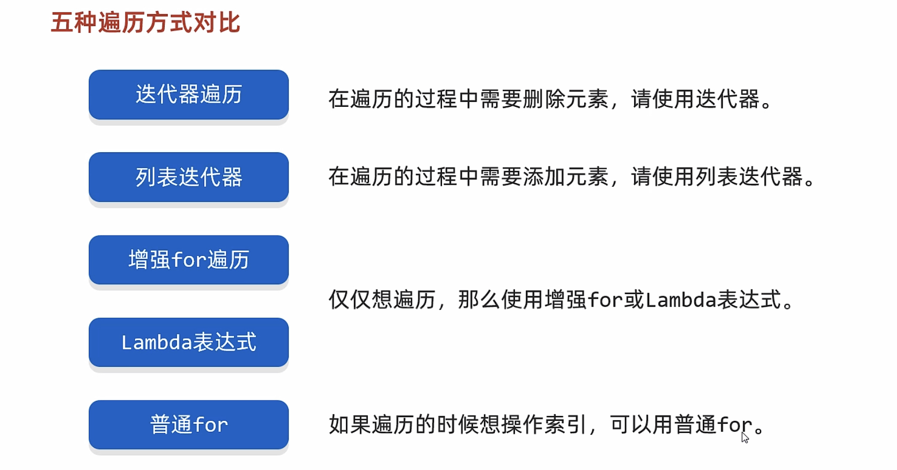

#### 数据结构


##### 栈


##### 队列


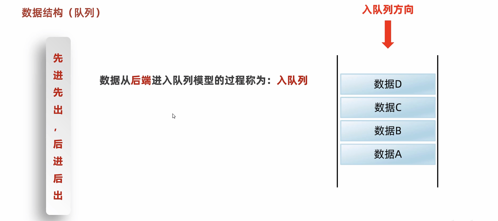


##### 数组


##### 链表


#### ArrayList集合

##### 底层原理


#### LinkedList集合


#### 泛型


```java
public class GenericsDemo1 {
    public static void main(String[] args) {
        //没有泛型的时候，集合如何存储数据
        //结论：
        //如果我们没有给集合指定类型，默认认为所有的数据类型都是Object类型
        //此时可以往集合添加任意的数据类型。
        //带来一个坏处：我们在获取数据的时候，无法使用他的特有行为。

        //此时推出了泛型，可以在添加数据的时候就把类型进行统一。
        //而且我们在获取数据的时候，也省的强转了，非常的方便。

        //1.创建集合的对象
        ArrayList<String> list = new ArrayList<>();

        //2.添加数据
        //list.add(123);
        list.add("aaa");
        //list.add(new Student("zhangsan",123));


        //3.遍历集合获取里面的每一个元素
        Iterator<String> it = list.iterator();
        while(it.hasNext()){
            String str = it.next();
            //多态的弊端是不能访问子类的特有功能
            //obj.length();
            //str.length();
            System.out.println(str);
        }


    }
}
```


##### 泛型类

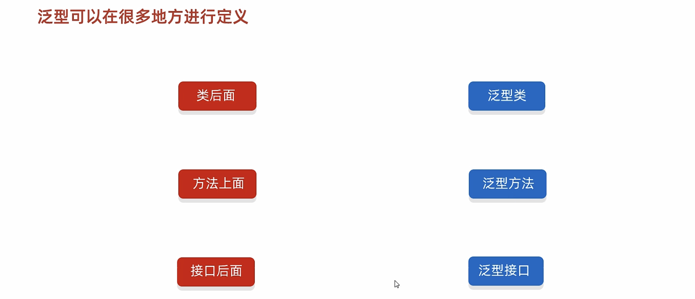


```java
/*
*       当我在编写一个类的时候，如果不确定类型，那么这个类就可以定义为泛型类。
* */
public class MyArrayList<E> {

    Object[] obj = new Object[10];
    int size;

    /*
    E : 表示是不确定的类型。该类型在类名后面已经定义过了。
    e：形参的名字，变量名
    * */
    public boolean add(E e){
        obj[size] = e;
        size++;
        return true;
    }

    public E get(int index){
        return (E)obj[index];
    }

    @Override
    public String toString() {
        return Arrays.toString(obj);
    }
}
```

```java
public class GenericsDemo2 {
    public static void main(String[] args) {
       /* MyArrayList<String> list = new MyArrayList<>();

        list.add("aaa");
        list.add("bbb");
        list.add("ccc");

        System.out.println(list);*/

        MyArrayList<Integer> list2 = new MyArrayList<>();
        list2.add(123);
        list2.add(456);
        list2.add(789);

        int i = list2.get(0);
        System.out.println(i);

        System.out.println(list2);
    }
}
```

##### 泛型方法


```java
public class ListUtil {
    private ListUtil(){}

    //类中定义一个静态方法addAll，用来添加多个集合的元素。


    /*
    *   参数一：集合
    *   参数二~最后：要添加的元素
    *
    * */
    public static<E> void addAll(ArrayList<E> list, E e1,E e2,E e3,E e4){
        list.add(e1);
        list.add(e2);
        list.add(e3);
        list.add(e4);
    }

/*    public static<E> void addAll2(ArrayList<E> list, E...e){
        for (E element : e) {
            list.add(element);
        }
    }*/


    public void show(){
        System.out.println("尼古拉斯·纯情·天真·暖男·阿玮");
    }
}
```

```java
/*
    定义一个工具类：ListUtil
    类中定义一个静态方法addAll，用来添加多个集合的元素。
*/
public class GenericsDemo3 {
    public static void main(String[] args) {

        ArrayList<String> list1 = new ArrayList<>();
        ListUtil.addAll(list1, "aaa", "bbb", "ccc", "ddd");
        System.out.println(list1);


        ArrayList<Integer> list2 = new ArrayList<>();
        ListUtil.addAll(list2,1,2,3,4);
        System.out.println(list2);

    }
}
```

##### 泛型接口


```java
public class MyArrayList2 implements List<String> {
 
}
```

```java
public class MyArrayList3<E> implements List<E> {

}

```

```java
public class GenericsDemo4 {
    public static void main(String[] args) {
        /*
            泛型接口的两种使用方式：
                1.实现类给出具体的类型
                2.实现类延续泛型，创建实现类对象时再确定类型
        */


        MyArrayList3<String> list = new MyArrayList3<>();


    }
}
```

##### 泛型的继承和通配符


```java
public class GenericsDemo5 {
    public static void main(String[] args) {
        /*
            泛型不具备继承性，但是数据具备继承性
        */

        //创建集合的对象
        ArrayList<Ye> list1 = new ArrayList<>();
        ArrayList<Fu> list2 = new ArrayList<>();
        ArrayList<Zi> list3 = new ArrayList<>();

        //调用method方法
        //method(list1);
        //method(list2);
        //method(list3);


        list1.add(new Ye());
        list1.add(new Fu());
        list1.add(new Zi());


    }


    /*
    * 此时，泛型里面写的是什么类型，那么只能传递什么类型的数据。
    * */
    public static void method(ArrayList<Ye> list) {

    }


}
```

```java
public class GenericsDemo6 {
    public static void main(String[] args) {
        /*
        *   需求：
        *       定义一个方法，形参是一个集合，但是集合中的数据类型不确定。
        *
        * */


        //创建集合的对象
        ArrayList<Ye> list1 = new ArrayList<>();
        ArrayList<Fu> list2 = new ArrayList<>();
        ArrayList<Zi> list3 = new ArrayList<>();

        ArrayList<Student2> list4 = new ArrayList<>();

        method(list1);
        method(list2);
        //method(list3);


        //method(list4);


    }

    /*
     * 此时，泛型里面写的是什么类型，那么只能传递什么类型的数据。
     * 弊端：
     *      利用泛型方法有一个小弊端，此时他可以接受任意的数据类型
     *      Ye  Fu   Zi    Student
     *
     * 希望：本方法虽然不确定类型，但是以后我希望只能传递Ye Fu Zi
     *
     * 此时我们就可以使用泛型的通配符：
     *      ?也表示不确定的类型
     *      他可以进行类型的限定
     *      ? extends E: 表示可以传递E或者E所有的子类类型
     *      ? super E:表示可以传递E或者E所有的父类类型
     *
     * 应用场景：
     *      1.如果我们在定义类、方法、接口的时候，如果类型不确定，就可以定义泛型类、泛型方法、泛型接口。
     *      2.如果类型不确定，但是能知道以后只能传递某个继承体系中的，就可以泛型的通配符
     * 泛型的通配符：
     *      关键点：可以限定类型的范围。
     *
     * */
    public static void method(ArrayList<? super Fu> list) {

    }
}

class Ye {
}

class Fu extends Ye {
}

class Zi extends Fu {
}

class Student2{}
```

```java
public class Test1 {
    public static void main(String[] args) {
        /*
            需求：
                定义一个继承结构：
                                    动物
                         |                           |
                         猫                          狗
                      |      |                    |      |
                   波斯猫   狸花猫                泰迪   哈士奇


                 属性：名字，年龄
                 行为：吃东西
                       波斯猫方法体打印：一只叫做XXX的，X岁的波斯猫，正在吃小饼干
                       狸花猫方法体打印：一只叫做XXX的，X岁的狸花猫，正在吃鱼
                       泰迪方法体打印：一只叫做XXX的，X岁的泰迪，正在吃骨头，边吃边蹭
                       哈士奇方法体打印：一只叫做XXX的，X岁的哈士奇，正在吃骨头，边吃边拆家

            测试类中定义一个方法用于饲养动物
                public static void keepPet(ArrayList<???> list){
                    //遍历集合，调用动物的eat方法
                }
            要求1：该方法能养所有品种的猫，但是不能养狗
            要求2：该方法能养所有品种的狗，但是不能养猫
            要求3：该方法能养所有的动物，但是不能传递其他类型
         */


        ArrayList<PersianCat> list1 = new ArrayList<>();
        ArrayList<LiHuaCat> list2 = new ArrayList<>();
        ArrayList<TeddyDog> list3 = new ArrayList<>();
        ArrayList<HuskyDog> list4 = new ArrayList<>();

        keepPet(list1);
        keepPet(list2);
        keepPet(list3);
        keepPet(list4);
    }

    //该方法能养所有的动物，但是不能传递其他类型
    public static void keepPet(ArrayList<? extends Animal> list){
        //遍历集合，调用动物的eat方法
    }


  /*  //  要求2：该方法能养所有品种的狗，但是不能养猫
    public static void keepPet(ArrayList<? extends Dog> list){
        //遍历集合，调用动物的eat方法
    }*/


    /*//要求1：该方法能养所有品种的猫，但是不能养狗
    public static void keepPet(ArrayList<? extends Cat> list){
        //遍历集合，调用动物的eat方法
    }*/
}
```

```java
public abstract class Animal {
    private String name;
    private int age;


    public Animal() {
    }

    public Animal(String name, int age) {
        this.name = name;
        this.age = age;
    }

    /**
     * 获取
     * @return name
     */
    public String getName() {
        return name;
    }

    /**
     * 设置
     * @param name
     */
    public void setName(String name) {
        this.name = name;
    }

    /**
     * 获取
     * @return age
     */
    public int getAge() {
        return age;
    }

    /**
     * 设置
     * @param age
     */
    public void setAge(int age) {
        this.age = age;
    }


    public abstract void eat();

    public String toString() {
        return "Animal{name = " + name + ", age = " + age + "}";
    }
}

```

```java
public abstract class Cat extends Animal{

    //1.继承抽象类，重写里面所有的抽象方法
    //2.本身Cat也是一个抽象的，让Cat的子类再重写重写方法

    //此时采取第二种处理方案
    //因为猫的两个子类中eat的方法体还是不一样的。

}
```

```java
public abstract class Dog extends Animal{
}
```

```java
public class HuskyDog extends Dog {
    @Override
    public void eat() {
        System.out.println("一只叫做" + getName() + "的，" + getAge() + "岁的哈士奇，正在吃骨头，边吃边拆家");
    }
}
```

```java
public class TeddyDog extends Dog{
    @Override
    public void eat() {
        System.out.println("一只叫做"+getName()+"的，"+getAge()+"岁的泰迪，正在吃骨头，边吃边蹭");
    }
}
```

```java
public class LiHuaCat extends Cat {
    @Override
    public void eat() {
        System.out.println("一只叫做" + getName() + "的，" + getAge() + "岁的狸花猫，正在吃鱼");
    }
}
```

```java
public class PersianCat extends Cat {
    @Override
    public void eat() {
        System.out.println("一只叫做" + getName() + "的，" + getAge() + "岁的波斯猫，正在吃小饼干");
    }
}
```

#### 数据结构

##### 树


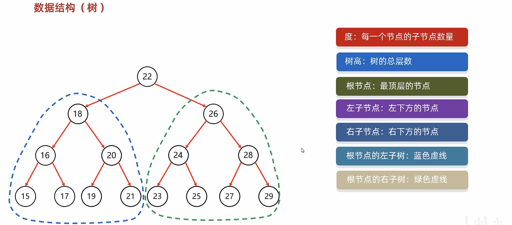

##### 二叉树


##### 二叉查找树


##### 二叉树的遍历


##### 平衡二叉树


##### 树的演变


##### 平衡二叉树旋转机制


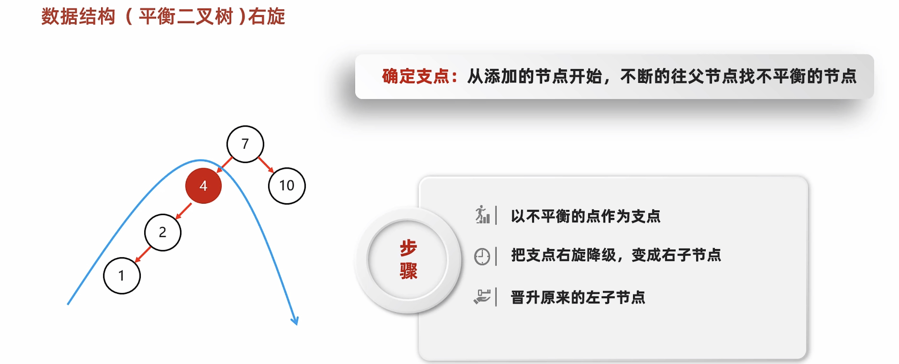


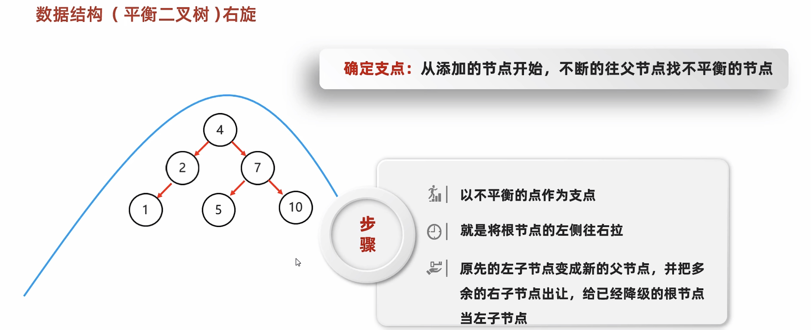


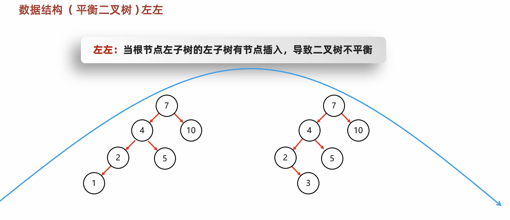

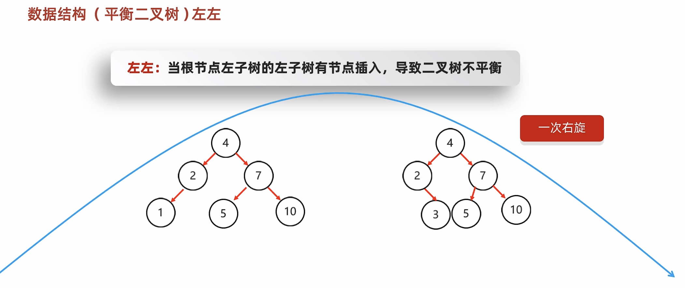


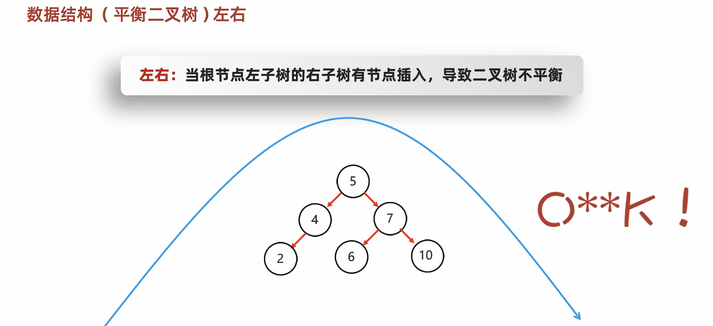


##### 红黑树


#### Set集合


```java
public class A01_SetDemo1 {
    public static void main(String[] args) {
       /*
           利用Set系列的集合，添加字符串，并使用多种方式遍历。
            迭代器
            增强for
            Lambda表达式

        */

        //1.创建一个Set集合的对象
        Set<String> s = new HashSet<>();

        //2,添加元素
        //如果当前元素是第一次添加，那么可以添加成功，返回true
        //如果当前元素是第二次添加，那么添加失败，返回false
        s.add("张三");
        s.add("张三");
        s.add("李四");
        s.add("王五");

        //3.打印集合
        //无序
        //System.out.println(s);//[李四, 张三, 王五]

        //迭代器遍历
       /* Iterator<String> it = s.iterator();
        while (it.hasNext()){
            String str = it.next();
            System.out.println(str);
        }
*/

        //增强for
       /* for (String str : s) {
            System.out.println(str);
        }*/

        // Lambda表达式
        s.forEach( str->System.out.println(str));

    }
}
```

#### HashSet底层原理


```java
public class A02_HashSetDemo1 {
    public static void main(String[] args) {
        /*
            哈希值：
                对象的整数表现形式
                1. 如果没有重写hashCode方法，不同对象计算出的哈希值是不同的
                2. 如果已经重写hashcode方法，不同的对象只要属性值相同，计算出的哈希值就是一样的
                3. 但是在小部分情况下，不同的属性值或者不同的地址值计算出来的哈希值也有可能一样。（哈希碰撞）

         */

        //1.创建对象
        Student s1 = new Student("zhangsan",23);
        Student s2 = new Student("zhangsan",23);

        //2.如果没有重写hashCode方法，不同对象计算出的哈希值是不同的
        //  如果已经重写hashcode方法，不同的对象只要属性值相同，计算出的哈希值就是一样的
        System.out.println(s1.hashCode());//-1461067292
        System.out.println(s2.hashCode());//-1461067292


        //在小部分情况下，不同的属性值或者不同的地址值计算出来的哈希值也有可能一样。
        //哈希碰撞
        System.out.println("abc".hashCode());//96354
        System.out.println("acD".hashCode());//96354

    }
}
```


问题一：首先HashSet是利用HashCode方法计算哈希值来存储数据的，但是HashSet遍历数据时是按照数组的索引顺序来遍历的

问题二：因为HashSet底层不是单纯的一种数据结构，HashSet在底层涉及到数组、链表、红黑树，用索引不方便对数据进行定位

问题三：HashSet去重其实就是利用HashCode方法和equals方法，利用HashCode方法可以计算出哈希值，哈希值可以定位数据在数组中的哪个位置，然后利用equals方法可以比较对象内部的属性值是否相同（注：自定义对象需要重写HashCode方法和equals方法）


```java
public class A03_HashSetDemo2 {
    public static void main(String[] args) {
        /* 需求：创建一个存储学生对象的集合，存储多个学生对象。
            使用程序实现在控制台遍历该集合。
            要求：学生对象的成员变量值相同，我们就认为是同一个对象

        String   Integer
*/
        //1.创建三个学生对象
        Student s1 = new Student("zhangsan",23);
        Student s2 = new Student("lisi",24);
        Student s3 = new Student("wangwu",25);
        Student s4 = new Student("zhangsan",23);

        //2.创建集合用来添加学生
        HashSet<Student> hs = new HashSet<>();

        //3.添加元素
        System.out.println(hs.add(s1));
        System.out.println(hs.add(s2));
        System.out.println(hs.add(s3));
        System.out.println(hs.add(s4));

        //4.打印集合
        System.out.println(hs);

    }
}
```

#### LinkedHashSet


```java
public class A04_LinkedHashSetDemo {
    public static void main(String[] args) {
        //1.创建4个学生对象
        Student s1 = new Student("zhangsan",23);
        Student s2 = new Student("lisi",24);
        Student s3 = new Student("wangwu",25);
        Student s4 = new Student("zhangsan",23);


        //2.创建集合的对象
        LinkedHashSet<Student> lhs = new LinkedHashSet<>();


        //3.添加元素
        System.out.println(lhs.add(s3));
        System.out.println(lhs.add(s2));
        System.out.println(lhs.add(s1));
        System.out.println(lhs.add(s4));

        //4.打印集合
        System.out.println(lhs);
    }
}
```


#### TreeSet


```java
public class A04_TreeSetDemo1 {
    public static void main(String[] args) {
        /*
        *
        *       需求：利用TreeSet存储整数并进行排序
        *
        * */

        //1.创建TreeSet集合对象
        TreeSet<Integer> ts = new TreeSet<>();

        //2.添加元素
        ts.add(4);
        ts.add(5);
        ts.add(1);
        ts.add(3);
        ts.add(2);

        //3.打印集合
        //System.out.println(ts);

        //4.遍历集合（三种遍历）
        //迭代器
        Iterator<Integer> it = ts.iterator();
        while(it.hasNext()){
            int i = it.next();
            System.out.println(i);
        }

        System.out.println("--------------------------");
        //增强for
        for (int t : ts) {
            System.out.println(t);
        }
        System.out.println("--------------------------");
        //lambda
        ts.forEach( i-> System.out.println(i));

    }
}
```


```java
public class A05_TreeSetDemo2 {
    public static void main(String[] args) {
        /*
            需求：创建TreeSet集合，并添加3个学生对象
            学生对象属性：
                姓名，年龄。
                要求按照学生的年龄进行排序
                同年龄按照姓名字母排列（暂不考虑中文）
                同姓名，同年龄认为是同一个人

            方式一：
                默认的排序规则/自然排序
                Student实现Comparable接口，重写里面的抽象方法，再指定比较规则
        */


        //1.创建三个学生对象
        Student s1 = new Student("zhangsan",23);
        Student s2 = new Student("lisi",24);
        Student s3 = new Student("wangwu",25);
        Student s4 = new Student("zhaoliu",26);


        //2.创建集合对象
        TreeSet<Student> ts = new TreeSet<>();

        //3.添加元素
        ts.add(s3);
        ts.add(s2);
        ts.add(s1);
        ts.add(s4);

        //4.打印集合
        System.out.println(ts);


        //TreeSet 底层是红黑树

    }
}
```

```java
public class Student implements Comparable<Student>{
    private String name;
    private int age;


    public Student() {
    }

    public Student(String name, int age) {
        this.name = name;
        this.age = age;
    }

    /**
     * 获取
     * @return name
     */
    public String getName() {
        return name;
    }

    /**
     * 设置
     * @param name
     */
    public void setName(String name) {
        this.name = name;
    }

    /**
     * 获取
     * @return age
     */
    public int getAge() {
        return age;
    }

    /**
     * 设置
     * @param age
     */
    public void setAge(int age) {
        this.age = age;
    }

    public String toString() {
        return "Student{name = " + name + ", age = " + age + "}";
    }

    @Override
    //this：表示当前要添加的元素
    //o：表示已经在红黑树存在的元素

    //返回值：
    //负数：表示当前要添加的元素是小的，存左边
    //正数：表示当前要添加的元素是大的，存右边
    //0 :表示当前要添加的元素已经存在，舍弃
    public int compareTo(Student o) {
        System.out.println("--------------");
        System.out.println("this:" + this);
        System.out.println("o:" + o);
        //指定排序的规则
        //只看年龄，我想要按照年龄的升序进行排列
        return this.getAge() - o.getAge();
    }
}
```


```java
public class A06_TreeSetDemo3 {
    public static void main(String[] args) {
       /*
            需求：请自行选择比较器排序和自然排序两种方式；
            要求：存入四个字符串， “c”, “ab”, “df”, “qwer”
            按照长度排序，如果一样长则按照首字母排序

            采取第二种排序方式：比较器排序
        */

        //1.创建集合
        //o1:表示当前要添加的元素
        //o2：表示已经在红黑树存在的元素
        //返回值规则跟之前是一样的
        TreeSet<String> ts = new TreeSet<>((o1, o2)->{
                // 按照长度排序
                int i = o1.length() - o2.length();
                //如果一样长则按照首字母排序
                i = i == 0 ? o1.compareTo(o2) : i;
                return i;
        });

        //2.添加元素
        ts.add("c");
        ts.add("ab");
        ts.add("df");
        ts.add("qwer");


        //3.打印集合
        System.out.println(ts);


    }
}
```


```java
public class Student2 implements Comparable<Student2> {
    //姓名
    private String name;
    //年龄
    private int age;
    //语文成绩
    private int chinese;
    //数学成绩
    private int math;
    //英语成绩
    private int english;


    public Student2() {
    }

    public Student2(String name, int age, int chinese, int math, int english) {
        this.name = name;
        this.age = age;
        this.chinese = chinese;
        this.math = math;
        this.english = english;
    }

    /**
     * 获取
     * @return name
     */
    public String getName() {
        return name;
    }

    /**
     * 设置
     * @param name
     */
    public void setName(String name) {
        this.name = name;
    }

    /**
     * 获取
     * @return age
     */
    public int getAge() {
        return age;
    }

    /**
     * 设置
     * @param age
     */
    public void setAge(int age) {
        this.age = age;
    }

    /**
     * 获取
     * @return chinese
     */
    public int getChinese() {
        return chinese;
    }

    /**
     * 设置
     * @param chinese
     */
    public void setChinese(int chinese) {
        this.chinese = chinese;
    }

    /**
     * 获取
     * @return math
     */
    public int getMath() {
        return math;
    }

    /**
     * 设置
     * @param math
     */
    public void setMath(int math) {
        this.math = math;
    }

    /**
     * 获取
     * @return english
     */
    public int getEnglish() {
        return english;
    }

    /**
     * 设置
     * @param english
     */
    public void setEnglish(int english) {
        this.english = english;
    }

    public String toString() {
        return "Student2{name = " + name + ", age = " + age + ", chinese = " + chinese + ", math = " + math + ", english = " + english + "}";
    }

   /* 按照总分从高到低输出到控制台
    如果总分一样，按照语文成绩排
    如果语文一样，按照数学成绩排
    如果数学成绩一样，按照英语成绩排
    如果英文成绩一样，按照年龄排
    如果年龄一样，按照姓名的字母顺序排
    如果都一样，认为是同一个学生，不存。*/
    @Override
    public int compareTo(Student2 o) {
        int sum1 = this.getChinese() + this.getMath() + this.getEnglish();
        int sum2 = o.getChinese() + o.getMath() + o.getEnglish();

        //比较两者的总分
        int i = sum1 - sum2;
        //如果总分一样，就按照语文成绩排序
        i = i == 0 ? this.getChinese() - o.getChinese() : i;
        //如果语文成绩一样，就按照数学成绩排序
        i = i == 0 ? this.getMath() - o.getMath() : i;
        //如果数学成绩一样，按照英语成绩排序（可以省略不写）
        i = i == 0 ? this.getEnglish() - o.getEnglish() : i;
        //如果英文成绩一样，按照年龄排序
        i = i == 0 ? this.getAge() - o.getAge() : i;
        //如果年龄一样，按照姓名的字母顺序排序
        i = i == 0 ? this.getName().compareTo(o.getName()) : i;
        return i;
    }
}
```

```java
public class A07_TreeSetDemo4 {
    public static void main(String[] args) {
      /*  需求：创建5个学生对象
        属性：(姓名,年龄，语文成绩,数学成绩,英语成绩),
        按照总分从高到低输出到控制台
        如果总分一样，按照语文成绩排
        如果语文一样，按照数学成绩排
        如果数学成绩一样，按照英语成绩排
        如果英文成绩一样，按照年龄排
        如果年龄一样，按照姓名的字母顺序排
        如果都一样，认为是同一个学生，不存。

        第一种：默认排序/自然排序
        第二种：比较器排序

        默认情况下，用第一种排序方式，如果第一种不能满足当前的需求，采取第二种方式。

        课堂练习：
            要求：在遍历集合的时候，我想看到总分。

      */

        //1.创建学生对象
        Student2 s1 = new Student2("zhangsan",23,90,99,50);
        Student2 s2 = new Student2("lisi",24,90,98,50);
        Student2 s3 = new Student2("wangwu",25,95,100,30);
        Student2 s4 = new Student2("zhaoliu",26,60,99,70);
        Student2 s5 = new Student2("qianqi",26,70,80,70);

        //2.创建集合
        TreeSet<Student2> ts = new TreeSet<>();

        //3.添加元素
        ts.add(s1);
        ts.add(s2);
        ts.add(s3);
        ts.add(s4);
        ts.add(s5);

        //4.打印集合
        //System.out.println(ts);
        for (Student2 t : ts) {
            System.out.println(t);
        }

    }
}
```


### 双列集合


‍


#### Map

##### 常见API

​​

```java
public class A01_MapDemo1 {
    public static void main(String[] args) {
        /*
            V put(K key,V value)                    添加元素
            V remove(Object key)                    根据键删除键值对元素
            void clear()                            移除所有的键值对元素
            boolean containsKey(Object key)         判断集合是否包含指定的键
            boolean containsValue(Object value)     判断集合是否包含指定的值
            boolean isEmpty()                       判断集合是否为空
            int size()                              集合的长度，也就是集合中键值对的个数
        */


        //1.创建Map集合的对象
        Map<String, String> m = new HashMap<>();

        //2.添加元素
        //put方法的细节：
        //添加/覆盖
        //在添加数据的时候，如果键不存在，那么直接把键值对对象添加到map集合当中,方法返回null
        //在添加数据的时候，如果键是存在的，那么会把原有的键值对对象覆盖，会把被覆盖的值进行返回。

        m.put("郭靖", "黄蓉");
        m.put("韦小宝","沐剑屏");
        m.put("尹志平","小龙女");

        //String value2 = m.put("韦小宝", "双儿");
        //System.out.println(value2);

        //删除
        //String result = m.remove("郭靖");//黄蓉
        //System.out.println(result);

        //清空
        //m.clear();

        //判断是否包含
        /*boolean keyResult = m.containsKey("郭靖");
        System.out.println(keyResult);

        boolean valueResult = m.containsValue("小龙女2");
        System.out.println(valueResult);*/

       /* boolean result = m.isEmpty();
        System.out.println(result);*/

        int size = m.size();
        System.out.println(size);


        //3.打印集合
        System.out.println(m);

    }
}
```

##### 遍历方式

###### 键找值


```java
public class A02_MapDemo2 {
    public static void main(String[] args) {
        //Map集合的第一种遍历方式

        //三个课堂练习：
        //
        //练习一：  利用键找值的方式遍历map集合，要求：装着键的单列集合使用增强for的形式进行遍历
        //练习二：  利用键找值的方式遍历map集合，要求：装着键的单列集合使用迭代器的形式进行遍历
        //练习三：  利用键找值的方式遍历map集合，要求：装着键的单列集合使用lambda表达式的形式进行遍历


        //1.创建Map集合的对象
        Map<String,String> map = new HashMap<>();

        //2.添加元素
        map.put("尹志平","小龙女");
        map.put("郭靖","穆念慈");
        map.put("欧阳克","黄蓉");

        //3.通过键找值

        //3.1获取所有的键，把这些键放到一个单列集合当中
        Set<String> keys = map.keySet();
        //3.2遍历单列集合，得到每一个键
        for (String key : keys) {
            //System.out.println(key);
            //3.3 利用map集合中的键获取对应的值  get
            String value = map.get(key);
            System.out.println(key + " = " + value);
        }


    }
}
```

###### 键值对


```java
public class A03_MapDemo3 {
    public static void main(String[] args) {
        //Map集合的第二种遍历方式

        //三个课堂练习：
        //
        //练习一：  通过键值对对象进行遍历map集合，要求：装着键值对对象的单列集合使用增强for的形式进行遍历
        //练习二：  通过键值对对象进行遍历map集合，要求：装着键值对对象的单列集合使用迭代器的形式进行遍历
        //练习三：  通过键值对对象进行遍历map集合，要求：装着键值对对象的单列集合使用lambda的形式进行遍历

        //1.创建Map集合的对象
        Map<String, String> map = new HashMap<>();

        //2.添加元素
        //键：人物的外号
        //值：人物的名字
        map.put("标枪选手", "马超");
        map.put("人物挂件", "明世隐");
        map.put("御龙骑士", "尹志平");

       /* //3.Map集合的第二种遍历方式
        //通过键值对对象进行遍历
        //3.1 通过一个方法获取所有的键值对对象，返回一个Set集合
        Set<Map.Entry<String, String>> entries = map.entrySet();
        //3.2 遍历entries这个集合，去得到里面的每一个键值对对象
        for (Map.Entry<String, String> entry : entries) {//entry  --->  "御龙骑士","尹志平"
            //3.3 利用entry调用get方法获取键和值
            String key = entry.getKey();
            String value = entry.getValue();
            System.out.println(key + "=" + value);
        }*/

        //3.Map集合的第二种遍历方式
        //通过键值对对象进行遍历
        //3.1 通过一个方法获取所有的键值对对象，返回一个Set集合
        //3.2 遍历entries这个集合，去得到里面的每一个键值对对象
        for (Map.Entry<String, String> entry :  map.entrySet()) {//entry  --->  "御龙骑士","尹志平"
            //3.3 利用entry调用get方法获取键和值
            String key = entry.getKey();
            String value = entry.getValue();
            System.out.println(key + "=" + value);
        }

    }
}
```

###### Lambda表达式


```java
public class A04_MapDemo4 {
    public static void main(String[] args) {
        //Map集合的第三种遍历方式


        //1.创建Map集合的对象
        Map<String,String> map = new HashMap<>();

        //2.添加元素
        //键：人物的名字
        //值：名人名言
        map.put("鲁迅","这句话是我说的");
        map.put("曹操","不可能绝对不可能");
        map.put("刘备","接着奏乐接着舞");
        map.put("柯镇恶","看我眼色行事");

        //3.利用lambda表达式进行遍历
        //底层：
        //forEach其实就是利用第二种方式进行遍历，依次得到每一个键和值
        //再调用accept方法
        map.forEach(new BiConsumer<String, String>() {
            @Override
            public void accept(String key, String value) {
                System.out.println(key + "=" + value);
            }
        });

        System.out.println("-----------------------------------");

        map.forEach((String key, String value)->{
                System.out.println(key + "=" + value);
            }
        );

        System.out.println("-----------------------------------");

        map.forEach((key, value)-> System.out.println(key + "=" + value));


    }
}
```

#### HashMap

##### 特点


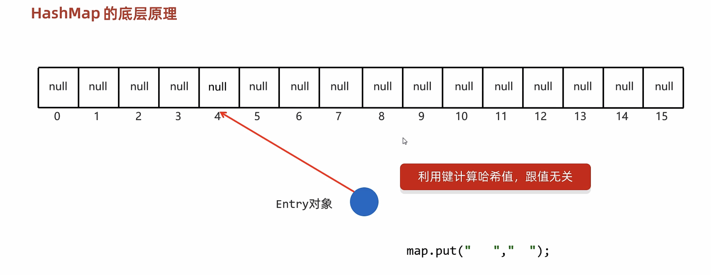

注：如果键的属性值相同，则会覆盖（不会丢弃）


##### 练习


```java
public class Student {
    private String name;
    private int age;


    public Student() {
    }

    public Student(String name, int age) {
        this.name = name;
        this.age = age;
    }

    /**
     * 获取
     * @return name
     */
    public String getName() {
        return name;
    }

    /**
     * 设置
     * @param name
     */
    public void setName(String name) {
        this.name = name;
    }

    /**
     * 获取
     * @return age
     */
    public int getAge() {
        return age;
    }

    /**
     * 设置
     * @param age
     */
    public void setAge(int age) {
        this.age = age;
    }

    @Override
    public boolean equals(Object o) {
        if (this == o) return true;
        if (o == null || getClass() != o.getClass()) return false;
        Student student = (Student) o;
        return age == student.age && Objects.equals(name, student.name);
    }

    @Override
    public int hashCode() {
        //return Objects.hash(name, age);
        return name.hashCode();
    }

    public String toString() {
        return "Student{name = " + name + ", age = " + age + "}";
    }
}
```

```java
public class A01_HashMapDemo1 {
    public static void main(String[] args) {
       /*
        需求：创建一个HashMap集合，键是学生对象(Student)，值是籍贯(String)。
        存储三个键值对元素，并遍历
        要求：同姓名，同年龄认为是同一个学生

        核心点：
            HashMap的键位置如果存储的是自定义对象，需要重写hashCode和equals方法。
       */


        //1.创建HashMap的对象
        HashMap<Student,String> hm = new HashMap<>();

        //2.创建三个学生对象
        Student s1 = new Student("zhangsan",23);
        Student s2 = new Student("lisi",24);
        Student s3 = new Student("wangwu",25);
        Student s4 = new Student("wangwu",25);

        //3.添加元素
        hm.put(s1,"江苏");
        hm.put(s2,"浙江");
        hm.put(s3,"福建");
        hm.put(s4,"山东");

        //4.遍历集合
        Set<Student> keys = hm.keySet();
        for (Student key : keys) {
            String value = hm.get(key);
            System.out.println(key + "=" + value);
        }

        System.out.println("--------------------------");

        Set<Map.Entry<Student, String>> entries = hm.entrySet();
        for (Map.Entry<Student, String> entry : entries) {
            Student key = entry.getKey();
            String value = entry.getValue();
            System.out.println(key + "=" + value);
        }

        System.out.println("--------------------------");

        hm.forEach((student, s)-> System.out.println(student + "=" +  s));

    }
}
```


```java
public class A02_HashMapDemo2 {
    public static void main(String[] args) {
        /*
            某个班级80名学生，现在需要组成秋游活动，
            班长提供了四个景点依次是（A、B、C、D）,
            每个学生只能选择一个景点，请统计出最终哪个景点想去的人数最多。
        */
        //1.需要先让同学们投票
        //定义一个数组，存储4个景点
        String[] arr = {"A","B","C","D"};
        //利用随机数模拟80个同学的投票，并把投票的结果存储起来
        ArrayList<String> list = new ArrayList<>();
        Random r = new Random();
        for (int i = 0; i < 80; i++) {
            int index = r.nextInt(arr.length);
            list.add(arr[index]);
        }
        //2.如果要统计的东西比较多，不方便使用计数器思想
        //我们可以定义map集合，利用集合进行统计。
        HashMap<String,Integer> hm = new HashMap<>();
        for (String name : list) {
            //判断当前的景点在map集合当中是否存在
            if(hm.containsKey(name)){
                //存在
                //先获取当前景点已经被投票的次数
                int count = hm.get(name);
                //表示当前景点又被投了一次
                count++;
                //把新的次数再次添加到集合当中
                hm.put(name,count);
            }else{
                //不存在
                hm.put(name,1);
            }
        }

        System.out.println(hm);

        //3.求最大值
        int max = 0;
        Set<Map.Entry<String, Integer>> entries = hm.entrySet();
        for (Map.Entry<String, Integer> entry : entries) {
            int count = entry.getValue();
            if(count > max){
                max = count;
            }
        }
        System.out.println(max);
        //4.判断哪个景点的次数跟最大值一样，如果一样，打印出来
        for (Map.Entry<String, Integer> entry : entries) {
            int count = entry.getValue();
            if(count == max){
                System.out.println(entry.getKey());
            }
        }

    }
}
```

#### LinkedHsahMap


```java
public class A01_LinkedHashMapDemo1 {
    public static void main(String[] args) {
        /*
           LinkedHashMap:
               由键决定：
                   有序、不重复、无索引。
               有序：
                   保证存储和取出的顺序一致
               原理：
                   底层数据结构是依然哈希表，只是每个键值对元素又额外的多了一个双链表的机制记录存储的顺序。
         */

        //1.创建集合
        LinkedHashMap<String,Integer> lhm = new LinkedHashMap<>();

        //2.添加元素
        lhm.put("c",789);
        lhm.put("b",456);
        lhm.put("a",123);
        lhm.put("a",111);

        //3.打印集合
        System.out.println(lhm);

    }
}
```

#### TreeMap


```java
public class A01_TreeMapDemo1 {
    public static void main(String[] args) {
        /*
           TreeMap集合：基本应用
            需求1：
                键：整数表示id
	            值：字符串表示商品名称
	            要求1：按照id的升序排列

	            要求2：按照id的降序排列
         */

        //1.创建集合对象
        //Integer Double 默认情况下都是按照升序排列的
        //String 按照字母再ASCII码表中对应的数字升序进行排列
        //abcdefg ...
        TreeMap<Integer,String> tm = new TreeMap<>(new Comparator<Integer>() {
            @Override
            public int compare(Integer o1, Integer o2) {
                //o1:当前要添加的元素
                //o2：表示已经在红黑树中存在的元素
                return o2 - o1;
            }
        });

        //2.添加元素
        tm.put(5,"可恰可乐");
        tm.put(4,"雷碧");
        tm.put(3,"九个核桃");
        tm.put(2,"康帅傅");
        tm.put(1,"粤利粤");

        //3.打印集合
        System.out.println(tm);

    }
}
```


```java
public class Student implements Comparable<Student>{
    private String name;
    private int age;


    public Student() {
    }

    public Student(String name, int age) {
        this.name = name;
        this.age = age;
    }

    /**
     * 获取
     * @return name
     */
    public String getName() {
        return name;
    }

    /**
     * 设置
     * @param name
     */
    public void setName(String name) {
        this.name = name;
    }

    /**
     * 获取
     * @return age
     */
    public int getAge() {
        return age;
    }

    /**
     * 设置
     * @param age
     */
    public void setAge(int age) {
        this.age = age;
    }

    public String toString() {
        return "Student{name = " + name + ", age = " + age + "}";
    }

    @Override
    public int compareTo(Student o) {
        //按照学生年龄的升序排列，年龄一样按照姓名的字母排列，同姓名年龄视为同一个人。

        //this：表示当前要添加的元素
        //o：表示已经在红黑树中存在的元素

        //返回值：
        //负数：表示当前要添加的元素是小的，存左边
        //正数：表示当前要添加的元素是大的，存右边
        //0：表示当前要添加的元素已经存在，舍弃

        int i = this.getAge() - o.getAge();
        i = i == 0 ? this.getName().compareTo(o.getName()) : i;
        return i;
    }
}
```

```java
public class A02_TreeMapDemo2 {
    public static void main(String[] args) {
        /*
           TreeMap集合：基本应用
            需求2：
                键：学生对象
	            值：籍贯
	            要求：按照学生年龄的升序排列，年龄一样按照姓名的字母排列，同姓名年龄视为同一个人。
         */


        //1.创建集合
        TreeMap<Student,String> tm = new TreeMap<>();

        //2.创建三个学生对象
        Student s1 = new Student("zhangsan",23);
        Student s2 = new Student("lisi",24);
        Student s3 = new Student("wangwu",25);

        //3.添加元素
        tm.put(s1,"江苏");
        tm.put(s2,"天津");
        tm.put(s3,"北京");

        //4.打印集合
        System.out.println(tm);
```


```java
public class A03_TreeMapDemo3 {
    public static void main(String[] args) {
       /* 需求：
        字符串“aababcabcdabcde”
        请统计字符串中每一个字符出现的次数，并按照以下格式输出
        输出结果：
        a（5）b（4）c（3）d（2）e（1）

            新的统计思想：利用map集合进行统计

          如果题目中没有要求对结果进行排序，默认使用HashMap
          如果题目中要求对结果进行排序，请使用TreeMap

          键：表示要统计的内容
          值：表示次数

        */


        //1.定义字符串
        String s = "aababcabcdabcde";

        //2.创建集合
        TreeMap<Character,Integer> tm = new TreeMap<>();

        //3.遍历字符串得到里面的每一个字符
        for (int i = 0; i < s.length(); i++) {
            char c = s.charAt(i);
            //拿着c到集合中判断是否存在
            //存在，表示当前字符又出现了一次
            //不存在，表示当前字符是第一次出现
            if(tm.containsKey(c)){
                //存在
                //先把已经出现的次数拿出来
                int count = tm.get(c);
                //当前字符又出现了一次
                count++;
                //把自增之后的结果再添加到集合当中
                tm.put(c,count);
            }else{
                //不存在
                tm.put(c,1);
            }
        }

        //4.遍历集合，并按照指定的格式进行拼接
        // a（5）b（4）c（3）d（2）e（1）
        //StringBuilder sb = new StringBuilder();
        //tm.forEach((key, value)->sb.append(key).append("(").append(value).append(")"));

        StringJoiner sj = new StringJoiner("","","");
        tm.forEach((key, value)->sj.add(key + "").add("(").add(value + "").add(")"));

        System.out.println(sj);


    }
}
```


### 可变参数

​​

```java
public class ArgsDemo3 {
    public static void main(String[] args) {
        //JDK5
        //可变参数
        //方法形参的个数是可以发生变化的，0 1 2 3 ...
        //格式：属性类型...名字
        //int...args

        int sum = getSum(1, 2, 3, 4, 5, 6, 7, 8, 9, 10);
        System.out.println(sum);
    }

    //底层：
    //可变参数底层就是一个数组
    //只不过不需要我们自己创建了，Java会帮我们创建好
    public static int getSum(int...args){
        //System.out.println(args);//[I@119d7047
        int sum = 0;
        for (int i : args) {
            sum = sum + i;
        }
        return sum;
    }
}
```

```java
public class ArgsDemo4 {
    public static void main(String[] args) {
        //可变参数的小细节：
        //1.在方法的形参中最多只能写一个可变参数
        //可变参数，理解为一个大胖子，有多少吃多少

        //2.在方法的形参当中，如果出了可变参数以外，还有其他的形参，那么可变参数要写在最后

        getSum(1,2,3,4,5,6,7,8,9,10);

    }

    public static int getSum( int a,int...args) {
        return 0;
    }
}
```

### Collections

​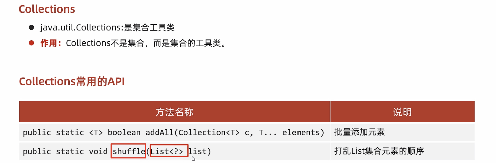​

```java
public class CollectionsDemo1 {
    public static void main(String[] args) {
      /*
        public static <T> boolean addAll(Collection<T> c, T... elements)        批量添加元素
        public static void shuffle(List<?> list)                                打乱List集合元素的顺序
     */


        //addAll  批量添加元素
        //1.创建集合对象
        ArrayList<String> list = new ArrayList<>();
        //2.批量添加元素
        Collections.addAll(list,"abc","bcd","qwer","df","asdf","zxcv","1234","qwer");
        //3.打印集合
        System.out.println(list);

        //shuffle 打乱
        Collections.shuffle(list);

        System.out.println(list);

    }
}
```

```java
public class CollectionsDemo2 {
    public static void main(String[] args) {
      /*
        public static <T> void sort(List<T> list)                       排序
        public static <T> void sort(List<T> list, Comparator<T> c)      根据指定的规则进行排序
        public static <T> int binarySearch (List<T> list,  T key)       以二分查找法查找元素
        public static <T> void copy(List<T> dest, List<T> src)          拷贝集合中的元素
        public static <T> int fill (List<T> list,  T obj)               使用指定的元素填充集合
        public static <T> void max/min(Collection<T> coll)              根据默认的自然排序获取最大/小值
        public static <T> void swap(List<?> list, int i, int j)         交换集合中指定位置的元素
     */


        System.out.println("-------------sort默认规则--------------------------");
        //默认规则，需要重写Comparable接口compareTo方法。Integer已经实现，按照从小打大的顺序排列
        //如果是自定义对象，需要自己指定规则
        ArrayList<Integer> list1 = new ArrayList<>();
        Collections.addAll(list1, 10, 1, 2, 4, 8, 5, 9, 6, 7, 3);
        Collections.sort(list1);
        System.out.println(list1);


        System.out.println("-------------sort自己指定规则规则--------------------------");
        Collections.sort(list1, new Comparator<Integer>() {
            @Override
            public int compare(Integer o1, Integer o2) {
                return o2 - o1;
            }
        });
        System.out.println(list1);

        Collections.sort(list1, (o1, o2) -> o2 - o1);
        System.out.println(list1);

        System.out.println("-------------binarySearch--------------------------");
        //需要元素有序
        ArrayList<Integer> list2 = new ArrayList<>();
        Collections.addAll(list2, 1, 2, 3, 4, 5, 6, 7, 8, 9, 10);
        System.out.println(Collections.binarySearch(list2, 9));
        System.out.println(Collections.binarySearch(list2, 1));
        System.out.println(Collections.binarySearch(list2, 20));

        System.out.println("-------------copy--------------------------");
        //把list3中的元素拷贝到list4中
        //会覆盖原来的元素
        //注意点：如果list3的长度 > list4的长度，方法会报错
        ArrayList<Integer> list3 = new ArrayList<>();
        ArrayList<Integer> list4 = new ArrayList<>();
        Collections.addAll(list3, 1, 2, 3, 4, 5, 6, 7, 8, 9, 10);
        Collections.addAll(list4, 0,0,0,0,0,0,0,0,0,0,0,0,0,0,0);
        Collections.copy(list4, list3);
        System.out.println(list3);
        System.out.println(list4);

        System.out.println("-------------fill--------------------------");
        //把集合中现有的所有数据，都修改为指定数据
        ArrayList<Integer> list5 = new ArrayList<>();
        Collections.addAll(list5, 1, 2, 3, 4, 5, 6, 7, 8, 9, 10);
        Collections.fill(list5, 100);
        System.out.println(list5);

        System.out.println("-------------max/min--------------------------");
        //求最大值或者最小值
        ArrayList<Integer> list6 = new ArrayList<>();
        Collections.addAll(list6, 1, 2, 3, 4, 5, 6, 7, 8, 9, 10);
        System.out.println(Collections.max(list6));
        System.out.println(Collections.min(list6));

        System.out.println("-------------max/min指定规则--------------------------");
        // String中默认是按照字母的abcdefg顺序进行排列的
        // 现在我要求最长的字符串
        // 默认的规则无法满足，可以自己指定规则
        // 求指定规则的最大值或者最小值
        ArrayList<String> list7 = new ArrayList<>();
        Collections.addAll(list7, "a","aa","aaa","aaaa");
        System.out.println(Collections.max(list7, new Comparator<String>() {
            @Override
            public int compare(String o1, String o2) {
                return o1.length() - o2.length();
            }
        }));

        System.out.println("-------------swap--------------------------");
        ArrayList<Integer> list8 = new ArrayList<>();
        Collections.addAll(list8, 1, 2, 3);
        Collections.swap(list8,0,2);
        System.out.println(list8);

    }
}
```

### 不可变集合


```java
public class ImmutableDemo1 {
    public static void main(String[] args) {
        /*
            创建不可变的List集合
            "张三", "李四", "王五", "赵六"
        */

        //一旦创建完毕之后，是无法进行修改的，在下面的代码中，只能进行查询操作
        List<String> list = List.of("张三", "李四", "王五", "赵六");

        System.out.println(list.get(0));
        System.out.println(list.get(1));
        System.out.println(list.get(2));
        System.out.println(list.get(3));

        System.out.println("---------------------------");

        for (String s : list) {
            System.out.println(s);
        }

        System.out.println("---------------------------");


        Iterator<String> it = list.iterator();
        while(it.hasNext()){
            String s = it.next();
            System.out.println(s);
        }
        System.out.println("---------------------------");

        for (int i = 0; i < list.size(); i++) {
            String s = list.get(i);
            System.out.println(s);
        }
        System.out.println("---------------------------");

        //list.remove("李四");
        //list.add("aaa");
        list.set(0,"aaa");
    }
}
```

```java
public class ImmutableDemo2 {
    public static void main(String[] args) {
        /*
           创建不可变的Set集合
           "张三", "李四", "王五", "赵六"


           细节：
                当我们要获取一个不可变的Set集合时，里面的参数一定要保证唯一性
        */

        //一旦创建完毕之后，是无法进行修改的，在下面的代码中，只能进行查询操作
        Set<String> set = Set.of("张三", "张三", "李四", "王五", "赵六");

        for (String s : set) {
            System.out.println(s);
        }

        System.out.println("-----------------------");

        Iterator<String> it = set.iterator();
        while(it.hasNext()){
            String s = it.next();
            System.out.println(s);
        }

        System.out.println("-----------------------");
        //set.remove("王五");
    }
}
```

```java
public class ImmutableDemo3 {
    public static void main(String[] args) {
       /*
        创建Map的不可变集合
            细节1：
                键是不能重复的
            细节2：
                Map里面的of方法，参数是有上限的，最多只能传递20个参数，10个键值对
            细节3：
                如果我们要传递多个键值对对象，数量大于10个，在Map接口中还有一个方法

        */

        //一旦创建完毕之后，是无法进行修改的，在下面的代码中，只能进行查询操作
        Map<String, String> map = Map.of("张三", "南京", "张三", "北京", "王五", "上海",
                "赵六", "广州", "孙七", "深圳", "周八", "杭州",
                "吴九", "宁波", "郑十", "苏州", "刘一", "无锡",
                "陈二", "嘉兴");


        Set<String> keys = map.keySet();
        for (String key : keys) {
            String value = map.get(key);
            System.out.println(key + "=" + value);
        }

        System.out.println("--------------------------");

        Set<Map.Entry<String, String>> entries = map.entrySet();
        for (Map.Entry<String, String> entry : entries) {
            String key = entry.getKey();
            String value = entry.getValue();
            System.out.println(key + "=" + value);
        }
        System.out.println("--------------------------");
    }

}
```

```java
public class ImmutableDemo4 {
    public static void main(String[] args) {

        /*
            创建Map的不可变集合,键值对的数量超过10个
        */

        //1.创建一个普通的Map集合
        HashMap<String, String> hm = new HashMap<>();
        hm.put("张三", "南京");
        hm.put("李四", "北京");
        hm.put("王五", "上海");
        hm.put("赵六", "北京");
        hm.put("孙七", "深圳");
        hm.put("周八", "杭州");
        hm.put("吴九", "宁波");
        hm.put("郑十", "苏州");
        hm.put("刘一", "无锡");
        hm.put("陈二", "嘉兴");
        hm.put("aaa", "111");

        //2.利用上面的数据来获取一个不可变的集合
/*
        //获取到所有的键值对对象（Entry对象）
        Set<Map.Entry<String, String>> entries = hm.entrySet();
        //把entries变成一个数组
        Map.Entry[] arr1 = new Map.Entry[0];
        //toArray方法在底层会比较集合的长度跟数组的长度两者的大小
        //如果集合的长度 > 数组的长度 ：数据在数组中放不下，此时会根据实际数据的个数，重新创建数组
        //如果集合的长度 <= 数组的长度：数据在数组中放的下，此时不会创建新的数组，而是直接用
        Map.Entry[] arr2 = entries.toArray(arr1);
        //不可变的map集合
        Map map = Map.ofEntries(arr2);
        map.put("bbb","222");*/


        //Map<Object, Object> map = Map.ofEntries(hm.entrySet().toArray(new Map.Entry[0]));


        Map<String, String> map = Map.copyOf(hm);
        map.put("bbb","222");

    }
}
```


‍
