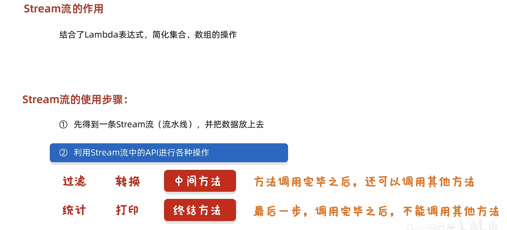

# 17-Stream流


```java
public class StreamDemo1 {
    public static void main(String[] args) {
        /*
            创建集合添加元素，完成以下需求：
            1.把所有以“张”开头的元素存储到新集合中
            2.把“张”开头的，长度为3的元素再存储到新集合中
            3.遍历打印最终结果
        */
        ArrayList<String> list1 = new ArrayList<>();
        list1.add("张无忌");
        list1.add("周芷若");
        list1.add("赵敏");
        list1.add("张强");
        list1.add("张三丰");


        list1.stream().filter(name->name.startsWith("张")).filter(name -> name.length() == 3).forEach(name-> System.out.println(name));


      /*  //1.把所有以“张”开头的元素存储到新集合中
        ArrayList<String> list2 = new ArrayList<>();
        for (String name : list1) {
            if(name.startsWith("张")){
                list2.add(name);
            }
        }
        //2.把“张”开头的，长度为3的元素再存储到新集合中
        ArrayList<String> list3 = new ArrayList<>();
        for (String name : list2) {
            if(name.length() == 3){
                list3.add(name);
            }
        }

        //3.遍历打印最终结果
        for (String name : list3) {
            System.out.println(name);
        }*/


    }
}
```




​​

```java
public class StreamDemo2 {
    public static void main(String[] args) {
/*
        单列集合      default Stream<E> stream()                           Collection中的默认方法
        双列集合      无                                                   无法直接使用stream流
        数组          public static <T> Stream<T> stream(T[] array)        Arrays工具类中的静态方法
        一堆零散数据   public static<T> Stream<T> of(T... values)           Stream接口中的静态方法
*/

        //1.单列集合获取Stream流
        ArrayList<String> list = new ArrayList<>();
        Collections.addAll(list,"a","b","c","d","e");
        /*//获取到一条流水线，并把集合中的数据放到流水线上
        Stream<String> stream1 = list.stream();
        //使用终结方法打印一下流水线上的所有数据
        stream1.forEach(new Consumer<String>() {
            @Override
            public void accept(String s) {
                //s:依次表示流水线上的每一个数据
                System.out.println(s);
            }
        });*/
        list.stream().forEach(s -> System.out.println(s));

    }
}
```

```java
public class StreamDemo3 {
    public static void main(String[] args) {
        //双列集合      无                                                   无法直接使用stream流


        //1.创建双列集合
        HashMap<String,Integer> hm = new HashMap<>();
        //2.添加数据
        hm.put("aaa",111);
        hm.put("bbb",222);
        hm.put("ccc",333);
        hm.put("ddd",444);

        //3.第一种获取stream流
        //hm.keySet().stream().forEach(s -> System.out.println(s));

        //4.第二种获取stream流
        hm.entrySet().stream().forEach(s-> System.out.println(s));
    }
}
```

```java
public class StreamDemo4 {
    public static void main(String[] args) {
        // 数组          public static <T> Stream<T> stream(T[] array)        Arrays工具类中的静态方法

        //1.创建数组
        int[] arr1 = {1,2,3,4,5,6,7,8,9,10};

        String[] arr2 = {"a","b","c"};


        //2.获取stream流
        // Arrays.stream(arr1).forEach(s-> System.out.println(s));

        //System.out.println("============================");

        //Arrays.stream(arr2).forEach(s-> System.out.println(s));


        //System.out.println("============================");


        //注意：
        //Stream接口中静态方法of的细节
        //方法的形参是一个可变参数，可以传递一堆零散的数据，也可以传递数组
        //但是数组必须是引用数据类型的，如果传递基本数据类型，是会把整个数组当做一个元素，放到Stream当中。
        Stream.of(arr1).forEach(s-> System.out.println(s));//[I@41629346

    }
}
```

```java
public class StreamDemo5 {
    public static void main(String[] args) {
        //一堆零散数据   public static<T> Stream<T> of(T... values)           Stream接口中的静态方法

        Stream.of(1,2,3,4,5).forEach(s-> System.out.println(s));
        Stream.of("a","b","c","d","e").forEach(s-> System.out.println(s));

    }
}
```

##### 中间方法


```java
public class StreamDemo6 {
    public static void main(String[] args) {
        /*
            filter              过滤
            limit               获取前几个元素
            skip                跳过前几个元素

            注意1：中间方法，返回新的Stream流，原来的Stream流只能使用一次，建议使用链式编程
            注意2：修改Stream流中的数据，不会影响原来集合或者数组中的数据
        */

        ArrayList<String> list = new ArrayList<>();
        Collections.addAll(list, "张无忌", "周芷若", "赵敏", "张强", "张三丰", "张翠山", "张良", "王二麻子", "谢广坤");

        //filter   过滤  把张开头的留下，其余数据过滤不要
        /*list.stream().filter(new Predicate<String>() {
            @Override
            public boolean test(String s) {
                //如果返回值为true，表示当前数据留下
                //如果返回值为false，表示当前数据舍弃不要
                return s.startsWith("张");
            }
        }).forEach(s -> System.out.println(s));

        list.stream()
                .filter(s -> s.startsWith("张"))
                .filter(s -> s.length() == 3)
                .forEach(s -> System.out.println(s));


        System.out.println("====================================");
        System.out.println(list);*/


       /* limit               获取前几个元素
        skip                跳过前几个元素*/

        //"张无忌", "周芷若", "赵敏", "张强", "张三丰", "张翠山", "张良", "王二麻子", "谢广坤"
        //list.stream().limit(3).forEach(s -> System.out.println(s));
        //list.stream().skip(4) .forEach(s -> System.out.println(s));


        //课堂练习：
        //"张强", "张三丰", "张翠山"
        //第一种思路：
        //先获取前面6个元素："张无忌", "周芷若", "赵敏", "张强", "张三丰", "张翠山",
        //然后跳过前面3个元素
        //list.stream().limit(6).skip(3).forEach(s -> System.out.println(s));

        //第二种思路：
        //先跳过3个元素："张强", "张三丰", "张翠山", "张良", "王二麻子", "谢广坤"
        //然后再获取前面3个元素："张强", "张三丰", "张翠山"
        //list.stream().skip(3).limit(3).forEach(s -> System.out.println(s));

    }
}
```

```java
public class StreamDemo7 {
    public static void main(String[] args) {
        /*
            distinct            元素去重，依赖(hashCode和equals方法)
            concat              合并a和b两个流为一个流

            注意1：中间方法，返回新的Stream流，原来的Stream流只能使用一次，建议使用链式编程
            注意2：修改Stream流中的数据，不会影响原来集合或者数组中的数据
        */

        ArrayList<String> list1 = new ArrayList<>();
        Collections.addAll(list1, "张无忌","张无忌","张无忌", "张强", "张三丰", "张翠山", "张良", "王二麻子", "谢广坤");

        ArrayList<String> list2 = new ArrayList<>();
        Collections.addAll(list2, "周芷若", "赵敏");


        // distinct            元素去重，依赖(hashCode和equals方法)
        //list1.stream().distinct().forEach(s -> System.out.println(s));


        Stream.concat(list1.stream(),list2.stream()).forEach(s -> System.out.println(s));


    }
}
```

```java
public class StreamDemo8 {
    public static void main(String[] args) {
         /*
            map                 转换流中的数据类型

            注意1：中间方法，返回新的Stream流，原来的Stream流只能使用一次，建议使用链式编程
            注意2：修改Stream流中的数据，不会影响原来集合或者数组中的数据
        */

        ArrayList<String> list = new ArrayList<>();
        Collections.addAll(list, "张无忌-15", "周芷若-14", "赵敏-13", "张强-20", "张三丰-100", "张翠山-40", "张良-35", "王二麻子-37", "谢广坤-41");
        //需求：只获取里面的年龄并进行打印
        //String->int

        //第一个类型：流中原本的数据类型
        //第二个类型：要转成之后的类型

        //apply的形参s：依次表示流里面的每一个数据
        //返回值：表示转换之后的数据

        //当map方法执行完毕之后，流上的数据就变成了整数
        //所以在下面forEach当中，s依次表示流里面的每一个数据，这个数据现在就是整数了
        list.stream().map(new Function<String, Integer>() {
            @Override
            public Integer apply(String s) {
                String[] arr = s.split("-");
                String ageString = arr[1];
                int age = Integer.parseInt(ageString);
                return age;
            }
        }).forEach(s-> System.out.println(s));

        System.out.println("------------------------");


        list.stream()
                .map(s-> Integer.parseInt(s.split("-")[1]))
                .forEach(s-> System.out.println(s));

    }
}
```

##### 终结方法


```java
public class StreamDemo9 {
    public static void main(String[] args) {
       /*
            void forEach(Consumer action)           遍历
            long count()                            统计
            toArray()                               收集流中的数据，放到数组中
       */

        ArrayList<String> list = new ArrayList<>();
        Collections.addAll(list, "张无忌", "周芷若", "赵敏", "张强", "张三丰", "张翠山", "张良", "王二麻子", "谢广坤");


        //void forEach(Consumer action)           遍历

        //Consumer的泛型：表示流中数据的类型
        //accept方法的形参s：依次表示流里面的每一个数据
        //方法体：对每一个数据的处理操作（打印）
        /*list.stream().forEach(new Consumer<String>() {
            @Override
            public void accept(String s) {
                System.out.println(s);
            }
        });*/

        //list.stream().forEach(s -> System.out.println(s));


        // long count()                            统计
        //long count = list.stream().count();
        //System.out.println(count);


        // toArray()                               收集流中的数据，放到数组中
        //Object[] arr1 = list.stream().toArray();
        //System.out.println(Arrays.toString(arr1));

        //IntFunction的泛型：具体类型的数组
        //apply的形参:流中数据的个数，要跟数组的长度保持一致
        //apply的返回值：具体类型的数组
        //方法体：就是创建数组


        //toArray方法的参数的作用：负责创建一个指定类型的数组
        //toArray方法的底层，会依次得到流里面的每一个数据，并把数据放到数组当中
        //toArray方法的返回值：是一个装着流里面所有数据的数组
       /* String[] arr = list.stream().toArray(new IntFunction<String[]>() {
            @Override
            public String[] apply(int value) {
                return new String[value];
            }
        });

        System.out.println(Arrays.toString(arr));*/
        String[] arr2 = list.stream().toArray(value -> new String[value]);
        System.out.println(Arrays.toString(arr2));

    }
}
```

##### 收集方法

```java
public class StreamDemo10 {
    public static void main(String[] args) {

        /*
            collect(Collector collector)            收集流中的数据，放到集合中 (List Set Map)

            注意点：
                如果我们要收集到Map集合当中，键不能重复，否则会报错
       */

        ArrayList<String> list = new ArrayList<>();
        Collections.addAll(list, "张无忌-男-15", "周芷若-女-14", "赵敏-女-13", "张强-男-20",
                "张三丰-男-100", "张翠山-男-40", "张良-男-35", "王二麻子-男-37", "谢广坤-男-41");


        //收集List集合当中
        //需求：
        //我要把所有的男性收集起来
        List<String> newList1 = list.stream()
                .filter(s -> "男".equals(s.split("-")[1]))
                .collect(Collectors.toList());
        //System.out.println(newList1);


        //收集Set集合当中
        //需求：
        //我要把所有的男性收集起来
        Set<String> newList2 = list.stream().filter(s -> "男".equals(s.split("-")[1]))
                .collect(Collectors.toSet());
        //System.out.println(newList2);


        //收集Map集合当中
        //谁作为键,谁作为值.
        //我要把所有的男性收集起来
        //键：姓名。 值：年龄
        Map<String, Integer> map = list.stream()
                .filter(s -> "男".equals(s.split("-")[1]))
                /*
                 *   toMap : 参数一表示键的生成规则
                 *           参数二表示值的生成规则
                 *
                 * 参数一：
                 *       Function泛型一：表示流中每一个数据的类型
                 *               泛型二：表示Map集合中键的数据类型
                 *
                 *        方法apply形参：依次表示流里面的每一个数据
                 *               方法体：生成键的代码
                 *               返回值：已经生成的键
                 *
                 *
                 * 参数二：
                 *        Function泛型一：表示流中每一个数据的类型
                 *                泛型二：表示Map集合中值的数据类型
                 *
                 *       方法apply形参：依次表示流里面的每一个数据
                 *               方法体：生成值的代码
                 *               返回值：已经生成的值
                 *
                 * */
                .collect(Collectors.toMap(new Function<String, String>() {
                                              @Override
                                              public String apply(String s) {
                                                  //张无忌-男-15
                                                  return s.split("-")[0];
                                              }
                                          },
                        new Function<String, Integer>() {
                            @Override
                            public Integer apply(String s) {
                                return Integer.parseInt(s.split("-")[2]);
                            }
                        }));


        Map<String, Integer> map2 = list.stream()
                .filter(s -> "男".equals(s.split("-")[1]))
                .collect(Collectors.toMap(
                        s -> s.split("-")[0],
                        s -> Integer.parseInt(s.split("-")[2])));

        System.out.println(map2);


    }
}
```


##### 练习


```java
public class Test1 {
    public static void main(String[] args) {
       /*
        定义一个集合，并添加一些整数  1,2,3,4,5,6,7,8,9,10
        过滤奇数，只留下偶数。
        并将结果保存起来
       */


        //1. 定义一个集合
        ArrayList<Integer> list = new ArrayList<>();
        //2.添加一些整数
        Collections.addAll(list, 1, 2, 3, 4, 5, 6, 7, 8, 9, 10);
        //3.过滤奇数，只留下偶数
        //进行判断，如果是偶数，返回true 保留
        List<Integer> newList = list.stream()
                .filter(n -> n % 2 == 0)
                .collect(Collectors.toList());
        //4.打印集合
        System.out.println(newList);

    }

}
```


```java
public class Test2 {
    public static void main(String[] args) {
       /*
        练习：
        创建一个ArrayList集合，并添加以下字符串，字符串中前面是姓名，后面是年龄
            "zhangsan,23"
            "lisi,24"
            "wangwu,25"
        保留年龄大于等于24岁的人，并将结果收集到Map集合中，姓名为键，年龄为值*/

        //1.创建一个ArrayList集合
        ArrayList<String> list = new ArrayList<>();
        //2.添加以下字符串
        list.add("zhangsan,23");
        list.add("lisi,24");
        list.add("wangwu,25");
        //3.保留年龄大于等于24岁的人
      /*  list.stream()
                .filter(s -> Integer.parseInt(s.split(",")[1]) >= 24)
                .collect(Collectors.toMap(new Function<String, String>() {
                    @Override
                    public String apply(String s) {
                        return s.split(",")[0];
                    }
                }, new Function<String, Integer>() {
                    @Override
                    public Integer apply(String s) {
                        return Integer.parseInt(s.split(",")[1]);
                    }
                }));*/

        Map<String, Integer> map = list.stream()
                .filter(s -> Integer.parseInt(s.split(",")[1]) >= 24)
                .collect(Collectors.toMap(
                        s -> s.split(",")[0],
                        s -> Integer.parseInt(s.split(",")[1])));

        System.out.println(map);

    }
}
```


```java
public class Test3 {
    public static void main(String[] args) {
      /*
        现在有两个ArrayList集合，分别存储6名男演员的名字和年龄以及6名女演员的名字和年龄。
        姓名和年龄中间用逗号隔开。
        比如：张三,23
        要求完成如下的操作：
        1，男演员只要名字为3个字的前两人
        2，女演员只要姓杨的，并且不要第一个
        3，把过滤后的男演员姓名和女演员姓名合并到一起
        4，将上一步的演员信息封装成Actor对象。
        5，将所有的演员对象都保存到List集合中。
        备注：演员类Actor，属性有：name，age

        男演员：  "蔡坤坤,24" , "叶齁咸,23", "刘不甜,22", "吴签,24", "谷嘉,30", "肖梁梁,27"
        女演员：  "赵小颖,35" , "杨颖,36", "高元元,43", "张天天,31", "刘诗,35", "杨小幂,33"
      */


        //1.创建两个ArrayList集合
        ArrayList<String> manList = new ArrayList<>();
        ArrayList<String> womenList = new ArrayList<>();
        //2.添加数据
        Collections.addAll(manList, "蔡坤坤,24", "叶齁咸,23", "刘不甜,22", "吴签,24", "谷嘉,30", "肖梁梁,27");
        Collections.addAll(womenList, "赵小颖,35", "杨颖,36", "高元元,43", "张天天,31", "刘诗,35", "杨小幂,33");
        //3.男演员只要名字为3个字的前两人
        Stream<String> stream1 = manList.stream()
                .filter(s -> s.split(",")[0].length() == 3)
                .limit(2);
        //4.女演员只要姓杨的，并且不要第一个
        Stream<String> stream2 = womenList.stream()
                .filter(s -> s.split(",")[0].startsWith("杨"))
                .skip(1);
        //5.把过滤后的男演员姓名和女演员姓名合并到一起
        //演员信息封装成Actor对象。

        //String -> Actor对象 （类型转换）
       /* Stream.concat(stream1,stream2).map(new Function<String, Actor>() {
            @Override
            public Actor apply(String s) {
                //"赵小颖,35"
                String name = s.split(",")[0];
                int age = Integer.parseInt(s.split(",")[1]);
                return new Actor(name,age);
            }
        }).forEach(s-> System.out.println(s));*/

        List<Actor> list = Stream.concat(stream1, stream2)
                .map(s -> new Actor(s.split(",")[0], Integer.parseInt(s.split(",")[1])))
                .collect(Collectors.toList());
        System.out.println(list);
    }
}
```

```java
public class Actor {
    private String name;
    private int age;

    public Actor() {
    }


    public Actor(String name, int age) {
        this.name = name;
        this.age = age;
    }

    /**
     * 获取
     * @return name
     */
    public String getName() {
        return name;
    }

    /**
     * 设置
     * @param name
     */
    public void setName(String name) {
        this.name = name;
    }

    /**
     * 获取
     * @return age
     */
    public int getAge() {
        return age;
    }

    /**
     * 设置
     * @param age
     */
    public void setAge(int age) {
        this.age = age;
    }

    public String toString() {
        return "Actor{name = " + name + ", age = " + age + "}";
    }
}

```
