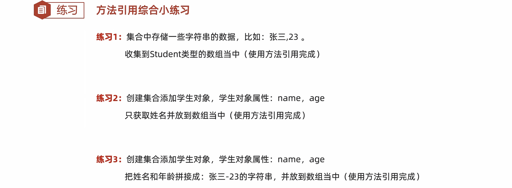

# 18-方法引用

#### 方法引用概述


```java
public class FunctionDemo1 {
    public static void main(String[] args) {
        //需求：创建一个数组，进行倒序排列
        Integer[] arr = {3, 5, 4, 1, 6, 2};
        //匿名内部类

       /* Arrays.sort(arr, new Comparator<Integer>() {
            @Override
            public int compare(Integer o1, Integer o2) {
                return o2 - o1;
            }
        });*/


        //lambda表达式
        //因为第二个参数的类型Comparator是一个函数式接口
       /* Arrays.sort(arr, (Integer o1, Integer o2)->{
            return o2 - o1;
        });*/

        //lambda表达式简化格式
        //Arrays.sort(arr, (o1, o2)->o2 - o1 );


        //方法引用
        //1.引用处需要是函数式接口
        //2.被引用的方法需要已经存在
        //3.被引用方法的形参和返回值需要跟抽象方法的形参和返回值保持一致
        //4.被引用方法的功能需要满足当前的要求

        //表示引用FunctionDemo1类里面的subtraction方法
        //把这个方法当做抽象方法的方法体
        Arrays.sort(arr, FunctionDemo1::subtraction);

        System.out.println(Arrays.toString(arr));

    }


    //可以是Java已经写好的，也可以是一些第三方的工具类
    public static int subtraction(int num1, int num2) {
        return num2 - num1;
    }
}
```


#### 引用静态方法


```java
public class FunctionDemo2 {
    public static void main(String[] args) {
       /*
        方法引用（引用静态方法）
        格式
              类::方法名

        需求：
            集合中有以下数字，要求把他们都变成int类型
            "1","2","3","4","5"
       */


        //1.创建集合并添加元素
        ArrayList<String> list = new ArrayList<>();
        Collections.addAll(list,"1","2","3","4","5");

        //2.把他们都变成int类型
       /* list.stream().map(new Function<String, Integer>() {
            @Override
            public Integer apply(String s) {
                int i = Integer.parseInt(s);
                return i;
            }
        }).forEach(s -> System.out.println(s));*/


        //1.方法需要已经存在
        //2.方法的形参和返回值需要跟抽象方法的形参和返回值保持一致
        //3.方法的功能需要把形参的字符串转换成整数

        list.stream()
                .map(Integer::parseInt)
                .forEach(s-> System.out.println(s));

    }
}
```

#### 引用成员方法


```java
public class StringOperation {
    public boolean stringJudge(String s){
        return s.startsWith("张") && s.length() == 3;
    }
}
```

```java
public class FunctionDemo3  {
    public static void main(String[] args) {
        /*
        方法引用（引用成员方法）
        格式
                其他类：其他类对象::方法名
                本类：this::方法名(引用处不能是静态方法)
                父类：super::方法名(引用处不能是静态方法)
        需求：
            集合中有一些名字，按照要求过滤数据
            数据："张无忌","周芷若","赵敏","张强","张三丰"
            要求：只要以张开头，而且名字是3个字的

       */

        //1.创建集合
        ArrayList<String> list = new ArrayList<>();
        //2.添加数据
        Collections.addAll(list,"张无忌","周芷若","赵敏","张强","张三丰");
        //3.过滤数据（只要以张开头，而且名字是3个字的）
        //list.stream().filter(s->s.startsWith("张")).filter(s->s.length() == 3).forEach(s-> System.out.println(s));


      /*  list.stream().filter(new Predicate<String>() {
            @Override
            public boolean test(String s) {
                return s.startsWith("张") && s.length() == 3;
            }
        }).forEach(s-> System.out.println(s));*/

      /*  StringOperation so = new StringOperation();
        list.stream().filter(so::stringJudge)
                .forEach(s-> System.out.println(s));*/

        //静态方法中是没有this的
        list.stream().filter(new FunctionDemo3()::stringJudge)
                .forEach(s-> System.out.println(s));

    }


    public boolean stringJudge(String s){
        return s.startsWith("张") && s.length() == 3;
    }
}
```


#### 引用构造方法


```java
public class Student {
    private String name;
    private int age;


    public Student() {
    }


    public Student(String str) {
        String[] arr = str.split(",");
        this.name = arr[0];
        this.age = Integer.parseInt(arr[1]);
    }

    public Student(String name, int age) {
        this.name = name;
        this.age = age;
    }

    /**
     * 获取
     * @return name
     */
    public String getName() {
        return name;
    }

    /**
     * 设置
     * @param name
     */
    public void setName(String name) {
        this.name = name;
    }

    /**
     * 获取
     * @return age
     */
    public int getAge() {
        return age;
    }

    /**
     * 设置
     * @param age
     */
    public void setAge(int age) {
        this.age = age;
    }

    public String toString() {
        return "Student{name = " + name + ", age = " + age + "}";
    }
}
```

```java
public class FunctionDemo4 {
    public static void main(String[] args) {
        /*
        方法引用（引用构造方法）
        格式
                类名::new

        目的：
                创建这个类的对象

        需求：
             集合里面存储姓名和年龄，要求封装成Student对象并收集到List集合中

        方法引用的规则：
            1.需要有函数式接口
            2.被引用的方法必须已经存在
            3.被引用方法的形参和返回值，需要跟抽象方法的形参返回值保持一致
            4.被引用方法的功能需要满足当前的需求
       */

        //1.创建集合对象
        ArrayList<String> list = new ArrayList<>();
        //2.添加数据
        Collections.addAll(list, "张无忌,15", "周芷若,14", "赵敏,13", "张强,20", "张三丰,100", "张翠山,40", "张良,35", "王二麻子,37", "谢广坤,41");
        //3.封装成Student对象并收集到List集合中
        //String --> Student
      /*  List<Student> newList = list.stream().map(new Function<String, Student>() {
            @Override
            public Student apply(String s) {
                String[] arr = s.split(",");
                String name = arr[0];
                int age = Integer.parseInt(arr[1]);
                return new Student(name, age);
            }
        }).collect(Collectors.toList());
        System.out.println(newList);*/


        List<Student> newList2 = list.stream().map(Student::new).collect(Collectors.toList());
        System.out.println(newList2);

    }
}
```

#### 特殊情况的方法引用


```java
public class FunctionDemo5 {
    public static void main(String[] args) {
        /*
        方法引用（类名引用成员方法）
        格式
                类名::成员方法
        需求：
             集合里面一些字符串，要求变成大写后进行输出


        方法引用的规则：
        1.需要有函数式接口
        2.被引用的方法必须已经存在
        3.被引用方法的形参，需要跟抽象方法的第二个形参到最后一个形参保持一致，返回值需要保持一致。
        4.被引用方法的功能需要满足当前的需求

        抽象方法形参的详解：
        第一个参数：表示被引用方法的调用者，决定了可以引用哪些类中的方法
                    在Stream流当中，第一个参数一般都表示流里面的每一个数据。
                    假设流里面的数据是字符串，那么使用这种方式进行方法引用，只能引用String这个类中的方法

        第二个参数到最后一个参数：跟被引用方法的形参保持一致，如果没有第二个参数，说明被引用的方法需要是无参的成员方法

        局限性：
            不能引用所有类中的成员方法。
            是跟抽象方法的第一个参数有关，这个参数是什么类型的，那么就只能引用这个类中的方法。

       */

        //1.创建集合对象
        ArrayList<String> list = new ArrayList<>();
        //2.添加数据
        Collections.addAll(list, "aaa", "bbb", "ccc", "ddd");
        //3.变成大写后进行输出
        //map(String::toUpperCase)
        //拿着流里面的每一个数据，去调用String类中的toUpperCase方法，方法的返回值就是转换之后的结果。
        list.stream().map(String::toUpperCase).forEach(s -> System.out.println(s));


        //String --> String
       /* list.stream().map(new Function<String, String>() {
            @Override
            public String apply(String s) {
                return s.toUpperCase();
            }
        }).forEach(s -> System.out.println(s));*/

    }
}
```


```java
public class FunctionDemo6 {
    public static void main(String[] args) {
        /*
        方法引用（数组的构造方法）
        格式
                数据类型[]::new
        目的：
                创建一个指定类型的数组
        需求：
             集合中存储一些整数，收集到数组当中

        细节：
            数组的类型，需要跟流中数据的类型保持一致。

       */

        //1.创建集合并添加元素
        ArrayList<Integer> list = new ArrayList<>();
        Collections.addAll(list, 1, 2, 3, 4, 5);
        //2.收集到数组当中

        Integer[] arr2 = list.stream().toArray(Integer[]::new);
        System.out.println(Arrays.toString(arr2));

        /*Integer[] arr = list.stream().toArray(new IntFunction<Integer[]>() {
            @Override
            public Integer[] apply(int value) {
                return new Integer[value];
            }
        });*/
        //3.打印


    }
}
```

​​


#### 练习



##### 练习1

```java
public class Student {
    private String name;
    private int age;


    public Student() {
    }


    public Student(String str) {
        String[] arr = str.split(",");
        this.name = arr[0];
        this.age = Integer.parseInt(arr[1]);
    }

    public Student(String name, int age) {
        this.name = name;
        this.age = age;
    }

    /**
     * 获取
     * @return name
     */
    public String getName() {
        return name;
    }

    /**
     * 设置
     * @param name
     */
    public void setName(String name) {
        this.name = name;
    }

    /**
     * 获取
     * @return age
     */
    public int getAge() {
        return age;
    }

    /**
     * 设置
     * @param age
     */
    public void setAge(int age) {
        this.age = age;
    }

    public String toString() {
        return "Student{name = " + name + ", age = " + age + "}";
    }
}
```

```java
public class FunctionDemo7 {
    public static void main(String[] args) {
        /*
        需求：
             集合中存储一些字符串的数据，比如：张三,23。
             收集到Student类型的数组当中
       */
        //1.创建集合并添加元素
        ArrayList<String> list = new ArrayList<>();
        Collections.addAll(list, "张无忌,15", "周芷若,14", "赵敏,13", "张强,20", "张三丰,100", "张翠山,40", "张良,35", "王二麻子,37", "谢广坤,41");
        //2.先把字符串变成Student对象，然后再把Student对象收集起来
        Student[] arr = list.stream().map(Student::new).toArray(Student[]::new);
        //打印数组
        System.out.println(Arrays.toString(arr));


    }
}
```

##### 练习2

```java
public class FunctionDemo8 {
    public static void main(String[] args) {
        /*
        *   需求：
        *       创建集合添加学生对象
        *       学生对象属性：name，age
        *   要求：
        *       获取姓名并放到数组当中
        *       使用方法引用完成
        *
        *   技巧：
        *       1.现在有没有一个方法符合我当前的需求
        *       2.如果有这样的方法，这个方法是否满足引用的规则
        *       静态   类名：：方法名
        *       成员方法
        *       构造方法  类名：：new
        *
        *
        * */

        //1.创建集合
        ArrayList<Student> list = new ArrayList<>();
        //2.添加元素
        list.add(new Student("zhangsan",23));
        list.add(new Student("lisi",24));
        list.add(new Student("wangwu",25));
        //3.获取姓名并放到数组当中

        String[] arr = list.stream().map(Student::getName).toArray(String[]::new);


       /* String[] arr = list.stream().map(new Function<Student, String>() {
            @Override
            public String apply(Student student) {
                return student.getName();
            }
        }).toArray(String[]::new);*/

        System.out.println(Arrays.toString(arr));


    }
}
```

‍
