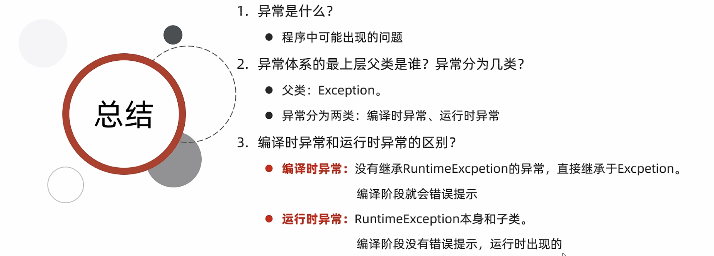
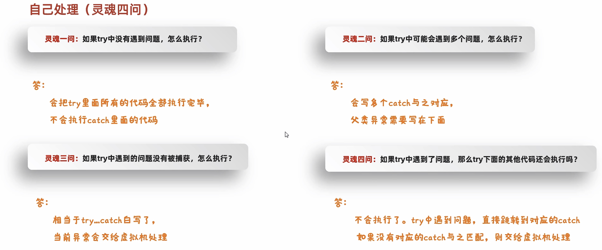
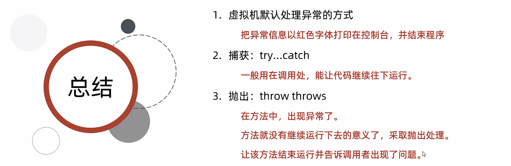

# 19-异常

#### 异常体系介绍




#### 编译时异常和运行时异常


```java
public class ExceptionDemo1 {
    public static void main(String[] args) throws ParseException {

        //编译时异常(在编译阶段，必须要手动处理，否则代码报错)
        /*String time = "2030年1月1日";
        SimpleDateFormat sdf = new SimpleDateFormat("yyyy年MM月dd日");
        Date date = sdf.parse(time);
        System.out.println(date);*/


        //运行时异常（在编译阶段是不需要处理的，是代码运行时出现的异常）
        int[] arr = {1,2,3,4,5};
        System.out.println(arr[10]);//ArrayIndexOutOfBoundsException


    }
}
```

‍


#### 异常在代码中的两个作用


```java
public class Student {
    private String name;
    private int age;


    public Student() {
    }

    public Student(String name, int age) {
        this.name = name;
        this.age = age;
    }

    /**
     * 获取
     * @return name
     */
    public String getName() {
        return name;
    }

    /**
     * 设置
     * @param name
     */
    public void setName(String name) {
        this.name = name;
    }

    /**
     * 获取
     * @return age
     */
    public int getAge() {
        return age;
    }

    /**
     * 设置
     * @param age
     */
    public void setAge(int age) {
        if(age < 18 || age > 40){
            //System.out.println("年龄超出范围");
            throw new RuntimeException();
        }else{
            this.age = age;
        }
    }

    public String toString() {
        return "Student{name = " + name + ", age = " + age + "}";
    }
}
```

```java
public class Student2 {
    private String name;
    private int age;


    public Student2() {
    }

    public Student2(String str) {//"张三,23"
        String[] arr = str.split(",");
        //arr 0: 张三,23
        this.name = arr[0];
        this.age = Integer.parseInt(arr[1]);
    }

    public Student2(String name, int age) {
        this.name = name;
        this.age = age;
    }

    /**
     * 获取
     * @return name
     */
    public String getName() {
        return name;
    }

    /**
     * 设置
     * @param name
     */
    public void setName(String name) {
        this.name = name;
    }

    /**
     * 获取
     * @return age
     */
    public int getAge() {
        return age;
    }

    /**
     * 设置
     * @param age
     */
    public void setAge(int age) {
        this.age = age;
    }

    public String toString() {
        return "Student2{name = " + name + ", age = " + age + "}";
    }
}
```

```java
public class ExceptionDemo2 {
    public static void main(String[] args) {
        /*
            异常作用一：异常是用来查询bug的关键参考信息
            异常作用二：异常可以作为方法内部的一种特殊返回值，以便通知调用者底层的执行情况
        */

        Student[] arr = new Student[3];// null null null

        String name = arr[0].getName();
        System.out.println(name);
    }
}
```

```java
public class ExceptionDemo3 {
    public static void main(String[] args) {
        /*
            异常作用一：异常是用来查询bug的关键参考信息
            异常作用二：异常可以作为方法内部的一种特殊返回值，以便通知调用者底层的执行情况
        */
        Student2 stu = new Student2("张三,23");

        System.out.println(stu);

    }
}
```

```java
public class ExceptionDemo4 {
    public static void main(String[] args) {
        /*
            异常作用一：异常是用来查询bug的关键参考信息
            异常作用二：异常可以作为方法内部的一种特殊返回值，以便通知调用者底层的执行情况
        */

        //1.创建学生对象
        Student s1 = new Student();
        //年龄：（同学） 18~40岁
        s1.setAge(50);//就知道了50赋值失败
                    //选择1：自己悄悄处理
                    //选择2：打印在控制台上

    }
}
```

#### 异常的处理方式


##### JVM默认的处理方式


```java
public class ExceptionDemo5 {
    public static void main(String[] args) {
        /*
        JVM默认处理异常的方式：
            1. 把异常的名称，异常原因及异常出现的位置等信息输出在了控制台
            2. 程序停止执行，异常下面的代码不会再执行了
        */

        System.out.println("狂踹瘸子那条好腿");
        System.out.println(2/0);//算术异常 ArithmeticException
        System.out.println("是秃子终会发光");
        System.out.println("火鸡味锅巴");

    }
}
```

##### 自己处理(捕获异常)


```java
public class ExceptionDemo6 {
    public static void main(String[] args) {
        /*
            自己处理（捕获异常）
            格式：
                try {
                   可能出现异常的代码;
                } catch(异常类名 变量名) {
                   异常的处理代码;
                }
             好处:可以让程序继续往下执行，不会停止
         */


        int[] arr = {1, 2, 3, 4, 5, 6};
        try{
            //可能出现异常的代码;
            System.out.println(arr[10]);//此处出现了异常，程序就会在这里创建一个ArrayIndexOutOfBoundsException对象
                                        //new ArrayIndexOutOfBoundsException();
                                        //拿着这个对象到catch的小括号中对比，看括号中的变量是否可以接收这个对象
                                        //如果能被接收，就表示该异常就被捕获（抓住），执行catch里面对应的代码
                                        //当catch里面所有的代码执行完毕，继续执行try...catch体系下面的其他代码
        }catch(ArrayIndexOutOfBoundsException e){
            //如果出现了ArrayIndexOutOfBoundsException异常，我该如何处理
            System.out.println("索引越界了");
        }

        System.out.println("看看我执行了吗？");

    }
}
```


```java
public class ExceptionDemo7 {
    public static void main(String[] args) {
        /*
            自己处理（捕获异常）灵魂四问：
                灵魂一问：如果try中没有遇到问题，怎么执行？
                            会把try里面所有的代码全部执行完毕，不会执行catch里面的代码
                            注意：
                                只有当出现了异常才会执行catch里面的代码

         */

        int[] arr = {1, 2, 3, 4, 5, 6};

        try{
            System.out.println(arr[0]);//1
        }catch(ArrayIndexOutOfBoundsException e){
            System.out.println("索引越界了");
        }

        System.out.println("看看我执行了吗？");//看看我执行了吗？

    }
}
```

```java
public class ExceptionDemo8 {
    public static void main(String[] args) {
        /*
            自己处理（捕获异常）灵魂四问：
                灵魂二问：如果try中可能会遇到多个问题，怎么执行？
                        会写多个catch与之对应
                        细节：
                            如果我们要捕获多个异常，这些异常中如果存在父子关系的话，那么父类一定要写在下面

                        了解性：
                            在JDK7之后，我们可以在catch中同时捕获多个异常，中间用|进行隔开
                            表示如果出现了A异常或者B异常的话，采取同一种处理方案
         */

        //JDK7
        int[] arr = {1, 2, 3, 4, 5, 6};

        try{
            System.out.println(arr[10]);//ArrayIndexOutOfBoundsException
            System.out.println(2/0);//ArithmeticException
            String s = null;
            System.out.println(s.equals("abc"));
        }catch(ArrayIndexOutOfBoundsException | ArithmeticException e){
            System.out.println("索引越界了");
        }catch(NullPointerException e){
            System.out.println("空指针异常");
        }catch (Exception e){
            System.out.println("Exception");
        }

        System.out.println("看看我执行了吗？");

    }
}
```

```java
public class ExceptionDemo9 {
    public static void main(String[] args) {
        /*
            自己处理（捕获异常）灵魂三问：
                如果try中遇到的问题没有被捕获，怎么执行？
                相当于try...catch的代码白写了，最终还是会交给虚拟机进行处理。
         */

        int[] arr = {1, 2, 3, 4, 5, 6};

        try{
            System.out.println(arr[10]);//new ArrayIndexOutOfBoundsException();
        }catch(NullPointerException e){
            System.out.println("空指针异常");
        }

        System.out.println("看看我执行了吗？");

    }
}
```

```java
public class ExceptionDemo10 {
    public static void main(String[] args) {
        /*
            自己处理（捕获异常）灵魂四问：
                如果try中遇到了问题，那么try下面的其他代码还会执行吗？
                下面的代码就不会执行了，直接跳转到对应的catch当中，执行catch里面的语句体
                但是如果没有对应catch与之匹配，那么还是会交给虚拟机进行处理
         */

        int[] arr = {1, 2, 3, 4, 5, 6};

        try{
            System.out.println(arr[10]);
            System.out.println("看看我执行了吗？... try");
        }catch(ArrayIndexOutOfBoundsException e){
            System.out.println("索引越界了");
        }

        System.out.println("看看我执行了吗？... 其他代码");

    }
}
```



##### 抛出异常


```java
public class ExceptionDemo12 {
    public static void main(String[] args) {
/*
        throws：写在方法定义处，表示声明一个异常。告诉调用者，使用本方法可能会有哪些异常。
        throw ：写在方法内，结束方法。手动抛出异常对象，交给调用者。方法中下面的代码不再执行了。


        需求：
            定义一个方法求数组的最大值
*/


        int[] arr = null;
        int max = 0;
        try {
            max = getMax(arr);
        } catch (NullPointerException e) {
            System.out.println("空指针异常");
        } catch (ArrayIndexOutOfBoundsException e) {
            System.out.println("索引越界异常");
        }

        System.out.println(max);
    }

    public static int getMax(int[] arr)/* throws NullPointerException,ArrayIndexOutOfBoundsException*/{
        if(arr == null){
            //手动创建一个异常对象，并把这个异常交给方法的调用者处理
            //此时方法就会结束，下面的代码不会再执行了
           throw new NullPointerException();
        }

        if(arr.length == 0){
            //手动创建一个异常对象，并把这个异常交给方法的调用者处理
            //此时方法就会结束，下面的代码不会再执行了
            throw new ArrayIndexOutOfBoundsException();
        }

        System.out.println("看看我执行了吗？");
        int max = arr[0];
        for (int i = 1; i < arr.length; i++) {
            if(arr[i] > max){
                max = arr[i];
            }
        }
        return max;
    }
}
```



##### 练习


​​

```java
public class GirlFriend {
    private String name;
    private int age;


    public GirlFriend() {
    }

    public GirlFriend(String name, int age) {
        this.name = name;
        this.age = age;
    }

    /**
     * 获取
     * @return name
     */
    public String getName() {
        return name;
    }

    /**
     * 设置
     * @param name
     */
    public void setName(String name)  {
        int len = name.length();
        if(len < 3 || len > 10){
            throw new RuntimeException();
        }
        this.name = name;
    }

    /**
     * 获取
     * @return age
     */
    public int getAge() {
        return age;
    }

    /**
     * 设置
     * @param age
     */
    public void setAge(int age) {
        if(age < 18 || age > 40){
            throw new RuntimeException();
        }
        this.age = age;
    }

    public String toString() {
        return "GirlFriend{name = " + name + ", age = " + age + "}";
    }
}
```

```java
public class Test {
    public static void main(String[] args) {
        /*
            需求：
                键盘录入自己心仪的女朋友姓名和年龄。
                姓名的长度在 3 - 10之间，
                年龄的范围为 18 - 40岁,
                超出这个范围是异常数据不能赋值，需要重新录入,一直录到正确为止。
            提示：
                需要考虑用户在键盘录入时的所有情况。
                比如：录入年龄时超出范围，录入年龄时录入了abc等情况
        */

        //1.创建键盘录入的对象
        Scanner sc = new Scanner(System.in);
        //2.创建女朋友的对象
        GirlFriend gf = new GirlFriend();
        while (true) {
            //3.接收女朋友的姓名
            try {
                System.out.println("请输入你心仪的女朋友的名字");
                String name = sc.nextLine();
                gf.setName(name);
                //4.接收女朋友的年龄
                System.out.println("请输入你心仪的女朋友的年龄");
                String ageStr = sc.nextLine();
                int age = Integer.parseInt(ageStr);
                gf.setAge(age);
                //如果所有的数据都是正确的，那么跳出循环
                break;
            } catch (NumberFormatException e) {
                System.out.println("年龄的格式有误，请输入数字");
                //continue;
            } catch (RuntimeException e) {
                System.out.println("姓名的长度或者年龄的范围有误");
                //continue;
            }
        }
        //5.打印
        System.out.println(gf);
    }
}
```

#### 异常中的常见方法


```java
public class ExceptionDemo11 {
    public static void main(String[] args) {
        /*
              public String getMessage()          返回此 throwable 的详细消息字符串
              public String toString()            返回此可抛出的简短描述

              public void printStackTrace()       在底层是利用System.err.println进行输出
                                                  把异常的错误信息以红色字体输出在控制台
                                                  细节：仅仅是打印信息，不会停止程序运行
        */


        int[] arr = {1, 2, 3, 4, 5, 6};

/*
        try {
            System.out.println(arr[10]);
        } catch (ArrayIndexOutOfBoundsException e) {
          *//*  String message = e.getMessage();
            System.out.println(message);//Index 10 out of bounds for length 6*//*

         *//*   String str = e.toString();
            System.out.println(str);//java.lang.ArrayIndexOutOfBoundsException: Index 10 out of bounds for length 6*//*

            e.printStackTrace();

        }
        System.out.println("看看我执行了吗？");*/


        //正常的输出语句
        //System.out.println(123);

        //错误的输出语句（而是用来打印错误信息）
        //System.err.println(123);

    }
}
```

#### 自定义异常


```java
public class AgeOutOfBoundsException extends RuntimeException{

    public AgeOutOfBoundsException() {
    }

    public AgeOutOfBoundsException(String message) {
        super(message);
    }
}
```

```java
public class NameFormatException extends RuntimeException{
    //技巧：
    //NameFormat：当前异常的名字，表示姓名格式化问题
    //Exception：表示当前类是一个异常类


    //运行时：RuntimeException 核心 就表示由于参数错误而导致的问题
    //编译时：Exception 核心 提醒程序员检查本地信息


    public NameFormatException() {
    }

    public NameFormatException(String message) {
        super(message);
    }
}
```

```java
public class GirlFriend {
    private String name;
    private int age;


    public GirlFriend() {
    }

    public GirlFriend(String name, int age) {
        this.name = name;
        this.age = age;
    }

    /**
     * 获取
     * @return name
     */
    public String getName() {
        return name;
    }

    /**
     * 设置
     * @param name
     */
    public void setName(String name) {
        int len = name.length();
        if(len < 3 || len > 10){
            throw new NameFormatException(name + "格式有误，长度应该为：3~10");
        }
        this.name = name;
    }

    /**
     * 获取
     * @return age
     */
    public int getAge() {
        return age;
    }

    /**
     * 设置
     * @param age
     */
    public void setAge(int age) {
        if(age < 18 || age > 40){
           throw new AgeOutOfBoundsException(age + "超出了范围");
        }
        this.age = age;
    }

    public String toString() {
        return "GirlFriend{name = " + name + ", age = " + age + "}";
    }
}
```

```java
public class Test {
    public static void main(String[] args) {
        /*
            需求：
                键盘录入自己心仪的女朋友姓名和年龄。
                姓名的长度在 3 - 10之间，
                年龄的范围为 18 - 40岁,
                超出这个范围是异常数据不能赋值，需要重新录入,一直录到正确为止。
            提示：
                需要考虑用户在键盘录入时的所有情况。
                比如：录入年龄时超出范围，录入年龄时录入了abc等情况
        */


        //1.创建键盘录入的对象
        Scanner sc = new Scanner(System.in);
        //2.创建女朋友的对象
        GirlFriend gf = new GirlFriend();
        while (true) {
            //3.接收女朋友的姓名
            try {
                System.out.println("请输入你心仪的女朋友的名字");
                String name = sc.nextLine();
                gf.setName(name);
                //4.接收女朋友的年龄
                System.out.println("请输入你心仪的女朋友的年龄");
                String ageStr = sc.nextLine();
                int age = Integer.parseInt(ageStr);
                gf.setAge(age);
                //如果所有的数据都是正确的，那么跳出循环
                break;
            } catch (NumberFormatException e) {
                e.printStackTrace();
            } catch (NameFormatException e) {
                e.printStackTrace();
            }catch (AgeOutOfBoundsException e) {
                e.printStackTrace();
            }
        }
        //5.打印
        System.out.println(gf);


    }
}
```

‍
