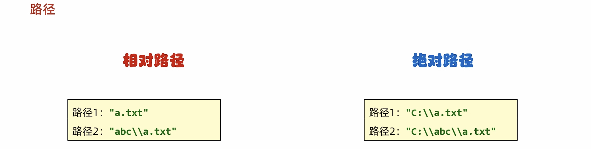
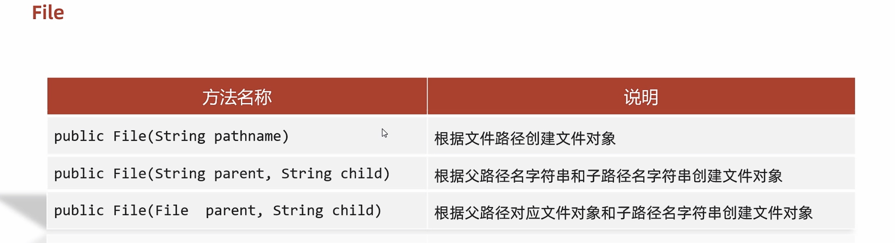
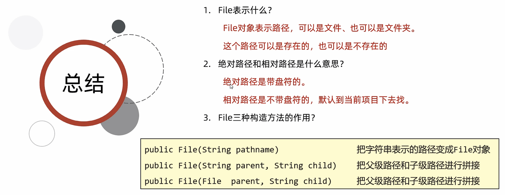
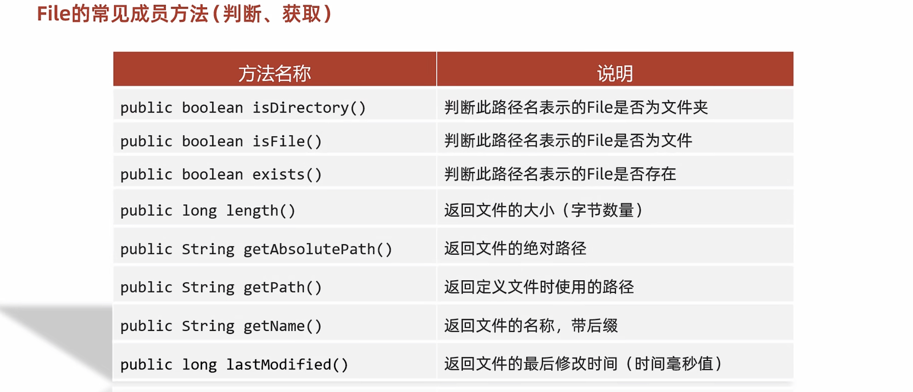
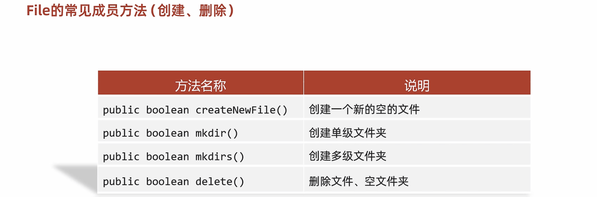
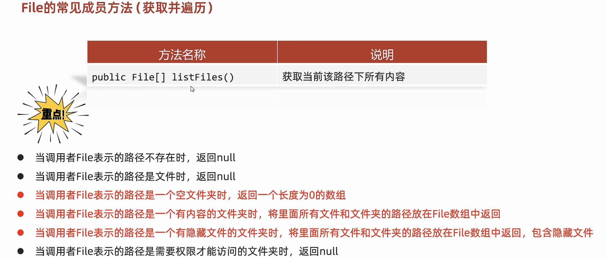
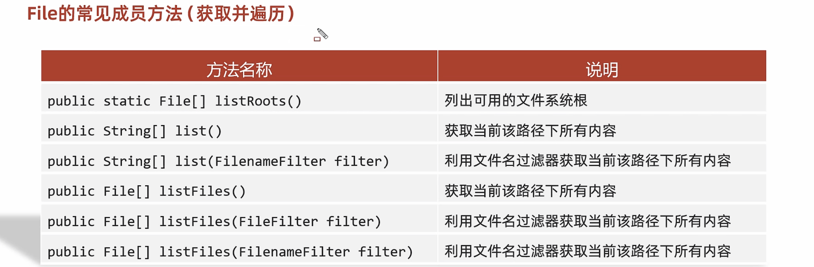

# 20-File

#### File概述和构造方法






```java
public class FileDemo1 {
    public static void main(String[] args) {
    /*
        public File(String pathname)                根据文件路径创建文件对象
        public File(String parent, String child)    根据父路径名字符串和子路径名字符串创建文件对象
        public File(File  parent, String child)     根据父路径对应文件对象和子路径名字符串创建文件对象

        C:\Users\alienware\Desktop

        \:转移字符
    */

        //1.根据字符串表示的路径，变成File对象
        String str = "C:\\Users\\alienware\\Desktop\\a.txt";
        File f1 = new File(str);
        System.out.println(f1);//C:\Users\alienware\Desktop\a.txt

        //2.父级路径：C:\Users\alienware\Desktop
        //子级路径：a.txt
        String parent = "C:\\Users\\alienware\\Desktop";
        String child = "a.txt";
        File f2 = new File(parent,child);
        System.out.println(f2);//C:\Users\alienware\Desktop\a.txt

        File f3 = new File(parent + "\\" + child);
        System.out.println(f3);//C:\Users\alienware\Desktop\a.txt


        //3.把一个File表示的路径和String表示路径进行拼接
        File parent2 = new File("C:\\Users\\alienware\\Desktop");
        String child2 = "a.txt";
        File f4 = new File(parent2,child2);
        System.out.println(f4);//C:\Users\alienware\Desktop\a.txt
    }
}
```



#### File成员方法(判断、获取)



```java
public class FileDemo2 {
    public static void main(String[] args) {
     /*
        public boolean isDirectory()        判断此路径名表示的File是否为文件夹
        public boolean isFile()             判断此路径名表示的File是否为文件
        public boolean exists()             判断此路径名表示的File是否存在

     */

        //1.对一个文件的路径进行判断
        File f1 = new File("D:\\aaa\\a.txt");
        System.out.println(f1.isDirectory());//false
        System.out.println(f1.isFile());//true
        System.out.println(f1.exists());//true
        System.out.println("--------------------------------------");
        //2.对一个文件夹的路径进行判断
        File f2 = new File("D:\\aaa\\bbb");
        System.out.println(f2.isDirectory());//true
        System.out.println(f2.isFile());//false
        System.out.println(f2.exists());//true
        System.out.println("--------------------------------------");
        //3.对一个不存在的路径进行判断
        File f3 = new File("D:\\aaa\\c.txt");
        System.out.println(f3.isDirectory());//false
        System.out.println(f3.isFile());//false
        System.out.println(f3.exists());//false

    }
}
```

```java
public class FileDemo3 {
    public static void main(String[] args) {
     /*
        public long length()                返回文件的大小（字节数量）
        public String getAbsolutePath()     返回文件的绝对路径
        public String getPath()             返回定义文件时使用的路径
        public String getName()             返回文件的名称，带后缀
        public long lastModified()          返回文件的最后修改时间（时间毫秒值）
     */

        //1.length  返回文件的大小（字节数量）
        //细节1：这个方法只能获取文件的大小，单位是字节
        //如果单位我们要是M，G，可以不断的除以1024
        //细节2：这个方法无法获取文件夹的大小
        //如果我们要获取一个文件夹的大小，需要把这个文件夹里面所有的文件大小都累加在一起。

        File f1 = new File("D:\\aaa\\a.txt");
        long len = f1.length();
        System.out.println(len);//12

        File f2 = new File("D:\\aaa\\bbb");
        long len2 = f2.length();
        System.out.println(len2);//0

        System.out.println("====================================");

        //2.getAbsolutePath 返回文件的绝对路径
        File f3 = new File("D:\\aaa\\a.txt");
        String path1 = f3.getAbsolutePath();
        System.out.println(path1);

        File f4 = new File("myFile\\a.txt");
        String path2 = f4.getAbsolutePath();
        System.out.println(path2);


        System.out.println("====================================");

        //3.getPath 返回定义文件时使用的路径
        File f5 = new File("D:\\aaa\\a.txt");
        String path3 = f5.getPath();
        System.out.println(path3);//D:\aaa\a.txt

        File f6 = new File("myFile\\a.txt");
        String path4 = f6.getPath();
        System.out.println(path4);//myFile\a.txt

        System.out.println("====================================");


        //4.getName 获取名字
        //细节1：
        //a.txt:
        //      a 文件名
        //      txt 后缀名、扩展名
        //细节2：
        //文件夹：返回的就是文件夹的名字
        File f7 = new File("D:\\aaa\\a.txt");
        String name1 = f7.getName();
        System.out.println(name1);


        File f8 = new File("D:\\aaa\\bbb");
        String name2 = f8.getName();
        System.out.println(name2);//bbb

        System.out.println("====================================");

        //5.lastModified  返回文件的最后修改时间（时间毫秒值）
        File f9 = new File("D:\\aaa\\a.txt");
        long time = f9.lastModified();
        System.out.println(time);//1667380952425

        //如何把时间的毫秒值变成字符串表示的时间呢？
        //课堂练习：
        //yyyy年MM月dd日 HH：mm：ss

    }
}

```

#### File成员方法(创建、删除)



```java
public class FileDemo4 {
    public static void main(String[] args) throws IOException {
      /*
        public boolean createNewFile()      创建一个新的空的文件
        public boolean mkdir()              创建单级文件夹
        public boolean mkdirs()             创建多级文件夹
        public boolean delete()             删除文件、空文件夹
      */


        //1.createNewFile 创建一个新的空的文件
        //细节1：如果当前路径表示的文件是不存在的，则创建成功，方法返回true
        //      如果当前路径表示的文件是存在的，则创建失败，方法返回false
        //细节2：如果父级路径是不存在的，那么方法会有异常IOException
        //细节3：createNewFile方法创建的一定是文件，如果路径中不包含后缀名，则创建一个没有后缀的文件
        /*File f1 = new File("D:\\aaa\\ddd");
        boolean b = f1.createNewFile();
        System.out.println(b);//true*/


        //2.mkdir   make Directory，文件夹（目录）
        //细节1：windows当中路径是唯一的，如果当前路径已经存在，则创建失败，返回false
        //细节2：mkdir方法只能创建单级文件夹，无法创建多级文件夹。
      /*  File f2 = new File("D:\\aaa\\aaa\\bbb\\ccc");
        boolean b = f2.mkdir();
        System.out.println(b);*/

        //3.mkdirs   创建多级文件夹
        //细节：既可以创建单级的，又可以创建多级的文件夹
        File f3 = new File("D:\\aaa\\ggg");
        boolean b = f3.mkdirs();
        System.out.println(b);//true

    }
}
```

```java
public class FileDemo5 {
    public static void main(String[] args) {
      /*
        public boolean delete()             删除文件、空文件夹
        细节：
            如果删除的是文件，则直接删除，不走回收站。
            如果删除的是空文件夹，则直接删除，不走回收站
            如果删除的是有内容的文件夹，则删除失败
      */

        //1.创建File对象
        File f1 = new File("D:\\aaa\\eee");
        //2.删除
        boolean b = f1.delete();
        System.out.println(b);

    }
}
```

#### File成员方法(获取并遍历)


```java
public class FileDemo6 {
    public static void main(String[] args) {

        //public File[] listFiles()       获取当前该路径下所有内容


        //1.创建File对象
        File f = new File("D:\\aaa");
        //2.listFiles方法
        //作用：获取aaa文件夹里面的所有内容，把所有的内容放到数组中返回
        File[] files = f.listFiles();
        for (File file : files) {
            //file依次表示aaa文件夹里面的每一个文件或者文件夹
            System.out.println(file);
        }

    }
}
```





```java
public class FileDemo7 {
    public static void main(String[] args) {

      /*
        public static File[] listRoots()                列出可用的文件系统根
        public String[] list()                          获取当前该路径下所有内容
        public String[] list(FilenameFilter filter)     利用文件名过滤器获取当前该路径下所有内容
        （掌握）public File[] listFiles()                获取当前该路径下所有内容
        public File[] listFiles(FileFilter filter)      利用文件名过滤器获取当前该路径下所有内容
        public File[] listFiles(FilenameFilter filter)  利用文件名过滤器获取当前该路径下所有内容
      */


      /*  //1.listRoots  获取系统中所有的盘符
        File[] arr = File.listRoots();
        System.out.println(Arrays.toString(arr));

        //2.list()    获取当前该路径下所有内容(仅仅能获取名字)
        File f1 = new File("D:\\aaa");
        String[] arr2 = f1.list();
        for (String s : arr2) {
            System.out.println(s);
        }*/

        //3.list(FilenameFilter filter)  利用文件名过滤器获取当前该路径下所有内容
        //需求：我现在要获取D：\\aaa文件夹里面所有的txt文件
        File f2 = new File("D:\\aaa");
        //accept方法的形参，依次表示aaa文件夹里面每一个文件或者文件夹的路径
        //参数一：父级路径
        //参数二：子级路径
        //返回值：如果返回值为true，就表示当前路径保留
        //        如果返回值为false，就表示当前路径舍弃不要
        String[] arr3 = f2.list(new FilenameFilter() {
            @Override
            public boolean accept(File dir, String name) {
                File src = new File(dir,name);
                    return src.isFile() && name.endsWith(".txt");
            }
        });

        System.out.println(Arrays.toString(arr3));


    }
}
```

```java
public class FileDemo8 {
    public static void main(String[] args) {
      /*
        （掌握）public File[] listFiles()                获取当前该路径下所有内容
        public File[] listFiles(FileFilter filter)      利用文件名过滤器获取当前该路径下所有内容
        public File[] listFiles(FilenameFilter filter)  利用文件名过滤器获取当前该路径下所有内容
      */


        //1.创建File对象
        File f = new File("D:\\aaa");
        //2.需求：打印里面所有的txt文件
        File[] arr = f.listFiles();
        for (File file : arr) {
            //file依次表示aaa文件夹里面每一个文件或者文件夹的路径
            if(file.isFile() && file.getName().endsWith(".txt")){
                System.out.println(file);
            }
        }
    }
}
```

```java
public class FileDemo9 {
    public static void main(String[] args) {
         /*
        public File[] listFiles(FileFilter filter)      利用文件名过滤器获取当前该路径下所有内容
        public File[] listFiles(FilenameFilter filter)  利用文件名过滤器获取当前该路径下所有内容
      */

        //创建File对象
        File f = new File("D:\\aaa");
        //调用listFiles(FileFilter filter)
        File[] arr1 = f.listFiles(new FileFilter() {
            @Override
            public boolean accept(File pathname) {
                return pathname.isFile() && pathname.getName().endsWith(".txt");
            }
        });

        //调用listFiles(FilenameFilter filter)
        File[] arr2 = f.listFiles(new FilenameFilter() {
            @Override
            public boolean accept(File dir, String name) {
                File src = new File(dir, name);
                return src.isFile() && name.endsWith(".txt");
            }
        });
        System.out.println(Arrays.toString(arr2));

    }
}
```

‍
