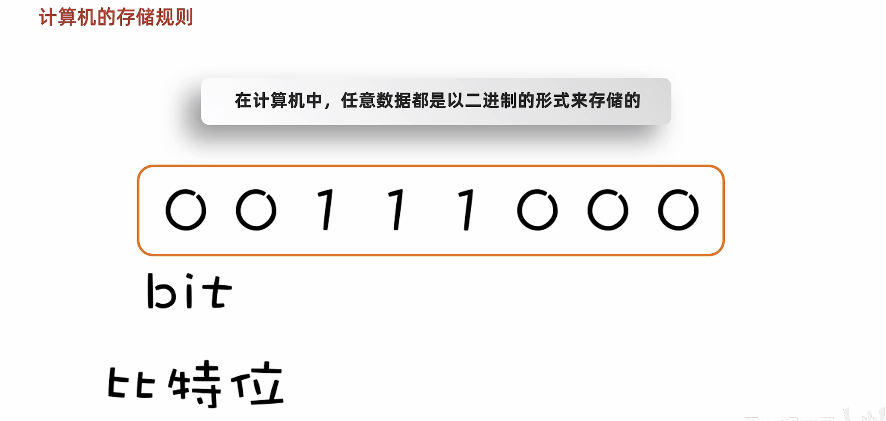
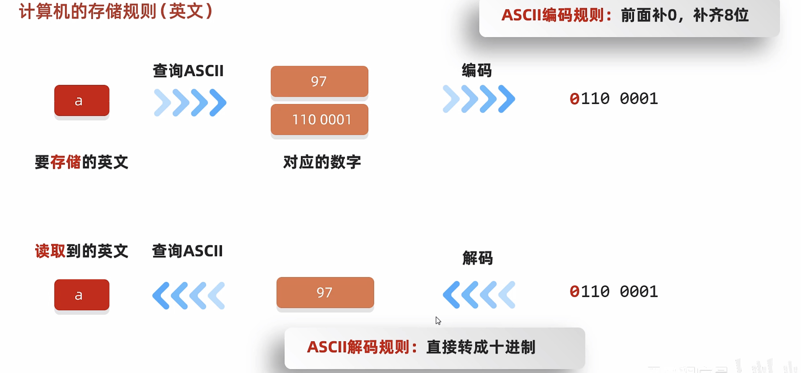
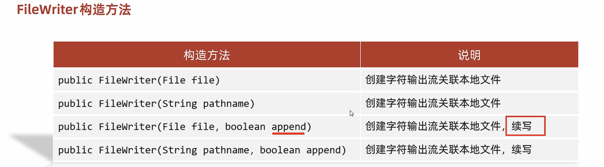
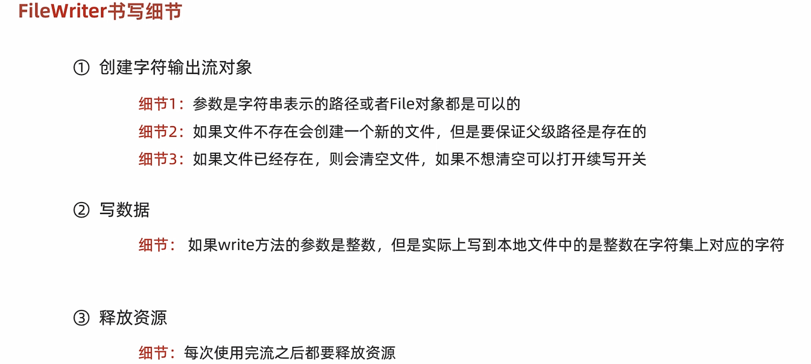
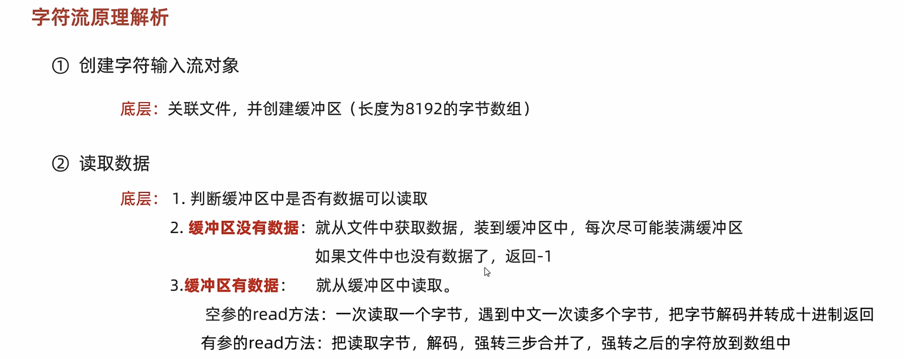
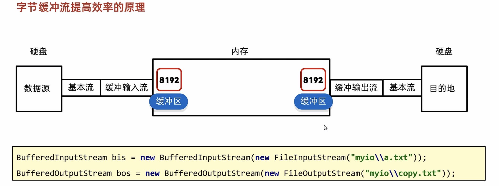

# 21-IO流

#### IO流概述


#### IO流的体系


#### FileOutputStream


```java
public class ByteStreamDemo1 {
    public static void main(String[] args) throws IOException {
        /*
        * 演示：字节输出流FileOutputStream
        * 实现需求：写出一段文字到本地文件中。（暂时不写中文）
        *
        * 实现步骤：
        *       创建对象
        *       写出数据
        *       释放资源
        * */

        //1.创建对象
        //写出 输出流 OutputStream
        //本地文件    File
        FileOutputStream fos = new FileOutputStream("myio\\a.txt");
        //2.写出数据
        fos.write(97);
        //3.释放资源
        fos.close();

    }
}
```

##### 原理

​​


##### 书写细节


```java
public class ByteStreamDemo2 {
    public static void main(String[] args) throws IOException {
    /*
          字节输出流的细节：
              1.创建字节输出流对象
                    细节1：参数是字符串表示的路径或者是File对象都是可以的
                    细节2：如果文件不存在会创建一个新的文件，但是要保证父级路径是存在的。
                    细节3：如果文件已经存在，则会清空文件
              2.写数据
                    细节：write方法的参数是整数，但是实际上写到本地文件中的是整数在ASCII上对应的字符
                    ‘9’
                    ‘7’
              3.释放资源
                    每次使用完流之后都要释放资源

    */
        //1.创建对象
        FileOutputStream fos = new FileOutputStream("myio\\a.txt");
        //2.写出数据
        fos.write(57);
        fos.write(55);
        //3.释放资源
        fos.close();

        while(true){}
    }
}
```

##### 写数据的3种方式


```java
public class ByteStreamDemo3 {
    public static void main(String[] args) throws IOException {
        /*
           void write(int b)                       一次写一个字节数据
           void write(byte[] b)                    一次写一个字节数组数据
           void write(byte[] b, int off, int len)  一次写一个字节数组的部分数据
           参数一：
                数组
           参数二：
                起始索引  0
           参数三：
                个数      3
        */

        //1.创建对象
        FileOutputStream fos = new FileOutputStream("myio\\a.txt");
        //2.写出数据
        //fos.write(97); // a
        //fos.write(98); // b
        byte[] bytes = {97, 98, 99, 100, 101};
        /* fos.write(bytes);*/

        fos.write(bytes,1,2);// b c
        //3.释放资源
        fos.close();

    }
}
```

##### 续写和换行写


```java
public class ByteStreamDemo4 {
    public static void main(String[] args) throws IOException {
        /*
            换行写：
                再次写出一个换行符就可以了
                windows： \r\n
                Linux:    \n
                Mac:      \r
            细节：
                在windows操作系统当中，java对回车换行进行了优化。
                虽然完整的是\r\n，但是我们写其中一个\r或者\n，
                java也可以实现换行，因为java在底层会补全。
            建议：
                不要省略，还是写全了。


            续写：
                如果想要续写，打开续写开关即可
                开关位置：创建对象的第二个参数
                默认false：表示关闭续写，此时创建对象会清空文件
                手动传递true：表示打开续写，此时创建对象不会清空文件

        */

        //1.创建对象
        FileOutputStream fos = new FileOutputStream("myio\\a.txt",true);
        //2.写出数据
        String str = "kankelaoyezuishuai";
        byte[] bytes1 = str.getBytes();
        fos.write(bytes1);

        //再次写出一个换行符就可以了
        String wrap = "\r\n";
        byte[] bytes2 = wrap.getBytes();
        fos.write(bytes2);

        String str2 = "666";
        byte[] bytes3 = str2.getBytes();
        fos.write(bytes3);

        //3.释放资源
        fos.close();

    }
}
```


#### FileInputStream


```java
public class ByteStreamDemo1 {
    public static void main(String[] args) throws IOException {
        /*
         * 演示：字节输入流FileInputStream
         * 实现需求：读取文件中的数据。（暂时不写中文）
         *
         * 实现步骤：
         *       创建对象
         *       读取数据
         *       释放资源
         * */


        //1.创建对象
        FileInputStream fis = new FileInputStream("myio\\a.txt");
        //2.读取数据
        int b1 = fis.read();
        System.out.println((char)b1);
        int b2 = fis.read();
        System.out.println((char)b2);
        int b3 = fis.read();
        System.out.println((char)b3);
        int b4 = fis.read();
        System.out.println((char)b4);
        int b5 = fis.read();
        System.out.println((char)b5);
        int b6 = fis.read();
        System.out.println(b6);//-1
        //3.释放资源
        fis.close();

    }
}
```

##### 书写细节


```java
public class ByteStreamDemo2 {
    public static void main(String[] args) throws IOException {
          /*
          字节输入流的细节：
              1.创建字节输入流对象
                    细节1：如果文件不存在，就直接报错。
                    Java为什么会这么设计呢？
                    输出流：不存在，创建
                        把数据写到文件当中

                    输入流：不存在，而是报错呢？
                        因为创建出来的文件是没有数据的，没有任何意义。
                        所以Java就没有设计这种无意义的逻辑，文件不存在直接报错。

                    程序中最重要的是：数据。

              2.写数据
                    细节1：一次读一个字节，读出来的是数据在ASCII上对应的数字
                    细节2：读到文件末尾了，read方法返回-1。

              3.释放资源
                    细节：每次使用完流之后都要释放资源

    */

        //1.创建对象
        FileInputStream fis = new FileInputStream("myio\\b.txt");
        //2.读取数据
        int b1 = fis.read();
        System.out.println((char)b1);
        //3.释放资源
        fis.close();

    }
}
```

##### 循环读取


```java
public class ByteStreamDemo3 {
    public static void main(String[] args) throws IOException {
         /*
             字节输入流循环读取
         */

       //1.创建对象
        FileInputStream fis = new FileInputStream("myio\\a.txt");
        //2.循环读取
        int b;
        while ((b = fis.read()) != -1) {
            System.out.println((char) b);
        }
        //3.释放资源
        fis.close();


       /* *//*
        *
        * read :表示读取数据，而且是读取一个数据就移动一次指针
        *
        * *//*
        FileInputStream fis = new FileInputStream("myio\\a.txt");
        //2.循环读取
        while ((fis.read()) != -1) {
            System.out.println(fis.read());//98  100  -1
        }
        //3.释放资源
        fis.close();*/


    }
}
```

#### 文件拷贝


```java
public class ByteStreamDemo4 {
    public static void main(String[] args) throws IOException {
        /*
        *   练习：
        *       文件拷贝
        *       把D:\itheima\movie.mp4拷贝到当前模块下。
        *
        *   注意：
        *       选择一个比较小的文件，不要太大。大文件拷贝我们下一个视频会说。
        *
        *
        *
        *   课堂练习：
        *       要求统计一下拷贝时间，单位毫秒
        * */

        long start = System.currentTimeMillis();

        //1.创建对象
        FileInputStream fis = new FileInputStream("D:\\itheima\\movie.mp4");
        FileOutputStream fos = new FileOutputStream("myio\\copy.mp4");
        //2.拷贝
        //核心思想：边读边写
        int b;
        while((b = fis.read()) != -1){
            fos.write(b);
        }
        //3.释放资源
        //规则：先开的最后关闭
        fos.close();
        fis.close();

        long end = System.currentTimeMillis();

        System.out.println(end - start);

    }
}
```

##### 弊端和解决方案


```java
public class ByteStreamDemo5 {
    public static void main(String[] args) throws IOException {
      /*
          public int read(byte[] buffer)      一次读一个字节数组数据
      */


        //1.创建对象
        FileInputStream fis = new FileInputStream("myio\\a.txt");
        //2.读取数据
        byte[] bytes = new byte[2];
        //一次读取多个字节数据，具体读多少，跟数组的长度有关
        //返回值：本次读取到了多少个字节数据
        int len1 = fis.read(bytes);
        System.out.println(len1);//2
        String str1 = new String(bytes,0,len1);
        System.out.println(str1);

        int len2 = fis.read(bytes);
        System.out.println(len2);//2
        String str2 = new String(bytes,0,len2);
        System.out.println(str2);

        int len3 = fis.read(bytes);
        System.out.println(len3);// 1
        String str3 = new String(bytes,0,len3);
        System.out.println(str3);// ed

        //3.释放资源
        fis.close();
    }
}
```

##### 改写

```java
public class ByteStreamDemo6 {
    public static void main(String[] args) throws IOException {
        /*
         *   练习：
         *       文件拷贝
         *       把D:\itheima\movie.mp4 (16.8 MB) 拷贝到当前模块下。
         *
         * */

        long start = System.currentTimeMillis();

        //1.创建对象
        FileInputStream fis = new FileInputStream("D:\\itheima\\movie.mp4");
        FileOutputStream fos = new FileOutputStream("myio\\copy.mp4");
        //2.拷贝
        int len;
        byte[] bytes = new byte[1024 * 1024 * 5];
        while((len = fis.read(bytes)) != -1){
            fos.write(bytes,0,len);
        }
        //3.释放资源
        fos.close();
        fis.close();

        long end = System.currentTimeMillis();

        System.out.println(end - start);

    }
}
```

#### IO流中不同JDK版本捕获异常的方式


```java
public class ByteStreamDemo7 {
    public static void main(String[] args) {
       /*
       *
       *    利用try...catch...finally捕获拷贝文件中代码出现的异常
       *
       *
       * */

        //1.创建对象
        FileInputStream fis = null;
        FileOutputStream fos = null;
        try {
            fis = new FileInputStream("D:\\itheima\\movie.mp4");
            fos = new FileOutputStream("myio\\copy.mp4");
            //2.拷贝
            int len;
            byte[] bytes = new byte[1024 * 1024 * 5];
            while((len = fis.read(bytes)) != -1){
                fos.write(bytes,0,len);
            }
        } catch (IOException e) {
            //e.printStackTrace();
        } finally {
            //3.释放资源
            if(fos != null){
                try {
                    fos.close();
                } catch (IOException e) {
                    e.printStackTrace();
                }
            }
            if(fis != null){
                try {
                    fis.close();
                } catch (IOException e) {
                    e.printStackTrace();
                }
            }

        }
    }
}
```


```java
public class ByteStreamDemo8 {
    public static void main(String[] args) {
        /*
         *
         *    JDK7:IO流中捕获异常的写法
         *
         *      try后面的小括号中写创建对象的代码，
         *          注意：只有实现了AutoCloseable接口的类，才能在小括号中创建对象。
         *     try(){
         *
         *     }catch(){
         *
         *     }
         *
         * */

        try (FileInputStream fis = new FileInputStream("D:\\itheima\\movie.mp4");
             FileOutputStream fos = new FileOutputStream("myio\\copy.mp4")) {
            //2.拷贝
            int len;
            byte[] bytes = new byte[1024 * 1024 * 5];
            while ((len = fis.read(bytes)) != -1) {
                fos.write(bytes, 0, len);
            }
        } catch (IOException e) {
            e.printStackTrace();
        }

    }
}
```

```java
public class ByteStreamDemo9 {
    public static void main(String[] args) throws FileNotFoundException {
        /*
         *
         *    JDK9:IO流中捕获异常的写法
         *
         *
         * */

        FileInputStream fis = new FileInputStream("D:\\itheima\\movie.mp4");
        FileOutputStream fos = new FileOutputStream("myio\\copy.mp4");

        try (fis;fos) {
            //2.拷贝
            int len;
            byte[] bytes = new byte[1024 * 1024 * 5];
            while ((len = fis.read(bytes)) != -1) {
                fos.write(bytes, 0, len);
            }
        } catch (IOException e) {
            e.printStackTrace();
        }

    }
}

```

#### 字符集

##### ASCII和GBK







##### Unicode


##### 乱码原因


##### Java中的编码和解码


```java
public class CharSetDemo3 {
    public static void main(String[] args) throws UnsupportedEncodingException {
       /*
       Java中编码的方法
            public byte[] getBytes()                        使用默认方式进行编码
            public byte[] getBytes(String charsetName)      使用指定方式进行编码

        Java中解码的方法
            String(byte[] bytes)                            使用默认方式进行解码
            String(byte[] bytes, String charsetName)        使用指定方式进行解码
        */

       //1.编码
        String str = "ai你哟";
        byte[] bytes1 = str.getBytes();
        System.out.println(Arrays.toString(bytes1));

        byte[] bytes2 = str.getBytes("GBK");
        System.out.println(Arrays.toString(bytes2));


        //2.解码
        String str2 = new String(bytes1);
        System.out.println(str2);

        String str3 = new String(bytes1,"GBK");
        System.out.println(str3);

    }
}
```

#### FileReader

##### 空参read方法


```java
public class CharStreamDemo1 {
    public static void main(String[] args) throws IOException {
        /*
            第一步：创建对象
            public FileReader(File file)        创建字符输入流关联本地文件
            public FileReader(String pathname)  创建字符输入流关联本地文件

            第二步：读取数据
            public int read()                   读取数据，读到末尾返回-1
            public int read(char[] buffer)      读取多个数据，读到末尾返回-1

            第三步：释放资源
            public void close()                 释放资源/关流
        */

        //1.创建对象并关联本地文件
        FileReader fr = new FileReader("myio\\a.txt");
        //2.读取数据 read()
        //字符流的底层也是字节流，默认也是一个字节一个字节的读取的。
        //如果遇到中文就会一次读取多个，GBK一次读两个字节，UTF-8一次读三个字节

        //read（）细节：
        //1.read():默认也是一个字节一个字节的读取的,如果遇到中文就会一次读取多个
        //2.在读取之后，方法的底层还会进行解码并转成十进制。
        //  最终把这个十进制作为返回值
        //  这个十进制的数据也表示在字符集上的数字
        //  英文：文件里面二进制数据 0110 0001
        //          read方法进行读取，解码并转成十进制97
        //  中文：文件里面的二进制数据 11100110 10110001 10001001
        //          read方法进行读取，解码并转成十进制27721

        // 我想看到中文汉字，就是把这些十进制数据，再进行强转就可以了

        int ch;
        while((ch = fr.read()) != -1){
            System.out.print((char)ch);
        }

        //3.释放资源
        fr.close();
    }
}
```

##### 有参read方法

```java
public class CharStreamDemo2 {
    public static void main(String[] args) throws IOException {
        /*
            第一步：创建对象
            public FileReader(File file)        创建字符输入流关联本地文件
            public FileReader(String pathname)  创建字符输入流关联本地文件

            第二步：读取数据
            public int read()                   读取数据，读到末尾返回-1
            public int read(char[] buffer)      读取多个数据，读到末尾返回-1

            第三步：释放资源
            public void close()                 释放资源/关流
        */


        //1.创建对象
        FileReader fr = new FileReader("myio\\a.txt");
        //2.读取数据
        char[] chars = new char[2];
        int len;
        //read(chars)：读取数据，解码，强转三步合并了，把强转之后的字符放到数组当中
        //空参的read + 强转类型转换
        while((len = fr.read(chars)) != -1){
            //把数组中的数据变成字符串再进行打印
            System.out.print(new String(chars,0,len));
        }
        //3.释放资源
        fr.close();

    }
}
```

#### FileWriter






```java
public class CharStreamDemo3 {
    public static void main(String[] args) throws IOException {
          /*
            第一步：创建对象
                public FileWriter(File file)                            创建字符输出流关联本地文件
                public FileWriter(String pathname)                      创建字符输出流关联本地文件
                public FileWriter(File file,  boolean append)           创建字符输出流关联本地文件，续写
                public FileWriter(String pathname,  boolean append)     创建字符输出流关联本地文件，续写

            第二步：读取数据
                void write(int c)                           写出一个字符
                void write(String str)                      写出一个字符串
                void write(String str, int off, int len)    写出一个字符串的一部分
                void write(char[] cbuf)                     写出一个字符数组
                void write(char[] cbuf, int off, int len)   写出字符数组的一部分

            第三步：释放资源
                public void close()                 释放资源/关流


                '我'    25105
        */

        FileWriter fw = new FileWriter("myio\\a.txt",true);

        //fw.write(25105);
        //fw.write("你好威啊???");
        char[] chars = {'a','b','c','我'};
        fw.write(chars);

        fw.close();
    }
}
```

#### 字符流原理

##### 字符输入流的底层原理

​​



##### 字符输出流的底层原理


#### 缓冲流

##### 字节缓冲流


```java
public class BufferedStreamDemo1 {
    public static void main(String[] args) throws IOException {
        /*
         *   需求：
         *       利用字节缓冲流拷贝文件
         *
         *   字节缓冲输入流的构造方法：
         *           public BufferedInputStream(InputStream is)
         *
         *    字节缓冲输出流的构造方法：
         *           public BufferedOutputStream(OutputStream os)
         *
         * */


        //1.创建缓冲流的对象
        BufferedInputStream bis = new BufferedInputStream(new FileInputStream("myio\\a.txt"));
        BufferedOutputStream bos = new BufferedOutputStream(new FileOutputStream("myio\\a.txt"));
        //2.循环读取并写到目的地
        int b;
        while ((b = bis.read()) != -1) {
            bos.write(b);
        }
        //3.释放资源
        bos.close();
        bis.close();
    }
}
```

```java
public class BufferedStreamDemo2 {
    public static void main(String[] args) throws IOException {
        /*
         *   需求：
         *       利用字节缓冲流拷贝文件
         *
         *   字节缓冲输入流的构造方法：
         *           public BufferedInputStream(InputStream is)
         *
         *    字节缓冲输出流的构造方法：
         *           public BufferedOutputStream(OutputStream os)
         *
         * */


        //1.创建缓冲流的对象
        BufferedInputStream bis = new BufferedInputStream(new FileInputStream("myio\\a.txt"));
        BufferedOutputStream bos = new BufferedOutputStream(new FileOutputStream("myio\\copy2.txt"));
        //2.拷贝（一次读写多个字节）
        byte[] bytes = new byte[1024];
        int len;
        while((len = bis.read(bytes)) != -1){
            bos.write(bytes,0,len);
        }
        //3.释放资源
        bos.close();
        bis.close();
    }
}
```

##### 提高效率的原理




##### 字符缓冲流


```java
public class BufferedStreamDemo3 {
    public static void main(String[] args) throws IOException {
        /*
         *   字符缓冲输入流：
         *      构造方法：
         *           public BufferedReader(Reader r)
         *      特有方法：
         *           public String readLine()   读一整行
         *
         * */

        //1.创建字符缓冲输入流的对象
        BufferedReader br = new BufferedReader(new FileReader("myio\\a.txt"));
        //2.读取数据
        //细节：
        //readLine方法在读取的时候，一次读一整行，遇到回车换行结束
        //        但是他不会把回车换行读到内存当中
     /*   String line1 = br.readLine();
        System.out.println(line1);

        String line2 = br.readLine();
        System.out.println(line2);*/

        String line;
        while ((( line = br.readLine()) != null)){
            System.out.println(line);
        }


        //3.释放资源
        br.close();
    }
}
```

```java
public class BufferedStreamDemo4 {
    public static void main(String[] args) throws IOException {
        /*
         *
         *    字符缓冲输出流
         *      构造方法：
         *           public BufferedWriter(Writer r)
         *      特有方法：
         *           public void newLine()      跨平台的换行
         *
         * */


        //1.创建字符缓冲输出流的对象
        BufferedWriter bw = new BufferedWriter(new FileWriter("b.txt",true));
        //2.写出数据
        bw.write("123");
        bw.newLine();
        bw.write("456");
        bw.newLine();
        //3.释放资源
        bw.close();

    }
}
```

#### 转换流


​​

```java
public class ConvertStreamDemo1 {
    public static void main(String[] args) throws IOException {
        /*
            利用转换流按照指定字符编码读取(了解)

            因为JDK11：这种方式被淘汰了。替代方案(掌握)
            F:\JavaSE最新版\day29-IO（其他流）\资料\gbkfile.txt
        */

       /* //1.创建对象并指定字符编码
        InputStreamReader isr = new InputStreamReader(new FileInputStream("myio\\gbkfile.txt"),"GBK");
        //2.读取数据
        int ch;
        while ((ch = isr.read()) != -1){
            System.out.print((char)ch);
        }
        //3.释放资源
        isr.close();*/


        FileReader fr = new FileReader("myio\\gbkfile.txt", Charset.forName("GBK"));
        //2.读取数据
        int ch;
        while ((ch = fr.read()) != -1){
            System.out.print((char)ch);
        }
        //3.释放资源
        fr.close();

    }
}
```

```java
public class ConvertStreamDemo2 {
    public static void main(String[] args) throws IOException {
        /*
            利用转换流按照指定字符编码写出
        */

/*
        //1.创建转换流的对象
        OutputStreamWriter osw = new OutputStreamWriter(new FileOutputStream("myio\\b.txt"),"GBK");
        //2.写出数据
        osw.write("你好你好");
        //3.释放资源
        osw.close();*/

        FileWriter fw = new FileWriter("myio\\c.txt", Charset.forName("GBK"));
        fw.write("你好你好");
        fw.close();

    }
}
```

```java
public class ConvertStreamDemo3 {
    public static void main(String[] args) throws IOException {
        /*
            将本地文件中的GBK文件，转成UTF-8
        */

        //1.JDK11以前的方案
       /* InputStreamReader isr = new InputStreamReader(new FileInputStream("myio\\b.txt"),"GBK");
        OutputStreamWriter osw = new OutputStreamWriter(new FileOutputStream("myio\\d.txt"),"UTF-8");

        int b;
        while((b = isr.read()) != -1){
            osw.write(b);
        }

        osw.close();
        isr.close();*/

        //2.替代方案
        FileReader fr = new FileReader("myio\\b.txt", Charset.forName("GBK"));
        FileWriter fw = new FileWriter("myio\\e.txt",Charset.forName("UTF-8"));
        int b;
        while ((b = fr.read()) != -1){
            fw.write(b);
        }
        fw.close();
        fr.close();

    }
}
```

‍

​​

```java
public class ConvertStreamDemo4 {
    public static void main(String[] args) throws IOException {
        /*
            利用字节流读取文件中的数据，每次读一整行，而且不能出现乱码

            //1.字节流在读取中文的时候，是会出现乱码的，但是字符流可以搞定
            //2.字节流里面是没有读一整行的方法的，只有字符缓冲流才能搞定
        */

       /* FileInputStream fis = new FileInputStream("myio\\a.txt");
        InputStreamReader isr = new InputStreamReader(fis);
        BufferedReader br = new BufferedReader(isr);
        String str = br.readLine();
        System.out.println(str);
        br.close();*/


        BufferedReader br = new BufferedReader(new InputStreamReader(new FileInputStream("myio\\a.txt")));
        String line;
        while ((line = br.readLine()) != null){
            System.out.println(line);
        }
        br.close();

    }
}
```


#### 序列化流


```java
/*
*
* Serializable接口里面是没有抽象方法，标记型接口
* 一旦实现了这个接口，那么就表示当前的Student类可以被序列化
* 理解：
*       一个物品的合格证
* */
public class Student implements Serializable {
    private String name;
    private int age;


    public Student() {
    }

    public Student(String name, int age) {
        this.name = name;
        this.age = age;
    }

    /**
     * 获取
     * @return name
     */
    public String getName() {
        return name;
    }

    /**
     * 设置
     * @param name
     */
    public void setName(String name) {
        this.name = name;
    }

    /**
     * 获取
     * @return age
     */
    public int getAge() {
        return age;
    }

    /**
     * 设置
     * @param age
     */
    public void setAge(int age) {
        this.age = age;
    }

    public String toString() {
        return "Student{name = " + name + ", age = " + age + "}";
    }
}
```

```java
public class ObjectStreamDemo1 {
    public static void main(String[] args) throws IOException {
        /*
           需求：
                利用序列化流/对象操作输出流，把一个对象写到本地文件中

           构造方法：
                public ObjectOutputStream(OutputStream out)         把基本流变成高级流

           成员方法：
                public final void writeObject(Object obj)           把对象序列化（写出）到文件中去

        */

        //1.创建对象
        Student stu = new Student("zhangsan",23);

        //2.创建序列化流的对象/对象操作输出流
        ObjectOutputStream oos = new ObjectOutputStream(new FileOutputStream("myio\\a.txt"));

        //3.写出数据
        oos.writeObject(stu);

        //4.释放资源
        oos.close();

    }
}
```

#### 反序列化流


```java
public class ObjectStreamDemo2 {
    public static void main(String[] args) throws IOException, ClassNotFoundException {
        /*
           需求：
                利用反序列化流/对象操作输入流，把文件中中的对象读到程序当中
           构造方法：
                public ObjectInputStream(InputStream out)         把基本流变成高级流
           成员方法：
                public Object readObject()                        把序列化到本地文件中的对象，读取到程序中来
        */


        //1.创建反序列化流的对象
        ObjectInputStream ois = new ObjectInputStream(new FileInputStream("myio\\a.txt"));

        //2.读取数据
        Student o = (Student) ois.readObject();

        //3.打印对象
        System.out.println(o);

        //4.释放资源
        ois.close();

    }
}
```

#### 序列化和反序列化流的使用细节


​​


#### 打印流

##### 字节打印流


```java
public class PrintStreamDemo1 {
    public static void main(String[] args) throws FileNotFoundException {
    /*
        字节打印流：
            构造方法
                public PrintStream(OutputStream/File/String)            关联字节输出流/文件/文件路径
                public PrintStream(String fileName, Charset charset)    指定字符编码
                public PrintStream(OutputStreamout, boolean autoFlush)  自动刷新
                public PrintStream(OutputStream out, boolean autoFlush, String encoding)    指定字符编码且自动刷新
            成员方法：
                public void write(int b)            常规方法：规则跟之前一样，将指定的字节写出
                public void println(Xxx xx)         特有方法：打印任意数据，自动刷新，自动换行
                public void print(Xxx xx)           特有方法：打印任意数据，不换行
                public void printf(String format, Object... args)   特有方法：带有占位符的打印语句，不换行
    */

        //1.创建字节打印流的对象
        PrintStream ps = new PrintStream(new FileOutputStream("myio\\a.txt"), true, Charset.forName("UTF-8"));
        //2.写出数据
        ps.println(97);//写出 + 自动刷新 + 自动换行
        ps.print(true);
        ps.println();
        ps.printf("%s爱上了%s","阿珍","阿强");
        //3.释放资源
        ps.close();


    }
}
```

```java
public class PrintStreamDemo2 {
    public static void main(String[] args) throws FileNotFoundException {
        PrintStream ps = new PrintStream("a.txt");

        //% n表示换行
        ps.printf("我叫%s %n", "阿玮");
        ps.printf("%s喜欢%s %n", "阿珍", "阿强");
        ps.printf("字母H的大写：%c %n", 'H');
        ps.printf("8>3的结果是：%b %n", 8 > 3);
        ps.printf("100的一半是：%d %n", 100 / 2);
        ps.printf("100的16进制数是：%x %n", 100);
        ps.printf("100的8进制数是：%o %n", 100);
        ps.printf("50元的书打8.5折扣是：%f元%n", 50 * 0.85);
        ps.printf("计算的结果转16进制：%a %n", 50 * 0.85);
        ps.printf("计算的结果转科学计数法表示：%e %n", 50 * 0.85);
        ps.printf("计算的结果转成指数和浮点数，结果的长度较短的是：%g %n", 50 * 0.85);
        ps.printf("带有百分号的符号表示法，以百分之85为例：%d%% %n", 85);
        ps.println("---------------------");

        double num1 = 1.0;
        ps.printf("num: %.4g %n", num1);
        ps.printf("num: %.5g %n", num1);
        ps.printf("num: %.6g %n", num1);

        float num2 = 1.0F;
        ps.printf("num: %.4f %n", num2);
        ps.printf("num: %.5f %n", num2);
        ps.printf("num: %.6f %n", num2);
        ps.println("---------------------");

        ps.printf("数字前面带有0的表示方式：%03d %n", 7);
        ps.printf("数字前面带有0的表示方式：%04d %n", 7);
        ps.printf("数字前面带有空格的表示方式：% 8d %n", 7);
        ps.printf("整数分组的效果是：%,d %n", 9989997);
        ps.println("---------------------");

        //最终结果是10位，小数点后面是5位，不够在前面补空格，补满10位
        //如果实际数字小数点后面过长，但是只规定两位，会四舍五入
        //如果整数部分过长，超出规定的总长度，会以实际为准
        ps.printf("一本书的价格是：%2.5f元%n", 49.8);
        ps.printf("%(f%n", -76.04);

        //%f，默认小数点后面7位，
        //<，表示采取跟前面一样的内容
        ps.printf("%f和%3.2f %n", 86.04, 1.789651);
        ps.printf("%f和%<3.2f %n", 86.04, 1.789651);
        ps.println("---------------------");

        Date date = new Date();
        // %t 表示时间，但是不能单独出现，要指定时间的格式
        // %tc 周二 12月 06 22:08:40 CST 2022
        // %tD 斜线隔开
        // %tF 冒号隔开（12小时制）
        // %tr 冒号隔开（24小时制）
        // %tT 冒号隔开（24小时制，带时分秒）
        ps.printf("全部日期和时间信息：%tc %n", date);
        ps.printf("月/日/年格式：%tD %n", date);
        ps.printf("年-月-日格式：%tF %n", date);
        ps.printf("HH:MM:SS PM格式(12时制)：%tr %n", date);
        ps.printf("HH:MM格式(24时制)：%tR %n", date);
        ps.printf("HH:MM:SS格式(24时制)：%tT %n", date);

        System.out.println("---------------------");
        ps.printf("星期的简称：%ta %n", date);
        ps.printf("星期的全称：%tA %n", date);
        ps.printf("英文月份简称：%tb %n", date);
        ps.printf("英文月份全称：%tB %n", date);
        ps.printf("年的前两位数字(不足两位前面补0)：%tC %n", date);
        ps.printf("年的后两位数字(不足两位前面补0)：%ty %n", date);
        ps.printf("一年中的第几天：%tj %n", date);
        ps.printf("两位数字的月份(不足两位前面补0)：%tm %n", date);
        ps.printf("两位数字的日(不足两位前面补0)：%td %n", date);
        ps.printf("月份的日(前面不补0)：%te  %n", date);

        System.out.println("---------------------");
        ps.printf("两位数字24时制的小时(不足2位前面补0):%tH %n", date);
        ps.printf("两位数字12时制的小时(不足2位前面补0):%tI %n", date);
        ps.printf("两位数字24时制的小时(前面不补0):%tk %n", date);
        ps.printf("两位数字12时制的小时(前面不补0):%tl %n", date);
        ps.printf("两位数字的分钟(不足2位前面补0):%tM %n", date);
        ps.printf("两位数字的秒(不足2位前面补0):%tS %n", date);
        ps.printf("三位数字的毫秒(不足3位前面补0):%tL %n", date);
        ps.printf("九位数字的毫秒数(不足9位前面补0):%tN %n", date);
        ps.printf("小写字母的上午或下午标记(英)：%tp %n", date);
        ps.printf("小写字母的上午或下午标记(中)：%tp %n", date);
        ps.printf("相对于GMT的偏移量:%tz %n", date);
        ps.printf("时区缩写字符串:%tZ%n", date);
        ps.printf("1970-1-1 00:00:00 到现在所经过的秒数：%ts %n", date);
        ps.printf("1970-1-1 00:00:00 到现在所经过的毫秒数：%tQ %n", date);

        ps.close();
    }
}

```

##### 字符打印流


```java
public class PrintStreamDemo3 {
    public static void main(String[] args) throws IOException {
/*
        字符打印流：
            构造方法
                public PrintWriter(Write/File/String)            关联字节输出流/文件/文件路径
                public PrintWriter(String fileName, Charset charset)    指定字符编码
                public PrintWriter(Write, boolean autoFlush)  自动刷新
                public PrintWriter(Write out, boolean autoFlush, String encoding)    指定字符编码且自动刷新
            成员方法：
                public void write(int b)            常规方法：规则跟之前一样，将指定的字节写出
                public void println(Xxx xx)         特有方法：打印任意数据，自动刷新，自动换行
                public void print(Xxx xx)           特有方法：打印任意数据，不换行
                public void printf(String format, Object... args)   特有方法：带有占位符的打印语句，不换行
    */

      //1.创建字符打印流的对象
        PrintWriter pw = new PrintWriter(new FileWriter("myio\\a.txt"),true);

        //2.写出数据
        pw.println("今天你终于叫我名字了，虽然叫错了，但是没关系，我马上改");
        pw.print("你好你好");
        pw.printf("%s爱上了%s","阿珍","阿强");
        //3.释放资源
        pw.close();

    }
}
```

```java
public class PrintStreamDemo4 {
    public static void main(String[] args) {
        /*
        *       打印流的应用场景
        * */

        //获取打印流的对象，此打印流在虚拟机启动的时候，由虚拟机创建，默认指向控制台
        //特殊的打印流，系统中的标准输出流,是不能关闭，在系统中是唯一的。
        PrintStream ps = System.out;

        //调用打印流中的方法println
        //写出数据，自动换行，自动刷新
        ps.println("123");

        //ps.close();

        ps.println("你好你好");

        System.out.println("456");

    }
}

```


‍
