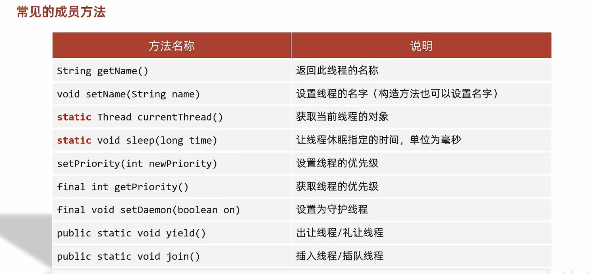
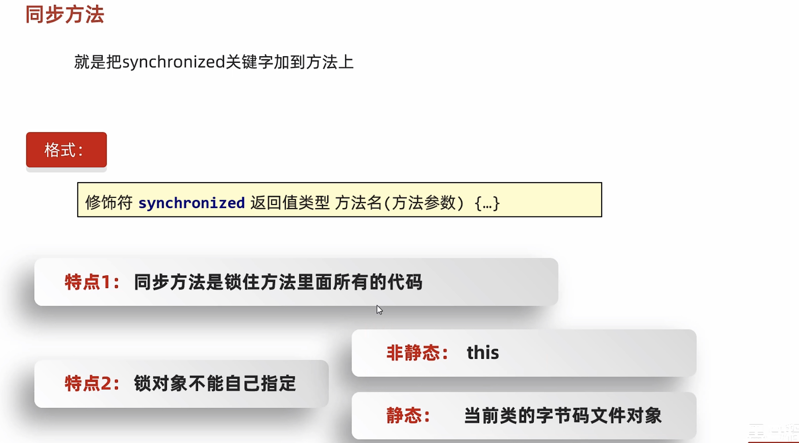
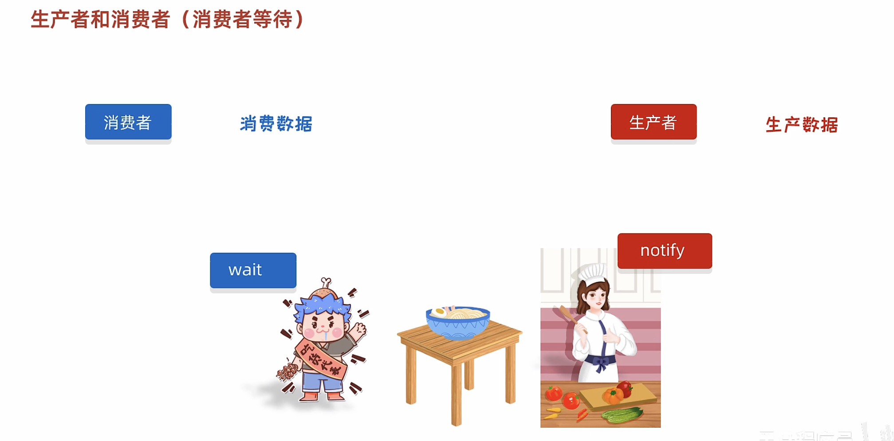
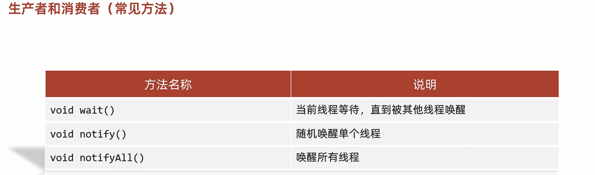
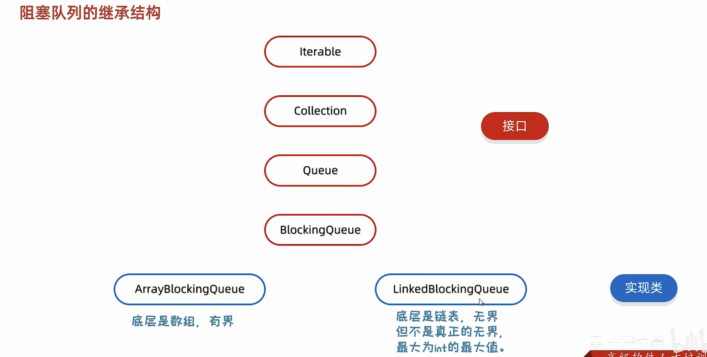

# 22-多线程

#### 线程概述


#### 并发和并行


#### 多线程的实现方式


##### 继承Thread类

```java
public class MyThread extends Thread{

    @Override
    public void run() {
        //书写线程要执行代码
        for (int i = 0; i < 100; i++) {
            System.out.println(getName() + "HelloWorld");
        }
    }
}
```

```java
public class ThreadDemo {
    public static void main(String[] args) {
        /*
        * 多线程的第一种启动方式：
        *   1. 自己定义一个类继承Thread
        *   2. 重写run方法
        *   3. 创建子类的对象，并启动线程
        * */

        MyThread t1 = new MyThread();
        MyThread t2 = new MyThread();

        t1.setName("线程1");
        t2.setName("线程2");

        t1.start();
        t2.start();
    }
}
```

##### 实现Runnable接口

```java
public class MyRun implements Runnable{

    @Override
    public void run() {
        //书写线程要执行的代码
        for (int i = 0; i < 100; i++) {
            //获取到当前线程的对象
            /*Thread t = Thread.currentThread();
            System.out.println(t.getName() + "HelloWorld!");*/
            System.out.println(Thread.currentThread().getName() + "HelloWorld!");
        }
    }
}
```

```java
public class ThreadDemo {
    public static void main(String[] args) {
        /*
         * 多线程的第二种启动方式：
         *   1.自己定义一个类实现Runnable接口
         *   2.重写里面的run方法
         *   3.创建自己的类的对象
         *   4.创建一个Thread类的对象，并开启线程
         * */

        //创建MyRun的对象
        //表示多线程要执行的任务
        MyRun mr = new MyRun();

        //创建线程对象
        Thread t1 = new Thread(mr);
        Thread t2 = new Thread(mr);

        //给线程设置名字
        t1.setName("线程1");
        t2.setName("线程2");

        //开启线程
        t1.start();
        t2.start();

    }
}
```

##### 实现Callable接口

```java
public class MyCallable implements Callable<Integer> {

    @Override
    public Integer call() throws Exception {
        //求1~100之间的和
        int sum = 0;
        for (int i = 1; i <= 100; i++) {
            sum = sum + i;
        }
        return sum;
    }
}
```

```java
public class ThreadDemo {
    public static void main(String[] args) throws ExecutionException, InterruptedException {

            /*
            *   多线程的第三种实现方式：
            *       特点：可以获取到多线程运行的结果
            *
            *       1. 创建一个类MyCallable实现Callable接口
            *       2. 重写call （是有返回值的，表示多线程运行的结果）
            *
            *       3. 创建MyCallable的对象（表示多线程要执行的任务）
            *       4. 创建FutureTask的对象（作用管理多线程运行的结果）
            *       5. 创建Thread类的对象，并启动（表示线程）
            * */

        //创建MyCallable的对象（表示多线程要执行的任务）
        MyCallable mc = new MyCallable();
        //创建FutureTask的对象（作用管理多线程运行的结果）
        FutureTask<Integer> ft = new FutureTask<>(mc);
        //创建线程的对象
        Thread t1 = new Thread(ft);
        //启动线程
        t1.start();

        //获取多线程运行的结果
        Integer result = ft.get();
        System.out.println(result);

    }
}
```

##### 三种实现方式对比


#### 常见成员方法

​​

##### 线程名称

```java
public class MyThread extends Thread{

    public MyThread() {
    }

    public MyThread(String name) {
        super(name);
    }

    @Override
    public void run() {
        for (int i = 0; i < 100; i++) {
            try {
                Thread.sleep(1000);
            } catch (InterruptedException e) {
                e.printStackTrace();
            }
            System.out.println(getName() + "@" + i);
        }
    }
}
```

```java
public class ThreadDemo {
    public static void main(String[] args) throws InterruptedException {
       /*
            String getName()                    返回此线程的名称
            void setName(String name)           设置线程的名字（构造方法也可以设置名字）
            细节：
                1、如果我们没有给线程设置名字，线程也是有默认的名字的
                        格式：Thread-X（X序号，从0开始的）
                2、如果我们要给线程设置名字，可以用set方法进行设置，也可以构造方法设置

            static Thread currentThread()       获取当前线程的对象
            细节：
                当JVM虚拟机启动之后，会自动的启动多条线程
                其中有一条线程就叫做main线程
                他的作用就是去调用main方法，并执行里面的代码
                在以前，我们写的所有的代码，其实都是运行在main线程当中

            static void sleep(long time)        让线程休眠指定的时间，单位为毫秒
            细节：
                1、哪条线程执行到这个方法，那么哪条线程就会在这里停留对应的时间
                2、方法的参数：就表示睡眠的时间，单位毫秒
                    1 秒= 1000毫秒
                3、当时间到了之后，线程会自动的醒来，继续执行下面的其他代码
       */

        //1.创建线程的对象
        MyThread t1 = new MyThread("飞机");
        MyThread t2 = new MyThread("坦克");

        //2.开启线程
        t1.start();
        t2.start();

        //哪条线程执行到这个方法，此时获取的就是哪条线程的对象
       /* Thread t = Thread.currentThread();
        String name = t.getName();
        System.out.println(name);//main*/

        /*System.out.println("11111111111");
        Thread.sleep(5000);
        System.out.println("22222222222");*/

    }
}
```

##### 线程优先级


```java
public class MyRunnable implements Runnable{

    @Override
    public void run() {
        for (int i = 1; i <= 100; i++) {
            System.out.println(Thread.currentThread().getName() + "---" + i);
        }
    }
}
```

```java
public class ThreadDemo {
    public static void main(String[] args){
       /*
            setPriority(int newPriority)        设置线程的优先级
            final int getPriority()             获取线程的优先级
       */

        //创建线程要执行的参数对象
        MyRunnable mr = new MyRunnable();
        //创建线程对象
        Thread t1 = new Thread(mr,"飞机");
        Thread t2 = new Thread(mr,"坦克");

        t1.setPriority(1);
        t2.setPriority(10);

        t1.start();
        t2.start();

    }
}
```

##### 守护线程

```java
public class MyThread1 extends Thread{

    @Override
    public void run() {
        for (int i = 1; i <= 10; i++) {
            System.out.println(getName() + "@" + i);
        }
    }
}
```

```java
public class MyThread2 extends Thread{

    @Override
    public void run() {
        for (int i = 1; i <= 100; i++) {
            System.out.println(getName() + "@" + i);
        }
    }
}
```

```java
public class ThreadDemo {
    public static void main(String[] args) {
       /*
            final void setDaemon(boolean on)    设置为守护线程
            细节：
                当其他的非守护线程执行完毕之后，守护线程会陆续结束
            通俗易懂：
                当女神线程结束了，那么备胎也没有存在的必要了
       */


        MyThread1 t1 = new MyThread1();
        MyThread2 t2 = new MyThread2();

        t1.setName("女神");
        t2.setName("备胎");

        //把第二个线程设置为守护线程（备胎线程）
        t2.setDaemon(true);

        t1.start();
        t2.start();

    }
}
```

##### 出让线程

```java
public class MyThread extends Thread{

    @Override
    public void run() {//"飞机"  "坦克"
        for (int i = 1; i <= 100; i++) {

            System.out.println(getName() + "@" + i);
            //表示出让当前CPU的执行权
            Thread.yield();
        }
    }
}
```

```java
public class ThreadDemo {
    public static void main(String[] args) {
       /*
            public static void yield()      出让线程/礼让线程

       */

        MyThread t1 = new MyThread();
        MyThread t2 = new MyThread();

        t1.setName("飞机");
        t2.setName("坦克");

        t1.start();
        t2.start();

    }
}
```

##### 插入线程

```java
public class MyThread extends Thread{

    @Override
    public void run() {
        for (int i = 1; i <= 100; i++) {
            System.out.println(getName() + "@" + i);

        }
    }
}
```

```java
public class ThreadDemo {
    public static void main(String[] args) throws InterruptedException {
       /*
            public final void join()  插入线程/插队线程
       */

        MyThread t = new MyThread();
        t.setName("土豆");
        t.start();

        //表示把t这个线程，插入到当前线程之前。
        //t:土豆
        //当前线程: main线程
        t.join();

        //执行在main线程当中的
        for (int i = 0; i < 10; i++) {
            System.out.println("main线程" + i);
        }
    }
}
```

#### 线程的生命周期


#### 线程的安全问题


##### 同步代码块


```java
public class MyThread extends Thread {

    //表示这个类所有的对象，都共享ticket数据
    static int ticket = 0;//0 ~ 99

    @Override
    public void run() {
            while (true) {
                synchronized (MyThread.class) {
                //同步代码块
                if (ticket < 100) {
                    try {
                        Thread.sleep(10);
                    } catch (InterruptedException e) {
                        e.printStackTrace();
                    }
                    ticket++;
                    System.out.println(getName() + "正在卖第" + ticket + "张票！！！");
                } else {
                    break;
                }
            }
        }
    }

}
```

```java
public class ThreadDemo {
    public static void main(String[] args) {
       /*
           需求：
                某电影院目前正在上映国产大片，共有100张票，而它有3个窗口卖票，请设计一个程序模拟该电影院卖票
       */

        //创建线程对象
        MyThread t1 = new MyThread();
        MyThread t2 = new MyThread();
        MyThread t3 = new MyThread();

        //起名字
        t1.setName("窗口1");
        t2.setName("窗口2");
        t3.setName("窗口3");

        //开启线程
        t1.start();
        t2.start();
        t3.start();

    }
}
```

##### 同步方法



```java
public class ThreadDemo {
    public static void main(String[] args) {
       /*
           需求：
                某电影院目前正在上映国产大片，共有100张票，而它有3个窗口卖票，请设计一个程序模拟该电影院卖票
                利用同步方法完成
                技巧：同步代码块
       */

        MyRunnable mr = new MyRunnable();

        Thread t1 = new Thread(mr);
        Thread t2 = new Thread(mr);
        Thread t3 = new Thread(mr);

        t1.setName("窗口1");
        t2.setName("窗口2");
        t3.setName("窗口3");

        t1.start();
        t2.start();
        t3.start();

    }
}
```

```java
public class MyRunnable implements Runnable {

    int ticket = 0;

    @Override
    public void run() {
        //1.循环
        while (true) {
            //2.同步代码块（同步方法）
            if (method()) break;
        }
    }

    //this
    private synchronized boolean method() {
        //3.判断共享数据是否到了末尾，如果到了末尾
        if (ticket == 100) {
            return true;
        } else {
            //4.判断共享数据是否到了末尾，如果没有到末尾
            try {
                Thread.sleep(10);
            } catch (InterruptedException e) {
                e.printStackTrace();
            }
            ticket++;
            System.out.println(Thread.currentThread().getName() + "在卖第" + ticket + "张票！！！");
        }
        return false;
    }
}
```

#### 锁

##### lock锁


```java
public class ThreadDemo {
    public static void main(String[] args) {
       /*
           需求：
                某电影院目前正在上映国产大片，共有100张票，而它有3个窗口卖票，请设计一个程序模拟该电影院卖票
                用JDK5的lock实现
       */


        MyThread t1 = new MyThread();
        MyThread t2 = new MyThread();
        MyThread t3 = new MyThread();

        t1.setName("窗口1");
        t2.setName("窗口2");
        t3.setName("窗口3");

        t1.start();
        t2.start();
        t3.start();

    }
}
```

```java
public class MyThread extends Thread{

    static int ticket = 0;

    static Lock lock = new ReentrantLock();

    @Override
    public void run() {
        //1.循环
        while(true){
            //2.同步代码块
            //synchronized (MyThread.class){
            lock.lock(); //2 //3
            try {
                //3.判断
                if(ticket == 100){
                    break;
                    //4.判断
                }else{
                    Thread.sleep(10);
                    ticket++;
                    System.out.println(getName() + "在卖第" + ticket + "张票！！！");
                }
                //  }
            } catch (InterruptedException e) {
                e.printStackTrace();
            } finally {
                lock.unlock();
            }
        }
    }
}
```

##### 死锁


```java
public class MyThread extends Thread {

    static Object objA = new Object();
    static Object objB = new Object();

    @Override
    public void run() {
        //1.循环
        while (true) {
            if ("线程A".equals(getName())) {
                synchronized (objA) {
                    System.out.println("线程A拿到了A锁，准备拿B锁");//A
                    synchronized (objB) {
                        System.out.println("线程A拿到了B锁，顺利执行完一轮");
                    }
                }
            } else if ("线程B".equals(getName())) {
                if ("线程B".equals(getName())) {
                    synchronized (objB) {
                        System.out.println("线程B拿到了B锁，准备拿A锁");//B
                        synchronized (objA) {
                            System.out.println("线程B拿到了A锁，顺利执行完一轮");
                        }
                    }
                }
            }
        }
    }
}
```

```java
public class ThreadDemo {
    public static void main(String[] args) {
       /*
           需求：
                死锁
       */


        MyThread t1 = new MyThread();
        MyThread t2 = new MyThread();

        t1.setName("线程A");
        t2.setName("线程B");

        t1.start();
        t2.start();

    }
}
```

#### 等待唤醒机制

##### 思路分析







##### 代码实现

```java
public class Desk {

    /*
    * 作用：控制生产者和消费者的执行
    *
    * */

    //是否有面条  0：没有面条  1：有面条
    public static int foodFlag = 0;

    //总个数
    public static int count = 10;

    //锁对象
    public static Object lock = new Object();


}
```

```java
public class Foodie extends Thread{

    @Override
    public void run() {
        /*
        * 1. 循环
        * 2. 同步代码块
        * 3. 判断共享数据是否到了末尾（到了末尾）
        * 4. 判断共享数据是否到了末尾（没有到末尾，执行核心逻辑）
        * */

        while(true){
            synchronized (Desk.lock){
                if(Desk.count == 0){
                    break;
                }else{
                    //先判断桌子上是否有面条
                    if(Desk.foodFlag == 0){
                        //如果没有，就等待
                        try {
                            Desk.lock.wait();//让当前线程跟锁进行绑定
                        } catch (InterruptedException e) {
                            e.printStackTrace();
                        }
                    }else{
                        //把吃的总数-1
                        Desk.count--;
                        //如果有，就开吃
                        System.out.println("吃货在吃面条，还能再吃" + Desk.count + "碗！！！");
                        //吃完之后，唤醒厨师继续做
                        Desk.lock.notifyAll();
                        //修改桌子的状态
                        Desk.foodFlag = 0;
                    }
                }
            }
        }
    }
}
```

```java
public class Cook extends Thread{

    @Override
    public void run() {
        /*
         * 1. 循环
         * 2. 同步代码块
         * 3. 判断共享数据是否到了末尾（到了末尾）
         * 4. 判断共享数据是否到了末尾（没有到末尾，执行核心逻辑）
         * */

        while (true){
            synchronized (Desk.lock){
                if(Desk.count == 0){
                    break;
                }else{
                    //判断桌子上是否有食物
                    if(Desk.foodFlag == 1){
                        //如果有，就等待
                        try {
                            Desk.lock.wait();
                        } catch (InterruptedException e) {
                            e.printStackTrace();
                        }
                    }else{
                        //如果没有，就制作食物
                        System.out.println("厨师做了一碗面条");
                        //修改桌子上的食物状态
                        Desk.foodFlag = 1;
                        //叫醒等待的消费者开吃
                        Desk.lock.notifyAll();
                    }
                }
            }
        }
    }
}
```

```java
public class ThreadDemo {
    public static void main(String[] args) {
       /*
       *
       *    需求：完成生产者和消费者（等待唤醒机制）的代码
       *         实现线程轮流交替执行的效果
       *
       * */


        //创建线程的对象
        Cook c = new Cook();
        Foodie f = new Foodie();

        //给线程设置名字
        c.setName("厨师");
        f.setName("吃货");

        //开启线程
        c.start();
        f.start();

    }
}
```

##### 阻塞队列方式




```java
public class Cook extends Thread{

    ArrayBlockingQueue<String> queue;

    public Cook(ArrayBlockingQueue<String> queue) {
        this.queue = queue;
    }

    @Override
    public void run() {
        while(true){
            //不断的把面条放到阻塞队列当中
            try {
                queue.put("面条");
                System.out.println("厨师放了一碗面条");
            } catch (InterruptedException e) {
                e.printStackTrace();
            }
        }
    }
}
```

```java
public class Foodie extends Thread{

    ArrayBlockingQueue<String> queue;

    public Foodie(ArrayBlockingQueue<String> queue) {
        this.queue = queue;
    }


    @Override
    public void run() {
        while(true){
                //不断从阻塞队列中获取面条
                try {
                    String food = queue.take();
                    System.out.println(food);
                } catch (InterruptedException e) {
                    e.printStackTrace();
                }
        }
    }
}
```

```java
public class ThreadDemo {
    public static void main(String[] args) {
       /*
       *
       *    需求：利用阻塞队列完成生产者和消费者（等待唤醒机制）的代码
       *    细节：
       *           生产者和消费者必须使用同一个阻塞队列
       *
       * */

        //1.创建阻塞队列的对象
        ArrayBlockingQueue<String> queue = new ArrayBlockingQueue<>(1);

        //2.创建线程的对象，并把阻塞队列传递过去
        Cook c = new Cook(queue);
        Foodie f = new Foodie(queue);

        //3.开启线程
        c.start();
        f.start();

    }
}
```

#### 线程的状态


#### 线程池


```java
public class MyRunnable implements Runnable{
    @Override
    public void run() {
        for (int i = 1; i <= 100; i++) {
            System.out.println(Thread.currentThread().getName() + "---" + i);
        }
    }
}
```

```java
public class MyThreadPoolDemo {
    public static void main(String[] args) throws InterruptedException {
    /*
        public static ExecutorService newCachedThreadPool()             创建一个没有上限的线程池
        public static ExecutorService newFixedThreadPool (int nThreads) 创建有上限的线程池
    */


        //1.获取线程池对象
        ExecutorService pool1 = Executors.newFixedThreadPool(3);
        //2.提交任务
        pool1.submit(new MyRunnable());
        pool1.submit(new MyRunnable());
        pool1.submit(new MyRunnable());
        pool1.submit(new MyRunnable());
        pool1.submit(new MyRunnable());
        pool1.submit(new MyRunnable());

        //3.销毁线程池
        //pool1.shutdown();

    }
}

```

#### 自定义线程池


```java
public class MyThreadPoolDemo1 {
    public static void main(String[] args){

    /*
        ThreadPoolExecutor threadPoolExecutor = new ThreadPoolExecutor
        (核心线程数量,最大线程数量,空闲线程最大存活时间,任务队列,创建线程工厂,任务的拒绝策略);

        参数一：核心线程数量              不能小于0
        参数二：最大线程数                不能小于0，最大数量 >= 核心线程数量
        参数三：空闲线程最大存活时间       不能小于0
        参数四：时间单位                  用TimeUnit指定
        参数五：任务队列                  不能为null
        参数六：创建线程工厂              不能为null
        参数七：任务的拒绝策略             不能为null
    */

        ThreadPoolExecutor pool = new ThreadPoolExecutor(
                3,  //核心线程数量，能小于0
                6,  //最大线程数，不能小于0，最大数量 >= 核心线程数量
                60,//空闲线程最大存活时间
                TimeUnit.SECONDS,//时间单位
                new ArrayBlockingQueue<>(3),//任务队列
                Executors.defaultThreadFactory(),//创建线程工厂
                new ThreadPoolExecutor.AbortPolicy()//任务的拒绝策略
        );

    }
}
```


#### 最大并行数


```java
public class MyThreadPoolDemo2 {
    public static void main(String[] args) {
        //向Java虚拟机返回可用处理器的数目
        int count = Runtime.getRuntime().availableProcessors();
        System.out.println(count);
    }
}
```


‍
