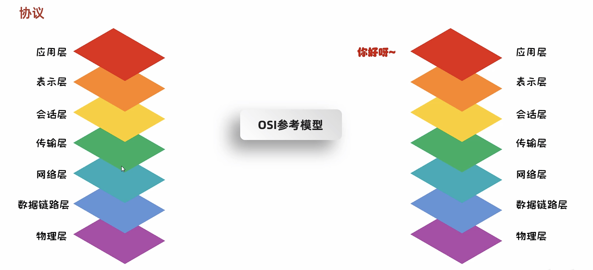

# 23-网络编程

### 网络编程入门


### 网络编程三要素


#### IP


#### InetAddress类

```java
public class MyInetAddressDemo1 {
    public static void main(String[] args) throws UnknownHostException {
/*
        static InetAddress getByName(String host)  确定主机名称的IP地址。主机名称可以是机器名称，也可以是IP地址
        String getHostName()                        获取此IP地址的主机名
        String getHostAddress()                     返回文本显示中的IP地址字符串
*/


      //1.获取InetAddress的对象
        //IP的对象 一台电脑的对象
        InetAddress address = InetAddress.getByName("DESKTOP-5OJJSAM");
        System.out.println(address);

        String name = address.getHostName();
        System.out.println(name);//DESKTOP-5OJJSAM

        String ip = address.getHostAddress();
        System.out.println(ip);//192.168.1.100


    }
}
```

#### 端口号


#### 协议





##### UDP


```java
public class SendMessageDemo {
    public static void main(String[] args) throws IOException {
        //发送数据

        //1.创建DatagramSocket对象(快递公司)
        //细节：
        //绑定端口，以后我们就是通过这个端口往外发送
        //空参：所有可用的端口中随机一个进行使用
        //有参：指定端口号进行绑定
        DatagramSocket ds = new DatagramSocket();

        //2.打包数据
        String str = "你好威啊！！！";
        byte[] bytes = str.getBytes();
        InetAddress address = InetAddress.getByName("127.0.0.1");
        int port = 10086;

        DatagramPacket dp = new DatagramPacket(bytes,bytes.length,address,port);

        //3.发送数据
        ds.send(dp);

        //4.释放资源
        ds.close();

    }
}
```


```java
public class ReceiveMessageDemo {
    public static void main(String[] args) throws IOException {
        //接收数据

        //1.创建DatagramSocket对象（快递公司）
        //细节：
        //在接收的时候，一定要绑定端口
        //而且绑定的端口一定要跟发送的端口保持一致
        DatagramSocket ds = new DatagramSocket(10086);

        //2.接收数据包
        byte[] bytes = new byte[1024];
        DatagramPacket dp = new DatagramPacket(bytes,bytes.length);

        //该方法是阻塞的
        //程序执行到这一步的时候，会在这里死等
        //等发送端发送消息
        System.out.println(11111);
        ds.receive(dp);
        System.out.println(2222);

        //3.解析数据包
        byte[] data = dp.getData();
        int len = dp.getLength();
        InetAddress address = dp.getAddress();
        int port = dp.getPort();

        System.out.println("接收到数据" + new String(data,0,len));
        System.out.println("该数据是从" + address + "这台电脑中的" + port + "这个端口发出的");

        //4.释放资源
        ds.close();

    }
}
```

###### 练习

​​

```java
public class SendMessageDemo {
    public static void main(String[] args) throws IOException {
         /*
            按照下面的要求实现程序
                UDP发送数据：数据来自于键盘录入，直到输入的数据是886，发送数据结束
                UDP接收数据：因为接收端不知道发送端什么时候停止发送，故采用死循环接收
        */


        //1.创建对象DatagramSocket的对象
        DatagramSocket ds = new DatagramSocket();

        //2.打包数据
        Scanner sc = new Scanner(System.in);
        while (true) {
            System.out.println("请输入您要说的话：");
            String str = sc.nextLine();
            if("886".equals(str)){
                break;
            }
            byte[] bytes = str.getBytes();
            InetAddress address = InetAddress.getByName("127.0.0.1");
            int port = 10086;
            DatagramPacket dp = new DatagramPacket(bytes,bytes.length,address,port);
            //3.发送数据
            ds.send(dp);
        }


        //4.释放资源
        ds.close();


    }
}
```

```java
public class ReceiveMessageDemo {
    public static void main(String[] args) throws IOException {
        /*
            按照下面的要求实现程序
                UDP发送数据：数据来自于键盘录入，直到输入的数据是886，发送数据结束
                UDP接收数据：因为接收端不知道发送端什么时候停止发送，故采用死循环接收
        */


        //1.创建对象DatagramSocket的对象
        DatagramSocket ds = new DatagramSocket(10086);

        //2.接收数据包
        byte[] bytes = new byte[1024];
        DatagramPacket dp = new DatagramPacket(bytes,bytes.length);

        while (true) {
            ds.receive(dp);

            //3.解析数据包
            byte[] data = dp.getData();
            int len = dp.getLength();
            String ip = dp.getAddress().getHostAddress();
            String name = dp.getAddress().getHostName();

            //4.打印数据
            System.out.println("ip为：" + ip + ",主机名为：" + name + "的人，发送了数据：" + new String(data,0,len));
        }


    }
}
```


###### 三种通信方式


组播

```java
public class SendMessageDemo {
    public static void main(String[] args) throws IOException {
         /*
            组播发送端代码
        */

        //创建MulticastSocket对象
        MulticastSocket ms = new MulticastSocket() ;

        // 创建DatagramPacket对象
        String s = "你好,你好!" ;
        byte[] bytes = s.getBytes();
        InetAddress address = InetAddress.getByName("224.0.0.1");
        int port = 10000;

        DatagramPacket datagramPacket = new DatagramPacket(bytes, bytes.length, address, port) ;

        // 调用MulticastSocket发送数据方法发送数据
        ms.send(datagramPacket);

        // 释放资源
        ms.close();


    }
}
```

```java
public class ReceiveMessageDemo1 {
    public static void main(String[] args) throws IOException {
        /*
            组播接收端代码
        */


        //1. 创建MulticastSocket对象
        MulticastSocket ms = new MulticastSocket(10000);

        //2. 将将当前本机，添加到224.0.0.1的这一组当中
        InetAddress address = InetAddress.getByName("224.0.0.1");
        ms.joinGroup(address);

        //3. 创建DatagramPacket数据包对象
        byte[] bytes = new byte[1024];
        DatagramPacket dp = new DatagramPacket(bytes, bytes.length);

        //4. 接收数据
        ms.receive(dp);

        //5. 解析数据
        byte[] data = dp.getData();
        int len = dp.getLength();
        String ip = dp.getAddress().getHostAddress();
        String name = dp.getAddress().getHostName();

        System.out.println("ip为：" + ip + ",主机名为：" + name + "的人，发送了数据：" + new String(data,0,len));

        //6. 释放资源
        ms.close();


    }
}
```

```java
public class ReceiveMessageDemo2 {
    public static void main(String[] args) throws IOException {
        /*
            组播接收端代码
        */

        //1. 创建MulticastSocket对象
        MulticastSocket ms = new MulticastSocket(10000);

        //2. 将将当前本机，添加到224.0.0.1的这一组当中
        InetAddress address = InetAddress.getByName("224.0.0.1");
        ms.joinGroup(address);

        //3. 创建DatagramPacket数据包对象
        byte[] bytes = new byte[1024];
        DatagramPacket dp = new DatagramPacket(bytes, bytes.length);

        //4. 接收数据
        ms.receive(dp);

        //5. 解析数据
        byte[] data = dp.getData();
        int len = dp.getLength();
        String ip = dp.getAddress().getHostAddress();
        String name = dp.getAddress().getHostName();

        System.out.println("ip为：" + ip + ",主机名为：" + name + "的人，发送了数据：" + new String(data,0,len));

        //6. 释放资源
        ms.close();

    }
}
```

```java
public class ReceiveMessageDemo3 {
    public static void main(String[] args) throws IOException {
        /*
            组播接收端代码
        */

        //1. 创建MulticastSocket对象
        MulticastSocket ms = new MulticastSocket(10000);

        //2. 将将当前本机，添加到224.0.0.2的这一组当中
        InetAddress address = InetAddress.getByName("224.0.0.2");
        ms.joinGroup(address);

        //3. 创建DatagramPacket数据包对象
        byte[] bytes = new byte[1024];
        DatagramPacket dp = new DatagramPacket(bytes, bytes.length);

        //4. 接收数据
        ms.receive(dp);

        //5. 解析数据
        byte[] data = dp.getData();
        int len = dp.getLength();
        String ip = dp.getAddress().getHostAddress();
        String name = dp.getAddress().getHostName();

        System.out.println("ip为：" + ip + ",主机名为：" + name + "的人，发送了数据：" + new String(data,0,len));

        //6. 释放资源
        ms.close();

    }
}
```

广播

```java
public class SendMessageDemo {
    public static void main(String[] args) throws IOException {
         /*
            按照下面的要求实现程序
                UDP发送数据：数据来自于键盘录入，直到输入的数据是886，发送数据结束
                UDP接收数据：因为接收端不知道发送端什么时候停止发送，故采用死循环接收
        */


        //1.创建对象DatagramSocket的对象
        DatagramSocket ds = new DatagramSocket();

        //2.打包数据
        Scanner sc = new Scanner(System.in);
        while (true) {
            System.out.println("请输入您要说的话：");
            String str = sc.nextLine();
            if("886".equals(str)){
                break;
            }
            byte[] bytes = str.getBytes();
            InetAddress address = InetAddress.getByName("255.255.255.255");
            int port = 10086;
            DatagramPacket dp = new DatagramPacket(bytes,bytes.length,address,port);
            //3.发送数据
            ds.send(dp);
        }


        //4.释放资源
        ds.close();


    }
}
```

##### TCP


```java
public class Client {
    public static void main(String[] args) throws IOException {
        //TCP协议，发送数据

        //1.创建Socket对象
        //细节：在创建对象的同时会连接服务端
        //      如果连接不上，代码会报错
        Socket socket = new Socket("127.0.0.1",10000);


        //2.可以从连接通道中获取输出流
        OutputStream os = socket.getOutputStream();
        //写出数据
        os.write("你好你好".getBytes());//12字节

        //3.释放资源
        os.close();
        socket.close();


    }
}
```

```java
public class Server {
    public static void main(String[] args) throws IOException {
        //TCP协议，接收数据

        //1.创建对象ServerSocker
        ServerSocket ss = new ServerSocket(10000);

        //2.监听客户端的链接
        Socket socket = ss.accept();

        //3.从连接通道中获取输入流读取数据
        InputStream is = socket.getInputStream();
        InputStreamReader isr = new InputStreamReader(is);
        BufferedReader br = new BufferedReader(isr);

       // BufferedReader br = new BufferedReader(new InputStreamReader(socket.getInputStream()));

        int b;
        while ((b = br.read()) != -1){
            System.out.print((char) b);
        }

        //4.释放资源
        socket.close();
        ss.close();

    }
}
```


###### 三次握手


###### 四次挥手


‍
