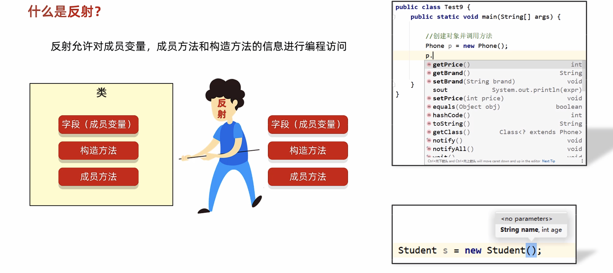
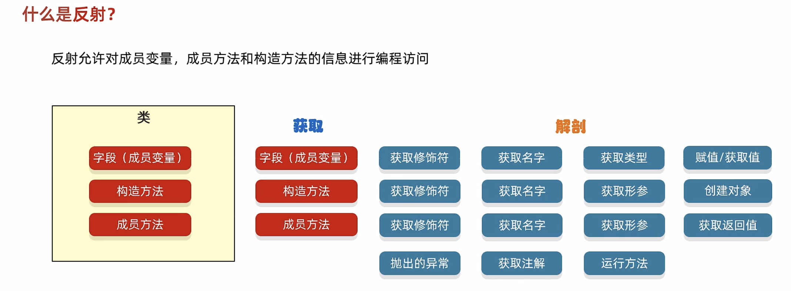
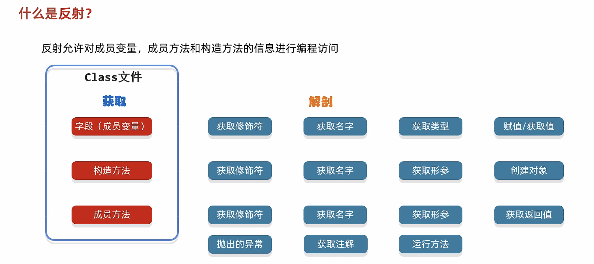
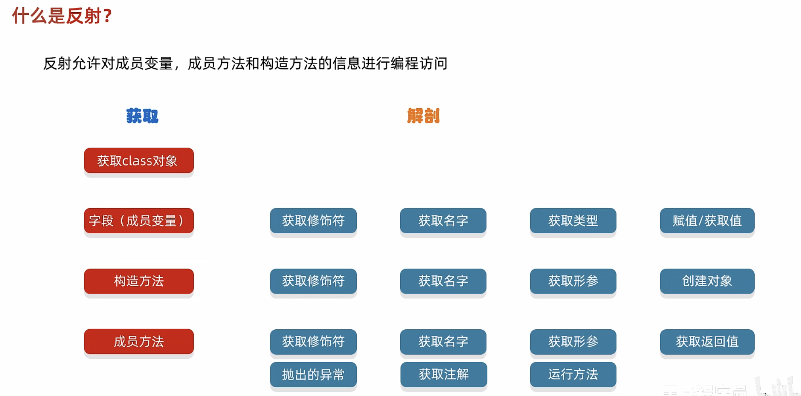
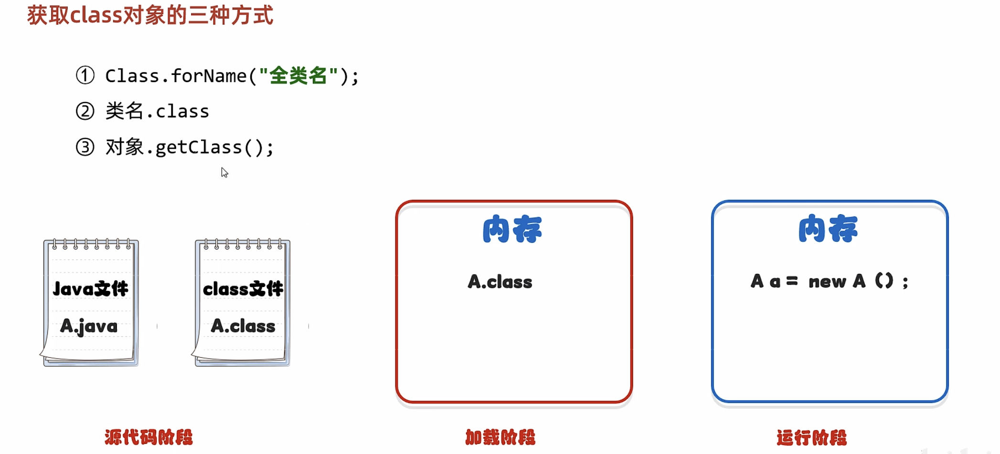
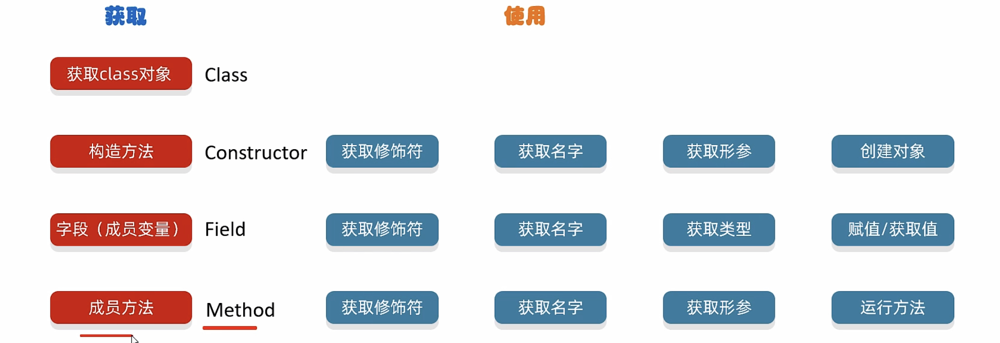
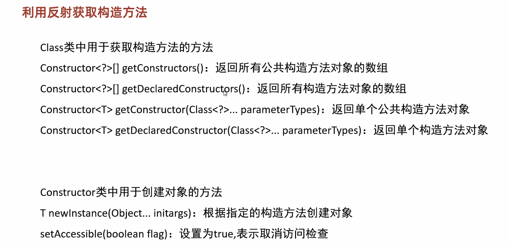
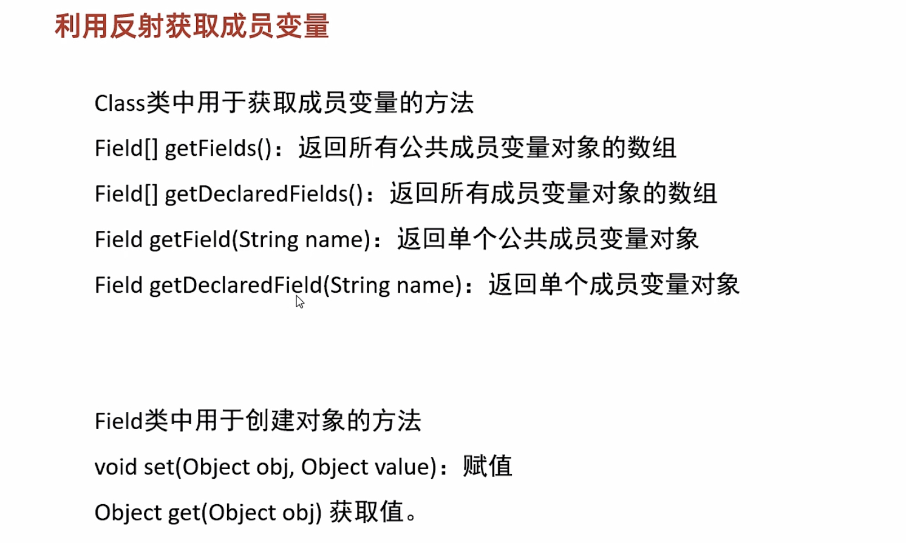
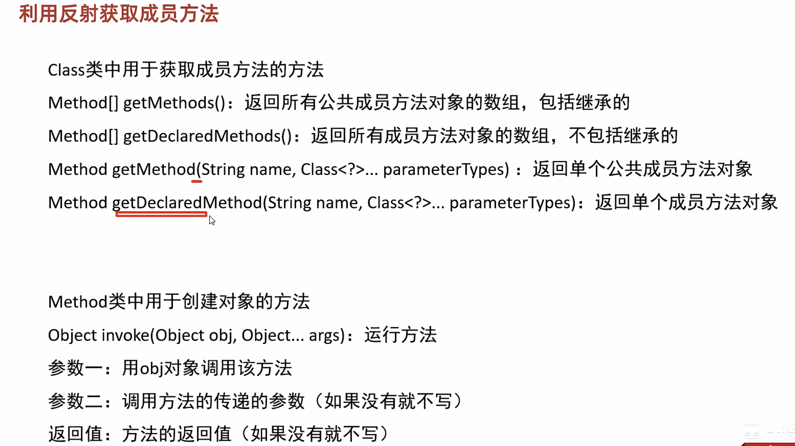

# 24-反射

#### 概述









#### 获取class对象的三种方式



```java
public class Student {
    private String name;
    private int age;

    public Student() {
    }

    public Student(String name, int age) {
        this.name = name;
        this.age = age;
    }

    /**
     * 获取
     * @return name
     */
    public String getName() {
        return name;
    }

    /**
     * 设置
     * @param name
     */
    public void setName(String name) {
        this.name = name;
    }

    /**
     * 获取
     * @return age
     */
    public int getAge() {
        return age;
    }

    /**
     * 设置
     * @param age
     */
    public void setAge(int age) {
        this.age = age;
    }

    public String toString() {
        return "Student{name = " + name + ", age = " + age + "}";
    }
}
```

```java
public class MyReflectDemo1 {
    public static void main(String[] args) throws ClassNotFoundException {

        /*
        * 获取class对象的三种方式：
        *   1. Class.forName("全类名");
        *   2. 类名.class
        *   3. 对象.getClass();
        *
        * */


        //1. 第一种方式
        //全类名 ： 包名 + 类名
        //最为常用的
        Class clazz1 = Class.forName("com.itheima.myreflect1.Student");

        //2. 第二种方式
        //一般更多的是当做参数进行传递
        Class clazz2 = Student.class;


       //3.第三种方式
        //当我们已经有了这个类的对象时，才可以使用。
        Student s = new Student();
        Class clazz3 = s.getClass();

        System.out.println(clazz1 == clazz2);
        System.out.println(clazz2 == clazz3);


    }
}
```

#### 获取构造方法





```java
public class Student {
    private String name;
    private int age;

    public Student() {
    }

    public Student(String name) {
        this.name = name;
    }

    protected Student(int age) {
        this.age = age;
    }

    private Student(String name, int age) {
        this.name = name;
        this.age = age;
    }

    /**
     * 获取
     * @return name
     */
    public String getName() {
        return name;
    }

    /**
     * 设置
     * @param name
     */
    public void setName(String name) {
        this.name = name;
    }

    /**
     * 获取
     * @return age
     */
    public int getAge() {
        return age;
    }

    /**
     * 设置
     * @param age
     */
    public void setAge(int age) {
        this.age = age;
    }

    public String toString() {
        return "Student{name = " + name + ", age = " + age + "}";
    }
}
```

```java
public class MyReflectDemo {
    public static void main(String[] args) throws ClassNotFoundException, NoSuchMethodException, InvocationTargetException, InstantiationException, IllegalAccessException {
    /*
        Class类中用于获取构造方法的方法
            Constructor<?>[] getConstructors()                                返回所有公共构造方法对象的数组
            Constructor<?>[] getDeclaredConstructors()                        返回所有构造方法对象的数组
            Constructor<T> getConstructor(Class<?>... parameterTypes)         返回单个公共构造方法对象
            Constructor<T> getDeclaredConstructor(Class<?>... parameterTypes) 返回单个构造方法对象


        Constructor类中用于创建对象的方法
            T newInstance(Object... initargs)                                 根据指定的构造方法创建对象
            setAccessible(boolean flag)                                       设置为true,表示取消访问检查
    */

        //1.获取class字节码文件对象
        Class clazz = Class.forName("com.itheima.myreflect2.Student");

        //2.获取构造方法
       /* Constructor[] cons1 = clazz.getConstructors();
        for (Constructor con : cons1) {
            System.out.println(con);
        }
        Constructor[] cons2 = clazz.getDeclaredConstructors();
        for (Constructor con : cons2) {
            System.out.println(con);
        }*/


       /* Constructor con1 = clazz.getDeclaredConstructor();
        System.out.println(con1);

        Constructor con2 = clazz.getDeclaredConstructor(String.class);
        System.out.println(con2);

        Constructor con3 = clazz.getDeclaredConstructor(int.class);
        System.out.println(con3);*/

        Constructor con4 = clazz.getDeclaredConstructor(String.class,int.class);
/*
        int modifiers = con4.getModifiers();
        System.out.println(modifiers);


        Parameter[] parameters = con4.getParameters();
        for (Parameter parameter : parameters) {
            System.out.println(parameter);
        }*/

        //暴力反射：表示临时取消权限校验
        con4.setAccessible(true);
        Student stu = (Student) con4.newInstance("张三", 23);

        System.out.println(stu);


    }
}
```

#### 获取成员变量



```java
public class Student {
    private String name;
    private int age;
    public String gender;

    public Student() {
    }

    public Student(String name, int age, String gender) {
        this.name = name;
        this.age = age;
        this.gender = gender;
    }

    /**
     * 获取
     * @return name
     */
    public String getName() {
        return name;
    }

    /**
     * 设置
     * @param name
     */
    public void setName(String name) {
        this.name = name;
    }

    /**
     * 获取
     * @return age
     */
    public int getAge() {
        return age;
    }

    /**
     * 设置
     * @param age
     */
    public void setAge(int age) {
        this.age = age;
    }

    /**
     * 获取
     * @return gender
     */
    public String getGender() {
        return gender;
    }

    /**
     * 设置
     * @param gender
     */
    public void setGender(String gender) {
        this.gender = gender;
    }

    public String toString() {
        return "Student{name = " + name + ", age = " + age + ", gender = " + gender + "}";
    }
}
```

```java
public class MyReflectDemo {
    public static void main(String[] args) throws ClassNotFoundException, NoSuchFieldException, IllegalAccessException {
    /*
       Class类中用于获取成员变量的方法
            Field[] getFields()：                返回所有公共成员变量对象的数组
            Field[] getDeclaredFields()：        返回所有成员变量对象的数组
            Field getField(String name)：        返回单个公共成员变量对象
            Field getDeclaredField(String name)：返回单个成员变量对象

       Field类中用于创建对象的方法
            void set(Object obj, Object value)：赋值
            Object get(Object obj)              获取值

    */


        //1.获取class字节码文件的对象
        Class clazz = Class.forName("com.itheima.myreflect3.Student");

        //2.获取所有的成员变量
       /* Field[] fields = clazz.getDeclaredFields();
        for (Field field : fields) {
            System.out.println(field);
        }*/

        //获取单个的成员变量
        Field name = clazz.getDeclaredField("name");
        System.out.println(name);

        //获取权限修饰符
        int modifiers = name.getModifiers();
        System.out.println(modifiers);

        //获取成员变量的名字
        String n = name.getName();
        System.out.println(n);

        //获取成员变量的数据类型
        Class<?> type = name.getType();
        System.out.println(type);

        //获取成员变量记录的值
        Student s = new Student("zhangsan",23,"男");
        name.setAccessible(true);
        String value = (String) name.get(s);
        System.out.println(value);

        //修改对象里面记录的值
        name.set(s,"lisi");

        System.out.println(s);

    }
}
```

#### 获取成员方法



```java
public class Student {
    private String name;
    private int age;

    public Student() {
    }

    public Student(String name, int age) {
        this.name = name;
        this.age = age;
    }

    /**
     * 获取
     * @return name
     */
    public String getName() {
        return name;
    }

    /**
     * 设置
     * @param name
     */
    public void setName(String name) {
        this.name = name;
    }

    /**
     * 获取
     * @return age
     */
    public int getAge() {
        return age;
    }

    /**
     * 设置
     * @param age
     */
    public void setAge(int age) {
        this.age = age;
    }

    public void sleep(){
        System.out.println("睡觉");
    }

    private String eat(String something) throws IOException,NullPointerException,ClassCastException {
        System.out.println("在吃" + something);
        return "奥利给";
    }

    private void eat(String something,int a) {
        System.out.println("在吃" + something);
    }

    public String toString() {
        return "Student{name = " + name + ", age = " + age + "}";
    }
}
```

```java
public class MyReflectDemo {
    public static void main(String[] args) throws ClassNotFoundException, NoSuchMethodException, InvocationTargetException, IllegalAccessException {
    /*
       Class类中用于获取成员方法的方法
            Method[] getMethods()：返回所有公共成员方法对象的数组，包括继承的
            Method[] getDeclaredMethods()：返回所有成员方法对象的数组，不包括继承的
            Method getMethod(String name, Class<?>... parameterTypes) ：返回单个公共成员方法对象
            Method getDeclaredMethod(String name, Class<?>... parameterTypes)：返回单个成员方法对象


       Method类中用于创建对象的方法
            Object invoke(Object obj, Object... args)：运行方法
            参数一：用obj对象调用该方法
            参数二：调用方法的传递的参数（如果没有就不写）
            返回值：方法的返回值（如果没有就不写）

        获取方法的修饰符
        获取方法的名字
        获取方法的形参
        获取方法的返回值
        获取方法的抛出的异常

    */


        //1. 获取class字节码文件对象
        Class clazz = Class.forName("com.itheima.myreflect4.Student");

        //2. 获取里面所有的方法对象(包含父类中所有的公共方法)
       /* Method[] methods = clazz.getMethods();
        for (Method method : methods) {
            System.out.println(method);
        }*/

        // 获取里面所有的方法对象(不能获取父类的，但是可以获取本类中私有的方法)
        /*Method[] methods = clazz.getDeclaredMethods();
        for (Method method : methods) {
            System.out.println(method);
        }*/

        // 获取指定的单一方法
        Method m = clazz.getDeclaredMethod("eat", String.class);
        System.out.println(m);

        // 获取方法的修饰符
        int modifiers = m.getModifiers();
        System.out.println(modifiers);

        // 获取方法的名字
        String name = m.getName();
        System.out.println(name);

        // 获取方法的形参
        Parameter[] parameters = m.getParameters();
        for (Parameter parameter : parameters) {
            System.out.println(parameter);
        }

        //获取方法的抛出的异常
        Class[] exceptionTypes = m.getExceptionTypes();
        for (Class exceptionType : exceptionTypes) {
            System.out.println(exceptionType);
        }

        //方法运行
        /*Method类中用于创建对象的方法
        Object invoke(Object obj, Object... args)：运行方法
        参数一：用obj对象调用该方法
        参数二：调用方法的传递的参数（如果没有就不写）
        返回值：方法的返回值（如果没有就不写）*/

        Student s = new Student();
        m.setAccessible(true);
        //参数一s：表示方法的调用者
        //参数二"汉堡包"：表示在调用方法的时候传递的实际参数
        String result = (String) m.invoke(s, "汉堡包");
        System.out.println(result);

    }
}
```

‍
