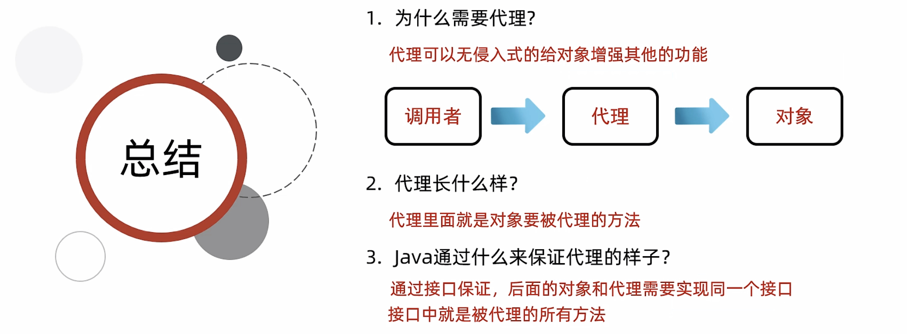

# 25-动态代理




```java
public class BigStar implements Star {
    private String name;


    public BigStar() {
    }

    public BigStar(String name) {
        this.name = name;
    }

    //唱歌
    @Override
    public String sing(String name){
        System.out.println(this.name + "正在唱" + name);
        return "谢谢";
    }

    //跳舞
    @Override
    public void dance(){
        System.out.println(this.name + "正在跳舞");
    }

    /**
     * 获取
     * @return name
     */
    public String getName() {
        return name;
    }

    /**
     * 设置
     * @param name
     */
    public void setName(String name) {
        this.name = name;
    }

    public String toString() {
        return "BigStar{name = " + name + "}";
    }
}

```

```java
/*
*
* 类的作用：
*       创建一个代理
*
* */
public class ProxyUtil {


    /*
    *
    * 方法的作用：
    *       给一个明星的对象，创建一个代理
    *
    *  形参：
    *       被代理的明星对象
    *
    *  返回值：
    *       给明星创建的代理
    *
    *
    *
    * 需求：
    *   外面的人想要大明星唱一首歌
    *   1. 获取代理的对象
    *      代理对象 = ProxyUtil.createProxy(大明星的对象);
    *   2. 再调用代理的唱歌方法
    *      代理对象.唱歌的方法("只因你太美");
    * */
    public static Star createProxy(BigStar bigStar){
       /* java.lang.reflect.Proxy类：提供了为对象产生代理对象的方法：

        public static Object newProxyInstance(ClassLoader loader, Class<?>[] interfaces, InvocationHandler h)
        参数一：用于指定用哪个类加载器，去加载生成的代理类
        参数二：指定接口，这些接口用于指定生成的代理长什么，也就是有哪些方法
        参数三：用来指定生成的代理对象要干什么事情*/
        Star star = (Star) Proxy.newProxyInstance(
                ProxyUtil.class.getClassLoader(),//参数一：用于指定用哪个类加载器，去加载生成的代理类
                new Class[]{Star.class},//参数二：指定接口，这些接口用于指定生成的代理长什么，也就是有哪些方法
                //参数三：用来指定生成的代理对象要干什么事情
                new InvocationHandler() {
                    @Override
                    public Object invoke(Object proxy, Method method, Object[] args) throws Throwable {
                        /*
                        * 参数一：代理的对象
                        * 参数二：要运行的方法 sing
                        * 参数三：调用sing方法时，传递的实参
                        * */
                        if("sing".equals(method.getName())){
                            System.out.println("准备话筒，收钱");
                        }else if("dance".equals(method.getName())){
                            System.out.println("准备场地，收钱");
                        }
                        //去找大明星开始唱歌或者跳舞
                        //代码的表现形式：调用大明星里面唱歌或者跳舞的方法
                        return method.invoke(bigStar,args);
                    }
                }
        );
        return star;

    }
}
```

```java
public interface Star {

    //我们可以把所有想要被代理的方法定义在接口当中

    //唱歌
    public abstract String sing(String name);

    //跳舞
    public abstract void dance();


}
```

```java
public class Test {
    public static void main(String[] args) {


    /*
        需求：
            外面的人想要大明星唱一首歌
             1. 获取代理的对象
                代理对象 = ProxyUtil.createProxy(大明星的对象);
             2. 再调用代理的唱歌方法
                代理对象.唱歌的方法("只因你太美");
     */

        //1. 获取代理的对象
        BigStar bigStar = new BigStar("鸡哥");
        Star proxy = ProxyUtil.createProxy(bigStar);

        //2. 调用唱歌的方法
        String result = proxy.sing("只因你太美");
        System.out.println(result);


    }
}
```

‍
